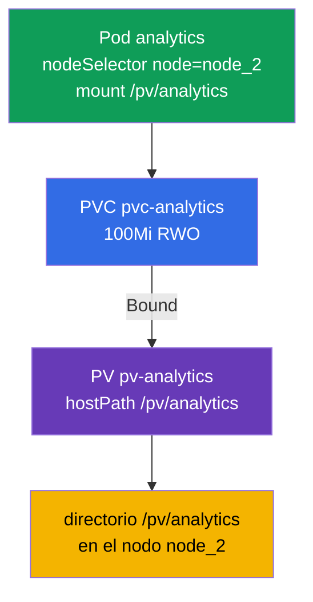

[Русская версия](README_RU.MD) · [Eng version](README.MD) · [Version française](README_FR.MD) · [Deutsche Version](README_DE.MD) · [ქართული ვერსია](README_GE.MD) · [繁體中文版](README_TW.MD) · [日本語版](README_JP.MD)

# Lab 108 — Almacenamiento: PersistentVolume, PersistentVolumeClaim y montaje de un volumen en un Pod

## Descripción

Práctica sobre almacenamiento persistente — el dominio Storage. Montarás la cadena clásica
**PersistentVolume → PersistentVolumeClaim → Pod**: crearás un PersistentVolume (hostPath),
una reclamación PersistentVolumeClaim, esperarás a que queden enlazados (Bound) y conectarás
el volumen a un Pod que se ejecuta en un nodo concreto mediante `nodeSelector`. El clúster
tiene **dos nodos**: el worker lleva el label (etiqueta) `node=node_2` y el directorio
`/pv/analytics`.

Todas las tareas están redactadas en estilo de examen (como las preguntas reales de CKA/CKAD)
con verificación automática mediante el comando `check_result`. Los objetos de almacenamiento
son más cómodos de describir con manifiestos (`kubectl apply -f`); la plantilla se puede
obtener con `--dry-run=client -o yaml`.

## Objetivo

Consolidar el material de los capítulos del curso:

- [Capítulo 25. Volumes, PersistentVolume y PersistentVolumeClaim](../../course/25/es.md) — volúmenes, PV y PVC, modos de acceso, enlace de la reclamación con el volumen (Bound)
- [Capítulo 26. StorageClass, provisionamiento dinámico](../../course/26/es.md) — StorageClass y asignación dinámica de volúmenes para una reclamación

## Qué creamos y para qué

En este laboratorio preparamos a mano un trozo de almacenamiento, una reclamación sobre él y
un Pod consumidor, y después colocamos ese Pod en el nodo necesario. Cada objeto resuelve su
propia tarea:

| Objeto | Qué es | Para qué está en este laboratorio |
|--------|--------|-----------------------------------|
| **PV `pv-analytics`** | PersistentVolume (hostPath) — un trozo de almacenamiento | aprender a describir un PersistentVolume a mano: `capacity`, `accessModes`, `hostPath` (capítulo 25) |
| **PVC `pvc-analytics`** | PersistentVolumeClaim — reclamación de almacenamiento | enlazar la reclamación con el PV (Bound) por tamaño y accessMode (capítulo 25) |
| **Pod `analytics`** | consumidor del volumen | montar el PVC en el Pod y colocarlo en el nodo necesario mediante `nodeSelector` (capítulo 26) |

Panorama final de lo que quedará despliegado:



## Infraestructura

El entorno se despliega en AWS (`eu-central-1`) mediante Terragrunt y consta de:

| Componente | Descripción                                                  |
|------------|--------------------------------------------------------------|
| `vpc`      | VPC `10.10.0.0/16` con subredes públicas                      |
| `ssh-keys` | Claves SSH para el acceso a los nodos                         |
| `k8s-1`    | Kubernetes `1.35.2` (kubeadm), CNI Calico, metrics-server, master + worker |
| `worker`   | Máquina de trabajo con `kubectl` y `check_result`             |

Instancias: `t3.medium`, Ubuntu `22.04`. El clúster tiene dos nodos: el master
(control-plane) y un worker. El worker lleva el label `node=node_2` y el directorio
`/pv/analytics` para hostPath, por lo que el Pod con el volumen debe planificarse
precisamente en él.

## Despliegue

```bash
TASK=108 make run_cka_task
```

Tras la creación, conéctate por SSH a la máquina de trabajo (worker) y realiza las tareas
desde allí. `kubectl` ya está configurado con el contexto `cluster1-admin@cluster1`.

Comandos útiles en la máquina de trabajo:

```bash
time_left       # cuánto tiempo queda
check_result    # comprobar la solución
```

## Tareas

---
|        **1**        | **Crear un PersistentVolume**                                |
| :-----------------: | :----------------------------------------------------------- |
| Qué hacemos         | Describe un PersistentVolume con el nombre `pv-analytics` de tipo `hostPath` en la ruta `/pv/analytics`, con capacidad `100Mi` y modo de acceso `ReadWriteOnce`. Es un trozo de almacenamiento definido a mano por el administrador, al que después se enlazará una reclamación PVC. |
| Criterios de aceptación | - PV `pv-analytics`;<br/>- storage `100Mi`;<br/>- accessMode `ReadWriteOnce`;<br/>- hostPath `/pv/analytics`. |
---
|        **2**        | **Crear la reclamación y enlazarla con el PV**               |
| :-----------------: | :----------------------------------------------------------- |
| Qué hacemos         | Crea un PersistentVolumeClaim con el nombre `pvc-analytics` de `100Mi` con el modo `ReadWriteOnce`. La reclamación se enlaza automáticamente con un PV adecuado cuando coinciden el tamaño y el accessMode: espera el estado `Bound`. |
| Criterios de aceptación | - PVC `pvc-analytics`, `100Mi`, `ReadWriteOnce`;<br/>- estado `Bound`. |
---
|        **3**        | **Montar el volumen en un pod del nodo necesario**           |
| :-----------------: | :----------------------------------------------------------- |
| Qué hacemos         | Crea un Pod `analytics` (imagen `viktoruj/ping_pong:alpine`) que use el PVC `pvc-analytics` y lo monte en la ruta `/pv/analytics`. Con `nodeSelector: node=node_2` coloca el Pod en el nodo worker: allí está el directorio hostPath. |
| Criterios de aceptación | - Pod `analytics`, imagen `viktoruj/ping_pong:alpine`;<br/>- usa el PVC `pvc-analytics`, mountPath `/pv/analytics`;<br/>- se ejecuta en el nodo con el label `node=node_2`. |
---

## Comprobación del resultado

En la máquina de trabajo lanza la verificación automática:

```bash
check_result
```

El script ejecuta los tests y muestra cuántas tareas están completadas.

## Solución

Solución de referencia: [worker/files/solutions/1_ES.MD](worker/files/solutions/1_ES.MD)

## Cobertura de exámenes simulados

El laboratorio cubre la tarea PV/PVC/pod que aparece en los cuatro simulados: CKA mock 01
(n.º 12), CKA mock 02 (n.º 10), CKAD mock 01 (n.º 15), CKAD mock 02 (n.º 10).

## Eliminación del clúster y los recursos

```bash
TASK=108 make delete_cka_task
```
