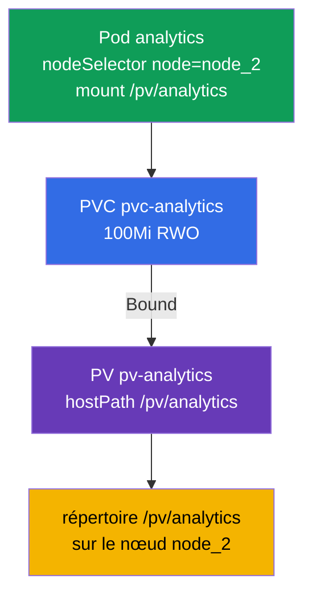

[Русская версия](README_RU.MD) · [Eng version](README.MD) · [Versión en español](README_ES.MD) · [Deutsche Version](README_DE.MD) · [ქართული ვერსია](README_GE.MD) · [繁體中文版](README_TW.MD) · [日本語版](README_JP.MD)

# Lab 108 — Stockage : PersistentVolume, PersistentVolumeClaim et montage d'un volume dans un Pod

## Description

Travail pratique sur le stockage persistant — le domaine Storage. Vous allez assembler la
chaîne classique **PersistentVolume → PersistentVolumeClaim → Pod** : créer un
PersistentVolume (hostPath), une demande PersistentVolumeClaim, attendre leur liaison (Bound)
et rattacher le volume à un Pod qui démarre sur un nœud précis via `nodeSelector`. Le cluster
comporte **deux nœuds** : le worker porte le label `node=node_2` et le répertoire
`/pv/analytics`.

Toutes les tâches sont rédigées dans le style de l'examen (comme les vraies questions
CKA/CKAD) avec une vérification automatique via la commande `check_result`. Les objets de
stockage sont plus commodes à décrire avec des manifestes (`kubectl apply -f`) ; on peut
générer une base avec `--dry-run=client -o yaml`.

## Objectif

Consolider le contenu des chapitres du cours :

- [Chapitre 25. Volumes, PersistentVolume et PersistentVolumeClaim](../../course/25/fr.md) — volumes, PV et PVC, modes d'accès, liaison de la demande au volume (Bound)
- [Chapitre 26. StorageClass, provisionnement dynamique](../../course/26/fr.md) — StorageClass et allocation dynamique de volumes pour une demande

## Ce que nous créons et pourquoi

Dans ce lab, nous préparons à la main un morceau de stockage, une demande sur celui-ci et un
Pod consommateur, puis nous plaçons ce Pod sur le nœud voulu. Chaque objet a son propre rôle :

| Objet | Ce que c'est | Pourquoi dans ce lab |
|-------|--------------|----------------------|
| **PV `pv-analytics`** | PersistentVolume (hostPath) — un morceau de stockage | apprendre à décrire un PersistentVolume à la main : `capacity`, `accessModes`, `hostPath` (chapitre 25) |
| **PVC `pvc-analytics`** | PersistentVolumeClaim — demande de stockage | lier la demande au PV (Bound) par la taille et l'accessMode (chapitre 25) |
| **Pod `analytics`** | consommateur du volume | monter le PVC dans le Pod et le placer sur le nœud voulu via `nodeSelector` (chapitre 26) |

Vue d'ensemble de ce qui sera déployé :



## Infrastructure

L'environnement est déployé dans AWS (`eu-central-1`) via Terragrunt et se compose de :

| Composant  | Description                                                  |
|------------|--------------------------------------------------------------|
| `vpc`      | VPC `10.10.0.0/16` avec des sous-réseaux publics               |
| `ssh-keys` | Clés SSH pour l'accès aux nœuds                                |
| `k8s-1`    | Kubernetes `1.35.2` (kubeadm), CNI Calico, metrics-server, master + worker |
| `worker`   | Machine de travail avec `kubectl` et `check_result`            |

Instances : `t3.medium`, Ubuntu `22.04`. Le cluster comporte deux nœuds — le master
(control-plane) et un worker. Le worker porte le label `node=node_2` et le répertoire
`/pv/analytics` pour hostPath, le Pod avec le volume doit donc être planifié précisément
dessus.

## Déploiement

```bash
TASK=108 make run_cka_task
```

Après la création, connectez-vous en SSH à la machine de travail (worker) et effectuez les
tâches depuis celle-ci. `kubectl` est déjà configuré sur le contexte `cluster1-admin@cluster1`.

Commandes utiles sur la machine de travail :

```bash
time_left       # combien de temps il reste
check_result    # vérifier la solution
```

## Tâches

---
|        **1**        | **Créer un PersistentVolume**                                |
| :-----------------: | :----------------------------------------------------------- |
| Ce qu'on fait       | Décrivez un PersistentVolume nommé `pv-analytics` de type `hostPath` sur le chemin `/pv/analytics`, de capacité `100Mi` et avec le mode d'accès `ReadWriteOnce`. C'est un morceau de stockage défini à la main par l'administrateur, auquel une demande PVC se liera ensuite. |
| Critères d'acceptation | - PV `pv-analytics` ;<br/>- storage `100Mi` ;<br/>- accessMode `ReadWriteOnce` ;<br/>- hostPath `/pv/analytics`. |
---
|        **2**        | **Créer la demande et la lier au PV**                        |
| :-----------------: | :----------------------------------------------------------- |
| Ce qu'on fait       | Créez un PersistentVolumeClaim nommé `pvc-analytics` de `100Mi` avec le mode `ReadWriteOnce`. La demande se lie automatiquement à un PV adapté lorsque la taille et l'accessMode correspondent — attendez le statut `Bound`. |
| Critères d'acceptation | - PVC `pvc-analytics`, `100Mi`, `ReadWriteOnce` ;<br/>- statut `Bound`. |
---
|        **3**        | **Monter le volume dans un pod sur le nœud voulu**           |
| :-----------------: | :----------------------------------------------------------- |
| Ce qu'on fait       | Créez un Pod `analytics` (image `viktoruj/ping_pong:alpine`) qui utilise le PVC `pvc-analytics` et le monte sur le chemin `/pv/analytics`. Avec `nodeSelector: node=node_2`, placez le Pod sur le nœud worker — c'est là que se trouve le répertoire hostPath. |
| Critères d'acceptation | - Pod `analytics`, image `viktoruj/ping_pong:alpine` ;<br/>- utilise le PVC `pvc-analytics`, mountPath `/pv/analytics` ;<br/>- tourne sur le nœud portant le label `node=node_2`. |
---

## Vérification du résultat

Sur la machine de travail, lancez la vérification automatique :

```bash
check_result
```

Le script exécute les tests et affiche le nombre de tâches réussies.

## Solution

Solution de référence : [worker/files/solutions/1_FR.MD](worker/files/solutions/1_FR.MD)

## Couverture des examens blancs

Le lab couvre la tâche PV/PVC/pod présente dans les quatre examens blancs : CKA mock 01
(n° 12), CKA mock 02 (n° 10), CKAD mock 01 (n° 15), CKAD mock 02 (n° 10).

## Suppression du cluster et des ressources

```bash
TASK=108 make delete_cka_task
```
