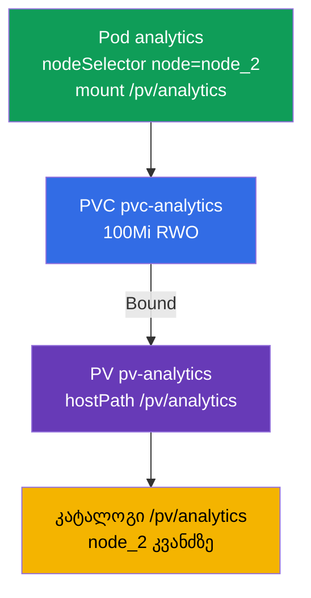

[Русская версия](README_RU.MD) · [Eng version](README.MD) · [Versión en español](README_ES.MD) · [Version française](README_FR.MD) · [Deutsche Version](README_DE.MD) · [繁體中文版](README_TW.MD) · [日本語版](README_JP.MD)

# Lab 108 — შენახვა: PersistentVolume, PersistentVolumeClaim და ტომის მიმაგრება Pod-ში

## აღწერა

პრაქტიკული სამუშაო მუდმივ საცავზე — დომენი Storage. თქვენ ააწყობთ კლასიკურ ჯაჭვს
**PersistentVolume → PersistentVolumeClaim → Pod**: შექმნით PersistentVolume-ს (hostPath),
განაცხადს PersistentVolumeClaim, დაელოდებით მათ დაკავშირებას (Bound) და მიამაგრებთ ტომს
Pod-ს, რომელიც `nodeSelector`-ის (კვანძის სელექტორის) მეშვეობით კონკრეტულ კვანძზე იშვება.
კლასტერი **ორკვანძიანია**: worker-ს აქვს ლეიბლი `node=node_2` და კატალოგი `/pv/analytics`.

ყველა დავალება გამოცდის სტილშია გაფორმებული (როგორც რეალური CKA/CKAD კითხვები) და მათი
შემოწმება ავტომატურად ხდება ბრძანებით `check_result`. საცავის ობიექტების აღწერა უფრო
მოსახერხებელია მანიფესტებით (`kubectl apply -f`), ნიმუშის მიღება შესაძლებელია
`--dry-run=client -o yaml`-ით.

## მიზანი

განამტკიცოთ კურსის თავების მასალა:

- [თავი 25. Volumes, PersistentVolume და PersistentVolumeClaim](../../course/25/ge.md) — ტომები, PV და PVC, წვდომის რეჟიმები, განაცხადის მიბმა ტომთან (Bound)
- [თავი 26. StorageClass, დინამიური provisioning](../../course/26/ge.md) — StorageClass და ტომების დინამიური გამოყოფა განაცხადისთვის

## რას ვქმნით და რისთვის

ამ ლაბორატორიაში ხელით ვამზადებთ საცავის ნაწილს, განაცხადს მასზე და Pod-მომხმარებელს, შემდეგ
კი ამ Pod-ს ვსვამთ საჭირო კვანძზე. თითოეული ობიექტი თავის ამოცანას ასრულებს:

| ობიექტი | რა არის ეს | რისთვის არის ამ ლაბორატორიაში |
|---------|------------|-------------------------------|
| **PV `pv-analytics`** | PersistentVolume (hostPath) — საცავის ნაწილი | ვსწავლობთ PersistentVolume-ის ხელით აღწერას: `capacity`, `accessModes`, `hostPath` (თავი 25) |
| **PVC `pvc-analytics`** | PersistentVolumeClaim — განაცხადი საცავზე | განაცხადს ვუკავშირებთ PV-ს (Bound) ზომითა და accessMode-ით (თავი 25) |
| **Pod `analytics`** | ტომის მომხმარებელი | PVC-ს ვამაგრებთ Pod-ში და მას ვსვამთ საჭირო კვანძზე `nodeSelector`-ით (თავი 26) |

საბოლოო სურათი იმისა, რაც განთავსდება:



## ინფრასტრუქტურა

გარემო იშლება AWS-ში (`eu-central-1`) Terragrunt-ის მეშვეობით და შედგება:

| კომპონენტი | აღწერა                                                    |
|------------|-----------------------------------------------------------|
| `vpc`      | VPC `10.10.0.0/16` საჯარო ქვექსელებით                      |
| `ssh-keys` | SSH-გასაღებები node-ებზე წვდომისთვის                        |
| `k8s-1`    | Kubernetes `1.35.2` (kubeadm), CNI Calico, metrics-server, master + worker |
| `worker`   | სამუშაო მანქანა `kubectl`-ით და `check_result`-ით            |

ინსტანსები: `t4g.medium`, Ubuntu `22.04`. კლასტერი ორკვანძიანია — master (control-plane) და
ერთი worker. Worker-ს აქვს ლეიბლი `node=node_2` და კატალოგი `/pv/analytics` hostPath-ისთვის,
ამიტომ ტომის მქონე Pod სწორედ მასზე უნდა დაიგეგმოს.

## განთავსება

```bash
TASK=108 make run_cka_task
```

შექმნის შემდეგ დაუკავშირდით სამუშაო მანქანას (worker) SSH-ით და დავალებები შეასრულეთ იქიდან.
`kubectl` უკვე კონფიგურირებულია კონტექსტზე `cluster1-admin@cluster1`.

სასარგებლო ბრძანებები სამუშაო მანქანაზე:

```bash
time_left       # რამდენი დრო დარჩა
check_result    # ამოხსნის შემოწმება
```

## დავალებები

---
|        **1**        | **PersistentVolume-ის შექმნა**                               |
| :-----------------: | :----------------------------------------------------------- |
| რას ვაკეთებთ        | აღწერეთ PersistentVolume სახელით `pv-analytics` ტიპით `hostPath` გზაზე `/pv/analytics`, ტევადობით `100Mi` და წვდომის რეჟიმით `ReadWriteOnce`. ეს არის ადმინისტრატორის მიერ ხელით განსაზღვრული საცავის ნაწილი, რომელსაც შემდეგ PVC განაცხადი მიება. |
| მიღების კრიტერიუმები | - PV `pv-analytics`;<br/>- storage `100Mi`;<br/>- accessMode `ReadWriteOnce`;<br/>- hostPath `/pv/analytics`. |
---
|        **2**        | **განაცხადის შექმნა და PV-სთან დაკავშირება**                 |
| :-----------------: | :----------------------------------------------------------- |
| რას ვაკეთებთ        | შექმენით PersistentVolumeClaim სახელით `pvc-analytics` `100Mi`-ზე რეჟიმით `ReadWriteOnce`. განაცხადი ავტომატურად უკავშირდება შესაბამის PV-ს ზომისა და accessMode-ის დამთხვევისას — დაელოდეთ სტატუსს `Bound`. |
| მიღების კრიტერიუმები | - PVC `pvc-analytics`, `100Mi`, `ReadWriteOnce`;<br/>- სტატუსი `Bound`. |
---
|        **3**        | **ტომის მიმაგრება pod-ზე საჭირო კვანძზე**                    |
| :-----------------: | :----------------------------------------------------------- |
| რას ვაკეთებთ        | შექმენით Pod `analytics` (image `viktoruj/ping_pong:alpine`), რომელიც იყენებს PVC `pvc-analytics`-ს და ამაგრებს მას გზაზე `/pv/analytics`. `nodeSelector: node=node_2`-ით დასვით Pod worker-კვანძზე — სწორედ იქ არის hostPath კატალოგი. |
| მიღების კრიტერიუმები | - Pod `analytics`, image `viktoruj/ping_pong:alpine`;<br/>- იყენებს PVC `pvc-analytics`-ს, mountPath `/pv/analytics`;<br/>- მუშაობს ლეიბლის `node=node_2` მქონე კვანძზე. |
---

## შედეგის შემოწმება

სამუშაო მანქანაზე გაუშვით ავტომატური შემოწმება:

```bash
check_result
```

სკრიპტი გაატარებს ტესტებს და აჩვენებს, რამდენი დავალებაა შესრულებული.

## ამოხსნა

ეტალონური ამოხსნა: [worker/files/solutions/1_GE.MD](worker/files/solutions/1_GE.MD)

## Mock-გამოცდების დაფარვა

ლაბორატორია ფარავს PV/PVC/pod დავალებას, რომელიც ოთხივე mock-ში გვხვდება: CKA mock 01 (№12),
CKA mock 02 (№10), CKAD mock 01 (№15), CKAD mock 02 (№10).

## კლასტერისა და რესურსების წაშლა

```bash
TASK=108 make delete_cka_task
```
