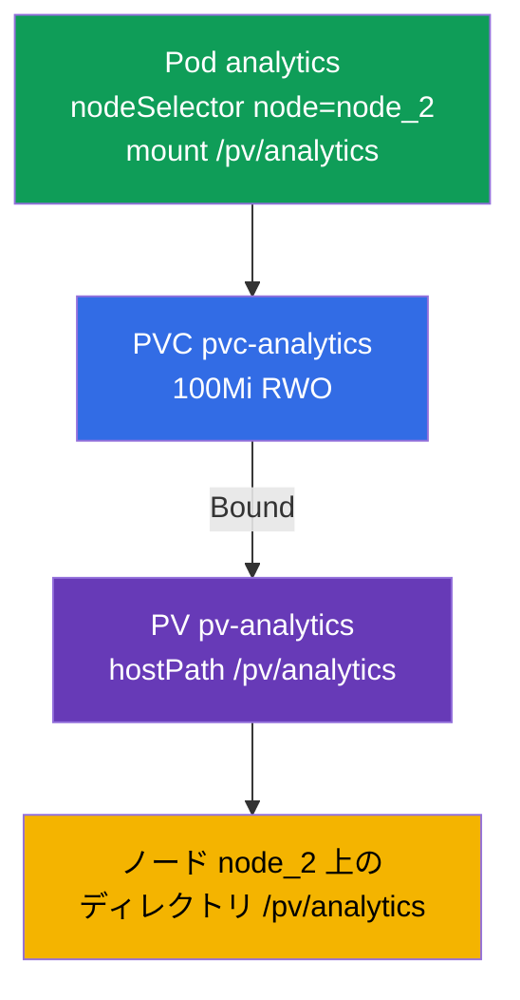

[Русская версия](README_RU.MD) · [Eng version](README.MD) · [Versión en español](README_ES.MD) · [Version française](README_FR.MD) · [Deutsche Version](README_DE.MD) · [ქართული ვერსია](README_GE.MD) · [繁體中文版](README_TW.MD)

# Lab 108 - ストレージ：PersistentVolume、PersistentVolumeClaim、そして Pod への volume マウント

## 概要

永続ストレージについての実習であり、Storage ドメインを扱います。ここでは古典的な
組み合わせ **PersistentVolume → PersistentVolumeClaim → Pod** を組み立てます：PersistentVolume
（hostPath）を作成し、PersistentVolumeClaim という申請を作り、両者が結び付く（Bound）のを待って、
`nodeSelector`（ノードセレクター）で特定のノード上に起動する Pod に volume を接続します。クラスタは
**2 ノード構成**です：worker が label（ラベル）`node=node_2` とディレクトリ `/pv/analytics` を持ちます。

すべての課題は試験形式（実際の CKA/CKAD の問題と同じスタイル）で書かれており、
`check_result` コマンドで自動的に検証されます。ストレージのオブジェクトはマニフェストで
記述するほうが扱いやすく（`kubectl apply -f`）、雛形は `--dry-run=client -o yaml` で用意できます。

## 目的

次のコース章の内容を定着させます：

- [第 25 章。Volumes、PersistentVolume と PersistentVolumeClaim](../../course/25/README.md) - volume、PV と PVC、アクセスモード、申請と volume の結び付け（Bound）
- [第 26 章。StorageClass、動的プロビジョニング](../../course/26/README.md) - StorageClass と申請に応じた volume の動的な割り当て

## 何を作り、なぜ作るのか

この実習では、ストレージの一区画、それに対する申請、そして volume を利用する Pod を手動で
用意し、その Pod を目的のノードに配置します。各オブジェクトにはそれぞれの役割があります：

| オブジェクト | これは何か | この実習での役割 |
|--------|---------|-------------------|
| **PV `pv-analytics`** | PersistentVolume（hostPath）- ストレージの一区画 | PersistentVolume を手動で記述する練習：`capacity`、`accessModes`、`hostPath`（第 25 章） |
| **PVC `pvc-analytics`** | PersistentVolumeClaim - ストレージへの申請 | サイズと accessMode によって申請を PV と結び付ける（Bound）（第 25 章） |
| **Pod `analytics`** | volume の利用者 | PVC を Pod にマウントし、`nodeSelector` で目的のノードに配置する（第 26 章） |

最終的にデプロイされる全体像：



## インフラ

環境は Terragrunt により AWS（`eu-central-1`）に展開され、次の要素で構成されます：

| コンポーネント | 説明                                                    |
|------------|-------------------------------------------------------------|
| `vpc`      | パブリックサブネットを持つ VPC `10.10.0.0/16`                    |
| `ssh-keys` | ノードへアクセスするための SSH キー                                |
| `k8s-1`    | Kubernetes `1.35.2`（kubeadm）、CNI Calico、metrics-server、master + worker |
| `worker`   | `kubectl` と `check_result` を備えた作業マシン                 |

インスタンス：`t4g.medium`、Ubuntu `22.04`。クラスタは 2 ノード構成で、master（control-plane）と
worker が 1 台です。Worker は label `node=node_2` と hostPath 用のディレクトリ `/pv/analytics` を
持つため、volume を使う Pod はまさにこのノードにスケジュールされる必要があります。

## デプロイ

```bash
TASK=108 make run_cka_task
```

作成が完了したら、SSH で作業マシン（worker）に接続し、そこから課題を進めてください。
`kubectl` はすでに `cluster1-admin@cluster1` コンテキストに設定されています。

作業マシンで使える便利なコマンド：

```bash
time_left       # 残り時間
check_result    # 解答をチェックする
```

## 課題

---
|        **1**        | **PersistentVolume を作成する**                              |
| :-----------------: | :----------------------------------------------------------- |
| やること            | `pv-analytics` という名前の PersistentVolume を、タイプ `hostPath`、パス `/pv/analytics`、容量 `100Mi`、アクセスモード `ReadWriteOnce` で記述してください。これは管理者が手動で定義したストレージの一区画で、あとで PVC の申請がこれに結び付きます。 |
| 受け入れ基準        | - PV `pv-analytics`；<br/>- storage `100Mi`；<br/>- accessMode `ReadWriteOnce`；<br/>- hostPath `/pv/analytics`。 |
---
|        **2**        | **申請を作成し、PV と結び付ける**                            |
| :-----------------: | :----------------------------------------------------------- |
| やること            | `pvc-analytics` という名前の PersistentVolumeClaim を `100Mi`、モード `ReadWriteOnce` で作成してください。申請はサイズと accessMode の一致によって適切な PV に自動的に結び付きます - ステータスが `Bound` になるまで待ってください。 |
| 受け入れ基準        | - PVC `pvc-analytics`、`100Mi`、`ReadWriteOnce`；<br/>- ステータスが `Bound`。 |
---
|        **3**        | **目的のノード上の Pod に volume を接続する**                |
| :-----------------: | :----------------------------------------------------------- |
| やること            | PVC `pvc-analytics` を使い、それをパス `/pv/analytics` にマウントする Pod `analytics`（イメージ `viktoruj/ping_pong:alpine`）を作成してください。`nodeSelector: node=node_2` によって Pod を worker ノードに配置します - hostPath のディレクトリはそこにあります。 |
| 受け入れ基準        | - Pod `analytics`、イメージ `viktoruj/ping_pong:alpine`；<br/>- PVC `pvc-analytics` を使い、mountPath は `/pv/analytics`；<br/>- label `node=node_2` を持つノード上で動いている。 |
---

## 結果のチェック

作業マシンで自動チェックを実行します：

```bash
check_result
```

スクリプトがテストを実行し、いくつの課題が完了したかを表示します。

## 解答

参考解答：[worker/files/solutions/1_JP.MD](worker/files/solutions/1_JP.MD)

## 模擬試験のカバー範囲

この実習は 4 つの模擬試験すべてに登場する PV/PVC/pod の課題をカバーします：CKA mock 01（第 12 問）、
CKA mock 02（第 10 問）、CKAD mock 01（第 15 問）、CKAD mock 02（第 10 問）。

## クラスタとリソースの削除

```bash
TASK=108 make delete_cka_task
```
