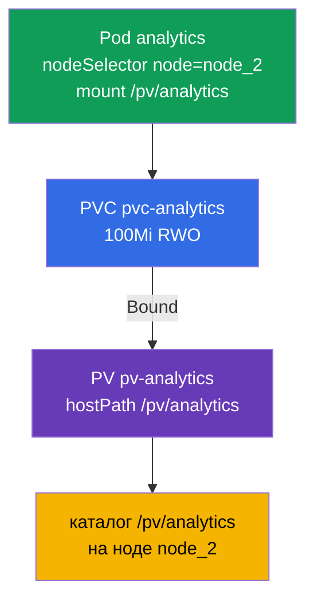

# Lab 108 — Хранение: PersistentVolume, PersistentVolumeClaim и монтирование тома в Pod

## Описание

Практическая работа по постоянному хранилищу — домен Storage. Вы соберёте классическую
связку **PersistentVolume → PersistentVolumeClaim → Pod (под)**: создадите PersistentVolume
(hostPath), заявку PersistentVolumeClaim, дождётесь их связывания (Bound) и подключите том
к Pod, который запускается на конкретной ноде через `nodeSelector` (селектор ноды). Кластер
**двухнодовый**: worker несёт label (метку) `node=node_2` и каталог `/pv/analytics`.

Все задания оформлены в экзаменационном стиле (как реальные вопросы CKA/CKAD) с
автоматической проверкой командой `check_result`. Объекты хранения удобнее описывать
манифестами (`kubectl apply -f`), заготовку можно получить через `--dry-run=client -o yaml`.

## Цель

Закрепить материал глав курса:

- [Глава 25. Volumes, PersistentVolume и PersistentVolumeClaim](../../course/25/ru.md) — тома, PV и PVC, режимы доступа, привязка заявки к тому (Bound)
- [Глава 26. StorageClass, динамический провижининг](../../course/26/ru.md) — StorageClass и динамическое выделение томов под заявку

## Что мы создаём и зачем

В этой лабе мы вручную готовим кусок хранилища, заявку на него и Pod-потребитель, а затем
сажаем этот Pod на нужную ноду. Каждый объект решает свою задачу:

| Объект | Что это | Зачем в этой лабе |
|--------|---------|-------------------|
| **PV `pv-analytics`** | PersistentVolume (hostPath) — кусок хранилища | учимся описывать PersistentVolume вручную: `capacity`, `accessModes`, `hostPath` (глава 25) |
| **PVC `pvc-analytics`** | PersistentVolumeClaim — заявка на хранилище | связываем заявку с PV (Bound) по размеру и accessMode (глава 25) |
| **Pod `analytics`** | потребитель тома | монтируем PVC в Pod и сажаем его на нужную ноду через `nodeSelector` (глава 26) |

Итоговая картина того, что будет развёрнуто:



## Инфраструктура

Окружение разворачивается в AWS (`eu-central-1`) через Terragrunt и состоит из:

| Компонент  | Описание                                                    |
|------------|-------------------------------------------------------------|
| `vpc`      | VPC `10.10.0.0/16` с публичными подсетями                    |
| `ssh-keys` | SSH-ключи для доступа к нодам                                |
| `k8s-1`    | Kubernetes `1.35.2` (kubeadm), CNI Calico, metrics-server, master + worker |
| `worker`   | Рабочая машина с `kubectl` и `check_result`                 |

Инстансы: `t3.medium` Ubuntu `22.04`. Кластер двухнодовый — master (control-plane) и один
worker. Worker несёт label `node=node_2` и каталог `/pv/analytics` для hostPath, поэтому
Pod с томом должен планироваться именно на него.

## Развёртывание

```bash
TASK=108 make run_cka_task
```

После создания подключитесь к рабочей машине (worker) по SSH и выполняйте задания оттуда.
`kubectl` уже настроен на контекст `cluster1-admin@cluster1`.

Полезные команды на рабочей машине:

```bash
time_left       # сколько осталось времени
check_result    # проверить решение
```

## Задания

---
|        **1**        | **Создать PersistentVolume**                                 |
| :-----------------: | :----------------------------------------------------------- |
| Что делаем          | Опишите PersistentVolume с именем `pv-analytics` типа `hostPath` по пути `/pv/analytics`, ёмкостью `100Mi` и режимом доступа `ReadWriteOnce`. Это кусок хранилища, заданный администратором вручную, к которому потом привяжется заявка PVC. |
| Критерии приёмки    | - PV `pv-analytics`;<br/>- storage `100Mi`;<br/>- accessMode `ReadWriteOnce`;<br/>- hostPath `/pv/analytics`. |
---
|        **2**        | **Создать заявку и связать её с PV**                         |
| :-----------------: | :----------------------------------------------------------- |
| Что делаем          | Создайте PersistentVolumeClaim с именем `pvc-analytics` на `100Mi` с режимом `ReadWriteOnce`. Заявка автоматически привязывается к подходящему PV по совпадению размера и accessMode — дождитесь статуса `Bound`. |
| Критерии приёмки    | - PVC `pvc-analytics`, `100Mi`, `ReadWriteOnce`;<br/>- статус `Bound`. |
---
|        **3**        | **Подключить том к поду на нужной ноде**                     |
| :-----------------: | :----------------------------------------------------------- |
| Что делаем          | Создайте Pod `analytics` (образ `viktoruj/ping_pong:alpine`), который использует PVC `pvc-analytics` и монтирует его по пути `/pv/analytics`. Через `nodeSelector: node=node_2` посадите Pod на worker-ноду — там же лежит каталог hostPath. |
| Критерии приёмки    | - Pod `analytics`, образ `viktoruj/ping_pong:alpine`;<br/>- использует PVC `pvc-analytics`, mountPath `/pv/analytics`;<br/>- работает на ноде с label `node=node_2`. |
---

## Проверка результата

На рабочей машине запустите автоматическую проверку:

```bash
check_result
```

Скрипт прогонит тесты и покажет, сколько заданий выполнено.

## Решение

Эталонное решение: [worker/files/solutions/1.MD](worker/files/solutions/1.MD)

## Покрытие мок-экзаменов

Лаба закрывает задание PV/PVC/pod, встречающееся во всех четырёх моках: CKA mock 01 (№12),
CKA mock 02 (№10), CKAD mock 01 (№15), CKAD mock 02 (№10).

## Удаление кластера и ресурсов

```bash
TASK=108 make delete_cka_task
```
