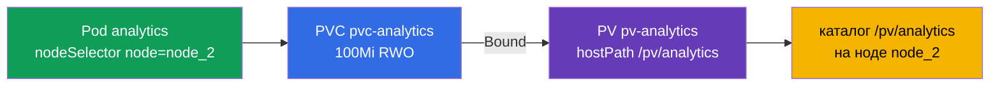

# Lab 108 — Хранение: PersistentVolume, PersistentVolumeClaim, под с томом

## Описание

Практическая работа по постоянному хранилищу — домен Storage. Вы соберёте классическую
связку **PV → PVC → под**: создадите PersistentVolume (hostPath), заявку
PersistentVolumeClaim, дождётесь их связывания (Bound) и подключите том к поду, который
запускается на конкретной ноде через `nodeSelector`. Кластер **двухнодовый**: worker
несёт метку `node=node_2` и каталог `/pv/analytics`.

Все задания в экзаменационном стиле с автопроверкой `check_result`.

## Цель

Закрепить главы курса:

- [Глава 25. Volumes, PersistentVolume и PersistentVolumeClaim](../../course/25/ru.md)
- [Глава 26. StorageClass, динамический провижининг](../../course/26/ru.md)

## Что мы создаём и зачем

| Объект | Что это | Зачем в этой лабе |
|--------|---------|-------------------|
| **PV `pv-analytics`** | кусок хранилища (hostPath) | учимся описывать PersistentVolume вручную |
| **PVC `pvc-analytics`** | заявка на хранилище | связываем заявку с PV (Bound) по размеру и accessMode |
| **Под `analytics`** | потребитель тома | монтируем PVC и сажаем под на нужную ноду через `nodeSelector` |



## Инфраструктура

| Компонент  | Описание                                                             |
|------------|----------------------------------------------------------------------|
| `k8s-1`    | Kubernetes `1.35.2` (kubeadm), Calico, metrics-server, **master + worker(`node=node_2`)** |
| `worker`   | Рабочая машина с `kubectl` и `check_result`                          |

## Развёртывание

```bash
TASK=108 make run_cka_task
```

## Задания

---
|        **1**        | **Создать PersistentVolume**                                 |
| :-----------------: | :----------------------------------------------------------- |
| Что делаем          | Описываем кусок хранилища вручную (hostPath)                  |
| Критерии приёмки    | - PV: `pv-analytics`<br/>- Storage: `100Mi`<br/>- Access mode: `ReadWriteOnce`<br/>- hostPath: `/pv/analytics` |
---
|        **2**        | **Создать заявку и связать её с PV**                         |
| :-----------------: | :----------------------------------------------------------- |
| Что делаем          | Создаём PVC, который связывается с подходящим PV              |
| Критерии приёмки    | - PVC: `pvc-analytics`, `100Mi`, `ReadWriteOnce`<br/>- Статус: `Bound` |
---
|        **3**        | **Подключить том к поду на нужной ноде**                     |
| :-----------------: | :----------------------------------------------------------- |
| Что делаем          | Монтируем PVC в под и сажаем его на ноду `node_2`             |
| Критерии приёмки    | - Pod: `analytics`, image `busybox`, command `sleep 60000`<br/>- Использует PVC `pvc-analytics`, mountPath `/pv/analytics`<br/>- Работает на ноде с меткой `node=node_2` |
---

## Проверка результата

```bash
check_result
```

## Решение

[worker/files/solutions/1.MD](worker/files/solutions/1.MD)

## Покрытие мок-экзаменов

Закрывает задание PV/PVC/pod, встречающееся во всех четырёх моках: CKA mock 01 (№12),
CKA mock 02 (№10), CKAD mock 01 (№15), CKAD mock 02 (№10).

## Удаление

```bash
TASK=108 make delete_cka_task
```
