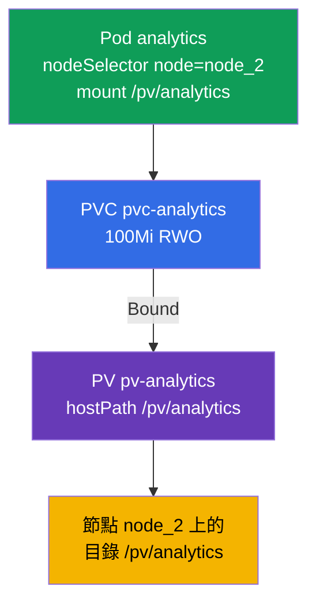

[Русская версия](README_RU.MD) · [Eng version](README.MD) · [Versión en español](README_ES.MD) · [Version française](README_FR.MD) · [Deutsche Version](README_DE.MD) · [ქართული ვერსია](README_GE.MD) · [日本語版](README_JP.MD)

# Lab 108 - 儲存:PersistentVolume、PersistentVolumeClaim 以及把 volume 掛載進 Pod

## 說明

關於持久化儲存的實作練習 - Storage 領域。你會組裝經典的
串連 **PersistentVolume → PersistentVolumeClaim → Pod**:建立 PersistentVolume
(hostPath)、PersistentVolumeClaim 申領,等待兩者綁定(Bound),再把 volume
接到透過 `nodeSelector` 執行在特定節點上的 Pod。叢集為
**雙節點**:worker 帶有 label(標籤)`node=node_2` 以及目錄 `/pv/analytics`。

所有任務都以考試風格撰寫(就像真正的 CKA/CKAD 題目),並透過
`check_result` 指令自動驗證。儲存物件用資源清單來描述比較方便
(`kubectl apply -f`),初稿可以透過 `--dry-run=client -o yaml` 產生。

## 目標

鞏固以下課程章節的內容:

- [第 25 章。Volumes、PersistentVolume 與 PersistentVolumeClaim](../../course/25/README.md) - volume、PV 與 PVC、存取模式、把申領綁定到 volume(Bound)
- [第 26 章。StorageClass、動態配置](../../course/26/README.md) - StorageClass 以及依申領動態配置 volume

## 我們要建立什麼,以及為什麼

在這個實驗中,我們手動準備一塊儲存、一份對它的申領以及一個消費它的 Pod,然後
把這個 Pod 放到需要的節點上。每個物件都有自己的用途:

| 物件 | 這是什麼 | 為什麼出現在這個實驗中 |
|--------|---------|-------------------|
| **PV `pv-analytics`** | PersistentVolume(hostPath)- 一塊儲存 | 學會手動描述 PersistentVolume:`capacity`、`accessModes`、`hostPath`(第 25 章) |
| **PVC `pvc-analytics`** | PersistentVolumeClaim - 對儲存的申領 | 依大小與 accessMode 把申領與 PV 綁定(Bound)(第 25 章) |
| **Pod `analytics`** | volume 的消費者 | 把 PVC 掛載進 Pod,並透過 `nodeSelector` 把它放到需要的節點上(第 26 章) |

最終部署出來的整體樣貌:



## 基礎架構

環境透過 Terragrunt 部署在 AWS(`eu-central-1`),由以下部分組成:

| 元件       | 說明                                                        |
|------------|-------------------------------------------------------------|
| `vpc`      | VPC `10.10.0.0/16`,含公有子網路                              |
| `ssh-keys` | 用於存取節點的 SSH 金鑰                                       |
| `k8s-1`    | Kubernetes `1.35.2`(kubeadm),CNI Calico,metrics-server,master + worker |
| `worker`   | 具備 `kubectl` 與 `check_result` 的工作機                     |

執行個體:`t4g.medium`,Ubuntu `22.04`。叢集為雙節點 - master(control-plane)與一台
worker。Worker 帶有 label `node=node_2` 以及供 hostPath 使用的目錄 `/pv/analytics`,因此
帶有 volume 的 Pod 必須正好排程到它上面。

## 部署

```bash
TASK=108 make run_cka_task
```

建立完成後,請透過 SSH 連線到工作機(worker),並在那裡完成任務。
`kubectl` 已經指向 `cluster1-admin@cluster1` context。

工作機上的實用指令:

```bash
time_left       # 還剩多少時間
check_result    # 檢查解答
```

## 任務

---
|        **1**        | **建立 PersistentVolume**                                    |
| :-----------------: | :----------------------------------------------------------- |
| 要做什麼            | 描述一個名為 `pv-analytics` 的 PersistentVolume,類型為 `hostPath`,路徑為 `/pv/analytics`,容量 `100Mi`,存取模式為 `ReadWriteOnce`。這是由管理員手動定義的一塊儲存,之後 PVC 申領會綁定到它上面。 |
| 驗收標準            | - PV `pv-analytics`;<br/>- storage `100Mi`;<br/>- accessMode `ReadWriteOnce`;<br/>- hostPath `/pv/analytics`。 |
---
|        **2**        | **建立申領並把它與 PV 綁定**                                   |
| :-----------------: | :----------------------------------------------------------- |
| 要做什麼            | 建立名為 `pvc-analytics` 的 PersistentVolumeClaim,大小為 `100Mi`,模式為 `ReadWriteOnce`。申領會依大小與 accessMode 相符自動綁定到合適的 PV - 請等到狀態變成 `Bound`。 |
| 驗收標準            | - PVC `pvc-analytics`,`100Mi`,`ReadWriteOnce`;<br/>- 狀態為 `Bound`。 |
---
|        **3**        | **把 volume 掛載到指定節點上的 Pod**                           |
| :-----------------: | :----------------------------------------------------------- |
| 要做什麼            | 建立 Pod `analytics`(映像 `viktoruj/ping_pong:alpine`),它使用 PVC `pvc-analytics`,並把它掛載到路徑 `/pv/analytics`。透過 `nodeSelector: node=node_2` 把 Pod 放到 worker 節點上 - hostPath 目錄就在那裡。 |
| 驗收標準            | - Pod `analytics`,映像 `viktoruj/ping_pong:alpine`;<br/>- 使用 PVC `pvc-analytics`,mountPath `/pv/analytics`;<br/>- 執行在帶有 label `node=node_2` 的節點上。 |
---

## 檢查結果

在工作機上執行自動檢查:

```bash
check_result
```

腳本會跑完測試,並顯示已完成多少任務。

## 解答

參考解答:[worker/files/solutions/1_TW.MD](worker/files/solutions/1_TW.MD)

## 模擬考涵蓋範圍

本實驗涵蓋在四份模擬考中都會出現的 PV/PVC/pod 題目:CKA mock 01(第 12 題)、
CKA mock 02(第 10 題)、CKAD mock 01(第 15 題)、CKAD mock 02(第 10 題)。

## 刪除叢集與資源

```bash
TASK=108 make delete_cka_task
```
