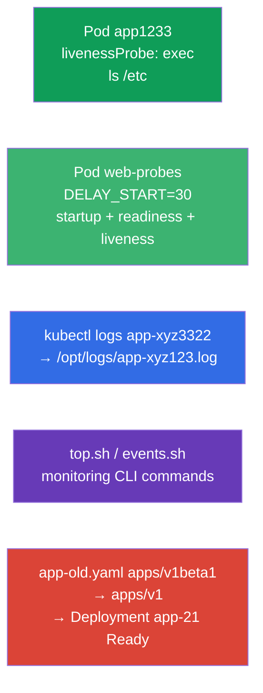

[Русская версия](README_RU.MD) · [Versión en español](README_ES.MD) · [Version française](README_FR.MD) · [Deutsche Version](README_DE.MD) · [ქართული ვერსია](README_GE.MD) · [繁體中文版](README_TW.MD) · [日本語版](README_JP.MD)

# Lab 109 — Observability and Maintenance: Probes, Logs, Debugging, Deprecations

## Description

A hands-on lab for the Observability and Maintenance domain. You will configure container
health checks — **startupProbe**, **readinessProbe** and **livenessProbe** (startup,
readiness and liveness probes), including on a slow-starting application, learn to export
Pod logs into a file, write CLI commands for monitoring (`kubectl top`, events) and fix a
manifest that uses an outdated API version (deprecations) — a typical task before a cluster
upgrade.

All tasks are written in exam style (like real CKA/CKAD questions) with automatic validation
via the `check_result` command. A Pod with a probe is easier to describe with a manifest
(use `--dry-run=client -o yaml` as a starting point), while logs and monitoring commands are
better done imperatively with `kubectl logs`/`kubectl top`.

## Goal

Reinforce the material from the course chapters:

- [Chapter 27. Health checks: liveness, readiness, startup](../../course/27/README.md) — the three probes (startup/readiness/liveness), the `periodSeconds`/`failureThreshold` timings, startupProbe versus `initialDelaySeconds`
- [Chapter 28. Logging and monitoring](../../course/28/README.md) — `kubectl logs`, `kubectl top`, cluster events
- [Chapter 29. Application debugging and API deprecations](../../course/29/README.md) — Pod diagnostics and migration off deprecated API versions

## What We Build and Why

In this lab we practice a set of application maintenance operations: from configuring a
probe to fixing an outdated manifest. Every step serves its own purpose:

| Object | What it is | Why it is in this lab |
|--------|---------|-------------------|
| **Pod `app1233`** with a livenessProbe | Pod with a liveness check | learn to configure an exec probe with timings (chapter 27) |
| **Pod `web-probes`** (slow start) | all three probes at once | startupProbe + readinessProbe + livenessProbe on an application with `DELAY_START`; the startupProbe versus `initialDelaySeconds` case (chapter 27) |
| **Log export** from the seed Pod `app-xyz3322` | logs into a file | practice `kubectl logs` into a file and finding a Pod across namespaces (chapter 28) |
| **CLI scripts** (top, events) | monitoring commands | save the correct `top`/events commands into files (chapter 28) |
| **Fixing `app-old.yaml`** | outdated apiVersion | update `apps/v1beta1` → `apps/v1` and deploy (chapter 29) |

The final picture of what will be deployed:



## Infrastructure

The environment is deployed in AWS (`eu-central-1`) via Terragrunt and consists of:

| Component  | Description                                                  |
|------------|--------------------------------------------------------------|
| `vpc`      | VPC `10.10.0.0/16` with public subnets                        |
| `ssh-keys` | SSH keys for node access                                      |
| `k8s-1`    | Kubernetes `1.35.2` (kubeadm), Calico CNI, metrics-server; creates the seed Pod `app-xyz3322` in namespace `app-logs` |
| `worker`   | Work machine with `kubectl` and `check_result`; on start it creates `/var/work/109/app-old.yaml` and the working directories |

Instances: `t4g.medium` (master), Ubuntu `22.04`. The cluster is single-node — the master is
untainted (the `control-plane` taint is removed), so Pods are scheduled directly on it.

## Deployment

```bash
TASK=109 make run_cka_task
```

Once it is created, connect to the work machine (worker) over SSH and do the tasks from there.
`kubectl` is already pointed at the `cluster1-admin@cluster1` context.

Handy commands on the work machine:

```bash
time_left       # how much time is left
check_result    # check your solution
```

## Tasks

---
|        **1**        | **livenessProbe: checking that the container is alive**       |
| :-----------------: | :----------------------------------------------------------- |
| What to do          | In namespace `web-ns` create Pod `app1233` (image `viktoruj/ping_pong:alpine`) with a livenessProbe of type `exec` that runs `ls /etc`. Set the timings: `initialDelaySeconds: 10` (the pause before the first check) and `periodSeconds: 60` (the interval between checks). The livenessProbe answers the question "is the container alive": if the command returns a non-zero code, the kubelet restarts the container. |
| Acceptance criteria | - namespace `web-ns`;<br/>- Pod `app1233`, image `viktoruj/ping_pong:alpine`;<br/>- livenessProbe: exec `ls /etc`, `initialDelaySeconds` `10`, `periodSeconds` `60`. |
---
|        **2**        | **Three probes for a slow-starting application**              |
| :-----------------: | :----------------------------------------------------------- |
| What to do          | In namespace `web-ns` create Pod `web-probes` (image `viktoruj/ping_pong:latest`, port `8080`) with the environment variable `DELAY_START="30"` — the application starts listening on `:8080` only after `30` seconds (simulating a long start). Attach **all three** probes via `httpGet` to `/` on port `8080`:<br/>• **startupProbe**: `periodSeconds: 5`, `failureThreshold: 12` — gives up to `60` seconds for startup;<br/>• **readinessProbe**: `periodSeconds: 10` — keeps traffic away until the application is ready;<br/>• **livenessProbe**: `periodSeconds: 10` — restarts a hung container. Until the startupProbe succeeds, readiness and liveness are not executed — the container calmly takes its `30` seconds to start. |
| Acceptance criteria | - Pod `web-probes` in namespace `web-ns`, image `viktoruj/ping_pong:latest`;<br/>- **startupProbe**, **readinessProbe** and **livenessProbe** of type `httpGet` on port `8080` are set;<br/>- the Pod reached the Ready state (the startupProbe succeeded). |
---
|        **3**        | **Export Pod logs into a file**                              |
| :-----------------: | :----------------------------------------------------------- |
| What to do          | Find the seed Pod `app-xyz3322` (it lives in one of the namespaces — look for it with `kubectl get po -A`) and export its logs into the file `/opt/logs/app-xyz123.log`. The file must not be empty. |
| Acceptance criteria | - the logs of Pod `app-xyz3322` are saved in `/opt/logs/app-xyz123.log` (the file is not empty). |
---
|        **4**        | **Write monitoring CLI commands**                            |
| :-----------------: | :----------------------------------------------------------- |
| What to do          | Save ready-to-use monitoring commands into scripts. In `/var/work/artifact/top.sh` — the resource usage of Pods sorted by CPU (`kubectl top pods` with `--sort-by=cpu`). In `/var/work/artifact/events.sh` — cluster events sorted by time (`kubectl get events` with `--sort-by`). |
| Acceptance criteria | - `/var/work/artifact/top.sh`: `top` for Pods, sorted by CPU;<br/>- `/var/work/artifact/events.sh`: events sorted by time (`--sort-by`). |
---
|        **5**        | **Fix the outdated manifest and deploy it**                 |
| :-----------------: | :----------------------------------------------------------- |
| What to do          | The manifest `/var/work/109/app-old.yaml` uses the removed API version `apps/v1beta1` and does not contain the required `selector`. Bring it to the current `apps/v1` (add `spec.selector.matchLabels` consistent with the label of the Pod template) and apply it. Deployment `app-21` must roll out and become Ready. |
| Acceptance criteria | - the manifest `/var/work/109/app-old.yaml` is brought to `apps/v1`;<br/>- Deployment `app-21` is rolled out and Ready (≥ 1 replica). |
---

## Practical case: startupProbe versus initialDelaySeconds

The application from task 2 starts slowly and unpredictably (`DELAY_START=30`). Let's look at
two ways to survive that.

First it is important to understand that these are **different things**, not alternatives in
the sense of "the same thing but better":

- `initialDelaySeconds` is a **field inside a probe** (a single number): how many seconds to
  wait before the **first** check. It does not "know" whether the application has started —
  it simply stays quiet for N seconds and then starts checking every `periodSeconds`.
- **startupProbe** is a **separate, third probe** that checks that the application has
  **finished starting up**. Until it succeeds, the kubelet does **not run** the livenessProbe
  and the readinessProbe at all. As soon as the startupProbe succeeds, it is no longer
  executed and liveness/readiness take over.

A direct comparison:

| Criterion | `initialDelaySeconds` on the livenessProbe | A separate startupProbe |
|----------|----------------------------------------|------------------------|
| What it is | a field delaying the first check | a standalone probe for the startup phase |
| Startup budget | a fixed number picked by eye | `failureThreshold × periodSeconds`, easy to extend |
| Unpredictable start | does not survive it: start longer than the delay → restart | survives it: waits until the probe succeeds (within the budget) |
| Liveness reaction after start | tied to the same "worst case" timing | fast: liveness with a small `periodSeconds` kicks in right after startup |
| What we tune | the "startup vs failure detection" trade-off in a single number | startup and failure detection separately |

Now let's see how this looks in a manifest.

**The naive way — only a livenessProbe with a large `initialDelaySeconds`:**

```yaml
livenessProbe:
  httpGet: { path: /, port: 8080 }
  initialDelaySeconds: 40   # guessing the "worst case" startup time
  periodSeconds: 10
```

Downsides:
- `initialDelaySeconds` is a **fixed guess**. You budgeted `40` seconds but the start took
  `50` → the kubelet kills the container and drops it into CrashLoop. Budget it generously
  (`120`) and you wait for nothing.
- This pause always applies to liveness: if the container hangs after startup, you will not
  react quickly until you tune the timings for the "worst case".
- One and the same timing serves both "slow start" and "fast hang detection" — and those are
  contradictory requirements.

**The right way — startupProbe plus separate liveness/readiness:**

```yaml
startupProbe:                 # works only during the startup phase
  httpGet: { path: /, port: 8080 }
  periodSeconds: 5
  failureThreshold: 12        # a budget of 5 × 12 = 60 s for startup
livenessProbe:                # kicks in only AFTER a successful startupProbe
  httpGet: { path: /, port: 8080 }
  periodSeconds: 10
readinessProbe:
  httpGet: { path: /, port: 8080 }
  periodSeconds: 10
```

Why it is better:
- Until the startupProbe succeeds, liveness and readiness are **not executed** — a slow start
  does not lead to a premature restart.
- The startup budget is set honestly: `failureThreshold × periodSeconds` (here up to `60` s) and
  it is easy to tune without depending on the application code.
- After readiness, liveness works with a **small** `periodSeconds` — a hang is caught quickly.
  In other words, "slow start" and "fast failure detection" are handled by different probes
  instead of being squeezed into a single `initialDelaySeconds`.

Check it on Pod `web-probes`: right after creation it is `0/1` (the startupProbe is running),
and after roughly `30` seconds, when the application brings up `:8080`, the startupProbe
succeeds and the Pod becomes `Ready`:

```bash
kubectl -n web-ns get pod web-probes -w
kubectl -n web-ns describe pod web-probes | grep -A1 -E "Startup|Liveness|Readiness"
```

## Checking the Result

On the work machine run the automatic validation:

```bash
check_result
```

The script runs the tests and shows how many tasks are complete.

## Solution

Reference solution: [worker/files/solutions/1.MD](worker/files/solutions/1.MD)

## Mock Exam Coverage

The lab covers the mock-exam tasks on observability and maintenance: CKA mock 02 (#16 — events
sorted, #17 — api-resources), CKAD mock 01 (#8 — logs into a file, #12 — livenessProbe, #17 —
top), CKAD mock 02 (#12 — logs, #13 — livenessProbe, #17 — logs, #21 — deprecations).
Task 2 additionally covers startupProbe and readinessProbe and walks through the
startupProbe versus `initialDelaySeconds` case (chapter 27).

## Deleting the Cluster and Resources

```bash
TASK=109 make delete_cka_task
```
