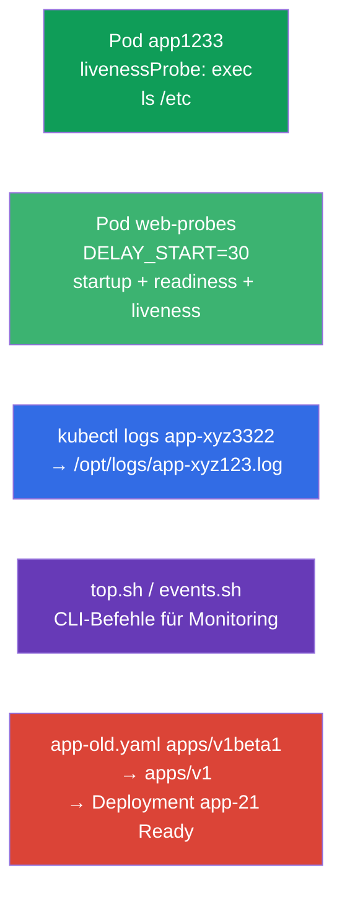

[Русская версия](README_RU.MD) · [Eng version](README.MD) · [Versión en español](README_ES.MD) · [Version française](README_FR.MD) · [ქართული ვერსია](README_GE.MD)

# Lab 109 — Observability und Wartung: Probes, Logs, Debugging, Deprecations

## Beschreibung

Praxisübung zur Domäne Observability and Maintenance. Du konfigurierst Health-Checks des
Containers — **startupProbe**, **readinessProbe** und **livenessProbe** (Start-, Readiness- und
Liveness-Probe), unter anderem am Beispiel einer langsam startenden Anwendung, lernst die Logs
eines Pods in eine Datei zu exportieren, CLI-Befehle für das Monitoring zu schreiben
(`kubectl top`, Events) und ein Manifest mit veralteter API-Version zu reparieren
(Deprecations) — eine typische Aufgabe vor einem Cluster-Upgrade.

Alle Aufgaben sind im Prüfungsstil formuliert (wie echte CKA/CKAD-Fragen) mit automatischer
Prüfung über den Befehl `check_result`. Einen Pod mit einer Probe beschreibt man bequemer per
Manifest (`--dry-run=client -o yaml` als Vorlage), Logs und Monitoring-Befehle dagegen
imperativ über `kubectl logs`/`kubectl top`.

## Ziel

Den Stoff der Kurskapitel festigen:

- [Kapitel 27. Zustandsprüfungen: liveness, readiness, startup](../../course/27/ru.md) — die drei Probes (startup/readiness/liveness), die Timings `periodSeconds`/`failureThreshold`, startupProbe gegen `initialDelaySeconds`
- [Kapitel 28. Logging und Monitoring](../../course/28/ru.md) — `kubectl logs`, `kubectl top`, Cluster-Events
- [Kapitel 29. Debugging von Anwendungen und API-Deprecations](../../course/29/ru.md) — Pod-Diagnose und Umstieg von veralteten API-Versionen

## Was wir erstellen und warum

In diesem Lab üben wir eine Reihe von Wartungsoperationen für Anwendungen: von der
Konfiguration einer Probe bis zur Reparatur eines veralteten Manifests. Jeder Schritt erfüllt
seine eigene Aufgabe:

| Objekt | Was das ist | Warum in diesem Lab |
|--------|---------|-------------------|
| **Pod `app1233`** mit livenessProbe | Pod mit Liveness-Prüfung | wir lernen, eine exec-Probe mit Timings zu konfigurieren (Kapitel 27) |
| **Pod `web-probes`** (langsamer Start) | alle drei Probes gleichzeitig | startupProbe + readinessProbe + livenessProbe an einer Anwendung mit `DELAY_START`; der Fall startupProbe gegen `initialDelaySeconds` (Kapitel 27) |
| **Log-Export** des Seed-Pods `app-xyz3322` | Logs in eine Datei | wir üben `kubectl logs` in eine Datei und das Auffinden eines Pods über Namespaces hinweg (Kapitel 28) |
| **CLI-Skripte** (top, events) | Monitoring-Befehle | wir speichern die richtigen `top`/events-Befehle in Dateien (Kapitel 28) |
| **Reparatur von `app-old.yaml`** | veraltete apiVersion | wir aktualisieren `apps/v1beta1` → `apps/v1` und deployen (Kapitel 29) |

Das Gesamtbild dessen, was ausgerollt wird:



## Infrastruktur

Die Umgebung wird in AWS (`eu-central-1`) über Terragrunt ausgerollt und besteht aus:

| Komponente | Beschreibung                                                 |
|------------|--------------------------------------------------------------|
| `vpc`      | VPC `10.10.0.0/16` mit öffentlichen Subnetzen                 |
| `ssh-keys` | SSH-Schlüssel für den Zugriff auf die Nodes                    |
| `k8s-1`    | Kubernetes `1.35.2` (kubeadm), CNI Calico, metrics-server; erstellt den Seed-Pod `app-xyz3322` im Namespace `app-logs` |
| `worker`   | Arbeitsmaschine mit `kubectl` und `check_result`; beim Start erstellt sie `/var/work/109/app-old.yaml` und die Arbeitsverzeichnisse |

Instanzen: `t3.medium` (Master), Ubuntu `22.04`. Der Cluster hat einen Node — beim Master ist
der Taint `control-plane` entfernt, daher werden Pods direkt auf ihm geplant.

## Bereitstellung

```bash
TASK=109 make run_cka_task
```

Verbinde dich nach dem Erstellen per SSH mit der Arbeitsmaschine (Worker) und erledige die
Aufgaben von dort. `kubectl` ist bereits auf den Kontext `cluster1-admin@cluster1` eingestellt.

Nützliche Befehle auf der Arbeitsmaschine:

```bash
time_left       # wie viel Zeit noch bleibt
check_result    # Lösung prüfen
```

## Aufgaben

---
|        **1**        | **livenessProbe: Prüfung, ob der Container lebt**            |
| :-----------------: | :----------------------------------------------------------- |
| Was wir tun         | Erstelle im Namespace `web-ns` den Pod `app1233` (Image `viktoruj/ping_pong:alpine`) mit einer livenessProbe (Liveness-Probe) vom Typ `exec`, die `ls /etc` ausführt. Setze die Timings: `initialDelaySeconds: 10` (Pause vor der ersten Prüfung) und `periodSeconds: 60` (Intervall zwischen den Prüfungen). Die livenessProbe beantwortet die Frage „lebt der Container“: gibt der Befehl einen Code ungleich null zurück, startet der kubelet den Container neu. |
| Abnahmekriterien    | - Namespace `web-ns`;<br/>- Pod `app1233`, Image `viktoruj/ping_pong:alpine`;<br/>- livenessProbe: exec `ls /etc`, `initialDelaySeconds` `10`, `periodSeconds` `60`. |
---
|        **2**        | **Drei Probes für eine langsam startende Anwendung**         |
| :-----------------: | :----------------------------------------------------------- |
| Was wir tun         | Erstelle im Namespace `web-ns` den Pod `web-probes` (Image `viktoruj/ping_pong:latest`, Port `8080`) mit der Umgebungsvariablen `DELAY_START="30"` — die Anwendung beginnt erst nach `30` Sekunden auf `:8080` zu lauschen (Nachbildung eines langen Starts). Hänge **alle drei** Probes über `httpGet` auf `/` Port `8080` an:<br/>• **startupProbe** (Start-Probe): `periodSeconds: 5`, `failureThreshold: 12` — gibt bis zu `60` Sekunden für den Start;<br/>• **readinessProbe** (Readiness-Probe): `periodSeconds: 10` — lässt keinen Traffic durch, solange die Anwendung nicht bereit ist;<br/>• **livenessProbe**: `periodSeconds: 10` — startet einen hängenden Container neu. Solange die startupProbe nicht erfolgreich ist, werden readiness und liveness nicht ausgeführt — der Container startet in Ruhe seine `30` Sekunden. |
| Abnahmekriterien    | - Pod `web-probes` im Namespace `web-ns`, Image `viktoruj/ping_pong:latest`;<br/>- **startupProbe**, **readinessProbe** und **livenessProbe** vom Typ `httpGet` auf Port `8080` sind gesetzt;<br/>- der Pod hat den Zustand Ready erreicht (die startupProbe war erfolgreich). |
---
|        **3**        | **Pod-Logs in eine Datei exportieren**                       |
| :-----------------: | :----------------------------------------------------------- |
| Was wir tun         | Finde den Seed-Pod `app-xyz3322` (er liegt in einem der Namespaces — suche ihn mit `kubectl get po -A`) und exportiere seine Logs in die Datei `/opt/logs/app-xyz123.log`. Die Datei darf nicht leer sein. |
| Abnahmekriterien    | - die Logs des Pods `app-xyz3322` sind in `/opt/logs/app-xyz123.log` gespeichert (die Datei ist nicht leer). |
---
|        **4**        | **CLI-Befehle für Monitoring schreiben**                     |
| :-----------------: | :----------------------------------------------------------- |
| Was wir tun         | Speichere fertige Monitoring-Befehle in Skripten. In `/var/work/artifact/top.sh` — die Ausgabe des Ressourcenverbrauchs der Pods sortiert nach CPU (`kubectl top pods` mit `--sort-by=cpu`). In `/var/work/artifact/events.sh` — die Cluster-Events sortiert nach Zeit (`kubectl get events` mit `--sort-by`). |
| Abnahmekriterien    | - `/var/work/artifact/top.sh`: `top` der Pods, Sortierung nach CPU;<br/>- `/var/work/artifact/events.sh`: Events sortiert nach Zeit (`--sort-by`). |
---
|        **5**        | **Veraltetes Manifest reparieren und deployen**             |
| :-----------------: | :----------------------------------------------------------- |
| Was wir tun         | Das Manifest `/var/work/109/app-old.yaml` verwendet die entfernte API-Version `apps/v1beta1` und enthält keinen erforderlichen `selector`. Bringe es auf die aktuelle `apps/v1` (füge `spec.selector.matchLabels` passend zum Label des Pod-Templates hinzu) und wende es an. Das Deployment `app-21` muss ausgerollt werden und Ready sein. |
| Abnahmekriterien    | - das Manifest `/var/work/109/app-old.yaml` ist auf `apps/v1` gebracht;<br/>- Deployment `app-21` ist ausgerollt und Ready (≥ 1 Replica). |
---

## Praxisfall: startupProbe gegen initialDelaySeconds

Die Anwendung aus Aufgabe 2 startet langsam und unvorhersehbar (`DELAY_START=30`). Sehen wir
uns zwei Wege an, das zu überleben.

Zuerst ist wichtig zu verstehen, dass es **verschiedene Dinge** sind und keine Alternativen im
Sinne von „dasselbe, nur besser“:

- `initialDelaySeconds` ist ein **Feld innerhalb einer Probe** (eine einzige Zahl): wie viele
  Sekunden vor der **ersten** Prüfung gewartet wird. Es „weiß“ nicht, ob die Anwendung
  gestartet ist — es schweigt einfach N Sekunden und beginnt dann im Takt von `periodSeconds`
  zu prüfen.
- **startupProbe** ist eine **eigene, dritte Probe**, die prüft, dass die Anwendung ihren
  **Start abgeschlossen** hat. Solange sie nicht erfolgreich ist, führt der kubelet die
  livenessProbe und die readinessProbe überhaupt **nicht** aus. Sobald die startupProbe
  erfolgreich ist, wird sie nicht mehr ausgeführt und liveness/readiness übernehmen.

Direkter Vergleich:

| Kriterium | `initialDelaySeconds` bei der livenessProbe | Eigene startupProbe |
|----------|----------------------------------------|------------------------|
| Was das ist | Feld, das die erste Prüfung verzögert | eigenständige Probe für die Startphase |
| Reserve für den Start | feste Zahl „nach Gefühl“ | `failureThreshold × periodSeconds`, leicht zu erweitern |
| Unvorhersehbarer Start | übersteht ihn nicht: Start länger als die Verzögerung → Restart | übersteht ihn: wartet, bis die Probe erfolgreich ist (innerhalb der Reserve) |
| Liveness-Reaktion nach dem Start | an dasselbe „Worst-Case“-Timing gebunden | schnell: liveness mit kleinem `periodSeconds` greift direkt nach dem Start |
| Was wir einstellen | den Kompromiss „Start vs. Fehlererkennung“ in einer Zahl | Start und Fehlererkennung getrennt |

Und so sieht das im Manifest aus.

**Der naive Weg — nur eine livenessProbe mit großem `initialDelaySeconds`:**

```yaml
livenessProbe:
  httpGet: { path: /, port: 8080 }
  initialDelaySeconds: 40   # wir raten den „Worst Case“ des Starts
  periodSeconds: 10
```

Nachteile:
- `initialDelaySeconds` ist eine **feste Vermutung**. Du hast `40` Sekunden eingeplant, der
  Start dauerte aber `50` → der kubelet killt den Container und schickt ihn in den CrashLoop.
  Planst du mit Reserve (`120`), wartest du umsonst.
- Diese Pause gilt für liveness **immer**: hängt der Container erst nach dem Start, kannst du
  nicht schnell reagieren, solange die Timings nicht auf den „Worst Case“ abgestimmt sind.
- Ein und dasselbe Timing dient sowohl dem „langsamen Start“ als auch der „schnellen Erkennung
  eines Hängers“ — und das sind widersprüchliche Anforderungen.

**Der richtige Weg — startupProbe + getrennte liveness/readiness:**

```yaml
startupProbe:                 # arbeitet nur in der Startphase
  httpGet: { path: /, port: 8080 }
  periodSeconds: 5
  failureThreshold: 12        # Reserve 5 × 12 = 60 s für den Start
livenessProbe:                # greift erst NACH erfolgreicher startupProbe
  httpGet: { path: /, port: 8080 }
  periodSeconds: 10
readinessProbe:
  httpGet: { path: /, port: 8080 }
  periodSeconds: 10
```

Warum das besser ist:
- Solange die startupProbe nicht erfolgreich ist, werden liveness und readiness **nicht
  ausgeführt** — ein langsamer Start führt nicht zu einem vorzeitigen Neustart.
- Die Startreserve wird ehrlich festgelegt: `failureThreshold × periodSeconds` (hier bis zu
  `60` s) und lässt sich leicht tunen, unabhängig vom Anwendungscode.
- Nach der Bereitschaft arbeitet liveness mit **kleinem** `periodSeconds` — ein Hänger wird
  schnell erkannt. „Langer Start“ und „schnelle Fehlererkennung“ sind also auf verschiedene
  Probes verteilt und nicht in ein einziges `initialDelaySeconds` gepresst.

Prüfe es am Pod `web-probes`: direkt nach dem Erstellen ist er `0/1` (die startupProbe läuft),
und nach etwa `30` Sekunden, wenn die Anwendung `:8080` öffnet, ist die startupProbe erfolgreich
und der Pod wird `Ready`:

```bash
kubectl -n web-ns get pod web-probes -w
kubectl -n web-ns describe pod web-probes | grep -A1 -E "Startup|Liveness|Readiness"
```

## Ergebnisprüfung

Starte auf der Arbeitsmaschine die automatische Prüfung:

```bash
check_result
```

Das Skript führt die Tests aus und zeigt, wie viele Aufgaben erledigt sind.

## Lösung

Referenzlösung: [worker/files/solutions/1_DE.MD](worker/files/solutions/1_DE.MD)

## Abdeckung der Mock-Prüfungen

Das Lab deckt die Mock-Aufgaben zu Observability und Wartung ab: CKA mock 02 (Nr. 16 — events
sorted, Nr. 17 — api-resources), CKAD mock 01 (Nr. 8 — Logs in eine Datei, Nr. 12 —
livenessProbe, Nr. 17 — top), CKAD mock 02 (Nr. 12 — Logs, Nr. 13 — livenessProbe, Nr. 17 —
Logs, Nr. 21 — Deprecations). Aufgabe 2 deckt zusätzlich startupProbe und readinessProbe ab und
behandelt den Fall startupProbe gegen `initialDelaySeconds` (Kapitel 27).

## Löschen von Cluster und Ressourcen

```bash
TASK=109 make delete_cka_task
```
