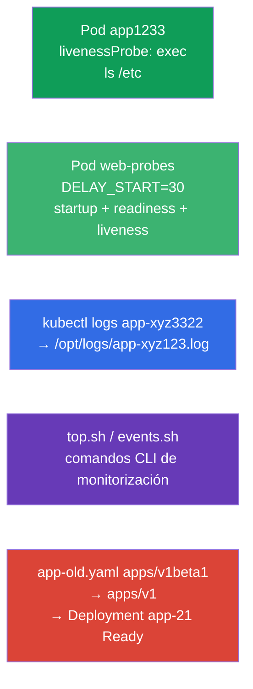

[Русская версия](README_RU.MD) · [Eng version](README.MD) · [Version française](README_FR.MD) · [Deutsche Version](README_DE.MD) · [ქართული ვერსია](README_GE.MD) · [繁體中文版](README_TW.MD) · [日本語版](README_JP.MD)

# Lab 109 — Observabilidad y mantenimiento: probes, logs, depuración, deprecations

## Descripción

Práctica del dominio Observability and Maintenance. Configurarás las comprobaciones de salud
del contenedor — **startupProbe**, **readinessProbe** y **livenessProbe** (probes de arranque,
de disponibilidad y de vida), incluso en el ejemplo de una aplicación de arranque lento;
aprenderás a volcar los logs de un Pod a un fichero, a escribir comandos de CLI para
monitorización (`kubectl top`, eventos) y a arreglar un manifiesto con una versión de API
obsoleta (deprecations) — tarea típica antes de actualizar el clúster.

Todas las tareas están redactadas en estilo de examen (como las preguntas reales de CKA/CKAD)
con verificación automática mediante el comando `check_result`. Un Pod con un probe es más
cómodo describirlo con un manifiesto (`--dry-run=client -o yaml` como plantilla), mientras que
los logs y los comandos de monitorización se hacen de forma imperativa con
`kubectl logs`/`kubectl top`.

## Objetivo

Consolidar el material de los capítulos del curso:

- [Capítulo 27. Comprobaciones de estado: liveness, readiness, startup](../../course/27/es.md) — los tres probes (startup/readiness/liveness), los tiempos `periodSeconds`/`failureThreshold`, startupProbe frente a `initialDelaySeconds`
- [Capítulo 28. Logging y monitorización](../../course/28/es.md) — `kubectl logs`, `kubectl top`, eventos del clúster
- [Capítulo 29. Depuración de aplicaciones y obsolescencia de la API](../../course/29/es.md) — diagnóstico de Pods y migración desde versiones de API obsoletas

## Qué creamos y para qué

En este laboratorio practicamos un conjunto de operaciones de mantenimiento de aplicaciones:
desde configurar un probe hasta arreglar un manifiesto obsoleto. Cada paso resuelve su propia
tarea:

| Objeto | Qué es | Para qué está en este laboratorio |
|--------|---------|-------------------|
| **Pod `app1233`** con livenessProbe | Pod con comprobación de vida | aprendemos a configurar un probe exec con sus tiempos (capítulo 27) |
| **Pod `web-probes`** (arranque lento) | los tres probes a la vez | startupProbe + readinessProbe + livenessProbe en una aplicación con `DELAY_START`; el caso de startupProbe frente a `initialDelaySeconds` (capítulo 27) |
| **Volcado de logs** del Pod semilla `app-xyz3322` | logs a un fichero | entrenamos `kubectl logs` a fichero y la búsqueda de un Pod entre namespaces (capítulo 28) |
| **Scripts de CLI** (top, events) | comandos de monitorización | guardamos los comandos correctos de `top`/events en ficheros (capítulo 28) |
| **Arreglo de `app-old.yaml`** | apiVersion obsoleta | actualizamos `apps/v1beta1` → `apps/v1` y despliegamos (capítulo 29) |

Panorama final de lo que quedará desplegado:



## Infraestructura

El entorno se despliega en AWS (`eu-central-1`) mediante Terragrunt y consta de:

| Componente | Descripción                                                  |
|------------|--------------------------------------------------------------|
| `vpc`      | VPC `10.10.0.0/16` con subredes públicas                      |
| `ssh-keys` | Claves SSH para el acceso a los nodos                         |
| `k8s-1`    | Kubernetes `1.35.2` (kubeadm), CNI Calico, metrics-server; crea el Pod semilla `app-xyz3322` en el namespace `app-logs` |
| `worker`   | Máquina de trabajo con `kubectl` y `check_result`; al arrancar crea `/var/work/109/app-old.yaml` y los directorios de trabajo |

Instancias: `t3.medium` (master), Ubuntu `22.04`. El clúster es de un solo nodo: al master se
le ha quitado el taint `control-plane`, por lo que los pods se planifican directamente en él.

## Despliegue

```bash
TASK=109 make run_cka_task
```

Tras la creación, conéctate por SSH a la máquina de trabajo (worker) y realiza las tareas desde
allí. `kubectl` ya está configurado con el contexto `cluster1-admin@cluster1`.

Comandos útiles en la máquina de trabajo:

```bash
time_left       # cuánto tiempo queda
check_result    # comprobar la solución
```

## Tareas

---
|        **1**        | **livenessProbe: comprobación de vida del contenedor**       |
| :-----------------: | :----------------------------------------------------------- |
| Qué hacemos         | En el namespace `web-ns` crea el Pod `app1233` (imagen `viktoruj/ping_pong:alpine`) con un livenessProbe (probe de vida) de tipo `exec` que ejecute `ls /etc`. Define los tiempos: `initialDelaySeconds: 10` (pausa antes de la primera comprobación) y `periodSeconds: 60` (intervalo entre comprobaciones). El livenessProbe responde a la pregunta «¿está vivo el contenedor?»: si el comando devuelve un código distinto de cero, el kubelet reinicia el contenedor. |
| Criterios de aceptación | - namespace `web-ns`;<br/>- Pod `app1233`, imagen `viktoruj/ping_pong:alpine`;<br/>- livenessProbe: exec `ls /etc`, `initialDelaySeconds` `10`, `periodSeconds` `60`. |
---
|        **2**        | **Tres probes para una aplicación de arranque lento**        |
| :-----------------: | :----------------------------------------------------------- |
| Qué hacemos         | En el namespace `web-ns` crea el Pod `web-probes` (imagen `viktoruj/ping_pong:latest`, puerto `8080`) con la variable de entorno `DELAY_START="30"`: la aplicación empieza a escuchar en `:8080` solo al cabo de `30` segundos (imitación de un arranque largo). Añade **los tres** probes mediante `httpGet` a `/` en el puerto `8080`:<br/>• **startupProbe** (probe de arranque): `periodSeconds: 5`, `failureThreshold: 12` — da hasta `60` segundos para arrancar;<br/>• **readinessProbe** (probe de disponibilidad): `periodSeconds: 10` — no deja pasar tráfico hasta que la aplicación esté lista;<br/>• **livenessProbe**: `periodSeconds: 10` — reinicia el contenedor colgado. Mientras el startupProbe no pase, readiness y liveness no se ejecutan: el contenedor arranca tranquilamente durante sus `30` segundos. |
| Criterios de aceptación | - Pod `web-probes` en el namespace `web-ns`, imagen `viktoruj/ping_pong:latest`;<br/>- están definidos **startupProbe**, **readinessProbe** y **livenessProbe** de tipo `httpGet` en el puerto `8080`;<br/>- el Pod llegó al estado Ready (el startupProbe pasó). |
---
|        **3**        | **Volcar los logs del pod a un fichero**                     |
| :-----------------: | :----------------------------------------------------------- |
| Qué hacemos         | Encuentra el Pod semilla `app-xyz3322` (está en uno de los namespaces: búscalo con `kubectl get po -A`) y vuelca sus logs al fichero `/opt/logs/app-xyz123.log`. El fichero no debe estar vacío. |
| Criterios de aceptación | - los logs del Pod `app-xyz3322` están guardados en `/opt/logs/app-xyz123.log` (el fichero no está vacío). |
---
|        **4**        | **Escribir comandos CLI de monitorización**                  |
| :-----------------: | :----------------------------------------------------------- |
| Qué hacemos         | Guarda comandos de monitorización listos para usar en scripts. En `/var/work/artifact/top.sh` — la salida del consumo de recursos de los Pods ordenada por CPU (`kubectl top pods` con `--sort-by=cpu`). En `/var/work/artifact/events.sh` — los eventos del clúster ordenados por tiempo (`kubectl get events` con `--sort-by`). |
| Criterios de aceptación | - `/var/work/artifact/top.sh`: `top` de Pods, ordenado por CPU;<br/>- `/var/work/artifact/events.sh`: eventos ordenados por tiempo (`--sort-by`). |
---
|        **5**        | **Arreglar el manifiesto obsoleto y desplegarlo**            |
| :-----------------: | :----------------------------------------------------------- |
| Qué hacemos         | El manifiesto `/var/work/109/app-old.yaml` usa la versión de API eliminada `apps/v1beta1` y no contiene el `selector` obligatorio. Llévalo a la versión actual `apps/v1` (añade `spec.selector.matchLabels` coherente con el label de la plantilla del Pod) y aplícalo. El Deployment `app-21` debe desplegarse y quedar Ready. |
| Criterios de aceptación | - el manifiesto `/var/work/109/app-old.yaml` está llevado a `apps/v1`;<br/>- el Deployment `app-21` está desplegado y Ready (≥ 1 réplica). |
---

## Caso práctico: startupProbe frente a initialDelaySeconds

La aplicación de la tarea 2 arranca de forma lenta e impredecible (`DELAY_START=30`). Veamos
dos maneras de sobrellevarlo.

Primero es importante entender que son **entidades distintas**, no alternativas del tipo «lo
mismo, pero mejor»:

- `initialDelaySeconds` es un **campo dentro del probe** (un único número): cuántos segundos
  esperar antes de la **primera** comprobación. No «sabe» si la aplicación arrancó o no:
  simplemente calla N segundos y luego empieza a comprobar con el paso `periodSeconds`.
- **startupProbe** es un **tercer probe independiente** que comprueba que la aplicación
  **terminó de arrancar**. Mientras no pase, el kubelet **no lanza** en absoluto el
  livenessProbe ni el readinessProbe. En cuanto el startupProbe tiene éxito, deja de
  ejecutarse y entran en juego liveness/readiness.

Comparación directa:

| Criterio | `initialDelaySeconds` en el livenessProbe | startupProbe independiente |
|----------|----------------------------------------|------------------------|
| Qué es | campo que retrasa la primera comprobación | probe autónomo de la etapa de arranque |
| Margen para el arranque | número fijo «a ojo» | `failureThreshold × periodSeconds`, fácil de ampliar |
| Arranque impredecible | no lo soporta: arranque más largo que el retardo → reinicio | lo soporta: espera hasta que el probe pase (dentro del margen) |
| Reacción de liveness tras el arranque | atada al mismo tiempo «para el peor caso» | rápida: liveness con un `periodSeconds` pequeño se activa justo tras el arranque |
| Qué configuramos | el compromiso «arranque vs detección de fallo» en un solo número | arranque y detección de fallo por separado |

Veamos ahora cómo queda en el manifiesto.

**La forma ingenua: solo livenessProbe con un `initialDelaySeconds` grande:**

```yaml
livenessProbe:
  httpGet: { path: /, port: 8080 }
  initialDelaySeconds: 40   # adivinamos el «peor caso» del arranque
  periodSeconds: 10
```

Inconvenientes:
- `initialDelaySeconds` es una **suposición fija**. Reservaste `40` segundos y el arranque
  tardó `50` → el kubelet mata el contenedor y lo tira a CrashLoop. Si reservas de sobra
  (`120`), esperas en vano.
- Esa pausa se aplica a liveness **siempre**: si el contenedor se cuelga ya después del
  arranque, no podrás reaccionar rápido hasta que ajustes los tiempos al «peor caso».
- Un mismo tiempo atiende tanto al «arranque lento» como a la «detección rápida de un
  cuelgue», y son requisitos contradictorios.

**La forma correcta: startupProbe + liveness/readiness separados:**

```yaml
startupProbe:                 # funciona solo en la etapa de arranque
  httpGet: { path: /, port: 8080 }
  periodSeconds: 5
  failureThreshold: 12        # margen 5 × 12 = 60 s para el arranque
livenessProbe:                # se activará solo DESPUÉS de un startupProbe correcto
  httpGet: { path: /, port: 8080 }
  periodSeconds: 10
readinessProbe:
  httpGet: { path: /, port: 8080 }
  periodSeconds: 10
```

Por qué es mejor:
- Mientras el startupProbe no pase, liveness y readiness **no se ejecutan**: un arranque lento
  no provoca un reinicio prematuro.
- El margen de arranque se fija de forma honesta: `failureThreshold × periodSeconds` (aquí
  hasta `60` s) y se ajusta con facilidad, sin depender del código de la aplicación.
- Tras estar listo, liveness trabaja con un `periodSeconds` **pequeño**: el cuelgue se detecta
  rápido. Es decir, el «arranque largo» y la «detección rápida de fallos» quedan repartidos
  entre probes distintos, en lugar de comprimidos en un único `initialDelaySeconds`.

Compruébalo en el Pod `web-probes`: justo tras crearlo está `0/1` (se está ejecutando el
startupProbe) y aproximadamente a los `30` segundos, cuando la aplicación levanta `:8080`, el
startupProbe pasa y el Pod se queda `Ready`:

```bash
kubectl -n web-ns get pod web-probes -w
kubectl -n web-ns describe pod web-probes | grep -A1 -E "Startup|Liveness|Readiness"
```

## Comprobación del resultado

En la máquina de trabajo lanza la verificación automática:

```bash
check_result
```

El script ejecuta los tests y muestra cuántas tareas están completadas.

## Solución

Solución de referencia: [worker/files/solutions/1_ES.MD](worker/files/solutions/1_ES.MD)

## Cobertura de exámenes simulados

El laboratorio cubre las tareas de los simulados sobre observabilidad y mantenimiento: CKA
mock 02 (n.º 16 — events sorted, n.º 17 — api-resources), CKAD mock 01 (n.º 8 — logs a un
fichero, n.º 12 — livenessProbe, n.º 17 — top), CKAD mock 02 (n.º 12 — logs, n.º 13 —
livenessProbe, n.º 17 — logs, n.º 21 — deprecations). La tarea 2 cubre además startupProbe y
readinessProbe y analiza el caso de startupProbe frente a `initialDelaySeconds` (capítulo 27).

## Eliminación del clúster y los recursos

```bash
TASK=109 make delete_cka_task
```
