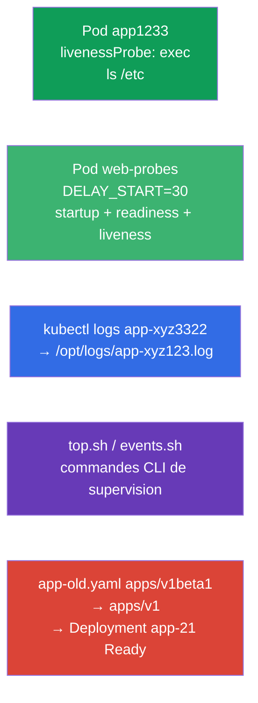

[Русская версия](README_RU.MD) · [Eng version](README.MD) · [Versión en español](README_ES.MD) · [Deutsche Version](README_DE.MD) · [ქართული ვერსია](README_GE.MD)

# Lab 109 — Observabilité et maintenance : probes, logs, débogage, deprecations

## Description

Travail pratique sur le domaine Observability and Maintenance. Vous configurerez les
vérifications de santé du conteneur — **startupProbe**, **readinessProbe** et
**livenessProbe** (probes de démarrage, de disponibilité et de vie), notamment sur l'exemple
d'une application qui démarre lentement, vous apprendrez à exporter les logs d'un Pod dans un
fichier, à écrire des commandes CLI de supervision (`kubectl top`, événements) et à réparer un
manifeste utilisant une version d'API obsolète (deprecations) — tâche typique avant la mise à
jour d'un cluster.

Toutes les tâches sont rédigées dans le style de l'examen (comme les vraies questions
CKA/CKAD) avec une vérification automatique via la commande `check_result`. Un Pod avec un
probe est plus commode à décrire par un manifeste (`--dry-run=client -o yaml` comme base),
tandis que les logs et les commandes de supervision se font de façon impérative avec
`kubectl logs`/`kubectl top`.

## Objectif

Consolider le contenu des chapitres du cours :

- [Chapitre 27. Vérifications d'état : liveness, readiness, startup](../../course/27/ru.md) — les trois probes (startup/readiness/liveness), les timings `periodSeconds`/`failureThreshold`, startupProbe face à `initialDelaySeconds`
- [Chapitre 28. Journalisation et supervision](../../course/28/ru.md) — `kubectl logs`, `kubectl top`, événements du cluster
- [Chapitre 29. Débogage des applications et obsolescence de l'API](../../course/29/ru.md) — diagnostic des Pods et migration depuis les versions d'API obsolètes

## Ce que nous créons et pourquoi

Dans ce lab, nous travaillons un ensemble d'opérations d'exploitation des applications : de la
configuration d'un probe à la réparation d'un manifeste obsolète. Chaque étape a son propre
rôle :

| Objet | Ce que c'est | Pourquoi dans ce lab |
|--------|---------|-------------------|
| **Pod `app1233`** avec livenessProbe | Pod avec une vérification de vie | nous apprenons à configurer un probe exec avec ses timings (chapitre 27) |
| **Pod `web-probes`** (démarrage lent) | les trois probes à la fois | startupProbe + readinessProbe + livenessProbe sur une application avec `DELAY_START` ; le cas startupProbe face à `initialDelaySeconds` (chapitre 27) |
| **Export des logs** du Pod initial `app-xyz3322` | logs dans un fichier | nous entraînons `kubectl logs` vers un fichier et la recherche d'un Pod à travers les namespaces (chapitre 28) |
| **Scripts CLI** (top, events) | commandes de supervision | nous enregistrons les bonnes commandes `top`/events dans des fichiers (chapitre 28) |
| **Réparation de `app-old.yaml`** | apiVersion obsolète | nous passons de `apps/v1beta1` à `apps/v1` et déployons (chapitre 29) |

Vue d'ensemble de ce qui sera déployé :



## Infrastructure

L'environnement est déployé dans AWS (`eu-central-1`) via Terragrunt et se compose de :

| Composant  | Description                                                  |
|------------|--------------------------------------------------------------|
| `vpc`      | VPC `10.10.0.0/16` avec des sous-réseaux publics               |
| `ssh-keys` | Clés SSH pour l'accès aux nœuds                                |
| `k8s-1`    | Kubernetes `1.35.2` (kubeadm), CNI Calico, metrics-server ; crée le Pod initial `app-xyz3322` dans le namespace `app-logs` |
| `worker`   | Machine de travail avec `kubectl` et `check_result` ; au démarrage, elle crée `/var/work/109/app-old.yaml` et les répertoires de travail |

Instances : `t3.medium` (master), Ubuntu `22.04`. Le cluster est mono-nœud — le taint
`control-plane` a été retiré du master, les pods sont donc planifiés directement dessus.

## Déploiement

```bash
TASK=109 make run_cka_task
```

Après la création, connectez-vous en SSH à la machine de travail (worker) et effectuez les
tâches depuis celle-ci. `kubectl` est déjà configuré sur le contexte `cluster1-admin@cluster1`.

Commandes utiles sur la machine de travail :

```bash
time_left       # combien de temps il reste
check_result    # vérifier la solution
```

## Tâches

---
|        **1**        | **livenessProbe : vérifier que le conteneur est vivant**     |
| :-----------------: | :----------------------------------------------------------- |
| Ce qu'on fait       | Dans le namespace `web-ns`, créez le Pod `app1233` (image `viktoruj/ping_pong:alpine`) avec un livenessProbe (probe de vie) de type `exec` qui exécute `ls /etc`. Fixez les timings : `initialDelaySeconds: 10` (pause avant la première vérification) et `periodSeconds: 60` (intervalle entre les vérifications). Le livenessProbe répond à la question « le conteneur est-il vivant ? » : si la commande renvoie un code non nul, le kubelet redémarre le conteneur. |
| Critères d'acceptation | - namespace `web-ns` ;<br/>- Pod `app1233`, image `viktoruj/ping_pong:alpine` ;<br/>- livenessProbe : exec `ls /etc`, `initialDelaySeconds` `10`, `periodSeconds` `60`. |
---
|        **2**        | **Trois probes pour une application à démarrage lent**       |
| :-----------------: | :----------------------------------------------------------- |
| Ce qu'on fait       | Dans le namespace `web-ns`, créez le Pod `web-probes` (image `viktoruj/ping_pong:latest`, port `8080`) avec la variable d'environnement `DELAY_START="30"` — l'application ne commence à écouter sur `:8080` qu'au bout de `30` secondes (imitation d'un démarrage long). Attachez **les trois** probes via `httpGet` sur `/` port `8080` :<br/>• **startupProbe** (probe de démarrage) : `periodSeconds: 5`, `failureThreshold: 12` — laisse jusqu'à `60` secondes pour démarrer ;<br/>• **readinessProbe** (probe de disponibilité) : `periodSeconds: 10` — ne laisse pas passer le trafic tant que l'application n'est pas prête ;<br/>• **livenessProbe** : `periodSeconds: 10` — redémarre un conteneur bloqué. Tant que le startupProbe n'a pas réussi, readiness et liveness ne sont pas exécutés — le conteneur démarre tranquillement pendant ses `30` secondes. |
| Critères d'acceptation | - Pod `web-probes` dans le namespace `web-ns`, image `viktoruj/ping_pong:latest` ;<br/>- **startupProbe**, **readinessProbe** et **livenessProbe** de type `httpGet` sur le port `8080` sont définis ;<br/>- le Pod a atteint l'état Ready (le startupProbe a réussi). |
---
|        **3**        | **Exporter les logs du pod dans un fichier**                 |
| :-----------------: | :----------------------------------------------------------- |
| Ce qu'on fait       | Trouvez le Pod initial `app-xyz3322` (il se trouve dans un des namespaces — cherchez-le avec `kubectl get po -A`) et exportez ses logs dans le fichier `/opt/logs/app-xyz123.log`. Le fichier ne doit pas être vide. |
| Critères d'acceptation | - les logs du Pod `app-xyz3322` sont enregistrés dans `/opt/logs/app-xyz123.log` (le fichier n'est pas vide). |
---
|        **4**        | **Écrire des commandes CLI de supervision**                  |
| :-----------------: | :----------------------------------------------------------- |
| Ce qu'on fait       | Enregistrez des commandes de supervision prêtes à l'emploi dans des scripts. Dans `/var/work/artifact/top.sh` — l'affichage de la consommation de ressources des Pods triée par CPU (`kubectl top pods` avec `--sort-by=cpu`). Dans `/var/work/artifact/events.sh` — les événements du cluster triés par date (`kubectl get events` avec `--sort-by`). |
| Critères d'acceptation | - `/var/work/artifact/top.sh` : `top` des Pods, tri par CPU ;<br/>- `/var/work/artifact/events.sh` : événements triés par date (`--sort-by`). |
---
|        **5**        | **Réparer le manifeste obsolète et le déployer**            |
| :-----------------: | :----------------------------------------------------------- |
| Ce qu'on fait       | Le manifeste `/var/work/109/app-old.yaml` utilise la version d'API supprimée `apps/v1beta1` et ne contient pas le `selector` obligatoire. Mettez-le à la version actuelle `apps/v1` (ajoutez `spec.selector.matchLabels` cohérent avec le label du template de Pod) et appliquez-le. Le Deployment `app-21` doit se déployer et devenir Ready. |
| Critères d'acceptation | - le manifeste `/var/work/109/app-old.yaml` est passé à `apps/v1` ;<br/>- le Deployment `app-21` est déployé et Ready (≥ 1 réplica). |
---

## Cas pratique : startupProbe face à initialDelaySeconds

L'application de la tâche 2 démarre lentement et de façon imprévisible (`DELAY_START=30`).
Examinons deux façons de gérer cela.

Il faut d'abord comprendre qu'il s'agit d'**entités différentes**, et non d'alternatives du
type « la même chose, mais en mieux » :

- `initialDelaySeconds` est un **champ à l'intérieur d'un probe** (un seul nombre) : combien
  de secondes attendre avant la **première** vérification. Il ne « sait » pas si l'application
  a démarré — il se contente de se taire N secondes, puis commence à vérifier au rythme de
  `periodSeconds`.
- **startupProbe** est un **troisième probe distinct** qui vérifie que l'application a
  **terminé son démarrage**. Tant qu'il n'a pas réussi, le kubelet **ne lance pas** du tout le
  livenessProbe ni le readinessProbe. Dès que le startupProbe réussit, il n'est plus exécuté
  et liveness/readiness entrent en jeu.

Comparaison directe :

| Critère | `initialDelaySeconds` du livenessProbe | startupProbe distinct |
|----------|----------------------------------------|------------------------|
| Ce que c'est | champ retardant la première vérification | probe autonome de la phase de démarrage |
| Marge pour le démarrage | nombre fixe « à vue de nez » | `failureThreshold × periodSeconds`, facile à étendre |
| Démarrage imprévisible | ne le supporte pas : démarrage plus long que le délai → redémarrage | le supporte : attend que le probe réussisse (dans la limite de la marge) |
| Réaction de liveness après le démarrage | liée au même timing « pour le pire cas » | rapide : liveness avec un petit `periodSeconds` s'active juste après le démarrage |
| Ce qu'on règle | le compromis « démarrage vs détection de panne » dans un seul nombre | démarrage et détection de panne séparément |

Voyons maintenant à quoi cela ressemble dans le manifeste.

**La méthode naïve — uniquement un livenessProbe avec un grand `initialDelaySeconds` :**

```yaml
livenessProbe:
  httpGet: { path: /, port: 8080 }
  initialDelaySeconds: 40   # on devine le « pire cas » du démarrage
  periodSeconds: 10
```

Inconvénients :
- `initialDelaySeconds` est une **supposition figée**. Vous avez prévu `40` secondes mais le
  démarrage a pris `50` → le kubelet tue le conteneur et le fait tomber en CrashLoop. Prévoyez
  large (`120`) et vous attendez pour rien.
- Cette pause s'applique **toujours** à liveness : si le conteneur se bloque après le
  démarrage, impossible de réagir vite tant que vous n'avez pas calé les timings sur le
  « pire cas ».
- Un même timing sert à la fois au « démarrage lent » et à la « détection rapide d'un
  blocage » — et ce sont des exigences contradictoires.

**La bonne méthode — startupProbe + liveness/readiness séparés :**

```yaml
startupProbe:                 # ne fonctionne qu'à la phase de démarrage
  httpGet: { path: /, port: 8080 }
  periodSeconds: 5
  failureThreshold: 12        # marge de 5 × 12 = 60 s pour le démarrage
livenessProbe:                # ne s'activera qu'APRÈS un startupProbe réussi
  httpGet: { path: /, port: 8080 }
  periodSeconds: 10
readinessProbe:
  httpGet: { path: /, port: 8080 }
  periodSeconds: 10
```

Pourquoi c'est mieux :
- Tant que le startupProbe n'a pas réussi, liveness et readiness **ne sont pas exécutés** — un
  démarrage lent n'entraîne pas de redémarrage prématuré.
- La marge de démarrage est définie honnêtement : `failureThreshold × periodSeconds` (ici
  jusqu'à `60` s) et elle se règle facilement, sans dépendre du code de l'application.
- Une fois prêt, liveness fonctionne avec un **petit** `periodSeconds` — un blocage est
  détecté rapidement. Autrement dit, le « démarrage long » et la « détection rapide de panne »
  sont répartis entre des probes différents au lieu d'être comprimés dans un seul
  `initialDelaySeconds`.

Vérifiez-le sur le Pod `web-probes` : juste après sa création il est `0/1` (le startupProbe est
en cours), et au bout d'environ `30` secondes, quand l'application ouvre `:8080`, le
startupProbe réussit et le Pod devient `Ready` :

```bash
kubectl -n web-ns get pod web-probes -w
kubectl -n web-ns describe pod web-probes | grep -A1 -E "Startup|Liveness|Readiness"
```

## Vérification du résultat

Sur la machine de travail, lancez la vérification automatique :

```bash
check_result
```

Le script exécute les tests et affiche le nombre de tâches réussies.

## Solution

Solution de référence : [worker/files/solutions/1_FR.MD](worker/files/solutions/1_FR.MD)

## Couverture des examens blancs

Le lab couvre les tâches des examens blancs sur l'observabilité et la maintenance : CKA mock 02
(n° 16 — events sorted, n° 17 — api-resources), CKAD mock 01 (n° 8 — logs dans un fichier,
n° 12 — livenessProbe, n° 17 — top), CKAD mock 02 (n° 12 — logs, n° 13 — livenessProbe,
n° 17 — logs, n° 21 — deprecations). La tâche 2 couvre en plus startupProbe et readinessProbe
et détaille le cas startupProbe face à `initialDelaySeconds` (chapitre 27).

## Suppression du cluster et des ressources

```bash
TASK=109 make delete_cka_task
```
