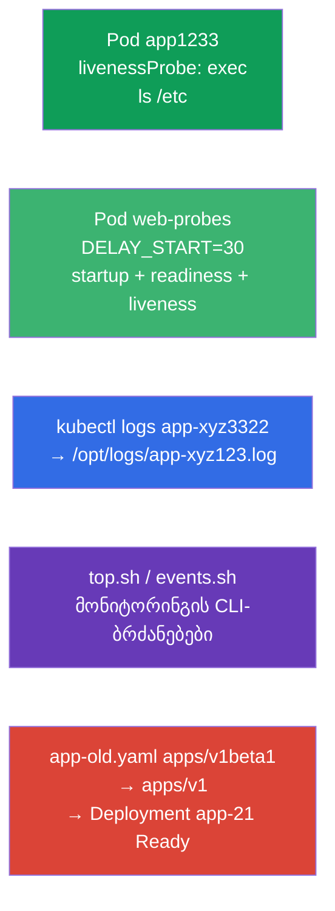

[Русская версия](README_RU.MD) · [Eng version](README.MD) · [Versión en español](README_ES.MD) · [Version française](README_FR.MD) · [Deutsche Version](README_DE.MD) · [繁體中文版](README_TW.MD) · [日本語版](README_JP.MD)

# Lab 109 — დაკვირვებადობა და მომსახურება: probe-ები, ლოგები, გამართვა, deprecations

## აღწერა

პრაქტიკული სამუშაო დომენზე Observability and Maintenance. თქვენ დააკონფიგურირებთ კონტეინერის
ჯანმრთელობის შემოწმებებს — **startupProbe**, **readinessProbe** და **livenessProbe** (გაშვების,
მზაობის და სიცოცხლის probe-ები), მათ შორის ნელა მშვები აპლიკაციის მაგალითზე, ისწავლით Pod-ის
ლოგების ფაილში გადმოტვირთვას, მონიტორინგის CLI-ბრძანებების წერას (`kubectl top`, მოვლენები) და
მოძველებული API-ვერსიის მქონე მანიფესტის შეკეთებას (deprecations, მოძველება) — ტიპური ამოცანა
კლასტერის განახლებამდე.

ყველა დავალება გამოცდის სტილშია გაფორმებული (როგორც რეალური CKA/CKAD კითხვები) და მათი
შემოწმება ავტომატურად ხდება ბრძანებით `check_result`. probe-ის მქონე Pod უფრო მოსახერხებელია
მანიფესტით აღწერო (`--dry-run=client -o yaml` როგორც სამუშაო ნიმუში), ხოლო ლოგები და
მონიტორინგის ბრძანებები — იმპერატიულად, `kubectl logs`/`kubectl top`-ის საშუალებით.

## მიზანი

განამტკიცოთ კურსის თავების მასალა:

- [თავი 27. მდგომარეობის შემოწმებები: liveness, readiness, startup](../../course/27/ge.md) — სამი probe (startup/readiness/liveness), ტაიმინგები `periodSeconds`/`failureThreshold`, startupProbe `initialDelaySeconds`-ის წინააღმდეგ
- [თავი 28. ლოგირება და მონიტორინგი](../../course/28/ge.md) — `kubectl logs`, `kubectl top`, კლასტერის მოვლენები
- [თავი 29. აპლიკაციების გამართვა და API-ის მოძველება](../../course/29/ge.md) — Pod-ის დიაგნოსტიკა და მოძველებული API-ვერსიებიდან გადასვლა

## რას ვქმნით და რისთვის

ამ ლაბორატორიაში ვამუშავებთ აპლიკაციების თანხლების ოპერაციათა ნაკრებს: probe-ის
კონფიგურაციიდან მოძველებული მანიფესტის შეკეთებამდე. თითოეული ნაბიჯი თავის ამოცანას ასრულებს:

| ობიექტი | რა არის ეს | რისთვის არის ამ ლაბორატორიაში |
|--------|---------|-------------------|
| **Pod `app1233`** livenessProbe-ით | Pod სიცოცხლის შემოწმებით | ვსწავლობთ exec-probe-ის კონფიგურაციას ტაიმინგებით (თავი 27) |
| **Pod `web-probes`** (ნელი გაშვება) | სამივე probe ერთდროულად | startupProbe + readinessProbe + livenessProbe აპლიკაციაზე `DELAY_START`-ით; კეისი startupProbe `initialDelaySeconds`-ის წინააღმდეგ (თავი 27) |
| **ლოგების გადმოტვირთვა** seed-Pod `app-xyz3322`-დან | ლოგები ფაილში | ვწვრთნით `kubectl logs`-ს ფაილში და Pod-ის ძებნას namespace-ებში (თავი 28) |
| **CLI-სკრიპტები** (top, events) | მონიტორინგის ბრძანებები | ვინახავთ სწორ `top`/events ბრძანებებს ფაილებში (თავი 28) |
| **`app-old.yaml`-ის შეკეთება** | მოძველებული apiVersion | ვანახლებთ `apps/v1beta1` → `apps/v1` და ვათავსებთ (თავი 29) |

საბოლოო სურათი იმისა, რაც განთავსდება:



## ინფრასტრუქტურა

გარემო იშლება AWS-ში (`eu-central-1`) Terragrunt-ის მეშვეობით და შედგება:

| კომპონენტი | აღწერა                                                    |
|------------|-----------------------------------------------------------|
| `vpc`      | VPC `10.10.0.0/16` საჯარო ქვექსელებით                      |
| `ssh-keys` | SSH-გასაღებები node-ებზე წვდომისთვის                        |
| `k8s-1`    | Kubernetes `1.35.2` (kubeadm), CNI Calico, metrics-server; ქმნის seed-Pod `app-xyz3322`-ს namespace `app-logs`-ში |
| `worker`   | სამუშაო მანქანა `kubectl`-ით და `check_result`-ით; გაშვებისას ქმნის `/var/work/109/app-old.yaml`-ს და სამუშაო კატალოგებს |

ინსტანსები: `t4g.medium` (master), Ubuntu `22.04`. კლასტერი ერთკვანძიანია — master-ს მოშორებულია
taint `control-plane`, ამიტომ pod-ები პირდაპირ მასზე იგეგმება.

## განთავსება

```bash
TASK=109 make run_cka_task
```

შექმნის შემდეგ დაუკავშირდით სამუშაო მანქანას (worker) SSH-ით და დავალებები შეასრულეთ იქიდან.
`kubectl` უკვე კონფიგურირებულია კონტექსტზე `cluster1-admin@cluster1`.

სასარგებლო ბრძანებები სამუშაო მანქანაზე:

```bash
time_left       # რამდენი დრო დარჩა
check_result    # ამოხსნის შემოწმება
```

## დავალებები

---
|        **1**        | **livenessProbe: კონტეინერის სიცოცხლის შემოწმება**           |
| :-----------------: | :----------------------------------------------------------- |
| რას ვაკეთებთ        | namespace `web-ns`-ში შექმენით Pod `app1233` (image `viktoruj/ping_pong:alpine`) `exec` ტიპის livenessProbe-ით (სიცოცხლის probe), რომელიც ასრულებს `ls /etc`-ს. მიუთითეთ ტაიმინგები: `initialDelaySeconds: 10` (პაუზა პირველ შემოწმებამდე) და `periodSeconds: 60` (ინტერვალი შემოწმებებს შორის). livenessProbe პასუხობს კითხვას „ცოცხალია თუ არა კონტეინერი“: თუ ბრძანება არანულოვან კოდს აბრუნებს, kubelet კონტეინერს რესტარტავს. |
| მიღების კრიტერიუმები | - namespace `web-ns`;<br/>- Pod `app1233`, image `viktoruj/ping_pong:alpine`;<br/>- livenessProbe: exec `ls /etc`, `initialDelaySeconds` `10`, `periodSeconds` `60`. |
---
|        **2**        | **სამი probe ნელა მშვები აპლიკაციისთვის**                    |
| :-----------------: | :----------------------------------------------------------- |
| რას ვაკეთებთ        | namespace `web-ns`-ში შექმენით Pod `web-probes` (image `viktoruj/ping_pong:latest`, პორტი `8080`) გარემოს ცვლადით `DELAY_START="30"` — აპლიკაცია `:8080`-ის მოსმენას მხოლოდ `30` წამის შემდეგ იწყებს (ხანგრძლივი გაშვების იმიტაცია). მიამაგრეთ **სამივე** probe `httpGet`-ით `/`-ზე პორტ `8080`-ზე:<br/>• **startupProbe** (გაშვების probe): `periodSeconds: 5`, `failureThreshold: 12` — გაშვებაზე `60` წამამდე იძლევა;<br/>• **readinessProbe** (მზაობის probe): `periodSeconds: 10` — ტრაფიკს არ უშვებს, სანამ აპლიკაცია მზად არ იქნება;<br/>• **livenessProbe**: `periodSeconds: 10` — გაჭედილ კონტეინერს რესტარტავს. სანამ startupProbe არ გაივლის, readiness და liveness არ სრულდება — კონტეინერი მშვიდად უშვებს თავის `30` წამს. |
| მიღების კრიტერიუმები | - Pod `web-probes` namespace `web-ns`-ში, image `viktoruj/ping_pong:latest`;<br/>- მითითებულია **startupProbe**, **readinessProbe** და **livenessProbe** `httpGet` ტიპის პორტ `8080`-ზე;<br/>- Pod მიაღწია Ready მდგომარეობას (startupProbe გაიარა). |
---
|        **3**        | **pod-ის ლოგების ფაილში გადმოტვირთვა**                       |
| :-----------------: | :----------------------------------------------------------- |
| რას ვაკეთებთ        | იპოვეთ seed-Pod `app-xyz3322` (ის ერთ-ერთ namespace-შია — ეძებეთ `kubectl get po -A`-ით) და გადმოტვირთეთ მისი ლოგები ფაილში `/opt/logs/app-xyz123.log`. ფაილი არ უნდა იყოს ცარიელი. |
| მიღების კრიტერიუმები | - Pod `app-xyz3322`-ის ლოგები შენახულია `/opt/logs/app-xyz123.log`-ში (ფაილი არ არის ცარიელი). |
---
|        **4**        | **მონიტორინგის CLI-ბრძანებების დაწერა**                      |
| :-----------------: | :----------------------------------------------------------- |
| რას ვაკეთებთ        | შეინახეთ მზა მონიტორინგის ბრძანებები სკრიპტებში. `/var/work/artifact/top.sh`-ში — Pod-ების რესურსების მოხმარების გამოტანა CPU-ს მიხედვით დალაგებით (`kubectl top pods` `--sort-by=cpu`-თი). `/var/work/artifact/events.sh`-ში — კლასტერის მოვლენები, დროის მიხედვით დალაგებული (`kubectl get events` `--sort-by`-თი). |
| მიღების კრიტერიუმები | - `/var/work/artifact/top.sh`: `top` Pod-ებისთვის, დალაგება CPU-ს მიხედვით;<br/>- `/var/work/artifact/events.sh`: მოვლენები, დროის მიხედვით დალაგებული (`--sort-by`). |
---
|        **5**        | **მოძველებული მანიფესტის შეკეთება და განთავსება**           |
| :-----------------: | :----------------------------------------------------------- |
| რას ვაკეთებთ        | მანიფესტი `/var/work/109/app-old.yaml` იყენებს წაშლილ API-ვერსიას `apps/v1beta1` და არ შეიცავს სავალდებულო `selector`-ს. მოიყვანეთ ის აქტუალურ `apps/v1`-ზე (დაამატეთ `spec.selector.matchLabels`, შეთანხმებული Pod-ის შაბლონის label-თან) და გამოიყენეთ. Deployment `app-21` უნდა განთავსდეს და გახდეს Ready. |
| მიღების კრიტერიუმები | - მანიფესტი `/var/work/109/app-old.yaml` მოყვანილია `apps/v1`-ზე;<br/>- Deployment `app-21` განთავსებულია და Ready (≥ 1 რეპლიკა). |
---

## პრაქტიკული კეისი: startupProbe initialDelaySeconds-ის წინააღმდეგ

დავალება 2-ის აპლიკაცია ხანგრძლივად და არაპროგნოზირებადად იშვება (`DELAY_START=30`). განვიხილოთ
ამის გადატანის ორი გზა.

პირველ რიგში მნიშვნელოვანია გვესმოდეს, რომ ეს **სხვადასხვა არსებაა**, და არა ალტერნატივები
„ერთი და იგივე, ოღონდ უკეთესი“:

- `initialDelaySeconds` — ეს არის **ველი probe-ის შიგნით** (ერთი რიცხვი): რამდენი წამი უნდა
  დაელოდოს **პირველ** შემოწმებამდე. მას არ „იცის“, გაეშვა აპლიკაცია თუ არა — უბრალოდ დუმს N
  წამი, შემდეგ კი იწყებს შემოწმებას `periodSeconds` ბიჯით.
- **startupProbe** — ეს არის **ცალკე, მესამე probe**, რომელიც ამოწმებს, რომ აპლიკაციამ
  **დაასრულა გაშვება**. სანამ ის არ გაივლის, kubelet livenessProbe-სა და readinessProbe-ს
  საერთოდ **არ უშვებს**. როგორც კი startupProbe წარმატებულია — ის მეტად არ სრულდება და საქმეში
  ერთვება liveness/readiness.

პირდაპირი შედარება:

| კრიტერიუმი | `initialDelaySeconds` livenessProbe-ში | ცალკე startupProbe |
|----------|----------------------------------------|------------------------|
| რა არის ეს | ველი-დაყოვნება პირველი შემოწმებისთვის | გაშვების ეტაპის დამოუკიდებელი probe |
| მარაგი გაშვებაზე | ფიქსირებული რიცხვი „თვალით“ | `failureThreshold × periodSeconds`, ადვილად გასაფართოებელი |
| არაპროგნოზირებადი გაშვება | ვერ გადაიტანს: გაშვება დაყოვნებაზე ხანგრძლივია → რესტარტი | გადაიტანს: ელოდება, სანამ probe არ გაივლის (მარაგის ფარგლებში) |
| liveness-ის რეაქცია გაშვების შემდეგ | იმავე „უარესი შემთხვევის“ ტაიმინგზეა მიბმული | სწრაფი: liveness მცირე `periodSeconds`-ით ერთვება გაშვებისთანავე |
| რას ვაკონფიგურირებთ | კომპრომისი „გაშვება vs შეფერხების აღმოჩენა“ ერთ რიცხვში | გაშვება და შეფერხების აღმოჩენა — ცალ-ცალკე |

შემდეგ — როგორ გამოიყურება ეს მანიფესტში.

**გულუბრყვილო გზა — მხოლოდ livenessProbe დიდი `initialDelaySeconds`-ით:**

```yaml
livenessProbe:
  httpGet: { path: /, port: 8080 }
  initialDelaySeconds: 40   # ვხვდებით გაშვების „უარეს შემთხვევას“
  periodSeconds: 10
```

მინუსები:
- `initialDelaySeconds` — ეს **ფიქსირებული ვარაუდია**. ჩადეთ `40` წამი, გაშვებამ კი `50` წამი
  დაიკავა → kubelet კონტეინერს მოკლავს და CrashLoop-ში ჩააგდებს. ჩადეთ მარაგით (`120`) —
  ტყუილად ველოდებით.
- ეს პაუზა liveness-ზე **ყოველთვის** მოქმედებს: თუ კონტეინერი გაშვების შემდეგ გაიჭედა, სწრაფად
  რეაგირება ვერ გამოგივა, სანამ ტაიმინგებს „უარეს შემთხვევაზე“ არ მოარგებ.
- ერთი და იგივე ტაიმინგი ემსახურება როგორც „ნელ გაშვებას“, ისე „გაჭედვის სწრაფ აღმოჩენას“ —
  ეს კი ურთიერთსაწინააღმდეგო მოთხოვნებია.

**სწორი გზა — startupProbe + ცალკე liveness/readiness:**

```yaml
startupProbe:                 # მუშაობს მხოლოდ გაშვების ეტაპზე
  httpGet: { path: /, port: 8080 }
  periodSeconds: 5
  failureThreshold: 12        # მარაგი 5 × 12 = 60 წ გაშვებაზე
livenessProbe:                # ჩაირთვება მხოლოდ წარმატებული startupProbe-ის შემდეგ
  httpGet: { path: /, port: 8080 }
  periodSeconds: 10
readinessProbe:
  httpGet: { path: /, port: 8080 }
  periodSeconds: 10
```

რატომ არის უკეთესი:
- სანამ startupProbe არ გაივლის, liveness და readiness **არ სრულდება** — ნელი გაშვება ნაადრევ
  რესტარტამდე არ მიგვიყვანს.
- გაშვების მარაგი პატიოსნად ისახება: `failureThreshold × periodSeconds` (აქ `60` წამამდე) და
  ადვილად იწესრიგება, აპლიკაციის კოდზე დამოკიდებულების გარეშე.
- მზაობის შემდეგ liveness **მცირე** `periodSeconds`-ით მუშაობს — გაჭედვა სწრაფად იჭერს. ესე იგი,
  „ხანგრძლივი გაშვება“ და „შეფერხების სწრაფი აღმოჩენა“ სხვადასხვა probe-ზეა გადანაწილებული და
  არა ერთ `initialDelaySeconds`-ში ჩატენილი.

შეამოწმეთ Pod `web-probes`-ზე: შექმნისთანავე ის `0/1`-ია (მიდის startupProbe), ხოლო დაახლოებით
`30` წამის შემდეგ, როცა აპლიკაცია `:8080`-ს ასწევს, startupProbe გაივლის და Pod ხდება `Ready`:

```bash
kubectl -n web-ns get pod web-probes -w
kubectl -n web-ns describe pod web-probes | grep -A1 -E "Startup|Liveness|Readiness"
```

## შედეგის შემოწმება

სამუშაო მანქანაზე გაუშვით ავტომატური შემოწმება:

```bash
check_result
```

სკრიპტი გაატარებს ტესტებს და აჩვენებს, რამდენი დავალებაა შესრულებული.

## ამოხსნა

ეტალონური ამოხსნა: [worker/files/solutions/1_GE.MD](worker/files/solutions/1_GE.MD)

## Mock-გამოცდების დაფარვა

ლაბორატორია ფარავს mock-ების დავალებებს დაკვირვებადობასა და მომსახურებაზე: CKA mock 02 (№16 —
events sorted, №17 — api-resources), CKAD mock 01 (№8 — ლოგები ფაილში, №12 — livenessProbe,
№17 — top), CKAD mock 02 (№12 — ლოგები, №13 — livenessProbe, №17 — ლოგები, №21 — deprecations).
დავალება 2 დამატებით ფარავს startupProbe-სა და readinessProbe-ს და განიხილავს კეისს
startupProbe `initialDelaySeconds`-ის წინააღმდეგ (თავი 27).

## კლასტერისა და რესურსების წაშლა

```bash
TASK=109 make delete_cka_task
```
