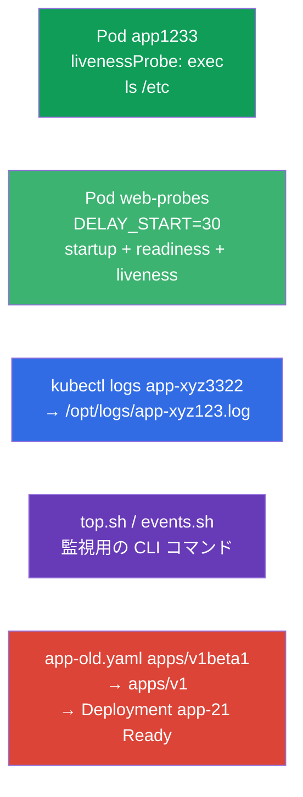

[Русская версия](README_RU.MD) · [Eng version](README.MD) · [Versión en español](README_ES.MD) · [Version française](README_FR.MD) · [Deutsche Version](README_DE.MD) · [ქართული ვერსია](README_GE.MD) · [繁體中文版](README_TW.MD)

# Lab 109 - 可観測性と運用保守：プローブ、ログ、デバッグ、deprecations

## 概要

Observability and Maintenance ドメインの実習です。コンテナのヘルスチェック -
**startupProbe**、**readinessProbe**、**livenessProbe**（起動、準備完了、生存の
プローブ）を設定します。起動が遅いアプリケーションを例にしたケースも含みます。
さらに Pod のログをファイルへ出力する方法、監視用の CLI コマンド
（`kubectl top`、イベント）の書き方、そして古い API バージョンを使うマニフェスト
（deprecations、非推奨化）の修正 - クラスタ更新前の定番作業 - を学びます。

すべての課題は試験形式（実際の CKA/CKAD の問題と同じスタイル）で書かれており、
`check_result` コマンドで自動的に検証されます。プローブ付きの Pod はマニフェストで
記述するのが楽です（`--dry-run=client -o yaml` を雛形に）。ログと監視コマンドは
`kubectl logs`/`kubectl top` を使って命令型で行います。

## 目的

次のコース章の内容を定着させます：

- [第 27 章。ヘルスチェック：liveness、readiness、startup](../../course/27/README.md) - 3 つのプローブ（startup/readiness/liveness）、`periodSeconds`/`failureThreshold` のタイミング、startupProbe と `initialDelaySeconds` の比較
- [第 28 章。ロギングとモニタリング](../../course/28/README.md) - `kubectl logs`、`kubectl top`、クラスタのイベント
- [第 29 章。アプリケーションのデバッグと API の非推奨化](../../course/29/README.md) - Pod の診断と古い API バージョンからの移行

## 何を作り、なぜ作るのか

この実習では、プローブの設定から古いマニフェストの修正まで、アプリケーション運用の
一連の操作を練習します。各ステップにはそれぞれの目的があります：

| オブジェクト | これは何か | この実習での役割 |
|--------|---------|-------------------|
| **livenessProbe 付きの Pod `app1233`** | 生存チェックを備えた Pod | タイミングを指定した exec プローブの設定を学ぶ（第 27 章） |
| **Pod `web-probes`**（起動が遅い） | 3 つのプローブを一度に | `DELAY_START` を持つアプリケーションでの startupProbe + readinessProbe + livenessProbe；startupProbe と `initialDelaySeconds` の比較ケース（第 27 章） |
| **ログの出力** シード Pod `app-xyz3322` | ログをファイルへ | `kubectl logs` でのファイル出力と namespaces をまたいだ Pod 検索を練習する（第 28 章） |
| **CLI スクリプト**（top、events） | 監視コマンド | 正しい `top`/events コマンドをファイルに保存する（第 28 章） |
| **`app-old.yaml` の修正** | 古い apiVersion | `apps/v1beta1` → `apps/v1` に更新してデプロイする（第 29 章） |

最終的にデプロイされる全体像：



## インフラ

環境は Terragrunt により AWS（`eu-central-1`）に展開され、次の要素で構成されます：

| コンポーネント | 説明                                                    |
|------------|-------------------------------------------------------------|
| `vpc`      | パブリックサブネットを持つ VPC `10.10.0.0/16`                    |
| `ssh-keys` | ノードへアクセスするための SSH キー                                |
| `k8s-1`    | Kubernetes `1.35.2`（kubeadm）、CNI Calico、metrics-server；namespace `app-logs` にシード Pod `app-xyz3322` を作成する |
| `worker`   | `kubectl` と `check_result` を備えた作業マシン；起動時に `/var/work/109/app-old.yaml` と作業用ディレクトリを作成する |

インスタンス：`t4g.medium`（master）、Ubuntu `22.04`。クラスタは単一ノード構成で、master の
taint は解除されています（`control-plane` taint を削除）。そのため Pod は master 上に直接スケジュールされます。

## デプロイ

```bash
TASK=109 make run_cka_task
```

作成が完了したら、SSH で作業マシン（worker）に接続し、そこから課題を進めてください。
`kubectl` はすでに `cluster1-admin@cluster1` コンテキストに設定されています。

作業マシンで使える便利なコマンド：

```bash
time_left       # 残り時間
check_result    # 解答をチェックする
```

## 課題

---
|        **1**        | **livenessProbe：コンテナの生存チェック**                     |
| :-----------------: | :----------------------------------------------------------- |
| やること            | namespace `web-ns` に、`ls /etc` を実行する `exec` タイプの livenessProbe（生存プローブ）を持つ Pod `app1233`（イメージ `viktoruj/ping_pong:alpine`）を作成してください。タイミングは `initialDelaySeconds: 10`（最初のチェックまでの待ち時間）と `periodSeconds: 60`（チェックの間隔）を指定します。livenessProbe は「コンテナは生きているか」という問いに答えるものです：コマンドが 0 以外の終了コードを返すと、kubelet はコンテナを再起動します。 |
| 受け入れ基準        | - namespace `web-ns`；<br/>- Pod `app1233`、イメージ `viktoruj/ping_pong:alpine`；<br/>- livenessProbe：exec `ls /etc`、`initialDelaySeconds` `10`、`periodSeconds` `60`。 |
---
|        **2**        | **起動が遅いアプリケーションのための 3 つのプローブ**          |
| :-----------------: | :----------------------------------------------------------- |
| やること            | namespace `web-ns` に、環境変数 `DELAY_START="30"` を持つ Pod `web-probes`（イメージ `viktoruj/ping_pong:latest`、ポート `8080`）を作成してください - アプリケーションは `30` 秒後にはじめて `:8080` をリッスンし始めます（起動が遅いケースの模擬）。ポート `8080` の `/` への `httpGet` で**3 つすべて**のプローブを設定します：<br/>• **startupProbe**（起動プローブ）：`periodSeconds: 5`、`failureThreshold: 12` - 起動に最大 `60` 秒の余裕を与える；<br/>• **readinessProbe**（準備完了プローブ）：`periodSeconds: 10` - アプリケーションが準備できるまでトラフィックを流さない；<br/>• **livenessProbe**：`periodSeconds: 10` - ハングしたコンテナを再起動する。startupProbe が成功するまで readiness と liveness は実行されません - コンテナは `30` 秒かけて落ち着いて起動できます。 |
| 受け入れ基準        | - namespace `web-ns` に Pod `web-probes` があり、イメージは `viktoruj/ping_pong:latest`；<br/>- ポート `8080` への `httpGet` タイプの **startupProbe**、**readinessProbe**、**livenessProbe** が設定されている；<br/>- Pod が Ready 状態に達している（startupProbe が成功した）。 |
---
|        **3**        | **Pod のログをファイルへ出力する**                            |
| :-----------------: | :----------------------------------------------------------- |
| やること            | シード Pod `app-xyz3322` を見つけて（いずれかの namespaces にあります - `kubectl get po -A` で探してください）、そのログをファイル `/opt/logs/app-xyz123.log` へ出力してください。ファイルは空でないこと。 |
| 受け入れ基準        | - Pod `app-xyz3322` のログが `/opt/logs/app-xyz123.log` に保存されている（ファイルが空でない）。 |
---
|        **4**        | **監視用の CLI コマンドを書く**                               |
| :-----------------: | :----------------------------------------------------------- |
| やること            | すぐ使える監視コマンドをスクリプトに保存してください。`/var/work/artifact/top.sh` には Pods のリソース消費を CPU でソートして表示するコマンド（`--sort-by=cpu` 付きの `kubectl top pods`）。`/var/work/artifact/events.sh` には時刻でソートしたクラスタのイベント（`--sort-by` 付きの `kubectl get events`）。 |
| 受け入れ基準        | - `/var/work/artifact/top.sh`：Pods の `top`、CPU でソート；<br/>- `/var/work/artifact/events.sh`：時刻でソートしたイベント（`--sort-by`）。 |
---
|        **5**        | **古いマニフェストを修正してデプロイする**                    |
| :-----------------: | :----------------------------------------------------------- |
| やること            | マニフェスト `/var/work/109/app-old.yaml` は削除済みの API バージョン `apps/v1beta1` を使っており、必須の `selector` も含んでいません。これを現行の `apps/v1` に直し（Pod テンプレートの label と一致する `spec.selector.matchLabels` を追加）、適用してください。Deployment `app-21` はデプロイされ Ready にならなければなりません。 |
| 受け入れ基準        | - マニフェスト `/var/work/109/app-old.yaml` が `apps/v1` になっている；<br/>- Deployment `app-21` がデプロイされ Ready（レプリカ ≥ 1）。 |
---

## 実践ケース：startupProbe と initialDelaySeconds

課題 2 のアプリケーションは起動が遅く、しかも予測できません（`DELAY_START=30`）。これを
乗り切る 2 つの方法を見ていきます。

まず大切なのは、この 2 つが「同じことをするが片方が優れている」という代替手段ではなく、
**別物**だと理解することです：

- `initialDelaySeconds` は**プローブ内のフィールド**（1 つの数値）です：最初のチェックまで
  何秒待つか。アプリケーションが起動したかどうかは「知りません」 - 単に N 秒黙り、
  その後 `periodSeconds` の間隔でチェックを始めます。
- **startupProbe** は、アプリケーションが**起動を完了した**ことを確認する**独立した 3 つ目の
  プローブ**です。これが成功するまで、kubelet は livenessProbe と readinessProbe を
  **一切実行しません**。startupProbe が成功すると、それ以降このプローブは実行されず、
  liveness/readiness が仕事を引き継ぎます。

直接比較：

| 基準 | livenessProbe の `initialDelaySeconds` | 独立した startupProbe |
|----------|----------------------------------------|------------------------|
| これは何か | 最初のチェックを遅らせるフィールド | 起動フェーズ専用の独立したプローブ |
| 起動の余裕 | 「目分量」の固定値 | `failureThreshold × periodSeconds`、簡単に広げられる |
| 予測できない起動 | 耐えられない：起動が遅延より長い → 再起動 | 耐えられる：プローブが成功するまで待つ（余裕の範囲内で） |
| 起動後の liveness の反応 | 「最悪ケース」向けの同じタイミングに縛られる | 速い：小さな `periodSeconds` の liveness が起動直後から効く |
| 何を設定するか | 「起動 vs 障害検知」の妥協点を 1 つの数値で | 起動と障害検知を別々に |

この先は、マニフェストでの見え方です。

**素朴な方法 - 大きな `initialDelaySeconds` を付けた livenessProbe だけ：**

```yaml
livenessProbe:
  httpGet: { path: /, port: 8080 }
  initialDelaySeconds: 40   # 起動の「最悪ケース」を当てにいく
  periodSeconds: 10
```

欠点：
- `initialDelaySeconds` は**固定の当て推量**です。`40` 秒を見込んだのに起動が
  `50` 秒かかった → kubelet はコンテナを kill し、CrashLoop に落とします。余裕を大きく
  取れば（`120`）、無駄に待つことになります。
- この待ち時間は liveness に**常に**適用されます：起動後にコンテナがハングした場合、
  「最悪ケース」向けにタイミングを調整するまで素早く反応できません。
- 同じ 1 つのタイミングが「遅い起動」と「ハングの早期検知」の両方を担っています -
  これは相反する要件です。

**正しい方法 - startupProbe + 独立した liveness/readiness：**

```yaml
startupProbe:                 # 起動フェーズのみで動作する
  httpGet: { path: /, port: 8080 }
  periodSeconds: 5
  failureThreshold: 12        # 起動に 5 × 12 = 60 秒の余裕
livenessProbe:                # startupProbe の成功後にだけ有効になる
  httpGet: { path: /, port: 8080 }
  periodSeconds: 10
readinessProbe:
  httpGet: { path: /, port: 8080 }
  periodSeconds: 10
```

なぜ良いのか：
- startupProbe が成功するまで liveness と readiness は**実行されません** - 遅い起動が
  早すぎる再起動につながりません。
- 起動の余裕は正直に決まります：`failureThreshold × periodSeconds`（ここでは最大 `60` 秒）で、
  アプリケーションのコードに依存せず簡単に調整できます。
- 準備完了後の liveness は**小さな** `periodSeconds` で動くため、ハングを素早く
  捕まえられます。つまり「遅い起動」と「障害の早期検知」が別々のプローブに分かれており、
  1 つの `initialDelaySeconds` に押し込められていません。

Pod `web-probes` で確認できます：作成直後は `0/1`（startupProbe 実行中）で、およそ
`30` 秒後にアプリケーションが `:8080` を上げると startupProbe が成功し、Pod は
`Ready` になります：

```bash
kubectl -n web-ns get pod web-probes -w
kubectl -n web-ns describe pod web-probes | grep -A1 -E "Startup|Liveness|Readiness"
```

## 結果のチェック

作業マシンで自動チェックを実行します：

```bash
check_result
```

スクリプトがテストを実行し、いくつの課題が完了したかを表示します。

## 解答

参考解答：[worker/files/solutions/1_JP.MD](worker/files/solutions/1_JP.MD)

## 模擬試験のカバー範囲

この実習は可観測性と運用保守に関する模擬試験の課題をカバーします：CKA mock 02（第 16 問 - events
sorted、第 17 問 - api-resources）、CKAD mock 01（第 8 問 - ログをファイルへ、第 12 問 - livenessProbe、
第 17 問 - top）、CKAD mock 02（第 12 問 - ログ、第 13 問 - livenessProbe、第 17 問 - ログ、第 21 問 - deprecations）。
課題 2 はさらに startupProbe と readinessProbe を扱い、startupProbe と
`initialDelaySeconds` の比較ケースを解説します（第 27 章）。

## クラスタとリソースの削除

```bash
TASK=109 make delete_cka_task
```
