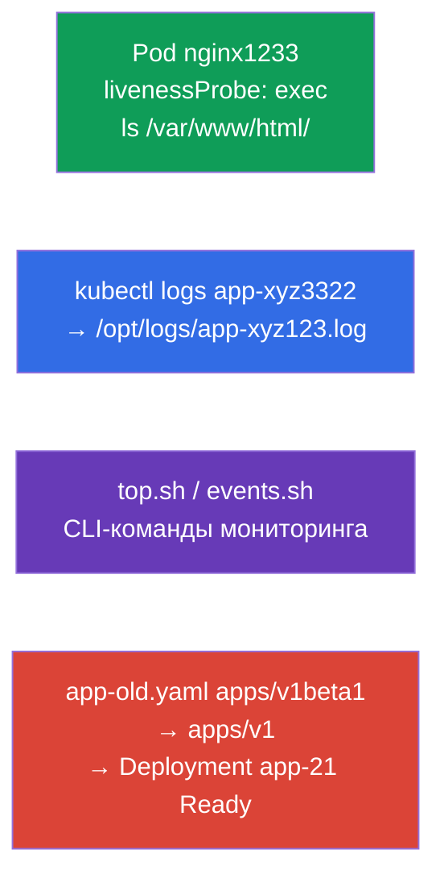

# Lab 109 — Наблюдаемость и обслуживание: пробы, логи, отладка, deprecations

## Описание

Практическая работа по домену Observability and Maintenance. Вы настроите проверку
здоровья контейнера (livenessProbe), научитесь выгружать логи Pod (под) в файл, писать
CLI-команды для мониторинга (`kubectl top`, события) и чинить манифест с устаревшей
версией API (deprecations, устаревание) — типовая задача перед обновлением кластера.

Все задания оформлены в экзаменационном стиле (как реальные вопросы CKA/CKAD) с
автоматической проверкой командой `check_result`. Pod с пробой удобнее описать манифестом
(`--dry-run=client -o yaml` как заготовка), а логи и команды мониторинга — императивно
через `kubectl logs`/`kubectl top`.

## Цель

Закрепить материал глав курса:

- [Глава 27. Проверки состояния: liveness, readiness, startup](../../course/27/ru.md) — пробы здоровья контейнера, тайминги `initialDelaySeconds`/`periodSeconds`
- [Глава 28. Логирование и мониторинг](../../course/28/ru.md) — `kubectl logs`, `kubectl top`, события кластера
- [Глава 29. Отладка приложений и устаревание API](../../course/29/ru.md) — диагностика Pod и переход с устаревших версий API

## Что мы создаём и зачем

В этой лабе мы отрабатываем набор операций сопровождения приложений: от настройки пробы до
починки устаревшего манифеста. Каждый шаг решает свою задачу:

| Объект | Что это | Зачем в этой лабе |
|--------|---------|-------------------|
| **Pod `nginx1233`** с livenessProbe | Pod с проверкой здоровья | учимся настраивать exec-пробу с таймингом (глава 27) |
| **Выгрузка логов** сид-Pod `app-xyz3322` | логи в файл | тренируем `kubectl logs` в файл и поиск Pod по namespaces (глава 28) |
| **CLI-скрипты** (top, events) | команды мониторинга | сохраняем правильные команды `top`/events в файлы (глава 28) |
| **Починка `app-old.yaml`** | устаревший apiVersion | обновляем `apps/v1beta1` → `apps/v1` и деплоим (глава 29) |

Итоговая картина того, что будет развёрнуто:



## Инфраструктура

Окружение разворачивается в AWS (`eu-central-1`) через Terragrunt и состоит из:

| Компонент  | Описание                                                    |
|------------|-------------------------------------------------------------|
| `vpc`      | VPC `10.10.0.0/16` с публичными подсетями                    |
| `ssh-keys` | SSH-ключи для доступа к нодам                                |
| `k8s-1`    | Kubernetes `1.35.2` (kubeadm), CNI Calico, metrics-server; создаёт сид-Pod `app-xyz3322` в namespace `app-logs` |
| `worker`   | Рабочая машина с `kubectl` и `check_result`; при старте создаёт `/var/work/109/app-old.yaml` и рабочие каталоги |

Инстансы: `t3.medium` (master) Ubuntu `22.04`. Кластер одноузловой — master «разтейнчен»
(снят taint `control-plane`), поэтому поды планируются прямо на него.

## Развёртывание

```bash
TASK=109 make run_cka_task
```

После создания подключитесь к рабочей машине (worker) по SSH и выполняйте задания оттуда.
`kubectl` уже настроен на контекст `cluster1-admin@cluster1`.

Полезные команды на рабочей машине:

```bash
time_left       # сколько осталось времени
check_result    # проверить решение
```

## Задания

---
|        **1**        | **Настроить проверку здоровья контейнера**                   |
| :-----------------: | :----------------------------------------------------------- |
| Что делаем          | В namespace `web-ns` создайте Pod `nginx1233` (образ `nginx`) с livenessProbe типа `exec`, которая выполняет `ls /var/www/html/`. Задайте тайминги: `initialDelaySeconds: 10` (пауза перед первой проверкой) и `periodSeconds: 60` (интервал между проверками). Если каталога нет, kubelet перезапустит контейнер. |
| Критерии приёмки    | - namespace `web-ns`;<br/>- Pod `nginx1233`, образ `nginx`;<br/>- livenessProbe: exec `ls /var/www/html/`, `initialDelaySeconds` `10`, `periodSeconds` `60`. |
---
|        **2**        | **Выгрузить логи пода в файл**                               |
| :-----------------: | :----------------------------------------------------------- |
| Что делаем          | Найдите сид-Pod `app-xyz3322` (он лежит в одном из namespaces — ищите через `kubectl get po -A`) и выгрузите его логи в файл `/opt/logs/app-xyz123.log`. Файл должен быть непустым. |
| Критерии приёмки    | - логи Pod `app-xyz3322` сохранены в `/opt/logs/app-xyz123.log` (файл не пуст). |
---
|        **3**        | **Написать CLI-команды мониторинга**                         |
| :-----------------: | :----------------------------------------------------------- |
| Что делаем          | Сохраните готовые команды мониторинга в скрипты. В `/var/work/artifact/top.sh` — вывод потребления ресурсов Pods с сортировкой по CPU (`kubectl top pods` с `--sort-by=cpu`). В `/var/work/artifact/events.sh` — события кластера, отсортированные по времени (`kubectl get events` с `--sort-by`). |
| Критерии приёмки    | - `/var/work/artifact/top.sh`: `top` Pods, сортировка по CPU;<br/>- `/var/work/artifact/events.sh`: события, отсортированные по времени (`--sort-by`). |
---
|        **4**        | **Починить устаревший манифест и задеплоить**               |
| :-----------------: | :----------------------------------------------------------- |
| Что делаем          | Манифест `/var/work/109/app-old.yaml` использует удалённую версию API `apps/v1beta1` и не содержит обязательного `selector`. Приведите его к актуальной `apps/v1` (добавьте `spec.selector.matchLabels`, согласованный с label шаблона Pod) и примените. Deployment `app-21` должен развернуться и стать Ready. |
| Критерии приёмки    | - манифест `/var/work/109/app-old.yaml` приведён к `apps/v1`;<br/>- Deployment `app-21` развёрнут и Ready (≥ 1 реплика). |
---

## Проверка результата

На рабочей машине запустите автоматическую проверку:

```bash
check_result
```

Скрипт прогонит тесты и покажет, сколько заданий выполнено.

## Решение

Эталонное решение: [worker/files/solutions/1.MD](worker/files/solutions/1.MD)

## Покрытие мок-экзаменов

Лаба закрывает задания моков по наблюдаемости и обслуживанию: CKA mock 02 (№16 — events
sorted, №17 — api-resources), CKAD mock 01 (№8 — логи в файл, №12 — livenessProbe, №17 —
top), CKAD mock 02 (№12 — логи, №13 — livenessProbe, №17 — логи, №21 — deprecations).

## Удаление кластера и ресурсов

```bash
TASK=109 make delete_cka_task
```
