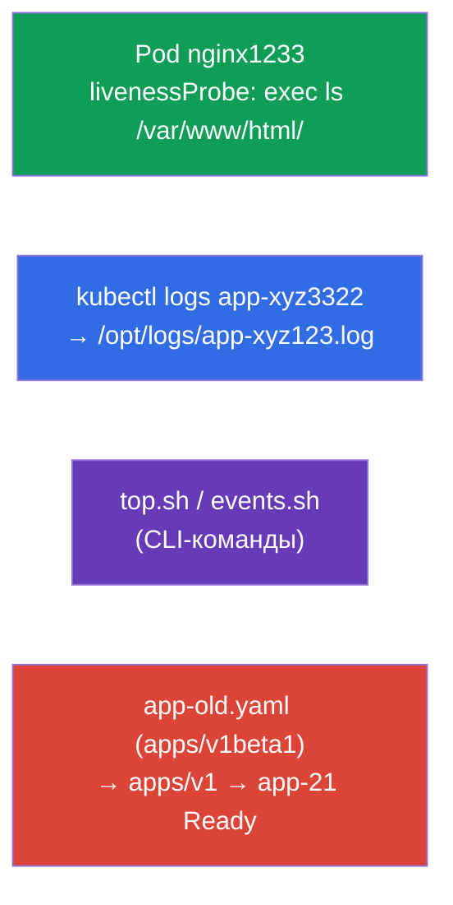

# Lab 109 — Наблюдаемость и обслуживание: пробы, логи, отладка, deprecations

## Описание

Практическая работа по домену Observability and Maintenance. Вы настроите проверку
здоровья контейнера (livenessProbe), научитесь выгружать логи пода в файл, писать
CLI-команды для мониторинга (`kubectl top`, события) и чинить манифест с устаревшей
версией API (deprecations) — типовая задача перед обновлением кластера.

Все задания в экзаменационном стиле с автопроверкой `check_result`.

## Цель

Закрепить главы курса:

- [Глава 27. Проверки состояния: liveness, readiness, startup](../../course/27/ru.md)
- [Глава 28. Логирование и мониторинг](../../course/28/ru.md)
- [Глава 29. Отладка приложений и устаревание API](../../course/29/ru.md)

## Что мы создаём и зачем

| Объект | Что это | Зачем в этой лабе |
|--------|---------|-------------------|
| **Под `nginx1233`** с livenessProbe | под с проверкой здоровья | учимся настраивать exec-пробу с таймингом |
| **Выгрузка логов** сид-пода `app-xyz3322` | логи в файл | тренируем `kubectl logs` в файл и поиск пода по неймспейсам |
| **CLI-скрипты** (top, events) | команды мониторинга | сохраняем правильные команды `top`/events в файлы |
| **Починка `app-old.yaml`** | устаревший apiVersion | обновляем `apps/v1beta1` → `apps/v1` и деплоим |



## Инфраструктура

| Компонент  | Описание                                                             |
|------------|----------------------------------------------------------------------|
| `k8s-1`    | Kubernetes `1.35.2` (kubeadm), Calico, metrics-server; создаёт сид-под `app-xyz3322` в `app-logs` |
| `worker`   | Рабочая машина; при старте создаёт `/var/work/109/app-old.yaml` и каталоги |

## Развёртывание

```bash
TASK=109 make run_cka_task
```

## Задания

---
|        **1**        | **Настроить проверку здоровья контейнера**                   |
| :-----------------: | :----------------------------------------------------------- |
| Что делаем          | Добавляем livenessProbe типа exec с нужным таймингом          |
| Критерии приёмки    | - Неймспейс: `web-ns`<br/>- Pod `nginx1233`, image `nginx`<br/>- livenessProbe: exec `ls /var/www/html/`, initialDelaySeconds `10`, periodSeconds `60` |
---
|        **2**        | **Выгрузить логи пода в файл**                               |
| :-----------------: | :----------------------------------------------------------- |
| Что делаем          | Находим сид-под по неймспейсам и сохраняем его логи           |
| Критерии приёмки    | - Логи пода `app-xyz3322` сохранены в `/opt/logs/app-xyz123.log` |
---
|        **3**        | **Написать CLI-команды мониторинга**                         |
| :-----------------: | :----------------------------------------------------------- |
| Что делаем          | Сохраняем правильные команды в скрипты                        |
| Критерии приёмки    | - `/var/work/artifact/top.sh`: top подов, сортировка по CPU<br/>- `/var/work/artifact/events.sh`: события, отсортированные по времени |
---
|        **4**        | **Починить устаревший манифест и задеплоить**               |
| :-----------------: | :----------------------------------------------------------- |
| Что делаем          | Обновляем `apiVersion` на актуальный и применяем              |
| Критерии приёмки    | - Манифест `/var/work/109/app-old.yaml` приведён к `apps/v1`<br/>- Deployment `app-21` развёрнут и Ready |
---

## Проверка результата

```bash
check_result
```

## Решение

[worker/files/solutions/1.MD](worker/files/solutions/1.MD)

## Покрытие мок-экзаменов

CKA mock 02 (№16 — events sorted, №17 — api-resources), CKAD mock 01 (№8 — логи в файл,
№12 — livenessProbe, №17 — top), CKAD mock 02 (№12 — логи, №13 — livenessProbe, №17 —
логи, №21 — deprecations).

## Удаление

```bash
TASK=109 make delete_cka_task
```
