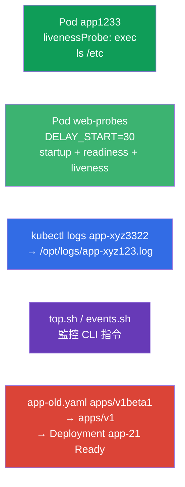

[Русская версия](README_RU.MD) · [Eng version](README.MD) · [Versión en español](README_ES.MD) · [Version française](README_FR.MD) · [Deutsche Version](README_DE.MD) · [ქართული ვერსია](README_GE.MD) · [日本語版](README_JP.MD)

# Lab 109 - 可觀測性與維護:探針、日誌、除錯、deprecations

## 說明

Observability and Maintenance 領域的實作練習。你會設定容器的健康檢查 -
**startupProbe**、**readinessProbe** 與 **livenessProbe**(啟動、就緒與存活
探針),其中包含一個啟動緩慢的應用程式的範例,還會學到如何把 Pod 的日誌
輸出到檔案、撰寫用於監控的 CLI 指令
(`kubectl top`、事件),以及修復使用了過時 API 版本的清單(deprecations,
棄用)- 這是叢集升級前的典型任務。

所有任務都以考試風格撰寫(就像真正的 CKA/CKAD 題目),並透過
`check_result` 指令自動驗證。帶探針的 Pod 用清單來描述更方便
(以 `--dry-run=client -o yaml` 作為起點),而日誌與監控指令則
用 `kubectl logs`/`kubectl top` 以命令式方式完成。

## 目標

鞏固以下課程章節的內容:

- [第 27 章。狀態檢查:liveness、readiness、startup](../../course/27/README.md) - 三種探針(startup/readiness/liveness)、`periodSeconds`/`failureThreshold` 計時設定、startupProbe 與 `initialDelaySeconds` 的比較
- [第 28 章。日誌與監控](../../course/28/README.md) - `kubectl logs`、`kubectl top`、叢集事件
- [第 29 章。應用程式除錯與 API 棄用](../../course/29/README.md) - Pod 診斷與從過時 API 版本遷移

## 我們要建立什麼,以及為什麼

在這個實驗中,我們會練習一組應用程式維運操作:從設定探針到
修復過時的清單。每個步驟都有自己的用途:

| 物件 | 這是什麼 | 為什麼出現在這個實驗中 |
|--------|---------|-------------------|
| **Pod `app1233`** 帶 livenessProbe | 帶存活檢查的 Pod | 學會設定帶計時參數的 exec 探針(第 27 章) |
| **Pod `web-probes`**(啟動緩慢) | 一次三種探針 | 在帶 `DELAY_START` 的應用程式上同時使用 startupProbe + readinessProbe + livenessProbe;startupProbe 與 `initialDelaySeconds` 的案例(第 27 章) |
| **輸出日誌** 種子 Pod `app-xyz3322` | 日誌寫入檔案 | 練習把 `kubectl logs` 寫入檔案,以及跨 namespaces 尋找 Pod(第 28 章) |
| **CLI 腳本**(top、events) | 監控指令 | 把正確的 `top`/events 指令儲存到檔案中(第 28 章) |
| **修復 `app-old.yaml`** | 過時的 apiVersion | 把 `apps/v1beta1` → `apps/v1` 並部署(第 29 章) |

最終部署出來的整體樣貌:



## 基礎架構

環境透過 Terragrunt 部署在 AWS(`eu-central-1`),由以下部分組成:

| 元件       | 說明                                                        |
|------------|-------------------------------------------------------------|
| `vpc`      | VPC `10.10.0.0/16`,含公有子網路                              |
| `ssh-keys` | 用於存取節點的 SSH 金鑰                                       |
| `k8s-1`    | Kubernetes `1.35.2`(kubeadm),CNI Calico,metrics-server;會在 namespace `app-logs` 中建立種子 Pod `app-xyz3322` |
| `worker`   | 具備 `kubectl` 與 `check_result` 的工作機;啟動時會建立 `/var/work/109/app-old.yaml` 以及工作目錄 |

執行個體:`t4g.medium`(master),Ubuntu `22.04`。叢集為單節點 - master
已解除污點(移除了 `control-plane` taint),因此 Pod 會直接排程到它上面。

## 部署

```bash
TASK=109 make run_cka_task
```

建立完成後,請透過 SSH 連線到工作機(worker),並在那裡完成任務。
`kubectl` 已經指向 `cluster1-admin@cluster1` context。

工作機上的實用指令:

```bash
time_left       # 還剩多少時間
check_result    # 檢查解答
```

## 任務

---
|        **1**        | **livenessProbe:檢查容器是否存活**                            |
| :-----------------: | :----------------------------------------------------------- |
| 要做什麼            | 在 namespace `web-ns` 中建立 Pod `app1233`(映像 `viktoruj/ping_pong:alpine`),並帶一個 `exec` 類型的 livenessProbe(存活探針),它執行 `ls /etc`。設定計時參數:`initialDelaySeconds: 10`(第一次檢查前的暫停)與 `periodSeconds: 60`(兩次檢查之間的間隔)。livenessProbe 回答的問題是「容器還活著嗎」:如果指令回傳非零的結束碼,kubelet 就會重啟容器。 |
| 驗收標準            | - namespace `web-ns`;<br/>- Pod `app1233`,映像 `viktoruj/ping_pong:alpine`;<br/>- livenessProbe:exec `ls /etc`,`initialDelaySeconds` `10`,`periodSeconds` `60`。 |
---
|        **2**        | **啟動緩慢的應用程式的三種探針**                              |
| :-----------------: | :----------------------------------------------------------- |
| 要做什麼            | 在 namespace `web-ns` 中建立 Pod `web-probes`(映像 `viktoruj/ping_pong:latest`,埠 `8080`),並帶環境變數 `DELAY_START="30"` - 應用程式要等 `30` 秒後才會開始監聽 `:8080`(模擬長時間啟動)。透過對埠 `8080` 上 `/` 的 `httpGet` 掛上**全部三種**探針:<br/>• **startupProbe**(啟動探針):`periodSeconds: 5`,`failureThreshold: 12` - 給啟動最多 `60` 秒;<br/>• **readinessProbe**(就緒探針):`periodSeconds: 10` - 在應用程式就緒之前不放流量進來;<br/>• **livenessProbe**:`periodSeconds: 10` - 重啟卡住的容器。在 startupProbe 成功之前,readiness 與 liveness 都不會執行 - 容器可以安心地花它那 `30` 秒來啟動。 |
| 驗收標準            | - namespace `web-ns` 中有 Pod `web-probes`,映像 `viktoruj/ping_pong:latest`;<br/>- 已設定對埠 `8080` 的 `httpGet` 類型的 **startupProbe**、**readinessProbe** 與 **livenessProbe**;<br/>- Pod 已達到 Ready 狀態(startupProbe 已通過)。 |
---
|        **3**        | **把 Pod 的日誌輸出到檔案**                                   |
| :-----------------: | :----------------------------------------------------------- |
| 要做什麼            | 找到種子 Pod `app-xyz3322`(它位於其中某個 namespaces 中 - 用 `kubectl get po -A` 尋找),並把它的日誌輸出到檔案 `/opt/logs/app-xyz123.log`。該檔案不得為空。 |
| 驗收標準            | - Pod `app-xyz3322` 的日誌已儲存到 `/opt/logs/app-xyz123.log`(檔案不為空)。 |
---
|        **4**        | **撰寫監控用的 CLI 指令**                                     |
| :-----------------: | :----------------------------------------------------------- |
| 要做什麼            | 把可直接使用的監控指令儲存到腳本中。在 `/var/work/artifact/top.sh` 中 - 輸出 Pods 的資源消耗並依 CPU 排序(`kubectl top pods` 搭配 `--sort-by=cpu`)。在 `/var/work/artifact/events.sh` 中 - 依時間排序的叢集事件(`kubectl get events` 搭配 `--sort-by`)。 |
| 驗收標準            | - `/var/work/artifact/top.sh`:Pods 的 `top`,依 CPU 排序;<br/>- `/var/work/artifact/events.sh`:依時間排序的事件(`--sort-by`)。 |
---
|        **5**        | **修復過時的清單並部署**                                     |
| :-----------------: | :----------------------------------------------------------- |
| 要做什麼            | 清單 `/var/work/109/app-old.yaml` 使用了已被移除的 API 版本 `apps/v1beta1`,且不包含必填的 `selector`。請把它改成目前的 `apps/v1`(加上與 Pod 範本 label 一致的 `spec.selector.matchLabels`)並套用。Deployment `app-21` 必須完成部署並變成 Ready。 |
| 驗收標準            | - 清單 `/var/work/109/app-old.yaml` 已改成 `apps/v1`;<br/>- Deployment `app-21` 已部署且為 Ready(≥ 1 個副本)。 |
---

## 實務案例:startupProbe 與 initialDelaySeconds 的比較

任務 2 中的應用程式啟動很慢而且不可預測(`DELAY_START=30`)。我們來看看
撐過這種情況的兩種做法。

首先必須理解,這是**兩種不同的東西**,而不是「同一件事只是更好」的
替代方案:

- `initialDelaySeconds` 是**探針內部的一個欄位**(一個數字):在**第一次**
  檢查之前要等幾秒。它並不「知道」應用程式是否已經啟動 - 它只是
  安靜 N 秒,然後開始以 `periodSeconds` 為間隔進行檢查。
- **startupProbe** 是**獨立的第三種探針**,它檢查應用程式是否
  **已完成啟動**。在它成功之前,kubelet **完全不會執行** livenessProbe 與
  readinessProbe。一旦 startupProbe 成功 - 它就不再執行,接著換
  liveness/readiness 上場。

直接比較:

| 標準 | livenessProbe 上的 `initialDelaySeconds` | 獨立的 startupProbe |
|----------|----------------------------------------|------------------------|
| 這是什麼 | 延遲第一次檢查的欄位 | 啟動階段的獨立探針 |
| 啟動預算 | 憑感覺定下的固定數字 | `failureThreshold × periodSeconds`,很容易擴大 |
| 不可預測的啟動 | 撐不過去:啟動時間長於延遲 → 重啟 | 撐得過去:等到探針通過為止(在預算範圍內) |
| 啟動後 liveness 的反應 | 綁在同一個「最壞情況」的計時上 | 快速:帶小 `periodSeconds` 的 liveness 在啟動後立刻生效 |
| 我們要調整什麼 | 用一個數字在「啟動 vs 偵測故障」之間妥協 | 啟動與偵測故障 - 分開設定 |

接下來 - 看看這在清單中是什麼樣子。

**天真的做法 - 只用帶較大 `initialDelaySeconds` 的 livenessProbe:**

```yaml
livenessProbe:
  httpGet: { path: /, port: 8080 }
  initialDelaySeconds: 40   # 猜一個啟動的「最壞情況」
  periodSeconds: 10
```

缺點:
- `initialDelaySeconds` 是一個**固定的猜測**。你預留了 `40` 秒,但啟動花了
  `50` 秒 → kubelet 會殺掉容器並讓它掉進 CrashLoop。如果留得很寬鬆(`120`)-
  就是白等。
- 這個暫停**永遠**會套用到 liveness:如果容器在啟動之後才卡住,
  在你把計時參數調成「最壞情況」之前,是沒辦法快速反應的。
- 同一組計時參數同時服務「啟動緩慢」和「快速偵測卡死」-
  而這是互相矛盾的需求。

**正確的做法 - startupProbe + 獨立的 liveness/readiness:**

```yaml
startupProbe:                 # 只在啟動階段運作
  httpGet: { path: /, port: 8080 }
  periodSeconds: 5
  failureThreshold: 12        # 啟動預算 5 × 12 = 60 秒
livenessProbe:                # 只有在 startupProbe 成功「之後」才會生效
  httpGet: { path: /, port: 8080 }
  periodSeconds: 10
readinessProbe:
  httpGet: { path: /, port: 8080 }
  periodSeconds: 10
```

為什麼更好:
- 在 startupProbe 通過之前,liveness 與 readiness **都不會執行** - 啟動緩慢
  不會導致過早的重啟。
- 啟動預算設得很誠實:`failureThreshold × periodSeconds`(這裡最多 `60` 秒),而且很容易
  微調,不必依賴應用程式的程式碼。
- 就緒之後,liveness 以**很小的** `periodSeconds` 運作 - 卡死可以很快被
  抓到。也就是說,「啟動很久」與「快速偵測故障」被拆到不同的探針上,
  而不是硬塞進同一個 `initialDelaySeconds`。

在 Pod `web-probes` 上驗證:剛建立後它是 `0/1`(startupProbe 正在執行),而大約
`30` 秒之後,當應用程式把 `:8080` 拉起來時,startupProbe 通過,Pod 就變成
`Ready`:

```bash
kubectl -n web-ns get pod web-probes -w
kubectl -n web-ns describe pod web-probes | grep -A1 -E "Startup|Liveness|Readiness"
```

## 檢查結果

在工作機上執行自動檢查:

```bash
check_result
```

腳本會跑完測試,並顯示已完成多少任務。

## 解答

參考解答:[worker/files/solutions/1_TW.MD](worker/files/solutions/1_TW.MD)

## 模擬考涵蓋範圍

本實驗涵蓋模擬考中關於可觀測性與維護的題目:CKA mock 02(第 16 題 - events
sorted,第 17 題 - api-resources)、CKAD mock 01(第 8 題 - 日誌寫入檔案,第 12 題 - livenessProbe,第 17 題 -
top)、CKAD mock 02(第 12 題 - 日誌,第 13 題 - livenessProbe,第 17 題 - 日誌,第 21 題 - deprecations)。
任務 2 額外涵蓋 startupProbe 與 readinessProbe,並剖析了
startupProbe 與 `initialDelaySeconds` 的比較案例(第 27 章)。

## 刪除叢集與資源

```bash
TASK=109 make delete_cka_task
```
