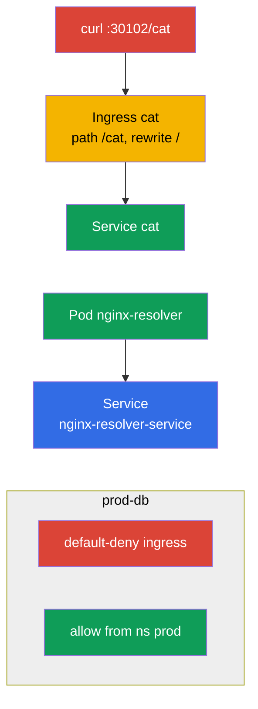

[Русская версия](README_RU.MD) · [Versión en español](README_ES.MD) · [Version française](README_FR.MD) · [Deutsche Version](README_DE.MD) · [ქართული ვერსია](README_GE.MD) · [繁體中文版](README_TW.MD) · [日本語版](README_JP.MD)

# Lab 110 — Networking: Service/DNS, Ingress, NetworkPolicy

## Description

A hands-on lab for the Services & Networking domain. You will practice DNS resolution of a
Service, publishing an application to the outside through **Ingress** (with rewrite and the
`/cat` path), traffic segmentation with **NetworkPolicy** (default-deny plus targeted
allows) and migrating Ingress to the **Gateway API**. The cluster comes with a preinstalled
ingress controller (NodePort `30102`) and Calico CNI (for NetworkPolicy), as well as seed
namespaces for the network policies and for the migration.

All tasks are written in exam style (like real CKA/CKAD questions) with automatic validation
via the `check_result` command. The Service and the Pod are convenient to create
imperatively (`kubectl run/expose`), while Ingress, NetworkPolicy and the Gateway API
objects are better done with manifests (`kubectl apply -f`).

## Goal

Reinforce the material from the course chapters:

- [Chapter 31. Service internals, DNS and CoreDNS](../../course/31/README.md) — how a Service works, DNS names and resolution through CoreDNS
- [Chapter 32. Ingress and Ingress controllers](../../course/32/README.md) — L7 entry point, path rules, rewrite, ingress controller
- [Chapter 33. Gateway API](../../course/33/README.md) — Gateway, HTTPRoute and migration from Ingress
- [Chapter 34. NetworkPolicy](../../course/34/README.md) — traffic segmentation, default-deny and allows by selector

## What We Build and Why

In this lab we assemble the networking layer of an application: from resolving a Service
over DNS to incoming traffic through Ingress/Gateway API and restricting it with policies.
Every object serves its own purpose:

| Object | What it is | Why it is in this lab |
|--------|---------|-------------------|
| **Pod `nginx-resolver` + Service** | an application and its Service | learn to resolve a Service over DNS and save the records (chapter 31) |
| **Ingress `cat` (namespace `cat`)** | L7 entry point on the `/cat` path | publish the application to the outside with rewrite (chapter 32) |
| **NetworkPolicy in `prod-db`** | traffic segmentation | default-deny plus an allow from namespace `prod` (chapter 34) |
| **Gateway `shop-gw` + HTTPRoute `shop-route`** | migration of Ingress to the Gateway API | move `Ingress shop-ingress` to the equivalent objects (chapter 33) |

The final picture of what will be deployed:



## Infrastructure

The environment is deployed in AWS (`eu-central-1`) via Terragrunt and consists of:

| Component  | Description                                                  |
|------------|--------------------------------------------------------------|
| `vpc`      | VPC `10.10.0.0/16` with public subnets                         |
| `ssh-keys` | SSH keys for node access                                       |
| `k8s-1`    | Kubernetes `1.35.2` (kubeadm), Calico CNI, metrics-server; **ingress-nginx (NodePort 30102)** and **Gateway API (CRDs + NGINX Gateway Fabric)** are installed; seed namespaces `prod-db`/`prod`/`stage` and a seed `Ingress shop-ingress` in namespace `gw` for the migration |
| `worker`   | Work machine with `kubectl` and `check_result`               |

Instances: `t4g.medium` (master), Ubuntu `22.04`. The cluster is single-node — the master is
untainted (the `control-plane` taint is removed), so Pods are scheduled directly on it.

## Deployment

```bash
TASK=110 make run_cka_task
```

Once it is created, connect to the work machine (worker) over SSH and do the tasks from there.
`kubectl` is already pointed at the `cluster1-admin@cluster1` context.

Handy commands on the work machine:

```bash
time_left       # how much time is left
check_result    # check your solution
```

## Tasks

---
|        **1**        | **Resolving a Service over DNS**                             |
| :-----------------: | :----------------------------------------------------------- |
| What to do          | Run the Pod `nginx-resolver` (image `viktoruj/ping_pong:latest`) and expose the Service `nginx-resolver-service` in front of it (Endpoints must not be empty). Check DNS resolution from a temporary Pod (`nslookup`) and save the records: the Service output to `/var/work/tests/artifacts/dns/nginx.svc`, the Pod output to `/var/work/tests/artifacts/dns/nginx.pod`. |
| Acceptance criteria | - Pod `nginx-resolver` (`viktoruj/ping_pong:latest`) + Service `nginx-resolver-service`, Endpoints are not empty;<br/>- the records are saved to `/var/work/tests/artifacts/dns/nginx.svc` and `/var/work/tests/artifacts/dns/nginx.pod`. |
---
|        **2**        | **Publish the application through Ingress**                  |
| :-----------------: | :----------------------------------------------------------- |
| What to do          | In namespace `cat` deploy the application and the Service `cat`, then create an Ingress with the path `/cat` and backend Service `cat`. Add the annotation `nginx.ingress.kubernetes.io/rewrite-target: /` so that the `/cat` prefix is rewritten to `/` before the backend. Check access: `curl cka.local:30102/cat`. |
| Acceptance criteria | - namespace `cat`, Service `cat`;<br/>- Ingress: path `/cat`, backend Service `cat`, annotation `nginx.ingress.kubernetes.io/rewrite-target: /`;<br/>- reachable: `curl cka.local:30102/cat`. |
---
|        **3**        | **Segment traffic with policies**                           |
| :-----------------: | :----------------------------------------------------------- |
| What to do          | In namespace `prod-db` create a default-deny NetworkPolicy for incoming traffic (empty `podSelector`, `policyTypes: [Ingress]`, no `ingress` rules), then a second policy that allows ingress from a namespace with the label `role=prod` (via `namespaceSelector`). |
| Acceptance criteria | - in `prod-db`: a default-deny ingress policy;<br/>- an allow policy from a namespace with the label `role=prod`. |
---
|        **4**        | **Migrate Ingress to the Gateway API**                       |
| :-----------------: | :----------------------------------------------------------- |
| What to do          | Namespace `gw` already contains an `Ingress shop-ingress` (host `shop.local`, path `/api` → Service `shop`, rewrite `/`). Move it to the equivalent Gateway API pair: `Gateway shop-gw` (with `gatewayClassName` set) and `HTTPRoute shop-route` (`parentRefs` → `shop-gw`, hostname `shop.local`, path `/api`, backend `shop`). |
| Acceptance criteria | - namespace `gw`;<br/>- `Gateway` `shop-gw` (`gatewayClassName` is set);<br/>- `HTTPRoute` `shop-route`: `parentRefs` → `shop-gw`, hostname `shop.local`, path `/api`, backend `shop`. |
---

## Checking the Result

On the work machine run the automatic validation:

```bash
check_result
```

The script runs the tests and shows how many tasks are complete.

## Solution

Reference solution: [worker/files/solutions/1.MD](worker/files/solutions/1.MD)

## Mock Exam Coverage

The lab covers the networking tasks of the mocks: CKA mock 01 (#21 — DNS resolve, #23 — NetworkPolicy),
CKA mock 02 (#12 — Ingress /cat, #21 — NetworkPolicy), CKAD mock 01 (#11 — Ingress /cat),
CKAD mock 02 (#7 — fix ingress, #8 — NetworkPolicy). Task 4 covers a new topic of the CKA
curriculum — **migrating Ingress to the Gateway API** (chapter 33).

## Deleting the Cluster and Resources

```bash
TASK=110 make delete_cka_task
```
