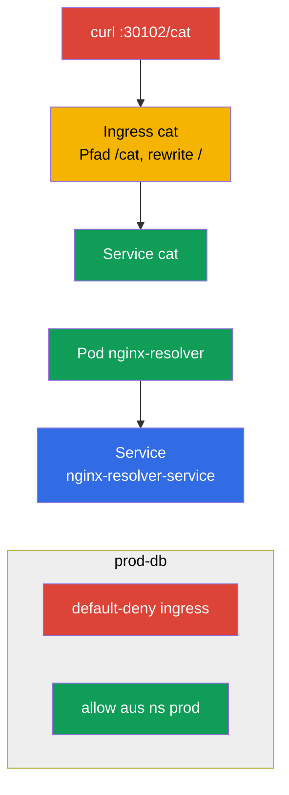

[Русская версия](README_RU.MD) · [Eng version](README.MD) · [Versión en español](README_ES.MD) · [Version française](README_FR.MD) · [ქართული ვერსია](README_GE.MD)

# Lab 110 — Netzwerk: Service/DNS, Ingress, NetworkPolicy

## Beschreibung

Praxisarbeit zur Domäne Services & Networking. Du übst die DNS-Auflösung eines Service, die
Veröffentlichung einer Anwendung nach außen über **Ingress** (mit Rewrite und dem Pfad
`/cat`), die Segmentierung des Traffics über **NetworkPolicy** (Netzwerkrichtlinien:
default-deny + punktuelle Freigaben) und die Migration von Ingress zur **Gateway API**. Im
Cluster sind ein Ingress-Controller (NodePort `30102`) und das CNI Calico (für NetworkPolicy)
vorinstalliert, ebenso vorbereitete Namespaces für die Netzwerkrichtlinien und die Migration.

Alle Aufgaben sind im Prüfungsstil formuliert (wie echte CKA/CKAD-Fragen) und werden
automatisch mit dem Befehl `check_result` geprüft. Service und Pod lassen sich bequem
imperativ erstellen (`kubectl run/expose`), Ingress, NetworkPolicy und die Gateway-API-Objekte
dagegen besser über Manifeste (`kubectl apply -f`).

## Ziel

Den Stoff der Kurskapitel festigen:

- [Kapitel 31. Service von innen, DNS und CoreDNS](../../course/31/ru.md) — wie ein Service funktioniert, DNS-Namen und Auflösung über CoreDNS
- [Kapitel 32. Ingress und Ingress-Controller](../../course/32/ru.md) — L7-Eingang, Pfadregeln, Rewrite, Ingress-Controller
- [Kapitel 33. Gateway API](../../course/33/ru.md) — Gateway, HTTPRoute und Migration von Ingress
- [Kapitel 34. NetworkPolicy](../../course/34/ru.md) — Traffic-Segmentierung, default-deny und Freigaben per Selector

## Was wir erstellen und warum

In diesem Lab bauen wir die Netzwerkschicht einer Anwendung: von der Auflösung des Service
über DNS bis zum eingehenden Traffic über Ingress/Gateway API und dessen Einschränkung durch
Richtlinien. Jedes Objekt erfüllt seine eigene Aufgabe:

| Objekt | Was es ist | Warum in diesem Lab |
|--------|---------|-------------------|
| **Pod `nginx-resolver` + Service** | die Anwendung und ihr Service | lernen, einen Service über DNS aufzulösen und die Ausgaben zu speichern (Kapitel 31) |
| **Ingress `cat` (Namespace `cat`)** | L7-Eingang über den Pfad `/cat` | die Anwendung mit Rewrite nach außen veröffentlichen (Kapitel 32) |
| **NetworkPolicy in `prod-db`** | Traffic-Segmentierung | default-deny + Freigabe aus dem Namespace `prod` (Kapitel 34) |
| **Gateway `shop-gw` + HTTPRoute `shop-route`** | Migration von Ingress zur Gateway API | wir übertragen `Ingress shop-ingress` auf die äquivalenten Objekte (Kapitel 33) |

Das Gesamtbild dessen, was bereitgestellt wird:



## Infrastruktur

Die Umgebung wird in AWS (`eu-central-1`) über Terragrunt bereitgestellt und besteht aus:

| Komponente | Beschreibung                                                 |
|------------|--------------------------------------------------------------|
| `vpc`      | VPC `10.10.0.0/16` mit öffentlichen Subnetzen                  |
| `ssh-keys` | SSH-Schlüssel für den Zugriff auf die Nodes                    |
| `k8s-1`    | Kubernetes `1.35.2` (kubeadm), CNI Calico, metrics-server; installiert sind **ingress-nginx (NodePort 30102)** und **Gateway API (CRDs + NGINX Gateway Fabric)**; vorbereitete Namespaces `prod-db`/`prod`/`stage` und ein vorbereiteter `Ingress shop-ingress` im Namespace `gw` für die Migration |
| `worker`   | Arbeitsmaschine mit `kubectl` und `check_result`             |

Instanzen: `t3.medium` (master), Ubuntu `22.04`. Der Cluster ist Einzelknoten — dem master
wurde der Taint `control-plane` entfernt, daher werden Pods direkt auf ihm eingeplant.

## Bereitstellung

```bash
TASK=110 make run_cka_task
```

Verbinde dich nach der Erstellung per SSH mit der Arbeitsmaschine (worker) und löse die Aufgaben von dort.
`kubectl` ist bereits auf den Kontext `cluster1-admin@cluster1` eingestellt.

Nützliche Befehle auf der Arbeitsmaschine:

```bash
time_left       # wie viel Zeit übrig ist
check_result    # Lösung prüfen
```

## Aufgaben

---
|        **1**        | **Auflösung des Service über DNS**                           |
| :-----------------: | :----------------------------------------------------------- |
| Was wir tun         | Starte den Pod `nginx-resolver` (Image `viktoruj/ping_pong:latest`) und stelle davor den Service `nginx-resolver-service` bereit (die Endpoints dürfen nicht leer sein). Prüfe die DNS-Auflösung aus einem temporären Pod (`nslookup`) und speichere die Ausgaben: die des Service in `/var/work/tests/artifacts/dns/nginx.svc`, die des Pod in `/var/work/tests/artifacts/dns/nginx.pod`. |
| Abnahmekriterien    | - Pod `nginx-resolver` (`viktoruj/ping_pong:latest`) + Service `nginx-resolver-service`, Endpoints sind nicht leer;<br/>- die Ausgaben sind in `/var/work/tests/artifacts/dns/nginx.svc` und `/var/work/tests/artifacts/dns/nginx.pod` gespeichert. |
---
|        **2**        | **Die Anwendung über Ingress veröffentlichen**              |
| :-----------------: | :----------------------------------------------------------- |
| Was wir tun         | Rolle im Namespace `cat` die Anwendung und den Service `cat` aus, erstelle dann einen Ingress mit dem Pfad `/cat` und dem Backend-Service `cat`. Hänge die Annotation `nginx.ingress.kubernetes.io/rewrite-target: /` an, damit das Präfix `/cat` vor dem Backend zu `/` umgeschrieben wird. Prüfe den Zugriff: `curl cka.local:30102/cat`. |
| Abnahmekriterien    | - Namespace `cat`, Service `cat`;<br/>- Ingress: path `/cat`, Backend-Service `cat`, Annotation `nginx.ingress.kubernetes.io/rewrite-target: /`;<br/>- erreichbar: `curl cka.local:30102/cat`. |
---
|        **3**        | **Traffic mit Richtlinien segmentieren**                    |
| :-----------------: | :----------------------------------------------------------- |
| Was wir tun         | Erstelle im Namespace `prod-db` eine NetworkPolicy default-deny für eingehenden Traffic (leerer `podSelector`, `policyTypes: [Ingress]`, ohne `ingress`-Regeln) und danach eine zweite Richtlinie, die den Eingang aus einem Namespace mit dem Label `role=prod` erlaubt (über `namespaceSelector`). |
| Abnahmekriterien    | - in `prod-db`: default-deny-ingress-Richtlinie;<br/>- allow-Richtlinie aus einem Namespace mit dem Label `role=prod`. |
---
|        **4**        | **Ingress zur Gateway API migrieren**                        |
| :-----------------: | :----------------------------------------------------------- |
| Was wir tun         | Im Namespace `gw` existiert ein fertiger `Ingress shop-ingress` (host `shop.local`, path `/api` → Service `shop`, rewrite `/`). Übertrage ihn auf das äquivalente Gateway-API-Paar: `Gateway shop-gw` (mit gesetztem `gatewayClassName`) und `HTTPRoute shop-route` (`parentRefs` → `shop-gw`, hostname `shop.local`, path `/api`, Backend `shop`). |
| Abnahmekriterien    | - Namespace `gw`;<br/>- `Gateway` `shop-gw` (`gatewayClassName` ist gesetzt);<br/>- `HTTPRoute` `shop-route`: `parentRefs` → `shop-gw`, hostname `shop.local`, path `/api`, Backend `shop`. |
---

## Ergebnisprüfung

Starte auf der Arbeitsmaschine die automatische Prüfung:

```bash
check_result
```

Das Skript führt die Tests aus und zeigt, wie viele Aufgaben erledigt sind.

## Lösung

Referenzlösung: [worker/files/solutions/1_DE.MD](worker/files/solutions/1_DE.MD)

## Abdeckung der Mock-Prüfungen

Das Lab deckt die Netzwerkaufgaben der Mocks ab: CKA mock 01 (Nr. 21 — DNS resolve, Nr. 23 — NetworkPolicy),
CKA mock 02 (Nr. 12 — Ingress /cat, Nr. 21 — NetworkPolicy), CKAD mock 01 (Nr. 11 — Ingress /cat),
CKAD mock 02 (Nr. 7 — fix ingress, Nr. 8 — NetworkPolicy). Aufgabe 4 deckt ein neues Thema des
CKA-Programms ab — die **Migration von Ingress zur Gateway API** (Kapitel 33).

## Löschen von Cluster und Ressourcen

```bash
TASK=110 make delete_cka_task
```
