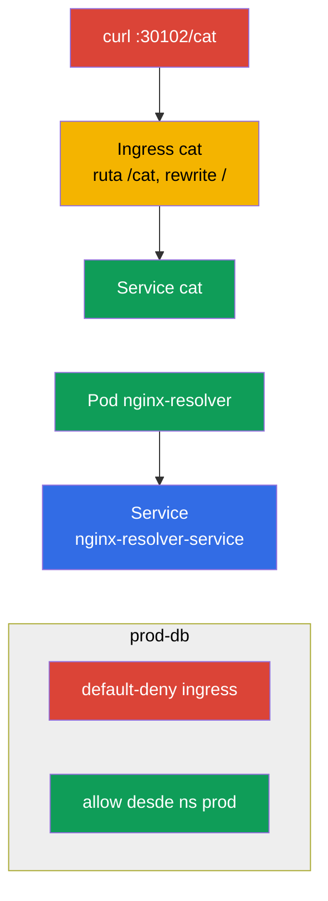

[Русская версия](README_RU.MD) · [Eng version](README.MD) · [Version française](README_FR.MD) · [Deutsche Version](README_DE.MD) · [ქართული ვერსია](README_GE.MD) · [繁體中文版](README_TW.MD) · [日本語版](README_JP.MD)

# Lab 110 — Redes: Service/DNS, Ingress, NetworkPolicy

## Descripción

Práctica del dominio Services & Networking. Trabajarás la resolución DNS de un Service, la
publicación de una aplicación hacia fuera mediante **Ingress** (con rewrite y la ruta
`/cat`), la segmentación del tráfico con **NetworkPolicy** (políticas de red: default-deny +
permisos puntuales) y la migración de Ingress a **Gateway API**. En el clúster vienen
preinstalados un controlador de ingress (NodePort `30102`) y el CNI Calico (para
NetworkPolicy), además de namespaces (espacios de nombres) semilla para las políticas de red
y para la migración.

Todas las tareas están redactadas en estilo de examen (como las preguntas reales de
CKA/CKAD) con verificación automática mediante el comando `check_result`. El Service y el Pod
resulta cómodo crearlos de forma imperativa (`kubectl run/expose`), mientras que el Ingress,
la NetworkPolicy y los objetos de Gateway API es mejor hacerlos con manifiestos
(`kubectl apply -f`).

## Objetivo

Consolidar el material de los capítulos del curso:

- [Capítulo 31. El Service por dentro, DNS y CoreDNS](../../course/31/es.md) — cómo funciona un Service, los nombres DNS y la resolución a través de CoreDNS
- [Capítulo 32. Ingress y controladores de Ingress](../../course/32/es.md) — entrada L7, reglas de rutas, rewrite, controlador de ingress
- [Capítulo 33. Gateway API](../../course/33/es.md) — Gateway, HTTPRoute y la migración desde Ingress
- [Capítulo 34. NetworkPolicy](../../course/34/es.md) — segmentación del tráfico, default-deny y permisos por selector

## Qué creamos y para qué

En este laboratorio montamos la capa de red de una aplicación: desde la resolución del
Service por DNS hasta el tráfico entrante a través de Ingress/Gateway API y su limitación
con políticas. Cada objeto resuelve su propia tarea:

| Objeto | Qué es | Para qué está en este laboratorio |
|--------|---------|-------------------|
| **Pod `nginx-resolver` + Service** | la aplicación y su Service | aprender a resolver un Service por DNS y a guardar los registros (capítulo 31) |
| **Ingress `cat` (namespace `cat`)** | entrada L7 por la ruta `/cat` | publicar la aplicación hacia fuera con rewrite (capítulo 32) |
| **NetworkPolicy en `prod-db`** | segmentación del tráfico | default-deny + permiso desde el namespace `prod` (capítulo 34) |
| **Gateway `shop-gw` + HTTPRoute `shop-route`** | migración de Ingress a Gateway API | trasladamos el `Ingress shop-ingress` a los objetos equivalentes (capítulo 33) |

Panorama final de lo que quedará despliegado:



## Infraestructura

El entorno se despliega en AWS (`eu-central-1`) mediante Terragrunt y consta de:

| Componente | Descripción                                                  |
|------------|--------------------------------------------------------------|
| `vpc`      | VPC `10.10.0.0/16` con subredes públicas                      |
| `ssh-keys` | Claves SSH para el acceso a los nodos                         |
| `k8s-1`    | Kubernetes `1.35.2` (kubeadm), CNI Calico, metrics-server; están instalados **ingress-nginx (NodePort 30102)** y **Gateway API (CRD + NGINX Gateway Fabric)**; namespaces semilla `prod-db`/`prod`/`stage` y un `Ingress shop-ingress` semilla en el namespace `gw` para la migración |
| `worker`   | Máquina de trabajo con `kubectl` y `check_result`            |

Instancias: `t4g.medium` (master), Ubuntu `22.04`. El clúster es de un solo nodo: al master se
le ha quitado el taint `control-plane`, por lo que los pods se planifican directamente en él.

## Despliegue

```bash
TASK=110 make run_cka_task
```

Tras la creación, conéctate por SSH a la máquina de trabajo (worker) y realiza las tareas desde allí.
`kubectl` ya está configurado con el contexto `cluster1-admin@cluster1`.

Comandos útiles en la máquina de trabajo:

```bash
time_left       # cuánto tiempo queda
check_result    # comprobar la solución
```

## Tareas

---
|        **1**        | **Resolución del Service por DNS**                           |
| :-----------------: | :----------------------------------------------------------- |
| Qué hacemos         | Ejecuta el Pod `nginx-resolver` (imagen `viktoruj/ping_pong:latest`) y expón delante de él el Service `nginx-resolver-service` (los Endpoints no deben estar vacíos). Comprueba la resolución DNS desde un Pod temporal (`nslookup`) y guarda los registros: la salida del Service en `/var/work/tests/artifacts/dns/nginx.svc` y la del Pod en `/var/work/tests/artifacts/dns/nginx.pod`. |
| Criterios de aceptación | - Pod `nginx-resolver` (`viktoruj/ping_pong:latest`) + Service `nginx-resolver-service`, los Endpoints no están vacíos;<br/>- los registros están guardados en `/var/work/tests/artifacts/dns/nginx.svc` y `/var/work/tests/artifacts/dns/nginx.pod`. |
---
|        **2**        | **Publicar la aplicación mediante Ingress**                 |
| :-----------------: | :----------------------------------------------------------- |
| Qué hacemos         | En el namespace `cat` despliega la aplicación y el Service `cat`, después crea un Ingress con la ruta `/cat` y backend Service `cat`. Añade la annotation `nginx.ingress.kubernetes.io/rewrite-target: /` para que el prefijo `/cat` se reescriba a `/` antes del backend. Comprueba el acceso: `curl cka.local:30102/cat`. |
| Criterios de aceptación | - namespace `cat`, Service `cat`;<br/>- Ingress: path `/cat`, backend Service `cat`, annotation `nginx.ingress.kubernetes.io/rewrite-target: /`;<br/>- accesible: `curl cka.local:30102/cat`. |
---
|        **3**        | **Segmentar el tráfico con políticas**                      |
| :-----------------: | :----------------------------------------------------------- |
| Qué hacemos         | En el namespace `prod-db` crea una NetworkPolicy default-deny para el tráfico entrante (`podSelector` vacío, `policyTypes: [Ingress]`, sin reglas `ingress`), y después una segunda política que permita la entrada desde un namespace con el label `role=prod` (mediante `namespaceSelector`). |
| Criterios de aceptación | - en `prod-db`: política default-deny ingress;<br/>- política allow desde un namespace con el label `role=prod`. |
---
|        **4**        | **Migrar el Ingress a Gateway API**                          |
| :-----------------: | :----------------------------------------------------------- |
| Qué hacemos         | En el namespace `gw` hay un `Ingress shop-ingress` ya listo (host `shop.local`, path `/api` → Service `shop`, rewrite `/`). Trasládalo a la pareja equivalente de Gateway API: `Gateway shop-gw` (con el `gatewayClassName` indicado) y `HTTPRoute shop-route` (`parentRefs` → `shop-gw`, hostname `shop.local`, path `/api`, backend `shop`). |
| Criterios de aceptación | - namespace `gw`;<br/>- `Gateway` `shop-gw` (con `gatewayClassName` indicado);<br/>- `HTTPRoute` `shop-route`: `parentRefs` → `shop-gw`, hostname `shop.local`, path `/api`, backend `shop`. |
---

## Comprobación del resultado

En la máquina de trabajo lanza la verificación automática:

```bash
check_result
```

El script ejecuta los tests y muestra cuántas tareas están completadas.

## Solución

Solución de referencia: [worker/files/solutions/1_ES.MD](worker/files/solutions/1_ES.MD)

## Cobertura de exámenes simulados

El laboratorio cubre las tareas de red de los simulados: CKA mock 01 (n.º 21 — DNS resolve, n.º 23 — NetworkPolicy),
CKA mock 02 (n.º 12 — Ingress /cat, n.º 21 — NetworkPolicy), CKAD mock 01 (n.º 11 — Ingress /cat),
CKAD mock 02 (n.º 7 — fix ingress, n.º 8 — NetworkPolicy). La tarea 4 cubre un tema nuevo del
programa CKA: la **migración de Ingress a Gateway API** (capítulo 33).

## Eliminación del clúster y los recursos

```bash
TASK=110 make delete_cka_task
```
