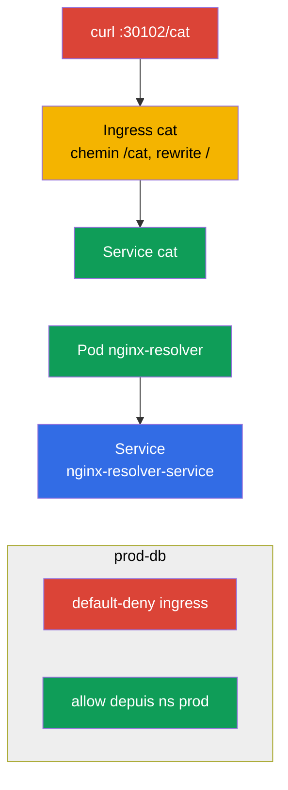

[Русская версия](README_RU.MD) · [Eng version](README.MD) · [Versión en español](README_ES.MD) · [Deutsche Version](README_DE.MD) · [ქართული ვერსია](README_GE.MD)

# Lab 110 — Réseau : Service/DNS, Ingress, NetworkPolicy

## Description

Travaux pratiques sur le domaine Services & Networking. Vous travaillerez la résolution DNS
d'un Service, la publication d'une application vers l'extérieur via **Ingress** (avec rewrite
et le chemin `/cat`), la segmentation du trafic via **NetworkPolicy** (politiques réseau :
default-deny + autorisations ciblées) et la migration d'Ingress vers **Gateway API**. Le
cluster contient déjà un contrôleur ingress (NodePort `30102`) et le CNI Calico (pour
NetworkPolicy), ainsi que des namespaces (espaces de noms) préremplis pour les politiques
réseau et pour la migration.

Toutes les tâches sont rédigées dans le style de l'examen (comme de vraies questions
CKA/CKAD) avec vérification automatique par la commande `check_result`. Le Service et le Pod
se créent commodément de façon impérative (`kubectl run/expose`), tandis que l'Ingress, la
NetworkPolicy et les objets Gateway API se font plutôt avec des manifestes
(`kubectl apply -f`).

## Objectif

Consolider le contenu des chapitres du cours :

- [Chapitre 31. Le Service de l'intérieur, DNS et CoreDNS](../../course/31/ru.md) — comment fonctionne un Service, les noms DNS et la résolution via CoreDNS
- [Chapitre 32. Ingress et contrôleurs Ingress](../../course/32/ru.md) — entrée L7, règles de chemins, rewrite, contrôleur ingress
- [Chapitre 33. Gateway API](../../course/33/ru.md) — Gateway, HTTPRoute et migration depuis Ingress
- [Chapitre 34. NetworkPolicy](../../course/34/ru.md) — segmentation du trafic, default-deny et autorisations par selector

## Ce que nous créons et pourquoi

Dans ce lab, nous assemblons la couche réseau d'une application : de la résolution du Service
par DNS au trafic entrant via Ingress/Gateway API et à sa limitation par des politiques.
Chaque objet remplit son rôle :

| Objet | Ce que c'est | Pourquoi dans ce lab |
|--------|---------|-------------------|
| **Pod `nginx-resolver` + Service** | l'application et son Service | apprendre à résoudre un Service par DNS et à enregistrer les résultats (chapitre 31) |
| **Ingress `cat` (namespace `cat`)** | entrée L7 sur le chemin `/cat` | publier l'application vers l'extérieur avec rewrite (chapitre 32) |
| **NetworkPolicy dans `prod-db`** | segmentation du trafic | default-deny + autorisation depuis le namespace `prod` (chapitre 34) |
| **Gateway `shop-gw` + HTTPRoute `shop-route`** | migration d'Ingress vers Gateway API | nous transférons l'`Ingress shop-ingress` vers les objets équivalents (chapitre 33) |

Voici le tableau final de ce qui sera déployé :



## Infrastructure

L'environnement est déployé dans AWS (`eu-central-1`) via Terragrunt et se compose de :

| Composant  | Description                                                  |
|------------|--------------------------------------------------------------|
| `vpc`      | VPC `10.10.0.0/16` avec des sous-réseaux publics               |
| `ssh-keys` | Clés SSH pour l'accès aux nœuds                                |
| `k8s-1`    | Kubernetes `1.35.2` (kubeadm), CNI Calico, metrics-server ; **ingress-nginx (NodePort 30102)** et **Gateway API (CRD + NGINX Gateway Fabric)** sont installés ; namespaces préremplis `prod-db`/`prod`/`stage` et un `Ingress shop-ingress` prérempli dans le namespace `gw` pour la migration |
| `worker`   | Machine de travail avec `kubectl` et `check_result`           |

Instances : `t3.medium` (master), Ubuntu `22.04`. Le cluster est mono-nœud — le taint
`control-plane` a été retiré du master, les pods sont donc planifiés directement dessus.

## Déploiement

```bash
TASK=110 make run_cka_task
```

Après la création, connectez-vous en SSH à la machine de travail (worker) et faites les tâches depuis là.
`kubectl` est déjà configuré sur le contexte `cluster1-admin@cluster1`.

Commandes utiles sur la machine de travail :

```bash
time_left       # combien de temps il reste
check_result    # vérifier la solution
```

## Tâches

---
|        **1**        | **Résolution du Service par DNS**                            |
| :-----------------: | :----------------------------------------------------------- |
| Ce qu'on fait       | Lancez le Pod `nginx-resolver` (image `viktoruj/ping_pong:latest`) et exposez devant lui le Service `nginx-resolver-service` (les Endpoints ne doivent pas être vides). Vérifiez la résolution DNS depuis un Pod temporaire (`nslookup`) et enregistrez les résultats : la sortie du Service dans `/var/work/tests/artifacts/dns/nginx.svc`, celle du Pod dans `/var/work/tests/artifacts/dns/nginx.pod`. |
| Critères d'acceptation | - Pod `nginx-resolver` (`viktoruj/ping_pong:latest`) + Service `nginx-resolver-service`, Endpoints non vides ;<br/>- les résultats sont enregistrés dans `/var/work/tests/artifacts/dns/nginx.svc` et `/var/work/tests/artifacts/dns/nginx.pod`. |
---
|        **2**        | **Publier l'application via Ingress**                       |
| :-----------------: | :----------------------------------------------------------- |
| Ce qu'on fait       | Dans le namespace `cat`, déployez l'application et le Service `cat`, puis créez un Ingress avec le chemin `/cat` et le backend Service `cat`. Ajoutez l'annotation `nginx.ingress.kubernetes.io/rewrite-target: /` pour que le préfixe `/cat` soit réécrit en `/` avant le backend. Vérifiez l'accès : `curl cka.local:30102/cat`. |
| Critères d'acceptation | - namespace `cat`, Service `cat` ;<br/>- Ingress : path `/cat`, backend Service `cat`, annotation `nginx.ingress.kubernetes.io/rewrite-target: /` ;<br/>- accessible : `curl cka.local:30102/cat`. |
---
|        **3**        | **Segmenter le trafic avec des politiques**                 |
| :-----------------: | :----------------------------------------------------------- |
| Ce qu'on fait       | Dans le namespace `prod-db`, créez une NetworkPolicy default-deny sur le trafic entrant (`podSelector` vide, `policyTypes: [Ingress]`, sans règles `ingress`), puis une seconde politique qui autorise l'entrée depuis un namespace portant le label `role=prod` (via `namespaceSelector`). |
| Critères d'acceptation | - dans `prod-db` : politique default-deny ingress ;<br/>- politique allow depuis un namespace portant le label `role=prod`. |
---
|        **4**        | **Migrer l'Ingress vers Gateway API**                        |
| :-----------------: | :----------------------------------------------------------- |
| Ce qu'on fait       | Dans le namespace `gw`, il existe un `Ingress shop-ingress` prêt à l'emploi (host `shop.local`, path `/api` → Service `shop`, rewrite `/`). Transférez-le vers la paire Gateway API équivalente : `Gateway shop-gw` (avec un `gatewayClassName` défini) et `HTTPRoute shop-route` (`parentRefs` → `shop-gw`, hostname `shop.local`, path `/api`, backend `shop`). |
| Critères d'acceptation | - namespace `gw` ;<br/>- `Gateway` `shop-gw` (`gatewayClassName` défini) ;<br/>- `HTTPRoute` `shop-route` : `parentRefs` → `shop-gw`, hostname `shop.local`, path `/api`, backend `shop`. |
---

## Vérification du résultat

Sur la machine de travail, lancez la vérification automatique :

```bash
check_result
```

Le script exécute les tests et montre combien de tâches sont accomplies.

## Solution

Solution de référence : [worker/files/solutions/1_FR.MD](worker/files/solutions/1_FR.MD)

## Couverture des examens blancs

Le lab couvre les tâches réseau des examens blancs : CKA mock 01 (n° 21 — DNS resolve, n° 23 — NetworkPolicy),
CKA mock 02 (n° 12 — Ingress /cat, n° 21 — NetworkPolicy), CKAD mock 01 (n° 11 — Ingress /cat),
CKAD mock 02 (n° 7 — fix ingress, n° 8 — NetworkPolicy). La tâche 4 couvre un nouveau thème du
programme CKA — la **migration d'Ingress vers Gateway API** (chapitre 33).

## Suppression du cluster et des ressources

```bash
TASK=110 make delete_cka_task
```
