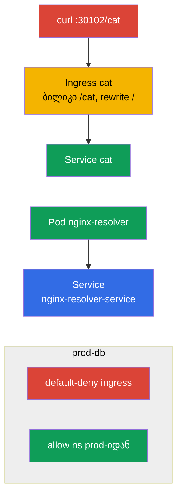

[Русская версия](README_RU.MD) · [Eng version](README.MD) · [Versión en español](README_ES.MD) · [Version française](README_FR.MD) · [Deutsche Version](README_DE.MD)

# Lab 110 — ქსელი: Service/DNS, Ingress, NetworkPolicy

## აღწერა

პრაქტიკული სამუშაო დომენზე Services & Networking. თქვენ ამუშავებთ Service-ის DNS-რეზოლვინგს,
აპლიკაციის გარეთ გამოქვეყნებას **Ingress**-ის მეშვეობით (rewrite-ით და ბილიკით `/cat`),
ტრაფიკის სეგმენტაციას **NetworkPolicy**-ს მეშვეობით (ქსელური პოლიტიკები: default-deny +
წერტილოვანი ნებართვები) და Ingress-ის მიგრაციას **Gateway API**-ზე. კლასტერში წინასწარ
დაყენებულია ingress-კონტროლერი (NodePort `30102`) და CNI Calico (NetworkPolicy-სთვის),
ასევე წინასწარ მომზადებული namespace-ები (სახელთა სივრცეები) ქსელური პოლიტიკებისა და
მიგრაციისთვის.

ყველა დავალება გამოცდის სტილშია გაფორმებული (როგორც რეალური CKA/CKAD კითხვები) და მათი
შემოწმება ავტომატურად ხდება ბრძანებით `check_result`. Service-ისა და Pod-ის (პოდის) შექმნა
მოსახერხებელია იმპერატიულად (`kubectl run/expose`), ხოლო Ingress, NetworkPolicy და Gateway
API-ს ობიექტები — მანიფესტებით (`kubectl apply -f`).

## მიზანი

განამტკიცოთ კურსის თავების მასალა:

- [თავი 31. Service შიგნიდან, DNS და CoreDNS](../../course/31/ru.md) — როგორ მუშაობს Service, DNS-სახელები და რეზოლვინგი CoreDNS-ის გავლით
- [თავი 32. Ingress და Ingress-კონტროლერები](../../course/32/ru.md) — L7-შესვლა, ბილიკების წესები, rewrite, ingress-კონტროლერი
- [თავი 33. Gateway API](../../course/33/ru.md) — Gateway, HTTPRoute და მიგრაცია Ingress-იდან
- [თავი 34. NetworkPolicy](../../course/34/ru.md) — ტრაფიკის სეგმენტაცია, default-deny და ნებართვები selector-ით

## რას ვქმნით და რისთვის

ამ ლაბორატორიაში ვაწყობთ აპლიკაციის ქსელურ შრეს: Service-ის DNS-რეზოლვინგიდან შემომავალ
ტრაფიკამდე Ingress/Gateway API-ს გავლით და მის შეზღუდვამდე პოლიტიკებით. თითოეული ობიექტი
თავის ამოცანას ასრულებს:

| ობიექტი | რა არის ეს | რისთვის არის ამ ლაბორატორიაში |
|--------|---------|-------------------|
| **Pod `nginx-resolver` + Service** | აპლიკაცია და მისი Service | ვსწავლობთ Service-ის DNS-რეზოლვინგს და ჩანაწერების შენახვას (თავი 31) |
| **Ingress `cat` (namespace `cat`)** | L7-შესვლა ბილიკით `/cat` | აპლიკაციას გარეთ ვაქვეყნებთ rewrite-ით (თავი 32) |
| **NetworkPolicy `prod-db`-ში** | ტრაფიკის სეგმენტაცია | default-deny + ნებართვა namespace `prod`-იდან (თავი 34) |
| **Gateway `shop-gw` + HTTPRoute `shop-route`** | Ingress-ის მიგრაცია Gateway API-ზე | `Ingress shop-ingress`-ს გადავიტანთ ეკვივალენტურ ობიექტებზე (თავი 33) |

საბოლოო სურათი იმისა, რაც განთავსდება:



## ინფრასტრუქტურა

გარემო იშლება AWS-ში (`eu-central-1`) Terragrunt-ის მეშვეობით და შედგება:

| კომპონენტი | აღწერა                                                    |
|------------|-----------------------------------------------------------|
| `vpc`      | VPC `10.10.0.0/16` საჯარო ქვექსელებით                      |
| `ssh-keys` | SSH-გასაღებები node-ებზე წვდომისთვის                        |
| `k8s-1`    | Kubernetes `1.35.2` (kubeadm), CNI Calico, metrics-server; დაყენებულია **ingress-nginx (NodePort 30102)** და **Gateway API (CRD + NGINX Gateway Fabric)**; წინასწარ მომზადებული namespace-ები `prod-db`/`prod`/`stage` და წინასწარ მომზადებული `Ingress shop-ingress` namespace `gw`-ში მიგრაციისთვის |
| `worker`   | სამუშაო მანქანა `kubectl`-ით და `check_result`-ით          |

ინსტანსები: `t3.medium` (master), Ubuntu `22.04`. კლასტერი ერთკვანძიანია — master-ს
მოშორებულია taint `control-plane`, ამიტომ pod-ები პირდაპირ მასზე იგეგმება.

## განთავსება

```bash
TASK=110 make run_cka_task
```

შექმნის შემდეგ დაუკავშირდით სამუშაო მანქანას (worker) SSH-ით და დავალებები შეასრულეთ იქიდან.
`kubectl` უკვე კონფიგურირებულია კონტექსტზე `cluster1-admin@cluster1`.

სასარგებლო ბრძანებები სამუშაო მანქანაზე:

```bash
time_left       # რამდენი დრო დარჩა
check_result    # ამოხსნის შემოწმება
```

## დავალებები

---
|        **1**        | **სერვისის რეზოლვინგი DNS-ით**                               |
| :-----------------: | :----------------------------------------------------------- |
| რას ვაკეთებთ        | გაუშვით Pod `nginx-resolver` (image `viktoruj/ping_pong:latest`) და მის წინ გამოიტანეთ Service `nginx-resolver-service` (Endpoints არ უნდა იყოს ცარიელი). შეამოწმეთ DNS-რეზოლვინგი დროებითი Pod-იდან (`nslookup`) და შეინახეთ ჩანაწერები: Service-ის გამონატანი — `/var/work/tests/artifacts/dns/nginx.svc`-ში, Pod-ის — `/var/work/tests/artifacts/dns/nginx.pod`-ში. |
| მიღების კრიტერიუმები | - Pod `nginx-resolver` (`viktoruj/ping_pong:latest`) + Service `nginx-resolver-service`, Endpoints არ არის ცარიელი;<br/>- ჩანაწერები შენახულია `/var/work/tests/artifacts/dns/nginx.svc`-სა და `/var/work/tests/artifacts/dns/nginx.pod`-ში. |
---
|        **2**        | **აპლიკაციის გამოქვეყნება Ingress-ით**                      |
| :-----------------: | :----------------------------------------------------------- |
| რას ვაკეთებთ        | namespace `cat`-ში განათავსეთ აპლიკაცია და Service `cat`, შემდეგ შექმენით Ingress ბილიკით `/cat` და backend Service `cat`. მიამაგრეთ annotation `nginx.ingress.kubernetes.io/rewrite-target: /`, რომ პრეფიქსი `/cat` ბექენდამდე გადაიწეროს `/`-ად. შეამოწმეთ წვდომა: `curl cka.local:30102/cat`. |
| მიღების კრიტერიუმები | - namespace `cat`, Service `cat`;<br/>- Ingress: path `/cat`, backend Service `cat`, annotation `nginx.ingress.kubernetes.io/rewrite-target: /`;<br/>- ხელმისაწვდომია: `curl cka.local:30102/cat`. |
---
|        **3**        | **ტრაფიკის სეგმენტაცია პოლიტიკებით**                        |
| :-----------------: | :----------------------------------------------------------- |
| რას ვაკეთებთ        | namespace `prod-db`-ში შექმენით NetworkPolicy default-deny შემომავალ ტრაფიკზე (ცარიელი `podSelector`, `policyTypes: [Ingress]`, `ingress` წესების გარეშე), შემდეგ მეორე პოლიტიკა, რომელიც დაუშვებს შესვლას label `role=prod`-ის მქონე namespace-იდან (`namespaceSelector`-ის მეშვეობით). |
| მიღების კრიტერიუმები | - `prod-db`-ში: default-deny ingress პოლიტიკა;<br/>- allow პოლიტიკა label `role=prod`-ის მქონე namespace-იდან. |
---
|        **4**        | **Ingress-ის მიგრაცია Gateway API-ზე**                       |
| :-----------------: | :----------------------------------------------------------- |
| რას ვაკეთებთ        | namespace `gw`-ში არის მზა `Ingress shop-ingress` (host `shop.local`, path `/api` → Service `shop`, rewrite `/`). გადაიტანეთ ის ეკვივალენტურ Gateway API წყვილზე: `Gateway shop-gw` (მითითებული `gatewayClassName`-ით) და `HTTPRoute shop-route` (`parentRefs` → `shop-gw`, hostname `shop.local`, path `/api`, backend `shop`). |
| მიღების კრიტერიუმები | - namespace `gw`;<br/>- `Gateway` `shop-gw` (მითითებულია `gatewayClassName`);<br/>- `HTTPRoute` `shop-route`: `parentRefs` → `shop-gw`, hostname `shop.local`, path `/api`, backend `shop`. |
---

## შედეგის შემოწმება

სამუშაო მანქანაზე გაუშვით ავტომატური შემოწმება:

```bash
check_result
```

სკრიპტი გაატარებს ტესტებს და აჩვენებს, რამდენი დავალებაა შესრულებული.

## ამოხსნა

ეტალონური ამოხსნა: [worker/files/solutions/1_GE.MD](worker/files/solutions/1_GE.MD)

## Mock-გამოცდების დაფარვა

ლაბორატორია ფარავს mock-ების ქსელურ დავალებებს: CKA mock 01 (№21 — DNS resolve, №23 — NetworkPolicy),
CKA mock 02 (№12 — Ingress /cat, №21 — NetworkPolicy), CKAD mock 01 (№11 — Ingress /cat),
CKAD mock 02 (№7 — fix ingress, №8 — NetworkPolicy). დავალება 4 ფარავს CKA-ს პროგრამის ახალ
თემას — **Ingress-ის მიგრაციას Gateway API-ზე** (თავი 33).

## კლასტერისა და რესურსების წაშლა

```bash
TASK=110 make delete_cka_task
```
