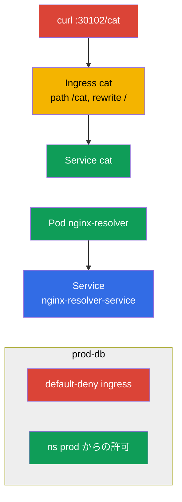

[Русская версия](README_RU.MD) · [Eng version](README.MD) · [Versión en español](README_ES.MD) · [Version française](README_FR.MD) · [Deutsche Version](README_DE.MD) · [ქართული ვერსია](README_GE.MD) · [繁體中文版](README_TW.MD)

# Lab 110 - ネットワーク：Service/DNS、Ingress、NetworkPolicy

## 概要

Services & Networking 領域の実習です。ここでは Service（サービス）の DNS 解析、
**Ingress** によるアプリケーションの外部公開（rewrite と `/cat` パスあり）、
**NetworkPolicy**（ネットワークポリシー：default-deny + 個別の許可）による
トラフィックの分割、そして Ingress から **Gateway API** への移行を練習します。
クラスタには ingress コントローラー（NodePort `30102`）と CNI Calico
（NetworkPolicy 用）、さらにネットワークポリシーと移行のための
シード namespaces（名前空間）があらかじめインストールされています。

すべての課題は試験形式（実際の CKA/CKAD の問題と同じスタイル）で書かれており、
`check_result` コマンドで自動的に検証されます。Service と Pod（ポッド）は命令型
（`kubectl run/expose`）で作るのが便利で、Ingress、NetworkPolicy、Gateway API の
オブジェクトはマニフェスト（`kubectl apply -f`）で作ります。

## 目的

次のコース章の内容を定着させます：

- [第 31 章。Service の内部、DNS と CoreDNS](../../course/31/README.md) - Service の仕組み、DNS 名、CoreDNS 経由の解決
- [第 32 章。Ingress と Ingress コントローラー](../../course/32/README.md) - L7 入口、パスのルール、rewrite、ingress コントローラー
- [第 33 章。Gateway API](../../course/33/README.md) - Gateway、HTTPRoute、Ingress からの移行
- [第 34 章。NetworkPolicy](../../course/34/README.md) - トラフィックの分割、default-deny、selector による許可

## 何を作り、なぜ作るのか

この実習では、アプリケーションのネットワーク層を組み立てます：DNS による Service の
解決から、Ingress/Gateway API 経由の受信トラフィック、そしてポリシーによるその制限まで。
各オブジェクトにはそれぞれの役割があります：

| オブジェクト | これは何か | この実習での役割 |
|--------|---------|-------------------|
| **Pod `nginx-resolver` + Service** | アプリケーションとその Service | DNS で Service を解決し、記録を保存することを学ぶ（第 31 章） |
| **Ingress `cat`（namespace `cat`）** | `/cat` パスの L7 入口 | rewrite 付きでアプリケーションを外部に公開する（第 32 章） |
| **`prod-db` の NetworkPolicy** | トラフィックの分割 | default-deny + namespace `prod` からの許可（第 34 章） |
| **Gateway `shop-gw` + HTTPRoute `shop-route`** | Ingress から Gateway API への移行 | `Ingress shop-ingress` を等価なオブジェクトへ移す（第 33 章） |

最終的にデプロイされる全体像：



## インフラ

環境は Terragrunt により AWS（`eu-central-1`）に展開され、次の要素で構成されます：

| コンポーネント | 説明                                                    |
|------------|-------------------------------------------------------------|
| `vpc`      | パブリックサブネットを持つ VPC `10.10.0.0/16`                    |
| `ssh-keys` | ノードへアクセスするための SSH キー                                |
| `k8s-1`    | Kubernetes `1.35.2`（kubeadm）、CNI Calico、metrics-server；**ingress-nginx（NodePort 30102）** と **Gateway API（CRD + NGINX Gateway Fabric）** が導入済み；シード namespaces `prod-db`/`prod`/`stage`、および移行用に namespace `gw` のシード `Ingress shop-ingress` |
| `worker`   | `kubectl` と `check_result` を備えた作業マシン                 |

インスタンス：`t3.medium`（master）、Ubuntu `22.04`。クラスタは単一ノード構成で、master の
taint は解除されています（`control-plane` taint を削除）。そのため Pod は master 上に直接スケジュールされます。

## デプロイ

```bash
TASK=110 make run_cka_task
```

作成が完了したら、SSH で作業マシン（worker）に接続し、そこから課題を進めてください。
`kubectl` はすでに `cluster1-admin@cluster1` コンテキストに設定されています。

作業マシンで使える便利なコマンド：

```bash
time_left       # 残り時間
check_result    # 解答をチェックする
```

## 課題

---
|        **1**        | **DNS によるサービスの解決**                                 |
| :-----------------: | :----------------------------------------------------------- |
| やること            | Pod `nginx-resolver`（コンテナイメージ `viktoruj/ping_pong:latest`）を起動し、その前に Service `nginx-resolver-service` を置いてください（Endpoints が空であってはいけません）。一時的な Pod から DNS 解決を確認し（`nslookup`）、記録を保存します：Service の出力を `/var/work/tests/artifacts/dns/nginx.svc` に、Pod の出力を `/var/work/tests/artifacts/dns/nginx.pod` に。 |
| 受け入れ基準        | - Pod `nginx-resolver`（`viktoruj/ping_pong:latest`）+ Service `nginx-resolver-service`、Endpoints が空でない；<br/>- 記録が `/var/work/tests/artifacts/dns/nginx.svc` と `/var/work/tests/artifacts/dns/nginx.pod` に保存されている。 |
---
|        **2**        | **Ingress によるアプリケーションの公開**                   |
| :-----------------: | :----------------------------------------------------------- |
| やること            | namespace `cat` にアプリケーションと Service `cat` をデプロイし、次にパス `/cat` と backend Service `cat` を持つ Ingress を作成してください。annotation `nginx.ingress.kubernetes.io/rewrite-target: /` を付けて、バックエンドに渡る前に `/cat` プレフィックスが `/` に書き換えられるようにします。アクセスを確認してください：`curl cka.local:30102/cat`。 |
| 受け入れ基準        | - namespace `cat`、Service `cat`；<br/>- Ingress：path `/cat`、backend Service `cat`、annotation `nginx.ingress.kubernetes.io/rewrite-target: /`；<br/>- アクセス可能：`curl cka.local:30102/cat`。 |
---
|        **3**        | **ポリシーによるトラフィックの分割**                        |
| :-----------------: | :----------------------------------------------------------- |
| やること            | namespace `prod-db` に受信トラフィック向けの default-deny NetworkPolicy を作成し（`podSelector` は空、`policyTypes: [Ingress]`、`ingress` ルールなし）、次に label `role=prod` を持つ namespace からの受信を許可する 2 つ目のポリシーを作成してください（`namespaceSelector` を使用）。 |
| 受け入れ基準        | - `prod-db` に：default-deny ingress のポリシー；<br/>- label `role=prod` を持つ namespace からの allow ポリシー。 |
---
|        **4**        | **Ingress を Gateway API へ移行する**                       |
| :-----------------: | :----------------------------------------------------------- |
| やること            | namespace `gw` には既製の `Ingress shop-ingress` があります（host `shop.local`、path `/api` → Service `shop`、rewrite `/`）。これを等価な Gateway API の組み合わせへ移してください：`Gateway shop-gw`（`gatewayClassName` を設定）と `HTTPRoute shop-route`（`parentRefs` → `shop-gw`、hostname `shop.local`、path `/api`、backend `shop`）。 |
| 受け入れ基準        | - namespace `gw`；<br/>- `Gateway` `shop-gw`（`gatewayClassName` が設定されている）；<br/>- `HTTPRoute` `shop-route`：`parentRefs` → `shop-gw`、hostname `shop.local`、path `/api`、backend `shop`。 |
---

## 結果のチェック

作業マシンで自動チェックを実行します：

```bash
check_result
```

スクリプトがテストを実行し、いくつの課題が完了したかを表示します。

## 解答

参考解答：[worker/files/solutions/1_JP.MD](worker/files/solutions/1_JP.MD)

## 模擬試験のカバー範囲

この実習は模擬試験のネットワーク課題をカバーします：CKA mock 01（第 21 問 - DNS resolve、第 23 問 - NetworkPolicy）、
CKA mock 02（第 12 問 - Ingress /cat、第 21 問 - NetworkPolicy）、CKAD mock 01（第 11 問 - Ingress /cat）、
CKAD mock 02（第 7 問 - fix ingress、第 8 問 - NetworkPolicy）。課題 4 は CKA の新しいテーマ - **Ingress から Gateway API への移行** をカバーします（第 33 章）。

## クラスタとリソースの削除

```bash
TASK=110 make delete_cka_task
```
