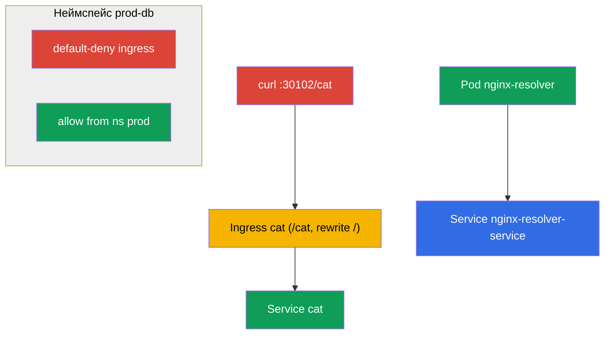

# Lab 110 — Сеть: Service/DNS, Ingress, NetworkPolicy

## Описание

Практическая работа по домену Services & Networking. Вы отработаете DNS-резолвинг
сервисов, публикацию приложения снаружи через **Ingress** (с rewrite и путём `/cat`) и
сегментацию трафика через **NetworkPolicy** (default-deny + точечные разрешения). В
кластере предустановлены ingress-контроллер (NodePort `30102`) и CNI Calico (для
NetworkPolicy), а также сид-неймспейсы для сетевых политик.

Все задания в экзаменационном стиле с автопроверкой `check_result`.

## Цель

Закрепить главы курса:

- [Глава 31. Service изнутри, DNS и CoreDNS](../../course/31/ru.md)
- [Глава 32. Ingress и Ingress-контроллеры](../../course/32/ru.md)
- [Глава 33. Gateway API](../../course/33/ru.md)
- [Глава 34. NetworkPolicy](../../course/34/ru.md)

## Что мы создаём и зачем

| Объект | Что это | Зачем в этой лабе |
|--------|---------|-------------------|
| **Под `nginx-resolver` + сервис** | приложение и его сервис | учимся резолвить сервис по DNS и сохранять записи |
| **Ingress `cat` (неймспейс `cat`)** | L7-вход по пути `/cat` | публикуем приложение снаружи с rewrite |
| **NetworkPolicy в `prod-db`** | сегментация трафика | default-deny + разрешение из неймспейса `prod` |



## Инфраструктура

| Компонент  | Описание                                                             |
|------------|----------------------------------------------------------------------|
| `k8s-1`    | Kubernetes `1.35.2` (kubeadm), Calico, metrics-server; установлены **ingress-nginx (NodePort 30102)** и **Gateway API (CRD + NGINX Gateway Fabric)**; сид-неймспейсы `prod-db`/`prod`/`stage` и сид-`Ingress shop-ingress` в `gw` для миграции |
| `worker`   | Рабочая машина с `kubectl` и `check_result`                          |

## Развёртывание

```bash
TASK=110 make run_cka_task
```

## Задания

---
|        **1**        | **Резолвинг сервиса по DNS**                                 |
| :-----------------: | :----------------------------------------------------------- |
| Что делаем          | Создаём под и сервис, проверяем DNS и сохраняем записи        |
| Критерии приёмки    | - Pod `nginx-resolver` (nginx) + Service `nginx-resolver-service` (Endpoints не пусты)<br/>- Записи сохранены в `/var/work/tests/artifacts/dns/nginx.svc` и `.../nginx.pod` |
---
|        **2**        | **Опубликовать приложение через Ingress**                   |
| :-----------------: | :----------------------------------------------------------- |
| Что делаем          | Создаём Ingress с путём `/cat` и rewrite на бэкенд `cat`      |
| Критерии приёмки    | - Неймспейс `cat`, service `cat`<br/>- Ingress: path `/cat`, backend service `cat`, annotation `nginx.ingress.kubernetes.io/rewrite-target: /`<br/>- Доступно: `curl cka.local:30102/cat` |
---
|        **3**        | **Сегментировать трафик политиками**                        |
| :-----------------: | :----------------------------------------------------------- |
| Что делаем          | В `prod-db` запрещаем весь вход, затем разрешаем из `prod`    |
| Критерии приёмки    | - В `prod-db`: политика default-deny ingress<br/>- Политика allow из неймспейса с меткой `role=prod` |
---
|        **4**        | **Мигрировать Ingress на Gateway API**                       |
| :-----------------: | :----------------------------------------------------------- |
| Что делаем          | Переносим готовый `Ingress shop-ingress` (ns `gw`) на эквивалентные `Gateway` + `HTTPRoute` |
| Критерии приёмки    | - Неймспейс `gw`<br/>- `Gateway` `shop-gw` (задан `gatewayClassName`)<br/>- `HTTPRoute` `shop-route`: `parentRefs` → `shop-gw`, hostname `shop.local`, path `/api`, backend `shop` |
---

## Проверка результата

```bash
check_result
```

## Решение

[worker/files/solutions/1.MD](worker/files/solutions/1.MD)

## Покрытие мок-экзаменов

CKA mock 01 (№21 — DNS resolve, №23 — NetworkPolicy), CKA mock 02 (№12 — Ingress /cat,
№21 — NetworkPolicy), CKAD mock 01 (№11 — Ingress /cat), CKAD mock 02 (№7 — fix ingress,
№8 — NetworkPolicy). Задание 4 покрывает новую тему программы CKA — **миграцию Ingress на
Gateway API** (глава 33).

## Удаление

```bash
TASK=110 make delete_cka_task
```
