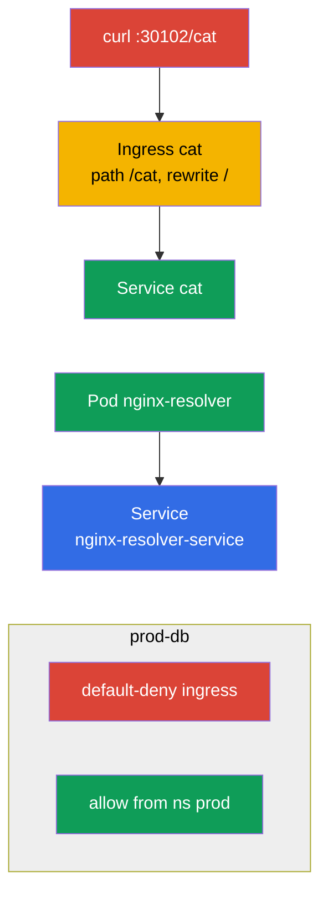

# Lab 110 — Сеть: Service/DNS, Ingress, NetworkPolicy

## Описание

Практическая работа по домену Services & Networking. Вы отработаете DNS-резолвинг
Service (сервисов), публикацию приложения снаружи через **Ingress** (с rewrite и путём
`/cat`), сегментацию трафика через **NetworkPolicy** (сетевые политики: default-deny +
точечные разрешения) и миграцию Ingress на **Gateway API**. В кластере предустановлены
ingress-контроллер (NodePort `30102`) и CNI Calico (для NetworkPolicy), а также
сид-namespaces (пространства имён) для сетевых политик и миграции.

Все задания оформлены в экзаменационном стиле (как реальные вопросы CKA/CKAD) с
автоматической проверкой командой `check_result`. Service и Pod (под) удобно создавать
императивно (`kubectl run/expose`), а Ingress, NetworkPolicy и объекты Gateway API —
манифестами (`kubectl apply -f`).

## Цель

Закрепить материал глав курса:

- [Глава 31. Service изнутри, DNS и CoreDNS](../../course/31/ru.md) — как работает Service, DNS-имена и резолвинг через CoreDNS
- [Глава 32. Ingress и Ingress-контроллеры](../../course/32/ru.md) — L7-вход, правила путей, rewrite, ingress-контроллер
- [Глава 33. Gateway API](../../course/33/ru.md) — Gateway, HTTPRoute и миграция с Ingress
- [Глава 34. NetworkPolicy](../../course/34/ru.md) — сегментация трафика, default-deny и разрешения по selector

## Что мы создаём и зачем

В этой лабе мы собираем сетевой слой приложения: от резолвинга Service по DNS до входящего
трафика через Ingress/Gateway API и его ограничения политиками. Каждый объект решает свою
задачу:

| Объект | Что это | Зачем в этой лабе |
|--------|---------|-------------------|
| **Pod `nginx-resolver` + Service** | приложение и его Service | учимся резолвить Service по DNS и сохранять записи (глава 31) |
| **Ingress `cat` (namespace `cat`)** | L7-вход по пути `/cat` | публикуем приложение снаружи с rewrite (глава 32) |
| **NetworkPolicy в `prod-db`** | сегментация трафика | default-deny + разрешение из namespace `prod` (глава 34) |
| **Gateway `shop-gw` + HTTPRoute `shop-route`** | миграция Ingress на Gateway API | переносим `Ingress shop-ingress` на эквивалентные объекты (глава 33) |

Итоговая картина того, что будет развёрнуто:



## Инфраструктура

Окружение разворачивается в AWS (`eu-central-1`) через Terragrunt и состоит из:

| Компонент  | Описание                                                    |
|------------|-------------------------------------------------------------|
| `vpc`      | VPC `10.10.0.0/16` с публичными подсетями                    |
| `ssh-keys` | SSH-ключи для доступа к нодам                                |
| `k8s-1`    | Kubernetes `1.35.2` (kubeadm), CNI Calico, metrics-server; установлены **ingress-nginx (NodePort 30102)** и **Gateway API (CRD + NGINX Gateway Fabric)**; сид-namespaces `prod-db`/`prod`/`stage` и сид-`Ingress shop-ingress` в namespace `gw` для миграции |
| `worker`   | Рабочая машина с `kubectl` и `check_result`                 |

Инстансы: `t3.medium` (master) Ubuntu `22.04`. Кластер одноузловой — master «разтейнчен»
(снят taint `control-plane`), поэтому поды планируются прямо на него.

## Развёртывание

```bash
TASK=110 make run_cka_task
```

После создания подключитесь к рабочей машине (worker) по SSH и выполняйте задания оттуда.
`kubectl` уже настроен на контекст `cluster1-admin@cluster1`.

Полезные команды на рабочей машине:

```bash
time_left       # сколько осталось времени
check_result    # проверить решение
```

## Задания

---
|        **1**        | **Резолвинг сервиса по DNS**                                 |
| :-----------------: | :----------------------------------------------------------- |
| Что делаем          | Запустите Pod `nginx-resolver` (образ `viktoruj/ping_pong:latest`) и выставьте перед ним Service `nginx-resolver-service` (Endpoints не должны быть пустыми). Проверьте DNS-резолвинг из временного Pod (`nslookup`) и сохраните записи: вывод по Service в `/var/work/tests/artifacts/dns/nginx.svc`, по Pod — в `/var/work/tests/artifacts/dns/nginx.pod`. |
| Критерии приёмки    | - Pod `nginx-resolver` (`viktoruj/ping_pong:latest`) + Service `nginx-resolver-service`, Endpoints не пусты;<br/>- записи сохранены в `/var/work/tests/artifacts/dns/nginx.svc` и `/var/work/tests/artifacts/dns/nginx.pod`. |
---
|        **2**        | **Опубликовать приложение через Ingress**                   |
| :-----------------: | :----------------------------------------------------------- |
| Что делаем          | В namespace `cat` разверните приложение и Service `cat`, затем создайте Ingress с путём `/cat` и backend Service `cat`. Навесьте annotation `nginx.ingress.kubernetes.io/rewrite-target: /`, чтобы префикс `/cat` переписывался в `/` перед бэкендом. Проверьте доступ: `curl cka.local:30102/cat`. |
| Критерии приёмки    | - namespace `cat`, Service `cat`;<br/>- Ingress: path `/cat`, backend Service `cat`, annotation `nginx.ingress.kubernetes.io/rewrite-target: /`;<br/>- доступно: `curl cka.local:30102/cat`. |
---
|        **3**        | **Сегментировать трафик политиками**                        |
| :-----------------: | :----------------------------------------------------------- |
| Что делаем          | В namespace `prod-db` создайте NetworkPolicy default-deny на входящий трафик (пустой `podSelector`, `policyTypes: [Ingress]`, без правил `ingress`), затем вторую политику, которая разрешает вход из namespace с label `role=prod` (через `namespaceSelector`). |
| Критерии приёмки    | - в `prod-db`: политика default-deny ingress;<br/>- политика allow из namespace с label `role=prod`. |
---
|        **4**        | **Мигрировать Ingress на Gateway API**                       |
| :-----------------: | :----------------------------------------------------------- |
| Что делаем          | В namespace `gw` есть готовый `Ingress shop-ingress` (host `shop.local`, path `/api` → Service `shop`, rewrite `/`). Перенесите его на эквивалентную пару Gateway API: `Gateway shop-gw` (с заданным `gatewayClassName`) и `HTTPRoute shop-route` (`parentRefs` → `shop-gw`, hostname `shop.local`, path `/api`, backend `shop`). |
| Критерии приёмки    | - namespace `gw`;<br/>- `Gateway` `shop-gw` (задан `gatewayClassName`);<br/>- `HTTPRoute` `shop-route`: `parentRefs` → `shop-gw`, hostname `shop.local`, path `/api`, backend `shop`. |
---

## Проверка результата

На рабочей машине запустите автоматическую проверку:

```bash
check_result
```

Скрипт прогонит тесты и покажет, сколько заданий выполнено.

## Решение

Эталонное решение: [worker/files/solutions/1.MD](worker/files/solutions/1.MD)

## Покрытие мок-экзаменов

Лаба закрывает сетевые задания моков: CKA mock 01 (№21 — DNS resolve, №23 — NetworkPolicy),
CKA mock 02 (№12 — Ingress /cat, №21 — NetworkPolicy), CKAD mock 01 (№11 — Ingress /cat),
CKAD mock 02 (№7 — fix ingress, №8 — NetworkPolicy). Задание 4 покрывает новую тему
программы CKA — **миграцию Ingress на Gateway API** (глава 33).

## Удаление кластера и ресурсов

```bash
TASK=110 make delete_cka_task
```
