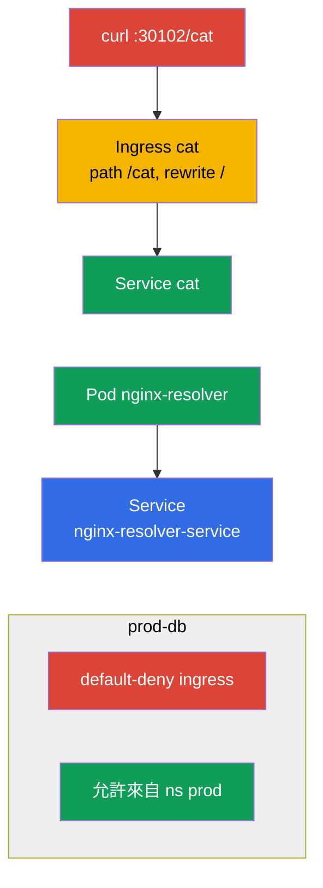

[Русская версия](README_RU.MD) · [Eng version](README.MD) · [Versión en español](README_ES.MD) · [Version française](README_FR.MD) · [Deutsche Version](README_DE.MD) · [ქართული ვერსია](README_GE.MD) · [日本語版](README_JP.MD)

# Lab 110 - 網路:Service/DNS、Ingress、NetworkPolicy

## 說明

Services & Networking 領域的實作練習。你會練習 Service(服務)的 DNS 解析、
透過 **Ingress** 把應用程式對外發布(含 rewrite 與 `/cat` 路徑)、
透過 **NetworkPolicy**(網路政策:default-deny + 針對性的允許)分段流量,
以及把 Ingress 遷移到 **Gateway API**。叢集中已預先安裝
ingress 控制器(NodePort `30102`)與 CNI Calico(供 NetworkPolicy 使用),
還有供網路政策與遷移使用的種子 namespaces(命名空間)。

所有任務都以考試風格撰寫(就像真正的 CKA/CKAD 題目),並透過
`check_result` 指令自動驗證。Service 與 Pod(容器組)建議用命令式方式建立
(`kubectl run/expose`),而 Ingress、NetworkPolicy 與 Gateway API 物件
則用資源清單(`kubectl apply -f`)。

## 目標

鞏固以下課程章節的內容:

- [第 31 章。Service 內部原理、DNS 與 CoreDNS](../../course/31/README.md) - Service 如何運作、DNS 名稱以及透過 CoreDNS 解析
- [第 32 章。Ingress 與 Ingress 控制器](../../course/32/README.md) - L7 入口、路徑規則、rewrite、ingress 控制器
- [第 33 章。Gateway API](../../course/33/README.md) - Gateway、HTTPRoute 以及從 Ingress 遷移
- [第 34 章。NetworkPolicy](../../course/34/README.md) - 流量分段、default-deny 以及依 selector 允許

## 我們要建立什麼,以及為什麼

在這個實驗中,我們組裝應用程式的網路層:從透過 DNS 解析 Service,到經由
Ingress/Gateway API 進來的流量,以及用政策限制這些流量。每個物件都有自己的
用途:

| 物件 | 這是什麼 | 為什麼出現在這個實驗中 |
|--------|---------|-------------------|
| **Pod `nginx-resolver` + Service** | 應用程式及其 Service | 學會透過 DNS 解析 Service 並儲存記錄(第 31 章) |
| **Ingress `cat`(namespace `cat`)** | 走 `/cat` 路徑的 L7 入口 | 帶 rewrite 把應用程式對外發布(第 32 章) |
| **`prod-db` 中的 NetworkPolicy** | 流量分段 | default-deny + 允許來自 namespace `prod`(第 34 章) |
| **Gateway `shop-gw` + HTTPRoute `shop-route`** | 把 Ingress 遷移到 Gateway API | 把 `Ingress shop-ingress` 搬到等價的物件(第 33 章) |

最終部署出來的整體樣貌:



## 基礎架構

環境透過 Terragrunt 部署在 AWS(`eu-central-1`),由以下部分組成:

| 元件       | 說明                                                        |
|------------|-------------------------------------------------------------|
| `vpc`      | VPC `10.10.0.0/16`,含公有子網路                              |
| `ssh-keys` | 用於存取節點的 SSH 金鑰                                       |
| `k8s-1`    | Kubernetes `1.35.2`(kubeadm),CNI Calico,metrics-server;已安裝 **ingress-nginx(NodePort 30102)** 與 **Gateway API(CRD + NGINX Gateway Fabric)**;種子 namespaces `prod-db`/`prod`/`stage`,以及 namespace `gw` 中供遷移使用的種子 `Ingress shop-ingress` |
| `worker`   | 具備 `kubectl` 與 `check_result` 的工作機                     |

執行個體:`t4g.medium`(master),Ubuntu `22.04`。叢集為單節點 - master 已解除污點
(移除了 `control-plane` taint),因此 Pod 會直接排程到它上面。

## 部署

```bash
TASK=110 make run_cka_task
```

建立完成後,請透過 SSH 連線到工作機(worker),並在那裡完成任務。
`kubectl` 已經指向 `cluster1-admin@cluster1` context。

工作機上的實用指令:

```bash
time_left       # 還剩多少時間
check_result    # 檢查解答
```

## 任務

---
|        **1**        | **透過 DNS 解析服務**                                         |
| :-----------------: | :----------------------------------------------------------- |
| 要做什麼            | 執行 Pod `nginx-resolver`(映像 `viktoruj/ping_pong:latest`),並在它前面建立 Service `nginx-resolver-service`(Endpoints 不可為空)。從臨時 Pod 檢查 DNS 解析(`nslookup`),並儲存記錄:Service 的輸出寫入 `/var/work/tests/artifacts/dns/nginx.svc`,Pod 的輸出寫入 `/var/work/tests/artifacts/dns/nginx.pod`。 |
| 驗收標準            | - Pod `nginx-resolver`(`viktoruj/ping_pong:latest`)+ Service `nginx-resolver-service`,Endpoints 不為空;<br/>- 記錄已儲存到 `/var/work/tests/artifacts/dns/nginx.svc` 與 `/var/work/tests/artifacts/dns/nginx.pod`。 |
---
|        **2**        | **透過 Ingress 對外發布應用程式**                              |
| :-----------------: | :----------------------------------------------------------- |
| 要做什麼            | 在 namespace `cat` 中部署應用程式與 Service `cat`,然後建立 Ingress,path 為 `/cat`、backend 為 Service `cat`。掛上 annotation `nginx.ingress.kubernetes.io/rewrite-target: /`,讓 `/cat` 前綴在送到後端之前被改寫成 `/`。檢查存取:`curl cka.local:30102/cat`。 |
| 驗收標準            | - namespace `cat`、Service `cat`;<br/>- Ingress:path `/cat`、backend Service `cat`、annotation `nginx.ingress.kubernetes.io/rewrite-target: /`;<br/>- 可以存取:`curl cka.local:30102/cat`。 |
---
|        **3**        | **用政策分段流量**                                            |
| :-----------------: | :----------------------------------------------------------- |
| 要做什麼            | 在 namespace `prod-db` 中建立針對入站流量的 default-deny NetworkPolicy(`podSelector` 為空、`policyTypes: [Ingress]`、沒有 `ingress` 規則),然後建立第二個政策,允許來自帶有 label `role=prod` 的 namespace 的入站流量(透過 `namespaceSelector`)。 |
| 驗收標準            | - `prod-db` 中:default-deny ingress 政策;<br/>- 允許來自帶有 label `role=prod` 的 namespace 的政策。 |
---
|        **4**        | **把 Ingress 遷移到 Gateway API**                             |
| :-----------------: | :----------------------------------------------------------- |
| 要做什麼            | namespace `gw` 中已有現成的 `Ingress shop-ingress`(host `shop.local`、path `/api` → Service `shop`、rewrite `/`)。請把它搬到等價的 Gateway API 組合:`Gateway shop-gw`(需設定 `gatewayClassName`)與 `HTTPRoute shop-route`(`parentRefs` → `shop-gw`、hostname `shop.local`、path `/api`、backend `shop`)。 |
| 驗收標準            | - namespace `gw`;<br/>- `Gateway` `shop-gw`(已設定 `gatewayClassName`);<br/>- `HTTPRoute` `shop-route`:`parentRefs` → `shop-gw`、hostname `shop.local`、path `/api`、backend `shop`。 |
---

## 檢查結果

在工作機上執行自動檢查:

```bash
check_result
```

腳本會跑完測試,並顯示已完成多少任務。

## 解答

參考解答:[worker/files/solutions/1_TW.MD](worker/files/solutions/1_TW.MD)

## 模擬考涵蓋範圍

本實驗涵蓋模擬考的網路題目:CKA mock 01(第 21 題 - DNS resolve、第 23 題 - NetworkPolicy)、
CKA mock 02(第 12 題 - Ingress /cat、第 21 題 - NetworkPolicy)、CKAD mock 01(第 11 題 - Ingress /cat)、
CKAD mock 02(第 7 題 - fix ingress、第 8 題 - NetworkPolicy)。任務 4 涵蓋 CKA 課程大綱的
新主題 - **把 Ingress 遷移到 Gateway API**(第 33 章)。

## 刪除叢集與資源

```bash
TASK=110 make delete_cka_task
```
