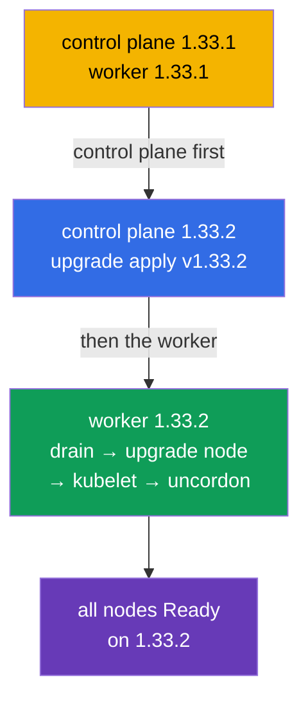

[Русская версия](README_RU.MD) · [Versión en español](README_ES.MD) · [Version française](README_FR.MD) · [Deutsche Version](README_DE.MD) · [ქართული ვერსია](README_GE.MD) · [繁體中文版](README_TW.MD) · [日本語版](README_JP.MD)

# Lab 111 — kubeadm: Cluster Upgrade (lifecycle)

## Description

A hands-on lab on upgrading a Kubernetes cluster — the classic high-score CKA task. The
cluster has **two nodes** (master + worker) and starts on version `1.33.1`. Your job is to
safely upgrade it to `1.33.2`: first the control plane, then the worker, one node at a
time, draining each one with `cordon`/`drain`. The work is done over SSH on the nodes.

All tasks are written in exam style (like real CKA/CKAD questions) with automatic
validation via the `check_result` command. The validation confirms that all nodes are
upgraded to the target version and are in the Ready state.

## Goal

Reinforce the material from the course chapters:

- [Chapter 35. Installing a kubeadm cluster](../../course/35/README.md) — what a cluster is assembled from, the control plane and worker roles
- [Chapter 36. Cluster upgrade (lifecycle)](../../course/36/README.md) — the upgrade order, `upgrade apply`/`upgrade node`, `cordon`/`drain`

## What We Do and Why

In this lab we go through the full upgrade cycle of a kubeadm cluster — from the control
plane to the worker, one node at a time, without disturbing the workload. Every action
serves its own purpose:

| Action | Why |
|--------|-----|
| Upgrading **kubeadm** on the node | the upgrade tool must match the target version (chapter 36) |
| `kubeadm upgrade apply` (control plane) | upgrades the control plane components (chapter 36) |
| `cordon` + `drain` before upgrading kubelet | drain the node so the workload is not affected (chapter 36) |
| `kubeadm upgrade node` (worker) | upgrades the worker node configuration (chapter 36) |
| upgrading **kubelet/kubectl** + restart | brings the node components to the target version (chapters 35, 36) |

The final picture of what will be deployed:



## Infrastructure

The environment is deployed in AWS (`eu-central-1`) via Terragrunt and consists of:

| Component  | Description                                                          |
|------------|----------------------------------------------------------------------|
| `vpc`      | VPC `10.10.0.0/16` with public subnets                                |
| `ssh-keys` | SSH keys for node access                                              |
| `k8s-1`    | Kubernetes **`1.33.1`** (kubeadm), Calico CNI, metrics-server, master + 1 worker |
| `worker`   | Work machine with `kubectl` and `check_result`; SSH access to the cluster nodes |

Instances: `t4g.medium`, Ubuntu `22.04`. The cluster has two nodes — the master
(control-plane) and one worker.

## Deployment

```bash
TASK=111 make run_cka_task
```

Once it is created, connect to the work machine (worker) over SSH. The upgrade itself is
performed over SSH on the cluster nodes — first on the control plane, then on the worker.
Take the node names from `kubectl get nodes` (the same names resolve for `ssh <node-name>`
and are used in `drain`/`uncordon`). `kubectl` on the work machine is pointed at the
`cluster1-admin@cluster1` context.

Handy commands on the work machine:

```bash
time_left       # how much time is left
check_result    # check your solution
```

## Tasks

---
|        **1**        | **Upgrade the control plane to 1.33.2**                      |
| :-----------------: | :----------------------------------------------------------- |
| What to do          | Over SSH on the control plane node, upgrade kubeadm to version `1.33.2` (`apt-mark unhold kubeadm` → `apt-get install kubeadm=1.33.2-1.1` → `apt-mark hold kubeadm`). Run `kubeadm upgrade plan`, then `kubeadm upgrade apply v1.33.2 -y`. After that drain the node (`kubectl drain <control-plane> --ignore-daemonsets`), upgrade `kubelet` and `kubectl` to `1.33.2`, restart kubelet (`systemctl daemon-reload && systemctl restart kubelet`) and put the node back in service (`kubectl uncordon <control-plane>`). |
| Acceptance criteria | - the control plane node is on version `v1.33.2`;<br/>- the control plane node is in the `Ready` state. |
---
|        **2**        | **Upgrade the worker node to 1.33.2**                       |
| :-----------------: | :----------------------------------------------------------- |
| What to do          | From the control plane, drain the worker (`kubectl drain <worker> --ignore-daemonsets`). On the worker node, over SSH, upgrade kubeadm to `1.33.2` and run `kubeadm upgrade node` (for a worker it is exactly `upgrade node`, not `upgrade apply`). Then upgrade `kubelet` and `kubectl` to `1.33.2`, restart kubelet and, from the control plane, put the worker back in service (`kubectl uncordon <worker>`). |
| Acceptance criteria | - all cluster nodes (≥ 2) are on version `v1.33.2`;<br/>- all nodes are in the `Ready` state. |
---

## Checking the Result

On the work machine run the automatic validation:

```bash
check_result
```

The script runs the tests and shows how many tasks are complete.

## Solution

Reference solution: [worker/files/solutions/1.MD](worker/files/solutions/1.MD)

## Mock Exam Coverage

The lab covers the mock-exam tasks on cluster upgrades: CKA mock 01 (#22 — update cluster),
CKA mock 02 (#11 — update cluster, #18 — node version matching the control plane).

## Deleting the Cluster and Resources

```bash
TASK=111 make delete_cka_task
```
