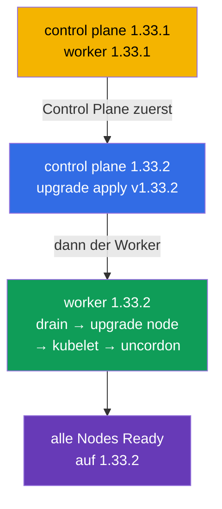

[Русская версия](README_RU.MD) · [Eng version](README.MD) · [Versión en español](README_ES.MD) · [Version française](README_FR.MD) · [ქართული ვერსია](README_GE.MD)

# Lab 111 — kubeadm: Cluster-Upgrade (lifecycle)

## Beschreibung

Praxisaufgabe zum Upgrade eines Kubernetes-Clusters — die klassische, hoch bewertete
CKA-Aufgabe. Der Cluster hat **zwei Nodes** (Master + Worker) und startet in Version
`1.33.1`. Deine Aufgabe: ihn sicher auf `1.33.2` aktualisieren — zuerst die Control Plane,
dann den Worker, Node für Node, mit Freigabe über `cordon`/`drain`. Die Arbeit erfolgt per
SSH auf den Nodes.

Alle Aufgaben sind im Prüfungsstil formuliert (wie echte CKA/CKAD-Fragen) und werden
automatisch mit dem Befehl `check_result` geprüft. Die automatische Prüfung stellt sicher,
dass alle Nodes auf der Zielversion sind und den Status Ready haben.

## Ziel

Den Stoff der Kurskapitel festigen:

- [Kapitel 35. Installation eines kubeadm-Clusters](../../course/35/ru.md) — woraus ein Cluster besteht, die Rollen Control Plane und Worker
- [Kapitel 36. Cluster-Upgrade (lifecycle)](../../course/36/ru.md) — Reihenfolge des Upgrades, `upgrade apply`/`upgrade node`, `cordon`/`drain`

## Was wir tun und warum

In diesem Lab durchlaufen wir den vollständigen Upgrade-Zyklus eines kubeadm-Clusters — von
der Control Plane zum Worker, Node für Node, ohne die Workload zu beeinträchtigen. Jede
Aktion hat ihren Zweck:

| Aktion | Warum |
|--------|-------|
| Upgrade von **kubeadm** auf dem Node | das Upgrade-Werkzeug muss zur Zielversion passen (Kapitel 36) |
| `kubeadm upgrade apply` (Control Plane) | aktualisiert die Control-Plane-Komponenten (Kapitel 36) |
| `cordon` + `drain` vor dem kubelet-Upgrade | wir geben den Node frei, um die Workload nicht zu beeinträchtigen (Kapitel 36) |
| `kubeadm upgrade node` (Worker) | aktualisiert die Konfiguration des Worker-Nodes (Kapitel 36) |
| Upgrade von **kubelet/kubectl** + Restart | bringt die Node-Komponenten auf die Zielversion (Kapitel 35, 36) |

Das Gesamtbild dessen, was bereitgestellt wird:



## Infrastruktur

Die Umgebung wird in AWS (`eu-central-1`) über Terragrunt bereitgestellt und besteht aus:

| Komponente | Beschreibung                                                         |
|------------|----------------------------------------------------------------------|
| `vpc`      | VPC `10.10.0.0/16` mit öffentlichen Subnetzen                         |
| `ssh-keys` | SSH-Schlüssel für den Zugriff auf die Nodes                            |
| `k8s-1`    | Kubernetes **`1.33.1`** (kubeadm), CNI Calico, metrics-server, Master + 1 Worker |
| `worker`   | Arbeitsmaschine mit `kubectl` und `check_result`; SSH-Zugriff auf die Cluster-Nodes |

Instanzen: `t3.medium` Ubuntu `22.04`. Der Cluster hat zwei Nodes — den Master
(control-plane) und einen Worker.

## Bereitstellung

```bash
TASK=111 make run_cka_task
```

Verbinde dich nach der Erstellung per SSH mit der Arbeitsmaschine (worker). Das Upgrade
selbst wird per SSH direkt auf den Cluster-Nodes ausgeführt — zuerst auf der Control Plane,
dann auf dem Worker. Die Node-Namen nimm aus `kubectl get nodes` (dieselben Namen werden für
`ssh <Node-Name>` aufgelöst und in `drain`/`uncordon` verwendet). `kubectl` auf der
Arbeitsmaschine ist auf den Kontext `cluster1-admin@cluster1` eingestellt.

Nützliche Befehle auf der Arbeitsmaschine:

```bash
time_left       # wie viel Zeit bleibt
check_result    # Lösung prüfen
```

## Aufgaben

---
|        **1**        | **Control Plane auf 1.33.2 aktualisieren**                   |
| :-----------------: | :----------------------------------------------------------- |
| Was wir tun         | Aktualisiere per SSH auf dem Control-Plane-Node kubeadm auf Version `1.33.2` (`apt-mark unhold kubeadm` → `apt-get install kubeadm=1.33.2-1.1` → `apt-mark hold kubeadm`). Führe `kubeadm upgrade plan` aus, dann `kubeadm upgrade apply v1.33.2 -y`. Gib danach den Node frei (`kubectl drain <control-plane> --ignore-daemonsets`), aktualisiere `kubelet` und `kubectl` auf `1.33.2`, starte kubelet neu (`systemctl daemon-reload && systemctl restart kubelet`) und nimm den Node wieder in Betrieb (`kubectl uncordon <control-plane>`). |
| Abnahmekriterien    | - Control-Plane-Node ist auf Version `v1.33.2`;<br/>- Control-Plane-Node hat den Status `Ready`. |
---
|        **2**        | **Worker-Node auf 1.33.2 aktualisieren**                    |
| :-----------------: | :----------------------------------------------------------- |
| Was wir tun         | Gib von der Control Plane aus den Worker frei (`kubectl drain <worker> --ignore-daemonsets`). Aktualisiere auf dem Worker-Node per SSH kubeadm auf `1.33.2` und führe `kubeadm upgrade node` aus (für einen Worker wird genau `upgrade node` verwendet, nicht `upgrade apply`). Aktualisiere dann `kubelet` und `kubectl` auf `1.33.2`, starte kubelet neu und nimm den Worker von der Control Plane aus wieder in Betrieb (`kubectl uncordon <worker>`). |
| Abnahmekriterien    | - alle Cluster-Nodes (≥ 2) sind auf Version `v1.33.2`;<br/>- alle Nodes haben den Status `Ready`. |
---

## Ergebnisprüfung

Starte auf der Arbeitsmaschine die automatische Prüfung:

```bash
check_result
```

Das Skript führt die Tests aus und zeigt, wie viele Aufgaben erledigt sind.

## Lösung

Referenzlösung: [worker/files/solutions/1_DE.MD](worker/files/solutions/1_DE.MD)

## Abdeckung der Mock-Prüfungen

Das Lab deckt die Mock-Aufgaben zum Cluster-Upgrade ab: CKA mock 01 (№22 — update cluster),
CKA mock 02 (№11 — update cluster, №18 — Node-Version wie die der Control Plane).

## Löschen von Cluster und Ressourcen

```bash
TASK=111 make delete_cka_task
```
