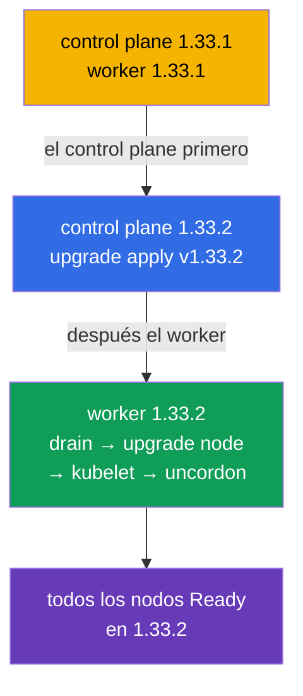

[Русская версия](README_RU.MD) · [Eng version](README.MD) · [Version française](README_FR.MD) · [Deutsche Version](README_DE.MD) · [ქართული ვერსია](README_GE.MD) · [繁體中文版](README_TW.MD) · [日本語版](README_JP.MD)

# Lab 111 — kubeadm: actualización del clúster (lifecycle)

## Descripción

Práctica de actualización de un clúster de Kubernetes: la clásica tarea de CKA con alta
puntuación. El clúster tiene **dos nodos** (master + worker) y arranca en la versión
`1.33.1`. Tu tarea es actualizarlo de forma segura a `1.33.2`: primero el control plane y
después el worker, nodo por nodo, liberándolos con `cordon`/`drain`. El trabajo se realiza
por SSH en los nodos.

Todas las tareas están redactadas en estilo de examen (como preguntas reales de CKA/CKAD)
con comprobación automática mediante el comando `check_result`. La comprobación verifica que
todos los nodos están actualizados a la versión objetivo y en estado Ready.

## Objetivo

Consolidar el material de los capítulos del curso:

- [Capítulo 35. Instalación de un clúster con kubeadm](../../course/35/es.md) — de qué se compone un clúster, los roles de control plane y worker
- [Capítulo 36. Actualización del clúster (lifecycle)](../../course/36/es.md) — el orden de la actualización, `upgrade apply`/`upgrade node`, `cordon`/`drain`

## Qué hacemos y para qué

En este laboratorio recorremos el ciclo completo de actualización de un clúster kubeadm:
del control plane al worker, nodo por nodo, sin afectar a la carga. Cada acción resuelve su
propia tarea:

| Acción | Para qué |
|--------|----------|
| Actualizar **kubeadm** en el nodo | la herramienta de actualización debe coincidir con la versión objetivo (capítulo 36) |
| `kubeadm upgrade apply` (control plane) | actualiza los componentes del control plane (capítulo 36) |
| `cordon` + `drain` antes de actualizar kubelet | liberamos el nodo para no afectar a la carga (capítulo 36) |
| `kubeadm upgrade node` (worker) | actualiza la configuración del nodo worker (capítulo 36) |
| actualizar **kubelet/kubectl** + reinicio | lleva los componentes del nodo a la versión objetivo (capítulos 35, 36) |

Imagen final de lo que se desplegará:



## Infraestructura

El entorno se despliega en AWS (`eu-central-1`) con Terragrunt y consta de:

| Componente | Descripción                                                          |
|------------|----------------------------------------------------------------------|
| `vpc`      | VPC `10.10.0.0/16` con subredes públicas                              |
| `ssh-keys` | Claves SSH para el acceso a los nodos                                 |
| `k8s-1`    | Kubernetes **`1.33.1`** (kubeadm), CNI Calico, metrics-server, master + 1 worker |
| `worker`   | Máquina de trabajo con `kubectl` y `check_result`; acceso SSH a los nodos del clúster |

Instancias: `t4g.medium` Ubuntu `22.04`. El clúster tiene dos nodos: el master
(control-plane) y un worker.

## Despliegue

```bash
TASK=111 make run_cka_task
```

Tras la creación, conéctate por SSH a la máquina de trabajo (worker). La actualización en sí
se ejecuta por SSH ya en los nodos del clúster: primero en el control plane y después en el
worker. Toma los nombres de los nodos de `kubectl get nodes` (esos mismos nombres se
resuelven para `ssh <nombre-del-nodo>` y se usan en `drain`/`uncordon`). `kubectl` en la
máquina de trabajo está configurado con el contexto `cluster1-admin@cluster1`.

Comandos útiles en la máquina de trabajo:

```bash
time_left       # cuánto tiempo queda
check_result    # comprobar la solución
```

## Tareas

---
|        **1**        | **Actualizar el control plane a 1.33.2**                     |
| :-----------------: | :----------------------------------------------------------- |
| Qué hacemos         | Por SSH en el nodo del control plane, actualiza kubeadm a la versión `1.33.2` (`apt-mark unhold kubeadm` → `apt-get install kubeadm=1.33.2-1.1` → `apt-mark hold kubeadm`). Ejecuta `kubeadm upgrade plan` y después `kubeadm upgrade apply v1.33.2 -y`. A continuación libera el nodo (`kubectl drain <control-plane> --ignore-daemonsets`), actualiza `kubelet` y `kubectl` a `1.33.2`, reinicia kubelet (`systemctl daemon-reload && systemctl restart kubelet`) y devuelve el nodo al servicio (`kubectl uncordon <control-plane>`). |
| Criterios de aceptación | - el nodo del control plane está en la versión `v1.33.2`;<br/>- el nodo del control plane está en estado `Ready`. |
---
|        **2**        | **Actualizar el nodo worker a 1.33.2**                      |
| :-----------------: | :----------------------------------------------------------- |
| Qué hacemos         | Desde el control plane libera el worker (`kubectl drain <worker> --ignore-daemonsets`). En el nodo worker, por SSH, actualiza kubeadm a `1.33.2` y ejecuta `kubeadm upgrade node` (para un worker se usa precisamente `upgrade node`, no `upgrade apply`). Después actualiza `kubelet` y `kubectl` a `1.33.2`, reinicia kubelet y, desde el control plane, devuelve el worker al servicio (`kubectl uncordon <worker>`). |
| Criterios de aceptación | - todos los nodos del clúster (≥ 2) están en la versión `v1.33.2`;<br/>- todos los nodos están en estado `Ready`. |
---

## Comprobación del resultado

En la máquina de trabajo ejecuta la comprobación automática:

```bash
check_result
```

El script pasa los tests y muestra cuántas tareas están completadas.

## Solución

Solución de referencia: [worker/files/solutions/1_ES.MD](worker/files/solutions/1_ES.MD)

## Cobertura de exámenes simulados

El laboratorio cubre las tareas de los simulacros sobre actualización del clúster: CKA mock 01
(№22 — update cluster), CKA mock 02 (№11 — update cluster, №18 — versión del nodo igual a la
del control plane).

## Eliminación del clúster y los recursos

```bash
TASK=111 make delete_cka_task
```
