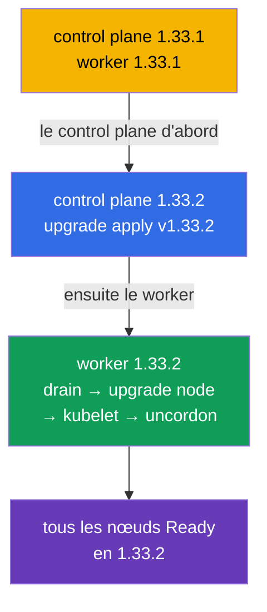

[Русская версия](README_RU.MD) · [Eng version](README.MD) · [Versión en español](README_ES.MD) · [Deutsche Version](README_DE.MD) · [ქართული ვერსია](README_GE.MD) · [繁體中文版](README_TW.MD) · [日本語版](README_JP.MD)

# Lab 111 — kubeadm : mise à niveau du cluster (lifecycle)

## Description

Travail pratique sur la mise à niveau d'un cluster Kubernetes — la tâche classique de CKA à
forte pondération. Le cluster comporte **deux nœuds** (master + worker) et démarre en
version `1.33.1`. Votre mission : le mettre à niveau en toute sécurité vers `1.33.2`,
d'abord le control plane, puis le worker, nœud par nœud, en les libérant avec
`cordon`/`drain`. Le travail se fait en SSH sur les nœuds.

Toutes les tâches sont rédigées dans le style de l'examen (comme de vraies questions
CKA/CKAD) avec une vérification automatique via la commande `check_result`. La vérification
s'assure que tous les nœuds sont mis à niveau vers la version cible et sont à l'état Ready.

## Objectif

Consolider le contenu des chapitres du cours :

- [Chapitre 35. Installation d'un cluster kubeadm](../../course/35/fr.md) — de quoi se compose un cluster, les rôles control plane et worker
- [Chapitre 36. Mise à niveau du cluster (lifecycle)](../../course/36/fr.md) — l'ordre de la mise à niveau, `upgrade apply`/`upgrade node`, `cordon`/`drain`

## Ce que nous faisons et pourquoi

Dans ce lab, nous parcourons le cycle complet de mise à niveau d'un cluster kubeadm — du
control plane vers le worker, nœud par nœud, sans toucher à la charge. Chaque action a son
rôle :

| Action | Pourquoi |
|--------|----------|
| Mise à niveau de **kubeadm** sur le nœud | l'outil de mise à niveau doit correspondre à la version cible (chapitre 36) |
| `kubeadm upgrade apply` (control plane) | met à niveau les composants du control plane (chapitre 36) |
| `cordon` + `drain` avant la mise à niveau de kubelet | on libère le nœud pour ne pas toucher à la charge (chapitre 36) |
| `kubeadm upgrade node` (worker) | met à niveau la configuration du nœud worker (chapitre 36) |
| mise à niveau de **kubelet/kubectl** + redémarrage | amène les composants du nœud à la version cible (chapitres 35, 36) |

Image finale de ce qui sera déployé :



## Infrastructure

L'environnement est déployé dans AWS (`eu-central-1`) via Terragrunt et se compose de :

| Composant  | Description                                                          |
|------------|----------------------------------------------------------------------|
| `vpc`      | VPC `10.10.0.0/16` avec des sous-réseaux publics                      |
| `ssh-keys` | Clés SSH pour l'accès aux nœuds                                       |
| `k8s-1`    | Kubernetes **`1.33.1`** (kubeadm), CNI Calico, metrics-server, master + 1 worker |
| `worker`   | Machine de travail avec `kubectl` et `check_result` ; accès SSH aux nœuds du cluster |

Instances : `t3.medium` Ubuntu `22.04`. Le cluster comporte deux nœuds — le master
(control-plane) et un worker.

## Déploiement

```bash
TASK=111 make run_cka_task
```

Une fois créé, connectez-vous en SSH à la machine de travail (worker). La mise à niveau
elle-même s'effectue en SSH directement sur les nœuds du cluster — d'abord sur le control
plane, puis sur le worker. Prenez les noms des nœuds dans `kubectl get nodes` (ces mêmes
noms se résolvent pour `ssh <nom-du-nœud>` et sont utilisés dans `drain`/`uncordon`).
`kubectl` sur la machine de travail est configuré sur le contexte `cluster1-admin@cluster1`.

Commandes utiles sur la machine de travail :

```bash
time_left       # temps restant
check_result    # vérifier la solution
```

## Tâches

---
|        **1**        | **Mettre à niveau le control plane vers 1.33.2**             |
| :-----------------: | :----------------------------------------------------------- |
| Ce qu'on fait       | En SSH sur le nœud du control plane, mettez kubeadm à niveau vers la version `1.33.2` (`apt-mark unhold kubeadm` → `apt-get install kubeadm=1.33.2-1.1` → `apt-mark hold kubeadm`). Exécutez `kubeadm upgrade plan`, puis `kubeadm upgrade apply v1.33.2 -y`. Ensuite libérez le nœud (`kubectl drain <control-plane> --ignore-daemonsets`), mettez à niveau `kubelet` et `kubectl` vers `1.33.2`, redémarrez kubelet (`systemctl daemon-reload && systemctl restart kubelet`) et remettez le nœud en service (`kubectl uncordon <control-plane>`). |
| Critères d'acceptation | - le nœud du control plane est en version `v1.33.2` ;<br/>- le nœud du control plane est à l'état `Ready`. |
---
|        **2**        | **Mettre à niveau le nœud worker vers 1.33.2**              |
| :-----------------: | :----------------------------------------------------------- |
| Ce qu'on fait       | Depuis le control plane, libérez le worker (`kubectl drain <worker> --ignore-daemonsets`). Sur le nœud worker, en SSH, mettez kubeadm à niveau vers `1.33.2` et exécutez `kubeadm upgrade node` (pour un worker on utilise justement `upgrade node`, et non `upgrade apply`). Puis mettez à niveau `kubelet` et `kubectl` vers `1.33.2`, redémarrez kubelet et, depuis le control plane, remettez le worker en service (`kubectl uncordon <worker>`). |
| Critères d'acceptation | - tous les nœuds du cluster (≥ 2) sont en version `v1.33.2` ;<br/>- tous les nœuds sont à l'état `Ready`. |
---

## Vérification du résultat

Sur la machine de travail, lancez la vérification automatique :

```bash
check_result
```

Le script exécute les tests et affiche combien de tâches sont accomplies.

## Solution

Solution de référence : [worker/files/solutions/1_FR.MD](worker/files/solutions/1_FR.MD)

## Couverture des examens blancs

Le lab couvre les tâches des examens blancs sur la mise à niveau du cluster : CKA mock 01
(№22 — update cluster), CKA mock 02 (№11 — update cluster, №18 — version du nœud identique à
celle du control plane).

## Suppression du cluster et des ressources

```bash
TASK=111 make delete_cka_task
```
