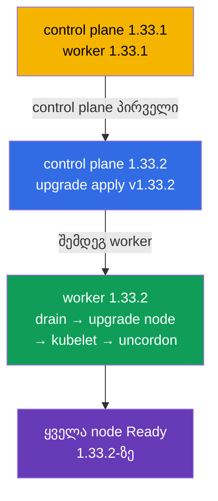

[Русская версия](README_RU.MD) · [Eng version](README.MD) · [Versión en español](README_ES.MD) · [Version française](README_FR.MD) · [Deutsche Version](README_DE.MD)

# Lab 111 — kubeadm: კლასტერის განახლება (lifecycle)

## აღწერა

პრაქტიკული სამუშაო Kubernetes-კლასტერის განახლებაზე — CKA-ს კლასიკური მაღალქულიანი
დავალება. კლასტერი **ორკვანძიანია** (master + worker) და იწყება ვერსიაზე `1.33.1`.
თქვენი ამოცანაა უსაფრთხოდ განაახლოთ იგი `1.33.2`-მდე: პირველად control plane, შემდეგ
worker, თითო node-ად, `cordon`/`drain`-ით გათავისუფლებით. სამუშაო მიმდინარეობს SSH-ით
node-ებზე.

ყველა დავალება გამოცდის სტილშია გაფორმებული (როგორც რეალური CKA/CKAD კითხვები) და მათი
შემოწმება ავტომატურად ხდება ბრძანებით `check_result`. ავტოშემოწმება რწმუნდება, რომ ყველა
node განახლებულია მიზნობრივ ვერსიამდე და იმყოფება სტატუსში Ready.

## მიზანი

განამტკიცოთ კურსის თავების მასალა:

- [თავი 35. kubeadm კლასტერის ინსტალაცია](../../course/35/ru.md) — რისგან იკრიბება კლასტერი, control plane-ისა და worker-ის როლები
- [თავი 36. კლასტერის განახლება (lifecycle)](../../course/36/ru.md) — განახლების რიგითობა, `upgrade apply`/`upgrade node`, `cordon`/`drain`

## რას ვაკეთებთ და რისთვის

ამ ლაბორატორიაში გავდივართ kubeadm-კლასტერის განახლების სრულ ციკლს — control plane-იდან
worker-ისკენ, თითო node-ად, დატვირთვის შეშლის გარეშე. თითოეული მოქმედება თავის ამოცანას
ასრულებს:

| მოქმედება | რისთვის |
|-----------|---------|
| **kubeadm**-ის განახლება node-ზე | განახლების ინსტრუმენტი უნდა შეესაბამებოდეს მიზნობრივ ვერსიას (თავი 36) |
| `kubeadm upgrade apply` (control plane) | ანახლებს control plane-ის კომპონენტებს (თავი 36) |
| `cordon` + `drain` kubelet-ის განახლებამდე | ვათავისუფლებთ node-ს, რომ დატვირთვას ხელი არ შევუშალოთ (თავი 36) |
| `kubeadm upgrade node` (worker) | ანახლებს worker-node-ის კონფიგურაციას (თავი 36) |
| **kubelet/kubectl**-ის განახლება + restart | node-ის კომპონენტებს მიზნობრივ ვერსიამდე მიჰყავს (თავები 35, 36) |

საბოლოო სურათი იმისა, რაც განთავსდება:



## ინფრასტრუქტურა

გარემო იშლება AWS-ში (`eu-central-1`) Terragrunt-ის მეშვეობით და შედგება:

| კომპონენტი | აღწერა                                                            |
|------------|-------------------------------------------------------------------|
| `vpc`      | VPC `10.10.0.0/16` საჯარო ქვექსელებით                              |
| `ssh-keys` | SSH-გასაღებები node-ებზე წვდომისთვის                                |
| `k8s-1`    | Kubernetes **`1.33.1`** (kubeadm), CNI Calico, metrics-server, master + 1 worker |
| `worker`   | სამუშაო მანქანა `kubectl`-ითა და `check_result`-ით; SSH-წვდომა კლასტერის node-ებზე |

ინსტანსები: `t3.medium` Ubuntu `22.04`. კლასტერი ორკვანძიანია — master (control-plane) და
ერთი worker.

## განთავსება

```bash
TASK=111 make run_cka_task
```

შექმნის შემდეგ დაუკავშირდით სამუშაო მანქანას (worker) SSH-ით. თავად განახლება სრულდება
SSH-ით უკვე კლასტერის node-ებზე — პირველად control plane-ზე, შემდეგ worker-ზე. node-ების
სახელები აიღეთ `kubectl get nodes`-იდან (იგივე სახელები რეზოლვდება `ssh <node-ის-სახელი>`
-ისთვის და გამოიყენება `drain`/`uncordon`-ში). `kubectl` სამუშაო მანქანაზე კონფიგურირებულია
კონტექსტზე `cluster1-admin@cluster1`.

სასარგებლო ბრძანებები სამუშაო მანქანაზე:

```bash
time_left       # რამდენი დრო დარჩა
check_result    # ამოხსნის შემოწმება
```

## დავალებები

---
|        **1**        | **control plane-ის განახლება 1.33.2-მდე**                    |
| :-----------------: | :----------------------------------------------------------- |
| რას ვაკეთებთ        | SSH-ით control plane node-ზე განაახლეთ kubeadm ვერსიამდე `1.33.2` (`apt-mark unhold kubeadm` → `apt-get install kubeadm=1.33.2-1.1` → `apt-mark hold kubeadm`). შეასრულეთ `kubeadm upgrade plan`, შემდეგ `kubeadm upgrade apply v1.33.2 -y`. ამის შემდეგ გაათავისუფლეთ node (`kubectl drain <control-plane> --ignore-daemonsets`), განაახლეთ `kubelet` და `kubectl` `1.33.2`-მდე, გადატვირთეთ kubelet (`systemctl daemon-reload && systemctl restart kubelet`) და დააბრუნეთ node მუშაობაში (`kubectl uncordon <control-plane>`). |
| მიღების კრიტერიუმები | - control plane node ვერსიაზე `v1.33.2`;<br/>- control plane node სტატუსში `Ready`. |
---
|        **2**        | **worker-node-ის განახლება 1.33.2-მდე**                     |
| :-----------------: | :----------------------------------------------------------- |
| რას ვაკეთებთ        | control plane-იდან გაათავისუფლეთ worker (`kubectl drain <worker> --ignore-daemonsets`). worker-node-ზე SSH-ით განაახლეთ kubeadm `1.33.2`-მდე და შეასრულეთ `kubeadm upgrade node` (worker-ისთვის გამოიყენება სწორედ `upgrade node`, და არა `upgrade apply`). შემდეგ განაახლეთ `kubelet` და `kubectl` `1.33.2`-მდე, გადატვირთეთ kubelet და control plane-იდან დააბრუნეთ worker მუშაობაში (`kubectl uncordon <worker>`). |
| მიღების კრიტერიუმები | - კლასტერის ყველა node (≥ 2) ვერსიაზე `v1.33.2`;<br/>- ყველა node სტატუსში `Ready`. |
---

## შედეგის შემოწმება

სამუშაო მანქანაზე გაუშვით ავტომატური შემოწმება:

```bash
check_result
```

სკრიპტი გაატარებს ტესტებს და აჩვენებს, რამდენი დავალებაა შესრულებული.

## ამოხსნა

ეტალონური ამოხსნა: [worker/files/solutions/1_GE.MD](worker/files/solutions/1_GE.MD)

## Mock-გამოცდების დაფარვა

ლაბორატორია ფარავს mock-ების დავალებებს კლასტერის განახლებაზე: CKA mock 01 (№22 — update
cluster), CKA mock 02 (№11 — update cluster, №18 — node-ის ვერსია control plane-ის მსგავსი).

## კლასტერისა და რესურსების წაშლა

```bash
TASK=111 make delete_cka_task
```
