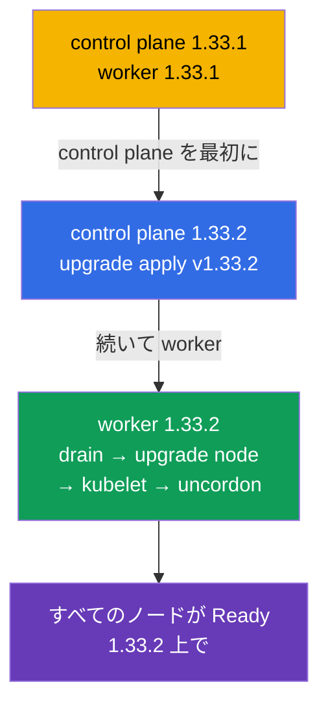

[Русская версия](README_RU.MD) · [Eng version](README.MD) · [Versión en español](README_ES.MD) · [Version française](README_FR.MD) · [Deutsche Version](README_DE.MD) · [ქართული ვერსია](README_GE.MD) · [繁體中文版](README_TW.MD)

# Lab 111 - kubeadm：クラスタの更新（lifecycle）

## 概要

Kubernetes クラスタの更新に関する実習 - CKA の古典的な高配点課題です。
クラスタは**2 ノード構成**（master + worker）で、バージョン `1.33.1` から始まります。
あなたの課題は、それを安全に `1.33.2` へ更新することです：まず control plane、次に worker、
1 ノードずつ、`cordon`/`drain` で退避させながら進めます。作業はノード上で SSH 経由で行います。

すべての課題は試験形式（実際の CKA/CKAD の問題と同じスタイル）で書かれており、
`check_result` コマンドで自動的に検証されます。自動チェックでは、すべてのノードが
目標バージョンに更新され、Ready の状態にあることを確認します。

## 目的

次のコース章の内容を定着させます：

- [第 35 章。kubeadm クラスタのインストール](../../course/35/README.md) - クラスタは何から組み立てられるか、control plane と worker の役割
- [第 36 章。クラスタの更新（lifecycle）](../../course/36/README.md) - アップグレードの順序、`upgrade apply`/`upgrade node`、`cordon`/`drain`

## 何をし、なぜするのか

この実習では、kubeadm クラスタの完全な更新サイクルをたどります - control plane から
worker へ、1 ノードずつ、ワークロードに影響を与えずに。各操作にはそれぞれの目的があります：

| 操作 | なぜ |
|----------|-------|
| ノード上での **kubeadm** の更新 | アップグレードのツールは目標バージョンと一致していなければならない（第 36 章） |
| `kubeadm upgrade apply`（control plane） | control plane のコンポーネントを更新する（第 36 章） |
| kubelet の更新前の `cordon` + `drain` | ワークロードに影響を与えないようノードを退避させる（第 36 章） |
| `kubeadm upgrade node`（worker） | worker ノードの設定を更新する（第 36 章） |
| **kubelet/kubectl** の更新 + restart | ノードのコンポーネントを目標バージョンに揃える（第 35、36 章） |

最終的にデプロイされる全体像：



## インフラ

環境は Terragrunt により AWS（`eu-central-1`）に展開され、次の要素で構成されます：

| コンポーネント | 説明                                                             |
|------------|----------------------------------------------------------------------|
| `vpc`      | パブリックサブネットを持つ VPC `10.10.0.0/16`                           |
| `ssh-keys` | ノードへアクセスするための SSH キー                                      |
| `k8s-1`    | Kubernetes **`1.33.1`**（kubeadm）、CNI Calico、metrics-server、master + 1 worker |
| `worker`   | `kubectl` と `check_result` を備えた作業マシン；クラスタのノードへ SSH アクセス可 |

インスタンス：`t4g.medium` Ubuntu `22.04`。クラスタは 2 ノード構成 - master（control-plane）と
1 台の worker です。

## デプロイ

```bash
TASK=111 make run_cka_task
```

作成が完了したら、SSH で作業マシン（worker）に接続してください。更新そのものは
すでにクラスタのノード上で SSH 経由で実行します - まず control plane、続いて worker です。
ノードの名前は `kubectl get nodes` から取得してください（それらは `ssh <ノード名>` でも
解決され、`drain`/`uncordon` でも使います）。作業マシンの `kubectl` はコンテキスト
`cluster1-admin@cluster1` に設定されています。

作業マシンで使える便利なコマンド：

```bash
time_left       # 残り時間
check_result    # 解答をチェックする
```

## 課題

---
|        **1**        | **control plane を 1.33.2 に更新する**                       |
| :-----------------: | :----------------------------------------------------------- |
| やること            | control plane ノードで SSH 経由で kubeadm をバージョン `1.33.2` に更新してください（`apt-mark unhold kubeadm` → `apt-get install kubeadm=1.33.2-1.1` → `apt-mark hold kubeadm`）。`kubeadm upgrade plan` を実行し、続いて `kubeadm upgrade apply v1.33.2 -y` を実行します。その後ノードを退避させ（`kubectl drain <control-plane> --ignore-daemonsets`）、`kubelet` と `kubectl` を `1.33.2` に更新し、kubelet を再起動して（`systemctl daemon-reload && systemctl restart kubelet`）、ノードを稼働に戻してください（`kubectl uncordon <control-plane>`）。 |
| 受け入れ基準        | - control plane ノードがバージョン `v1.33.2` である；<br/>- control plane ノードが `Ready` の状態である。 |
---
|        **2**        | **worker ノードを 1.33.2 に更新する**                        |
| :-----------------: | :----------------------------------------------------------- |
| やること            | control plane から worker を退避させます（`kubectl drain <worker> --ignore-daemonsets`）。worker ノードで SSH 経由で kubeadm を `1.33.2` に更新し、`kubeadm upgrade node` を実行してください（worker では `upgrade apply` ではなく、まさに `upgrade node` を使います）。続いて `kubelet` と `kubectl` を `1.33.2` に更新し、kubelet を再起動して、control plane から worker を稼働に戻してください（`kubectl uncordon <worker>`）。 |
| 受け入れ基準        | - クラスタのすべてのノード（≥ 2）がバージョン `v1.33.2` である；<br/>- すべてのノードが `Ready` の状態である。 |
---

## 結果のチェック

作業マシンで自動チェックを実行します：

```bash
check_result
```

スクリプトがテストを実行し、いくつの課題が完了したかを表示します。

## 解答

参考解答：[worker/files/solutions/1_JP.MD](worker/files/solutions/1_JP.MD)

## 模擬試験のカバー範囲

この実習は模擬試験のクラスタ更新の課題をカバーします：CKA mock 01（第 22 問 - update cluster）、
CKA mock 02（第 11 問 - update cluster、第 18 問 - control plane と同じノードのバージョン）。

## クラスタとリソースの削除

```bash
TASK=111 make delete_cka_task
```
