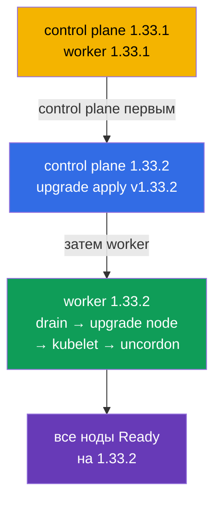

# Lab 111 — kubeadm: обновление кластера (lifecycle)

## Описание

Практическая работа по обновлению Kubernetes-кластера — классическое высокобалльное
задание CKA. Кластер **двухнодовый** (master + worker) и стартует на версии `1.33.1`.
Ваша задача — безопасно обновить его до `1.33.2`: сначала control plane, затем worker,
по одной ноде, с освобождением через `cordon`/`drain`. Работа ведётся по SSH на нодах.

Все задания оформлены в экзаменационном стиле (как реальные вопросы CKA/CKAD) с
автоматической проверкой командой `check_result`. Автопроверка убеждается, что все ноды
обновлены до целевой версии и находятся в статусе Ready.

## Цель

Закрепить материал глав курса:

- [Глава 35. Установка кластера kubeadm](../../course/35/ru.md) — из чего собирается кластер, роли control plane и worker
- [Глава 36. Обновление кластера (lifecycle)](../../course/36/ru.md) — порядок апгрейда, `upgrade apply`/`upgrade node`, `cordon`/`drain`

## Что мы делаем и зачем

В этой лабе мы проходим полный цикл обновления кластера kubeadm — от control plane к
worker, по одной ноде, не задевая нагрузку. Каждое действие решает свою задачу:

| Действие | Зачем |
|----------|-------|
| Обновление **kubeadm** на ноде | инструмент апгрейда должен соответствовать целевой версии (глава 36) |
| `kubeadm upgrade apply` (control plane) | обновляет компоненты control plane (глава 36) |
| `cordon` + `drain` перед обновлением kubelet | освобождаем ноду, чтобы не задеть нагрузку (глава 36) |
| `kubeadm upgrade node` (worker) | обновляет конфигурацию worker-ноды (глава 36) |
| обновление **kubelet/kubectl** + restart | приводит компоненты ноды к целевой версии (главы 35, 36) |

Итоговая картина того, что будет развёрнуто:



## Инфраструктура

Окружение разворачивается в AWS (`eu-central-1`) через Terragrunt и состоит из:

| Компонент  | Описание                                                             |
|------------|----------------------------------------------------------------------|
| `vpc`      | VPC `10.10.0.0/16` с публичными подсетями                             |
| `ssh-keys` | SSH-ключи для доступа к нодам                                         |
| `k8s-1`    | Kubernetes **`1.33.1`** (kubeadm), CNI Calico, metrics-server, master + 1 worker |
| `worker`   | Рабочая машина с `kubectl` и `check_result`; SSH-доступ к нодам кластера |

Инстансы: `t3.medium` Ubuntu `22.04`. Кластер двухнодовый — master (control-plane) и
один worker.

## Развёртывание

```bash
TASK=111 make run_cka_task
```

После создания подключитесь к рабочей машине (worker) по SSH. Само обновление
выполняется по SSH уже на нодах кластера — сначала на control plane
(`ssh k8s1_controlPlane_1`), затем на worker (`ssh k8s1_node_1`). `kubectl` на рабочей
машине настроен на контекст `cluster1-admin@cluster1`.

Полезные команды на рабочей машине:

```bash
time_left       # сколько осталось времени
check_result    # проверить решение
```

## Задания

---
|        **1**        | **Обновить control plane до 1.33.2**                         |
| :-----------------: | :----------------------------------------------------------- |
| Что делаем          | По SSH на control plane ноде обновите kubeadm до версии `1.33.2` (`apt-mark unhold kubeadm` → `apt-get install kubeadm=1.33.2-1.1` → `apt-mark hold kubeadm`). Выполните `kubeadm upgrade plan`, затем `kubeadm upgrade apply v1.33.2 -y`. После этого освободите ноду (`kubectl drain <control-plane> --ignore-daemonsets`), обновите `kubelet` и `kubectl` до `1.33.2`, перезапустите kubelet (`systemctl daemon-reload && systemctl restart kubelet`) и верните ноду в работу (`kubectl uncordon <control-plane>`). |
| Критерии приёмки    | - control plane нода на версии `v1.33.2`;<br/>- control plane нода в статусе `Ready`. |
---
|        **2**        | **Обновить worker-ноду до 1.33.2**                          |
| :-----------------: | :----------------------------------------------------------- |
| Что делаем          | С control plane освободите worker (`kubectl drain <worker> --ignore-daemonsets`). На worker-ноде по SSH обновите kubeadm до `1.33.2` и выполните `kubeadm upgrade node` (для worker используется именно `upgrade node`, а не `upgrade apply`). Затем обновите `kubelet` и `kubectl` до `1.33.2`, перезапустите kubelet и с control plane верните worker в работу (`kubectl uncordon <worker>`). |
| Критерии приёмки    | - все ноды кластера (≥ 2) на версии `v1.33.2`;<br/>- все ноды в статусе `Ready`. |
---

## Проверка результата

На рабочей машине запустите автоматическую проверку:

```bash
check_result
```

Скрипт прогонит тесты и покажет, сколько заданий выполнено.

## Решение

Эталонное решение: [worker/files/solutions/1.MD](worker/files/solutions/1.MD)

## Покрытие мок-экзаменов

Лаба закрывает задания моков по обновлению кластера: CKA mock 01 (№22 — update cluster),
CKA mock 02 (№11 — update cluster, №18 — версия ноды как у control plane).

## Удаление кластера и ресурсов

```bash
TASK=111 make delete_cka_task
```
