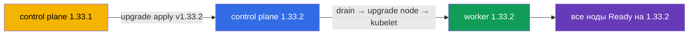

# Lab 111 — kubeadm: обновление кластера (lifecycle)

## Описание

Практическая работа по обновлению Kubernetes-кластера — классическое высокобалльное
задание CKA. Кластер **двухнодовый** (master + worker) и стартует на версии `1.33.1`.
Ваша задача — безопасно обновить его до `1.33.2`: сначала control plane, затем worker,
по одной ноде, с освобождением через `cordon`/`drain`. Работа ведётся по SSH на нодах.

Автопроверка `check_result` убеждается, что все ноды обновлены до целевой версии и
находятся в статусе Ready.

## Цель

Закрепить главы курса:

- [Глава 35. Установка кластера kubeadm](../../course/35/ru.md)
- [Глава 36. Обновление кластера (lifecycle)](../../course/36/ru.md)

## Что мы делаем и зачем

| Действие | Зачем |
|----------|-------|
| Обновление **kubeadm** на ноде | инструмент апгрейда должен соответствовать целевой версии |
| `kubeadm upgrade apply` (control plane) | обновляет компоненты control plane |
| `cordon` + `drain` перед обновлением kubelet | освобождаем ноду, чтобы не задеть нагрузку |
| `kubeadm upgrade node` (worker) | обновляет конфигурацию worker-ноды |
| обновление **kubelet/kubectl** + restart | приводит компоненты ноды к целевой версии |



## Инфраструктура

| Компонент  | Описание                                                             |
|------------|----------------------------------------------------------------------|
| `k8s-1`    | Kubernetes **`1.33.1`** (kubeadm), Calico, metrics-server, **master + 1 worker** |
| `worker`   | Рабочая машина с `kubectl` и `check_result`; SSH-доступ к нодам кластера |

## Развёртывание

```bash
TASK=111 make run_cka_task
```

## Задания

---
|        **1**        | **Обновить control plane до 1.33.2**                         |
| :-----------------: | :----------------------------------------------------------- |
| Что делаем          | Обновляем kubeadm, применяем `upgrade apply`, обновляем kubelet |
| Критерии приёмки    | - Control plane нода на версии `v1.33.2`, статус `Ready` |
---
|        **2**        | **Обновить worker-ноду до 1.33.2**                          |
| :-----------------: | :----------------------------------------------------------- |
| Что делаем          | drain → `kubeadm upgrade node` → kubelet → uncordon           |
| Критерии приёмки    | - Все ноды кластера на версии `v1.33.2`, статус `Ready` |
---

## Проверка результата

```bash
check_result
```

## Решение

[worker/files/solutions/1.MD](worker/files/solutions/1.MD)

## Покрытие мок-экзаменов

CKA mock 01 (№22 — update cluster), CKA mock 02 (№11 — update cluster, №18 — версия ноды
как у control plane).

## Удаление

```bash
TASK=111 make delete_cka_task
```
