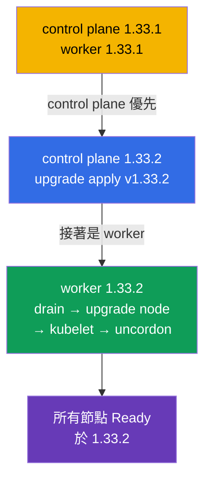

[Русская версия](README_RU.MD) · [Eng version](README.MD) · [Versión en español](README_ES.MD) · [Version française](README_FR.MD) · [Deutsche Version](README_DE.MD) · [ქართული ვერსია](README_GE.MD) · [日本語版](README_JP.MD)

# Lab 111 - kubeadm:叢集升級(lifecycle)

## 說明

Kubernetes 叢集升級的實作練習 - 這是 CKA 的經典高分題目。叢集為**雙節點**
(master + worker),起始版本是 `1.33.1`。你的任務是安全地把它升級到 `1.33.2`:
先升級 control plane,再升級 worker,一次一個節點,並透過 `cordon`/`drain` 騰空節點。
整個操作都是透過 SSH 在節點上完成的。

所有任務都以考試風格撰寫(就像真正的 CKA/CKAD 題目),並透過
`check_result` 指令自動驗證。自動檢查會確認所有節點都已升級到目標版本,
並且處於 Ready 狀態。

## 目標

鞏固以下課程章節的內容:

- [第 35 章。kubeadm 叢集安裝](../../course/35/README.md) - 叢集由哪些部分組成,control plane 與 worker 的角色
- [第 36 章。叢集升級(lifecycle)](../../course/36/README.md) - 升級順序、`upgrade apply`/`upgrade node`、`cordon`/`drain`

## 我們要做什麼,以及為什麼

在這個實驗中,我們走完 kubeadm 叢集的完整升級流程 - 從 control plane 到
worker,一次一個節點,而不影響工作負載。每個動作都有自己的目的:

| 動作 | 為什麼 |
|----------|-------|
| 在節點上升級 **kubeadm** | 升級工具必須與目標版本相符(第 36 章) |
| `kubeadm upgrade apply`(control plane) | 升級 control plane 的各個元件(第 36 章) |
| 升級 kubelet 之前先 `cordon` + `drain` | 騰空節點,避免影響工作負載(第 36 章) |
| `kubeadm upgrade node`(worker) | 更新 worker 節點的配置(第 36 章) |
| 升級 **kubelet/kubectl** + restart | 讓節點的元件達到目標版本(第 35、36 章) |

最終部署出來的整體樣貌:



## 基礎架構

環境透過 Terragrunt 部署在 AWS(`eu-central-1`),由以下部分組成:

| 元件       | 說明                                                                 |
|------------|----------------------------------------------------------------------|
| `vpc`      | VPC `10.10.0.0/16`,含公有子網路                                       |
| `ssh-keys` | 用於存取節點的 SSH 金鑰                                                |
| `k8s-1`    | Kubernetes **`1.33.1`**(kubeadm),CNI Calico,metrics-server,master + 1 worker |
| `worker`   | 具備 `kubectl` 與 `check_result` 的工作機;可 SSH 連線到叢集節點          |

執行個體:`t3.medium`,Ubuntu `22.04`。叢集為雙節點 - master(control-plane)與
一個 worker。

## 部署

```bash
TASK=111 make run_cka_task
```

建立完成後,請透過 SSH 連線到工作機(worker)。升級本身是透過 SSH
在叢集節點上完成的 - 先在 control plane,然後在 worker。
節點名稱請從 `kubectl get nodes` 取得(這些名稱同樣可以解析,`ssh <節點名稱>` 可用,
在 `drain`/`uncordon` 中也是使用它們)。工作機上的 `kubectl` 已指向
`cluster1-admin@cluster1` context。

工作機上的實用指令:

```bash
time_left       # 還剩多少時間
check_result    # 檢查解答
```

## 任務

---
|        **1**        | **把 control plane 升級到 1.33.2**                            |
| :-----------------: | :----------------------------------------------------------- |
| 要做什麼            | 透過 SSH 在 control plane 節點上把 kubeadm 升級到 `1.33.2` 版(`apt-mark unhold kubeadm` → `apt-get install kubeadm=1.33.2-1.1` → `apt-mark hold kubeadm`)。執行 `kubeadm upgrade plan`,然後執行 `kubeadm upgrade apply v1.33.2 -y`。之後騰空該節點(`kubectl drain <control-plane> --ignore-daemonsets`),把 `kubelet` 與 `kubectl` 升級到 `1.33.2`,重新啟動 kubelet(`systemctl daemon-reload && systemctl restart kubelet`),並讓節點恢復服務(`kubectl uncordon <control-plane>`)。 |
| 驗收標準            | - control plane 節點的版本為 `v1.33.2`;<br/>- control plane 節點處於 `Ready` 狀態。 |
---
|        **2**        | **把 worker 節點升級到 1.33.2**                              |
| :-----------------: | :----------------------------------------------------------- |
| 要做什麼            | 從 control plane 騰空 worker(`kubectl drain <worker> --ignore-daemonsets`)。在 worker 節點上透過 SSH 把 kubeadm 升級到 `1.33.2`,並執行 `kubeadm upgrade node`(worker 用的正是 `upgrade node`,而不是 `upgrade apply`)。接著把 `kubelet` 與 `kubectl` 升級到 `1.33.2`,重新啟動 kubelet,再從 control plane 讓 worker 恢復服務(`kubectl uncordon <worker>`)。 |
| 驗收標準            | - 叢集的所有節點(≥ 2)版本都是 `v1.33.2`;<br/>- 所有節點都處於 `Ready` 狀態。 |
---

## 檢查結果

在工作機上執行自動檢查:

```bash
check_result
```

腳本會跑完測試,並顯示已完成多少任務。

## 解答

參考解答:[worker/files/solutions/1_TW.MD](worker/files/solutions/1_TW.MD)

## 模擬考涵蓋範圍

本實驗涵蓋模擬考中關於叢集升級的題目:CKA mock 01(第 22 題 - update cluster)、
CKA mock 02(第 11 題 - update cluster,第 18 題 - 節點版本與 control plane 一致)。

## 刪除叢集與資源

```bash
TASK=111 make delete_cka_task
```
