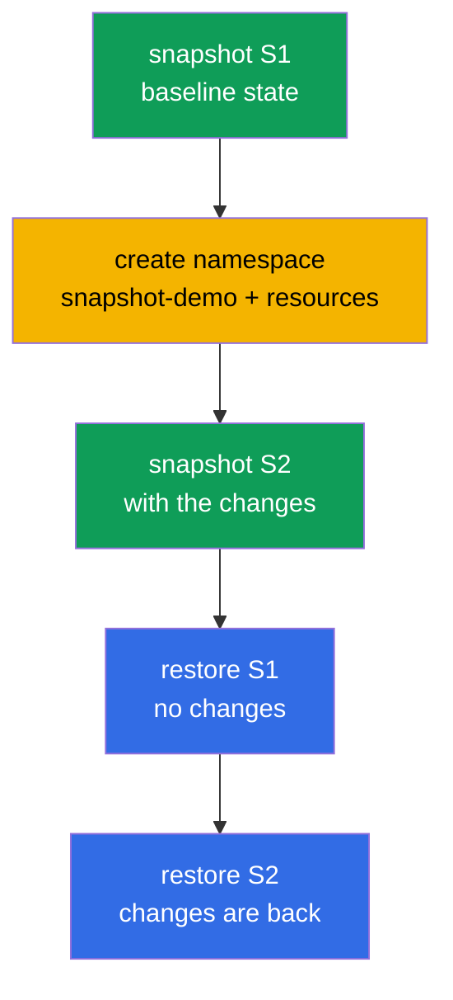

[Русская версия](README_RU.MD) · [Versión en español](README_ES.MD) · [Version française](README_FR.MD) · [Deutsche Version](README_DE.MD) · [ქართული ვერსია](README_GE.MD) · [繁體中文版](README_TW.MD) · [日本語版](README_JP.MD)

# Lab 112 — etcd: Snapshots and Restore

## Description

A hands-on lab on the most valuable operations skill — backing up and restoring etcd, the
store that holds the entire cluster state. You go through the full cycle: take a snapshot of
the baseline state, make changes, take a second snapshot, and then, on a live cluster,
confirm that restoring from the first snapshot rolls the changes back, while restoring from
the second one brings them back. All etcd work is done on the control plane node over SSH.

All tasks are written in exam style (like real CKA/CKAD questions) with automatic validation
via the `check_result` command. The automatic check verifies that both snapshots are
present, that the cluster is healthy after the restore and that the restored resources
exist.

## Goal

Reinforce the material from the course chapters:

- [Chapter 37. etcd Backup and Restore](../../course/37/README.md) — `snapshot save`/`status`/`restore`, stopping and starting the control plane static Pods, restoring etcd data, checking cluster health

## What We Do and Why

In this lab we go through the full etcd workflow — from taking a snapshot to restoring the
cluster into the state we need. Every action serves its own purpose:

| Action | Why |
|--------|-----|
| `etcdctl snapshot save` (S1) | take a backup of the baseline cluster state (chapter 37) |
| create a namespace and resources | make changes so that the cluster state differs (chapter 37) |
| `etcdctl snapshot save` (S2) | take a second copy — this time with the changes (chapter 37) |
| `etcdctl snapshot restore` from S1 | roll the cluster back to the state before the changes (chapter 37) |
| `etcdctl snapshot restore` from S2 | bring the cluster back to the state with the changes (chapter 37) |

The final picture of what will be deployed:



## Infrastructure

The environment is deployed in AWS (`eu-central-1`) via Terragrunt and consists of:

| Component  | Description                                                          |
|------------|----------------------------------------------------------------------|
| `vpc`      | VPC `10.10.0.0/16` with public subnets                                |
| `ssh-keys` | SSH keys for node access                                              |
| `k8s-1`    | Kubernetes `1.35.2` (kubeadm), Calico CNI, metrics-server, single-node; `etcdctl` installed |
| `worker`   | Work machine with `kubectl`, `check_result` and SSH access to the control plane |

Instances: `t4g.medium` (master), Ubuntu `22.04`. The cluster is single-node — the master is
untainted (the `control-plane` taint is removed), so Pods are scheduled directly on it.

## Deployment

```bash
TASK=112 make run_cka_task
```

Once it is created, connect to the work machine (worker) over SSH. The etcd work itself is
done over SSH on the control plane node (`ssh k8s1_controlPlane_1`, `sudo -i`); the etcd
certificates live in `/etc/kubernetes/pki/etcd/`. `kubectl` on the work machine is already
pointed at the `cluster1-admin@cluster1` context.

Handy commands on the work machine:

```bash
time_left       # how much time is left
check_result    # check your solution
```

## Tasks

---
|        **1**        | **Take snapshot S1 (baseline state)**                        |
| :-----------------: | :----------------------------------------------------------- |
| What to do          | On the control plane take an etcd snapshot with `etcdctl snapshot save /root/etcd-snapshot-1.db`, using endpoint `https://127.0.0.1:2379` and the certificates from `/etc/kubernetes/pki/etcd/` (`ca.crt`, `server.crt`, `server.key`). Verify it with `etcdctl snapshot status ... --write-out=table` and copy it to the work machine (for example with `scp`) into the file `/var/work/tests/artifacts/etcd/etcd-snapshot-1.db`. |
| Acceptance criteria | - snapshot S1 is copied to `/var/work/tests/artifacts/etcd/etcd-snapshot-1.db`;<br/>- the file is not empty (the snapshot is valid). |
---
|        **2**        | **Make changes in the cluster**                              |
| :-----------------: | :----------------------------------------------------------- |
| What to do          | Create the namespace `snapshot-demo` and, inside it, a ConfigMap `demo-config` (for example, `--from-literal=app=v1`) and a Deployment `demo-web` with image `viktoruj/ping_pong` and `2` replicas. These resources appear **after** snapshot S1 — they are what will later show the difference between the snapshots. |
| Acceptance criteria | - namespace `snapshot-demo` is created;<br/>- it contains ConfigMap `demo-config` and Deployment `demo-web`. |
---
|        **3**        | **Take snapshot S2 (after the changes)**                     |
| :-----------------: | :----------------------------------------------------------- |
| What to do          | On the control plane take a second snapshot into `/root/etcd-snapshot-2.db` (the same way as S1), verify it with `snapshot status` and copy it to the work machine into `/var/work/tests/artifacts/etcd/etcd-snapshot-2.db`. This snapshot already contains the namespace `snapshot-demo` and its resources. |
| Acceptance criteria | - snapshot S2 is copied to `/var/work/tests/artifacts/etcd/etcd-snapshot-2.db`;<br/>- the file is not empty (the snapshot is valid). |
---
|        **4**        | **Restore S1 and confirm the extra resources are gone**      |
| :-----------------: | :----------------------------------------------------------- |
| What to do          | Restore snapshot S1: stop the control plane static Pods (move the manifests out of `/etc/kubernetes/manifests/`), restore S1 into `/var/lib/etcd` with `etcdctl snapshot restore` (using `--name`/`--initial-cluster`/`--initial-advertise-peer-urls` from the etcd manifest) and put the manifests back. Wait until the API is ready and confirm that the namespace `snapshot-demo` is **absent**. |
| Acceptance criteria | - the cluster is healthy: `/healthz` returns `ok`;<br/>- namespace `snapshot-demo` is absent (the changes are rolled back). |
---
|        **5**        | **Restore the cluster from S2**                              |
| :-----------------: | :----------------------------------------------------------- |
| What to do          | Using the same procedure, restore snapshot S2. Wait until the cluster becomes healthy again and confirm that the namespace `snapshot-demo` with ConfigMap `demo-config` and Deployment `demo-web` is **back**. |
| Acceptance criteria | - the cluster is healthy after the restore: `/healthz` returns `ok`, the `kube-system` Pods are Running/Completed;<br/>- namespace `snapshot-demo` with ConfigMap `demo-config` and Deployment `demo-web` is present. |
---

## Checking the Result

On the work machine run the automatic validation:

```bash
check_result
```

The script runs the tests and shows how many tasks are complete. The automatic check looks
at the **final** state (after the restore from S2): both snapshots are in place, the cluster
is healthy, the restored resources are present.

## Solution

Reference solution: [worker/files/solutions/1.MD](worker/files/solutions/1.MD)

## Mock Exam Coverage

The lab covers the mock-exam tasks about etcd backup: CKA mock 01 (#13 — etcd backup),
CKA mock 02 (#20 — etcd backup + restore).

## Deleting the Cluster and Resources

```bash
TASK=112 make delete_cka_task
```
