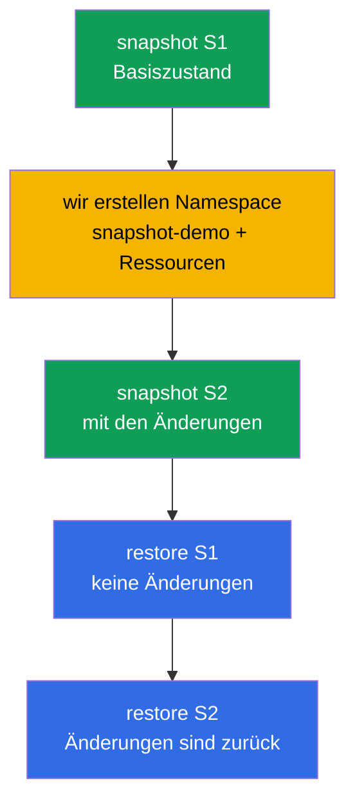

[Русская версия](README_RU.MD) · [Eng version](README.MD) · [Versión en español](README_ES.MD) · [Version française](README_FR.MD) · [ქართული ვერსია](README_GE.MD) · [繁體中文版](README_TW.MD) · [日本語版](README_JP.MD)

# Lab 112 — etcd: Snapshots und Wiederherstellung

## Beschreibung

Praxisübung zur wertvollsten Betriebsfähigkeit — Backup und Wiederherstellung von etcd, dem
Speicher des gesamten Cluster-Zustands. Du durchläufst den vollen Zyklus: Snapshot des
Basiszustands erstellen, Änderungen vornehmen, einen zweiten Snapshot erstellen und dann am
laufenden Cluster prüfen, dass die Wiederherstellung aus dem ersten Snapshot die Änderungen
zurücknimmt und die aus dem zweiten sie wiederbringt. Die Arbeit mit etcd erfolgt per SSH auf
der Control-Plane-Node.

Alle Aufgaben sind im Prüfungsstil formuliert (wie echte CKA/CKAD-Fragen) mit automatischer
Prüfung über den Befehl `check_result`. Die automatische Prüfung kontrolliert, ob beide
Snapshots vorhanden sind, ob der Cluster nach der Wiederherstellung gesund ist und ob die
wiederhergestellten Ressourcen existieren.

## Ziel

Den Stoff der Kurskapitel festigen:

- [Kapitel 37. Backup und Wiederherstellung von etcd](../../course/37/de.md) — `snapshot save`/`status`/`restore`, Stoppen und Starten der statischen Pods der Control Plane, Wiederherstellung der etcd-Daten, Prüfung der Cluster-Gesundheit

## Was wir tun und warum

In diesem Lab durchlaufen wir den vollen etcd-Zyklus — vom Erstellen eines Snapshots bis zur
Wiederherstellung des Clusters in den gewünschten Zustand. Jede Aktion hat ihren Zweck:

| Aktion | Wozu |
|--------|------|
| `etcdctl snapshot save` (S1) | ein Backup des Basiszustands des Clusters erstellen (Kapitel 37) |
| Namespace und Ressourcen erstellen | Änderungen vornehmen, damit sich der Cluster-Zustand unterscheidet (Kapitel 37) |
| `etcdctl snapshot save` (S2) | eine zweite Kopie erstellen — nun mit den Änderungen (Kapitel 37) |
| `etcdctl snapshot restore` aus S1 | den Cluster auf den Zustand vor den Änderungen zurücksetzen (Kapitel 37) |
| `etcdctl snapshot restore` aus S2 | den Cluster in den Zustand mit den Änderungen zurückbringen (Kapitel 37) |

Das Gesamtbild dessen, was bereitgestellt wird:



## Infrastruktur

Die Umgebung wird in AWS (`eu-central-1`) über Terragrunt bereitgestellt und besteht aus:

| Komponente | Beschreibung                                                         |
|------------|----------------------------------------------------------------------|
| `vpc`      | VPC `10.10.0.0/16` mit öffentlichen Subnetzen                          |
| `ssh-keys` | SSH-Schlüssel für den Zugriff auf die Nodes                            |
| `k8s-1`    | Kubernetes `1.35.2` (kubeadm), CNI Calico, metrics-server, Single-Node; `etcdctl` installiert |
| `worker`   | Arbeitsmaschine mit `kubectl`, `check_result` und SSH-Zugriff auf die Control Plane |

Instanzen: `t4g.medium` (master), Ubuntu `22.04`. Der Cluster ist Single-Node — beim Master
wurde der Taint `control-plane` entfernt, daher werden Pods direkt auf ihm geplant.

## Bereitstellung

```bash
TASK=112 make run_cka_task
```

Verbinde dich nach der Erstellung per SSH mit der Arbeitsmaschine (worker). Die Arbeit mit
etcd erfolgt per SSH direkt auf der Control-Plane-Node (`ssh k8s1_controlPlane_1`,
`sudo -i`); die etcd-Zertifikate liegen in `/etc/kubernetes/pki/etcd/`. `kubectl` auf der
Arbeitsmaschine ist auf den Kontext `cluster1-admin@cluster1` konfiguriert.

Nützliche Befehle auf der Arbeitsmaschine:

```bash
time_left       # wie viel Zeit noch bleibt
check_result    # Lösung prüfen
```

## Aufgaben

---
|        **1**        | **Snapshot S1 erstellen (Basiszustand)**                     |
| :-----------------: | :----------------------------------------------------------- |
| Was wir tun         | Erstelle auf der Control Plane einen etcd-Snapshot mit dem Befehl `etcdctl snapshot save /root/etcd-snapshot-1.db` mit dem Endpoint `https://127.0.0.1:2379` und den Zertifikaten aus `/etc/kubernetes/pki/etcd/` (`ca.crt`, `server.crt`, `server.key`). Prüfe ihn mit `etcdctl snapshot status ... --write-out=table` und kopiere ihn auf die Arbeitsmaschine (zum Beispiel per `scp`) in die Datei `/var/work/tests/artifacts/etcd/etcd-snapshot-1.db`. |
| Abnahmekriterien    | - Snapshot S1 ist nach `/var/work/tests/artifacts/etcd/etcd-snapshot-1.db` kopiert;<br/>- die Datei ist nicht leer (der Snapshot ist gültig). |
---
|        **2**        | **Änderungen im Cluster vornehmen**                         |
| :-----------------: | :----------------------------------------------------------- |
| Was wir tun         | Erstelle den Namespace `snapshot-demo` und darin eine ConfigMap `demo-config` (zum Beispiel `--from-literal=app=v1`) sowie ein Deployment `demo-web` mit dem Image `viktoruj/ping_pong` und `2` Replicas. Diese Ressourcen sind **nach** dem Snapshot S1 entstanden — an ihnen sehen wir später den Unterschied zwischen den Snapshots. |
| Abnahmekriterien    | - Namespace `snapshot-demo` ist erstellt;<br/>- darin existieren ConfigMap `demo-config` und Deployment `demo-web`. |
---
|        **3**        | **Snapshot S2 erstellen (nach den Änderungen)**             |
| :-----------------: | :----------------------------------------------------------- |
| Was wir tun         | Erstelle auf der Control Plane einen zweiten Snapshot nach `/root/etcd-snapshot-2.db` (auf dieselbe Weise wie S1), prüfe ihn mit `snapshot status` und kopiere ihn auf die Arbeitsmaschine nach `/var/work/tests/artifacts/etcd/etcd-snapshot-2.db`. Dieser Snapshot enthält bereits den Namespace `snapshot-demo` und seine Ressourcen. |
| Abnahmekriterien    | - Snapshot S2 ist nach `/var/work/tests/artifacts/etcd/etcd-snapshot-2.db` kopiert;<br/>- die Datei ist nicht leer (der Snapshot ist gültig). |
---
|        **4**        | **S1 wiederherstellen und prüfen, dass keine überflüssigen Ressourcen da sind** |
| :-----------------: | :----------------------------------------------------------- |
| Was wir tun         | Stelle den Snapshot S1 wieder her: stoppe die statischen Pods der Control Plane (nimm die Manifeste aus `/etc/kubernetes/manifests/` heraus), stelle S1 mit dem Befehl `etcdctl snapshot restore` nach `/var/lib/etcd` wieder her (mit `--name`/`--initial-cluster`/`--initial-advertise-peer-urls` aus dem etcd-Manifest) und lege die Manifeste zurück. Warte, bis die API bereit ist, und prüfe, dass der Namespace `snapshot-demo` **fehlt**. |
| Abnahmekriterien    | - der Cluster ist gesund: `/healthz` gibt `ok` zurück;<br/>- Namespace `snapshot-demo` fehlt (die Änderungen sind zurückgenommen). |
---
|        **5**        | **Cluster aus S2 wiederherstellen**                         |
| :-----------------: | :----------------------------------------------------------- |
| Was wir tun         | Stelle mit demselben Verfahren den Snapshot S2 wieder her. Warte, bis der Cluster wieder gesund ist, und prüfe, dass der Namespace `snapshot-demo` mit ConfigMap `demo-config` und Deployment `demo-web` **zurück** ist. |
| Abnahmekriterien    | - der Cluster ist nach der Wiederherstellung gesund: `/healthz` gibt `ok` zurück, die Pods in `kube-system` sind im Status Running/Completed;<br/>- Namespace `snapshot-demo` mit ConfigMap `demo-config` und Deployment `demo-web` ist vorhanden. |
---

## Ergebnisprüfung

Starte auf der Arbeitsmaschine die automatische Prüfung:

```bash
check_result
```

Das Skript führt die Tests aus und zeigt, wie viele Aufgaben erledigt sind. Die automatische
Prüfung schaut auf den **Endzustand** (nach der Wiederherstellung aus S2): beide Snapshots
sind vorhanden, der Cluster ist gesund, die wiederhergestellten Ressourcen sind da.

## Lösung

Referenzlösung: [worker/files/solutions/1_DE.MD](worker/files/solutions/1_DE.MD)

## Abdeckung der Mock-Prüfungen

Das Lab deckt die Mock-Aufgaben zum etcd-Backup ab: CKA mock 01 (Nr. 13 — etcd-Backup),
CKA mock 02 (Nr. 20 — etcd-Backup + Restore).

## Löschen von Cluster und Ressourcen

```bash
TASK=112 make delete_cka_task
```
