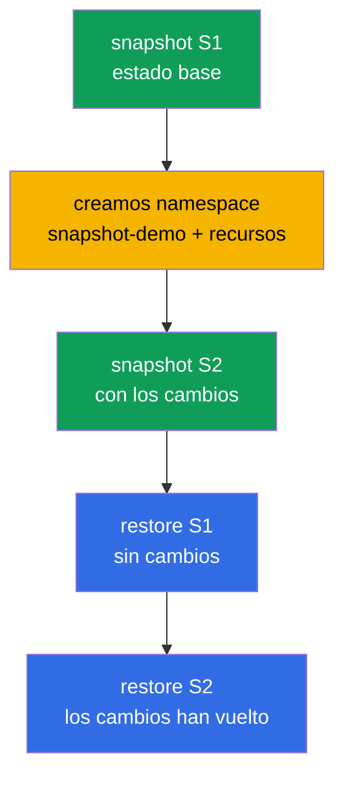

[Русская версия](README_RU.MD) · [Eng version](README.MD) · [Version française](README_FR.MD) · [Deutsche Version](README_DE.MD) · [ქართული ვერსია](README_GE.MD) · [繁體中文版](README_TW.MD) · [日本語版](README_JP.MD)

# Lab 112 — etcd: snapshots y restauración

## Descripción

Práctica sobre la habilidad operativa más valiosa: la copia de seguridad y la restauración
de etcd, el almacén de todo el estado del clúster. Recorrerás el ciclo completo: tomarás un
snapshot del estado base, introducirás cambios, tomarás un segundo snapshot y después, en un
clúster vivo, comprobarás que la restauración del primer snapshot revierte los cambios y la
del segundo los devuelve. El trabajo con etcd se hace por SSH en el nodo del control plane.

Todas las tareas están redactadas en estilo de examen (como las preguntas reales de
CKA/CKAD) con verificación automática mediante el comando `check_result`. La verificación
automática comprueba la presencia de ambos snapshots, la salud del clúster tras la
restauración y la existencia de los recursos restaurados.

## Objetivo

Consolidar el material de los capítulos del curso:

- [Capítulo 37. Copia de seguridad y restauración de etcd](../../course/37/es.md) — `snapshot save`/`status`/`restore`, parada y arranque de los pods estáticos del control plane, restauración de los datos de etcd, comprobación de la salud del clúster

## Qué hacemos y para qué

En este laboratorio recorremos el ciclo completo de trabajo con etcd: desde tomar un
snapshot hasta restaurar el clúster al estado deseado. Cada acción cumple su función:

| Acción | Para qué |
|--------|----------|
| `etcdctl snapshot save` (S1) | tomar una copia de seguridad del estado base del clúster (capítulo 37) |
| crear namespace y recursos | introducir cambios para que el estado del clúster sea distinto (capítulo 37) |
| `etcdctl snapshot save` (S2) | tomar una segunda copia, ya con los cambios (capítulo 37) |
| `etcdctl snapshot restore` desde S1 | revertir el clúster al estado anterior a los cambios (capítulo 37) |
| `etcdctl snapshot restore` desde S2 | devolver el clúster al estado con los cambios (capítulo 37) |

Imagen final de lo que se despliega:



## Infraestructura

El entorno se despliega en AWS (`eu-central-1`) mediante Terragrunt y consta de:

| Componente | Descripción                                                          |
|------------|----------------------------------------------------------------------|
| `vpc`      | VPC `10.10.0.0/16` con subredes públicas                              |
| `ssh-keys` | Claves SSH para acceder a los nodos                                   |
| `k8s-1`    | Kubernetes `1.35.2` (kubeadm), CNI Calico, metrics-server, de un solo nodo; con `etcdctl` instalado |
| `worker`   | Máquina de trabajo con `kubectl`, `check_result` y acceso SSH al control plane |

Instancias: `t4g.medium` (master), Ubuntu `22.04`. El clúster es de un solo nodo: al master
se le ha quitado el taint `control-plane`, por lo que los pods se planifican directamente
en él.

## Despliegue

```bash
TASK=112 make run_cka_task
```

Tras la creación, conéctate por SSH a la máquina de trabajo (worker). El trabajo con etcd se
hace por SSH ya en el nodo del control plane (`ssh k8s1_controlPlane_1`, `sudo -i`); los
certificados de etcd están en `/etc/kubernetes/pki/etcd/`. En la máquina de trabajo
`kubectl` está configurado con el contexto `cluster1-admin@cluster1`.

Comandos útiles en la máquina de trabajo:

```bash
time_left       # cuánto tiempo queda
check_result    # comprobar la solución
```

## Tareas

---
|        **1**        | **Tomar el snapshot S1 (estado base)**                       |
| :-----------------: | :----------------------------------------------------------- |
| Qué hacemos         | En el control plane toma un snapshot de etcd con el comando `etcdctl snapshot save /root/etcd-snapshot-1.db`, con el endpoint `https://127.0.0.1:2379` y los certificados de `/etc/kubernetes/pki/etcd/` (`ca.crt`, `server.crt`, `server.key`). Compruébalo con `etcdctl snapshot status ... --write-out=table` y cópialo a la máquina de trabajo (por ejemplo, con `scp`) al fichero `/var/work/tests/artifacts/etcd/etcd-snapshot-1.db`. |
| Criterios de aceptación | - el snapshot S1 está copiado en `/var/work/tests/artifacts/etcd/etcd-snapshot-1.db`;<br/>- el fichero no está vacío (el snapshot es válido). |
---
|        **2**        | **Introducir cambios en el clúster**                        |
| :-----------------: | :----------------------------------------------------------- |
| Qué hacemos         | Crea el namespace `snapshot-demo` y, dentro de él, un ConfigMap `demo-config` (por ejemplo, `--from-literal=app=v1`) y un Deployment `demo-web` con la imagen `viktoruj/ping_pong` y `2` réplicas. Estos recursos aparecieron **después** del snapshot S1: con ellos veremos luego la diferencia entre los snapshots. |
| Criterios de aceptación | - el namespace `snapshot-demo` está creado;<br/>- contiene el ConfigMap `demo-config` y el Deployment `demo-web`. |
---
|        **3**        | **Tomar el snapshot S2 (después de los cambios)**           |
| :-----------------: | :----------------------------------------------------------- |
| Qué hacemos         | En el control plane toma un segundo snapshot en `/root/etcd-snapshot-2.db` (del mismo modo que S1), compruébalo con `snapshot status` y cópialo a la máquina de trabajo en `/var/work/tests/artifacts/etcd/etcd-snapshot-2.db`. Este snapshot ya contiene el namespace `snapshot-demo` y sus recursos. |
| Criterios de aceptación | - el snapshot S2 está copiado en `/var/work/tests/artifacts/etcd/etcd-snapshot-2.db`;<br/>- el fichero no está vacío (el snapshot es válido). |
---
|        **4**        | **Restaurar S1 y comprobar que no hay recursos de más**     |
| :-----------------: | :----------------------------------------------------------- |
| Qué hacemos         | Restaura el snapshot S1: detén los pods estáticos del control plane (saca los manifiestos de `/etc/kubernetes/manifests/`), restaura S1 en `/var/lib/etcd` con el comando `etcdctl snapshot restore` (con `--name`/`--initial-cluster`/`--initial-advertise-peer-urls` tomados del manifiesto de etcd) y devuelve los manifiestos a su lugar. Espera a que la API esté lista y comprueba que el namespace `snapshot-demo` **no existe**. |
| Criterios de aceptación | - el clúster está sano: `/healthz` devuelve `ok`;<br/>- el namespace `snapshot-demo` no existe (los cambios están revertidos). |
---
|        **5**        | **Restaurar el clúster desde S2**                           |
| :-----------------: | :----------------------------------------------------------- |
| Qué hacemos         | Con el mismo procedimiento, restaura el snapshot S2. Espera a que el clúster vuelva a estar sano y comprueba que el namespace `snapshot-demo` con el ConfigMap `demo-config` y el Deployment `demo-web` **ha vuelto**. |
| Criterios de aceptación | - el clúster está sano tras la restauración: `/healthz` devuelve `ok`, los pods de `kube-system` están en estado Running/Completed;<br/>- el namespace `snapshot-demo` con el ConfigMap `demo-config` y el Deployment `demo-web` está presente. |
---

## Comprobación del resultado

En la máquina de trabajo lanza la verificación automática:

```bash
check_result
```

El script ejecuta los tests y muestra cuántas tareas están completadas. La verificación
automática mira el estado **final** (después de la restauración desde S2): ambos snapshots
en su sitio, el clúster sano y los recursos restaurados presentes.

## Solución

Solución de referencia: [worker/files/solutions/1_ES.MD](worker/files/solutions/1_ES.MD)

## Cobertura de exámenes simulados

El laboratorio cubre las tareas de los simulacros sobre copia de seguridad de etcd:
CKA mock 01 (n.º 13 — backup de etcd), CKA mock 02 (n.º 20 — backup + restore de etcd).

## Eliminación del clúster y los recursos

```bash
TASK=112 make delete_cka_task
```
