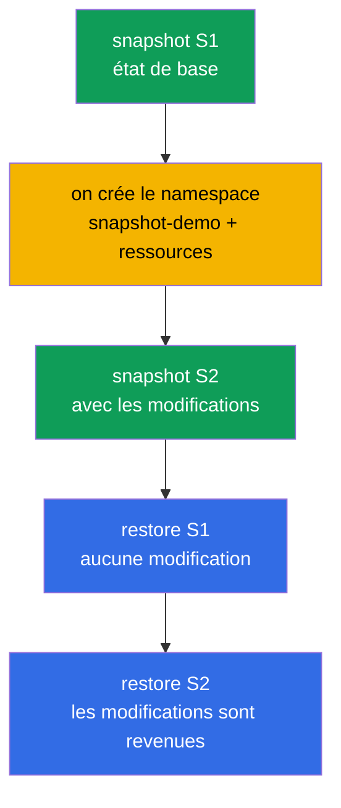

[Русская версия](README_RU.MD) · [Eng version](README.MD) · [Versión en español](README_ES.MD) · [Deutsche Version](README_DE.MD) · [ქართული ვერსია](README_GE.MD) · [繁體中文版](README_TW.MD) · [日本語版](README_JP.MD)

# Lab 112 — etcd : snapshots et restauration

## Description

Travail pratique sur la compétence d'exploitation la plus précieuse : la sauvegarde et la
restauration d'etcd, le magasin de tout l'état du cluster. Vous parcourez le cycle complet :
prendre un snapshot de l'état de base, apporter des modifications, prendre un second
snapshot, puis, sur un cluster vivant, vérifier que la restauration du premier snapshot
annule les modifications et que celle du second les ramène. Le travail avec etcd se fait en
SSH sur le nœud du control plane.

Toutes les tâches sont rédigées dans le style de l'examen (comme les vraies questions
CKA/CKAD) avec une vérification automatique via la commande `check_result`. La vérification
automatique contrôle la présence des deux snapshots, la santé du cluster après la
restauration et la présence des ressources restaurées.

## Objectif

Consolider le contenu des chapitres du cours :

- [Chapitre 37. Sauvegarde et restauration d'etcd](../../course/37/fr.md) — `snapshot save`/`status`/`restore`, arrêt et démarrage des pods statiques du control plane, restauration des données etcd, vérification de la santé du cluster

## Ce que nous faisons et pourquoi

Dans ce lab, nous parcourons le cycle complet de travail avec etcd : de la prise du snapshot
jusqu'à la restauration du cluster dans l'état voulu. Chaque action a son rôle :

| Action | Pourquoi |
|--------|----------|
| `etcdctl snapshot save` (S1) | prendre une sauvegarde de l'état de base du cluster (chapitre 37) |
| créer un namespace et des ressources | apporter des modifications pour que l'état du cluster diffère (chapitre 37) |
| `etcdctl snapshot save` (S2) | prendre une seconde copie, cette fois avec les modifications (chapitre 37) |
| `etcdctl snapshot restore` depuis S1 | ramener le cluster à l'état d'avant les modifications (chapitre 37) |
| `etcdctl snapshot restore` depuis S2 | ramener le cluster à l'état avec les modifications (chapitre 37) |

Image finale de ce qui sera déployé :



## Infrastructure

L'environnement est déployé dans AWS (`eu-central-1`) via Terragrunt et se compose de :

| Composant  | Description                                                          |
|------------|----------------------------------------------------------------------|
| `vpc`      | VPC `10.10.0.0/16` avec des sous-réseaux publics                       |
| `ssh-keys` | Clés SSH pour l'accès aux nœuds                                       |
| `k8s-1`    | Kubernetes `1.35.2` (kubeadm), CNI Calico, metrics-server, mono-nœud ; `etcdctl` installé |
| `worker`   | Machine de travail avec `kubectl`, `check_result` et un accès SSH au control plane |

Instances : `t4g.medium` (master), Ubuntu `22.04`. Le cluster est mono-nœud — le taint
`control-plane` a été retiré du master, les pods sont donc planifiés directement sur lui.

## Déploiement

```bash
TASK=112 make run_cka_task
```

Après la création, connectez-vous en SSH à la machine de travail (worker). Le travail avec
etcd se fait en SSH directement sur le nœud du control plane (`ssh k8s1_controlPlane_1`,
`sudo -i`) ; les certificats etcd se trouvent dans `/etc/kubernetes/pki/etcd/`. Sur la
machine de travail, `kubectl` est configuré sur le contexte `cluster1-admin@cluster1`.

Commandes utiles sur la machine de travail :

```bash
time_left       # combien de temps il reste
check_result    # vérifier la solution
```

## Tâches

---
|        **1**        | **Prendre le snapshot S1 (état de base)**                    |
| :-----------------: | :----------------------------------------------------------- |
| Quoi faire          | Sur le control plane, prenez un snapshot etcd avec la commande `etcdctl snapshot save /root/etcd-snapshot-1.db`, avec l'endpoint `https://127.0.0.1:2379` et les certificats de `/etc/kubernetes/pki/etcd/` (`ca.crt`, `server.crt`, `server.key`). Vérifiez-le avec `etcdctl snapshot status ... --write-out=table` et copiez-le sur la machine de travail (par exemple avec `scp`) dans le fichier `/var/work/tests/artifacts/etcd/etcd-snapshot-1.db`. |
| Critères d'acceptation | - le snapshot S1 est copié dans `/var/work/tests/artifacts/etcd/etcd-snapshot-1.db` ;<br/>- le fichier n'est pas vide (le snapshot est valide). |
---
|        **2**        | **Apporter des modifications au cluster**                   |
| :-----------------: | :----------------------------------------------------------- |
| Quoi faire          | Créez le namespace `snapshot-demo` et, dedans, un ConfigMap `demo-config` (par exemple, `--from-literal=app=v1`) et un Deployment `demo-web` avec l'image `viktoruj/ping_pong` et `2` réplicas. Ces ressources sont apparues **après** le snapshot S1 : c'est grâce à elles que l'on verra ensuite la différence entre les snapshots. |
| Critères d'acceptation | - le namespace `snapshot-demo` est créé ;<br/>- il contient le ConfigMap `demo-config` et le Deployment `demo-web`. |
---
|        **3**        | **Prendre le snapshot S2 (après les modifications)**        |
| :-----------------: | :----------------------------------------------------------- |
| Quoi faire          | Sur le control plane, prenez un second snapshot dans `/root/etcd-snapshot-2.db` (de la même façon que S1), vérifiez-le avec `snapshot status` et copiez-le sur la machine de travail dans `/var/work/tests/artifacts/etcd/etcd-snapshot-2.db`. Ce snapshot contient déjà le namespace `snapshot-demo` et ses ressources. |
| Critères d'acceptation | - le snapshot S2 est copié dans `/var/work/tests/artifacts/etcd/etcd-snapshot-2.db` ;<br/>- le fichier n'est pas vide (le snapshot est valide). |
---
|        **4**        | **Restaurer S1 et vérifier qu'il n'y a pas de ressources en trop** |
| :-----------------: | :----------------------------------------------------------- |
| Quoi faire          | Restaurez le snapshot S1 : arrêtez les pods statiques du control plane (sortez les manifestes de `/etc/kubernetes/manifests/`), restaurez S1 dans `/var/lib/etcd` avec la commande `etcdctl snapshot restore` (avec `--name`/`--initial-cluster`/`--initial-advertise-peer-urls` pris dans le manifeste etcd) et remettez les manifestes en place. Attendez que l'API soit prête et vérifiez que le namespace `snapshot-demo` est **absent**. |
| Critères d'acceptation | - le cluster est sain : `/healthz` renvoie `ok` ;<br/>- le namespace `snapshot-demo` est absent (les modifications sont annulées). |
---
|        **5**        | **Restaurer le cluster depuis S2**                          |
| :-----------------: | :----------------------------------------------------------- |
| Quoi faire          | Avec la même procédure, restaurez le snapshot S2. Attendez que le cluster redevienne sain et vérifiez que le namespace `snapshot-demo` avec le ConfigMap `demo-config` et le Deployment `demo-web` est **revenu**. |
| Critères d'acceptation | - le cluster est sain après la restauration : `/healthz` renvoie `ok`, les pods `kube-system` sont en statut Running/Completed ;<br/>- le namespace `snapshot-demo` avec le ConfigMap `demo-config` et le Deployment `demo-web` est présent. |
---

## Vérification du résultat

Sur la machine de travail, lancez la vérification automatique :

```bash
check_result
```

Le script exécute les tests et montre combien de tâches sont terminées. La vérification
automatique regarde l'état **final** (après la restauration depuis S2) : les deux snapshots
sont en place, le cluster est sain, les ressources restaurées sont présentes.

## Solution

Solution de référence : [worker/files/solutions/1_FR.MD](worker/files/solutions/1_FR.MD)

## Couverture des examens blancs

Le lab couvre les tâches des examens blancs sur la sauvegarde d'etcd : CKA mock 01 (n° 13 —
backup etcd), CKA mock 02 (n° 20 — backup + restore etcd).

## Suppression du cluster et des ressources

```bash
TASK=112 make delete_cka_task
```
