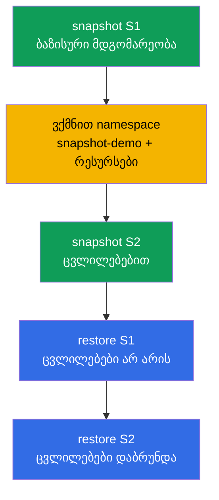

[Русская версия](README_RU.MD) · [Eng version](README.MD) · [Versión en español](README_ES.MD) · [Version française](README_FR.MD) · [Deutsche Version](README_DE.MD) · [繁體中文版](README_TW.MD) · [日本語版](README_JP.MD)

# Lab 112 — etcd: snapshot-ები და აღდგენა

## აღწერა

პრაქტიკული სამუშაო ექსპლუატაციის ყველაზე ღირებულ უნარზე — etcd-ის, კლასტერის მთელი
მდგომარეობის საცავის, სარეზერვო კოპირებასა და აღდგენაზე. თქვენ გაივლით სრულ ციკლს: აიღებთ
ბაზისური მდგომარეობის snapshot-ს, შეიტანთ ცვლილებებს, აიღებთ მეორე snapshot-ს, შემდეგ კი
ცოცხალ კლასტერზე დარწმუნდებით, რომ პირველი snapshot-იდან აღდგენა ცვლილებებს აბრუნებს უკან,
ხოლო მეორედან აღდგენა — უკან აბრუნებს მათ. etcd-თან მუშაობა control plane node-ზე ხდება
SSH-ით.

ყველა დავალება გამოცდის სტილშია გაფორმებული (როგორც რეალური CKA/CKAD კითხვები) და მათი
შემოწმება ავტომატურად ხდება ბრძანებით `check_result`. ავტოშემოწმება ამოწმებს ორივე
snapshot-ის არსებობას, კლასტერის ჯანმრთელობას აღდგენის შემდეგ და აღდგენილი რესურსების
არსებობას.

## მიზანი

განამტკიცოთ კურსის თავების მასალა:

- [თავი 37. etcd-ის სარეზერვო კოპირება და აღდგენა](../../course/37/ge.md) — `snapshot save`/`status`/`restore`, control plane-ის სტატიკური pod-ების გაჩერება და გაშვება, etcd-ის მონაცემების აღდგენა, კლასტერის ჯანმრთელობის შემოწმება

## რას ვაკეთებთ და რისთვის

ამ ლაბორატორიაში ვგადით etcd-თან მუშაობის სრულ ციკლს — snapshot-ის აღებიდან კლასტერის
სასურველ მდგომარეობაში აღდგენამდე. თითოეული მოქმედება თავის ამოცანას ასრულებს:

| მოქმედება | რისთვის |
|-----------|---------|
| `etcdctl snapshot save` (S1) | კლასტერის ბაზისური მდგომარეობის სარეზერვო ასლის აღება (თავი 37) |
| namespace-ისა და რესურსების შექმნა | ცვლილებების შეტანა, რომ კლასტერის მდგომარეობა განსხვავდებოდეს (თავი 37) |
| `etcdctl snapshot save` (S2) | მეორე ასლის აღება — უკვე ცვლილებებით (თავი 37) |
| `etcdctl snapshot restore` S1-იდან | კლასტერის დაბრუნება ცვლილებებამდე მდგომარეობაში (თავი 37) |
| `etcdctl snapshot restore` S2-იდან | კლასტერის დაბრუნება ცვლილებებიან მდგომარეობაში (თავი 37) |

საბოლოო სურათი იმისა, რაც განთავსდება:



## ინფრასტრუქტურა

გარემო იშლება AWS-ში (`eu-central-1`) Terragrunt-ის მეშვეობით და შედგება:

| კომპონენტი | აღწერა                                                            |
|------------|-------------------------------------------------------------------|
| `vpc`      | VPC `10.10.0.0/16` საჯარო ქვექსელებით                              |
| `ssh-keys` | SSH-გასაღებები node-ებზე წვდომისთვის                                |
| `k8s-1`    | Kubernetes `1.35.2` (kubeadm), CNI Calico, metrics-server, ერთკვანძიანი; დაყენებულია `etcdctl` |
| `worker`   | სამუშაო მანქანა `kubectl`-ით, `check_result`-ით და control plane-ზე SSH-წვდომით |

ინსტანსები: `t4g.medium` (master), Ubuntu `22.04`. კლასტერი ერთკვანძიანია — master-ს
მოშორებულია taint `control-plane`, ამიტომ pod-ები პირდაპირ მასზე იგეგმება.

## განთავსება

```bash
TASK=112 make run_cka_task
```

შექმნის შემდეგ დაუკავშირდით სამუშაო მანქანას (worker) SSH-ით. etcd-თან მუშაობა SSH-ით უკვე
control plane node-ზე ხდება (`ssh k8s1_controlPlane_1`, `sudo -i`); etcd-ის სერტიფიკატები
დევს `/etc/kubernetes/pki/etcd/`-ში. სამუშაო მანქანაზე `kubectl` კონფიგურირებულია კონტექსტზე
`cluster1-admin@cluster1`.

სასარგებლო ბრძანებები სამუშაო მანქანაზე:

```bash
time_left       # რამდენი დრო დარჩა
check_result    # ამოხსნის შემოწმება
```

## დავალებები

---
|        **1**        | **S1 snapshot-ის აღება (ბაზისური მდგომარეობა)**              |
| :-----------------: | :----------------------------------------------------------- |
| რას ვაკეთებთ        | control plane-ზე აიღეთ etcd-ის snapshot ბრძანებით `etcdctl snapshot save /root/etcd-snapshot-1.db` endpoint-ით `https://127.0.0.1:2379` და სერტიფიკატებით `/etc/kubernetes/pki/etcd/`-დან (`ca.crt`, `server.crt`, `server.key`). შეამოწმეთ ის `etcdctl snapshot status ... --write-out=table`-ით და დააკოპირეთ სამუშაო მანქანაზე (მაგალითად, `scp`-ით) ფაილში `/var/work/tests/artifacts/etcd/etcd-snapshot-1.db`. |
| მიღების კრიტერიუმები | - snapshot S1 დაკოპირებულია `/var/work/tests/artifacts/etcd/etcd-snapshot-1.db`-ში;<br/>- ფაილი არ არის ცარიელი (snapshot ვალიდურია). |
---
|        **2**        | **კლასტერში ცვლილებების შეტანა**                             |
| :-----------------: | :----------------------------------------------------------- |
| რას ვაკეთებთ        | შექმენით namespace `snapshot-demo`, ხოლო მასში — ConfigMap `demo-config` (მაგალითად, `--from-literal=app=v1`) და Deployment `demo-web` image-ით `viktoruj/ping_pong` და `2` რეპლიკით. ეს რესურსები გამოჩნდა S1 snapshot-ის **შემდეგ** — მათით შემდეგ დავინახავთ განსხვავებას snapshot-ებს შორის. |
| მიღების კრიტერიუმები | - namespace `snapshot-demo` შექმნილია;<br/>- მასში არის ConfigMap `demo-config` და Deployment `demo-web`. |
---
|        **3**        | **S2 snapshot-ის აღება (ცვლილებების შემდეგ)**                |
| :-----------------: | :----------------------------------------------------------- |
| რას ვაკეთებთ        | control plane-ზე აიღეთ მეორე snapshot `/root/etcd-snapshot-2.db`-ში (იმავე ხერხით, როგორც S1), შეამოწმეთ ის `snapshot status`-ით და დააკოპირეთ სამუშაო მანქანაზე `/var/work/tests/artifacts/etcd/etcd-snapshot-2.db`-ში. ეს snapshot უკვე შეიცავს namespace `snapshot-demo`-ს და მის რესურსებს. |
| მიღების კრიტერიუმები | - snapshot S2 დაკოპირებულია `/var/work/tests/artifacts/etcd/etcd-snapshot-2.db`-ში;<br/>- ფაილი არ არის ცარიელი (snapshot ვალიდურია). |
---
|        **4**        | **S1-ის აღდგენა და დარწმუნება, რომ ზედმეტი რესურსები არ არის** |
| :-----------------: | :----------------------------------------------------------- |
| რას ვაკეთებთ        | აღადგინეთ snapshot S1: გააჩერეთ control plane-ის სტატიკური pod-ები (გაიტანეთ მანიფესტები `/etc/kubernetes/manifests/`-დან), აღადგინეთ S1 `/var/lib/etcd`-ში ბრძანებით `etcdctl snapshot restore` (etcd-ის მანიფესტიდან აღებული `--name`/`--initial-cluster`/`--initial-advertise-peer-urls`-ით) და დააბრუნეთ მანიფესტები ადგილზე. დაელოდეთ API-ს მზადყოფნას და დარწმუნდით, რომ namespace `snapshot-demo` **არ არსებობს**. |
| მიღების კრიტერიუმები | - კლასტერი ჯანმრთელია: `/healthz` აბრუნებს `ok`-ს;<br/>- namespace `snapshot-demo` არ არსებობს (ცვლილებები დაბრუნებულია უკან). |
---
|        **5**        | **კლასტერის აღდგენა S2-იდან**                                |
| :-----------------: | :----------------------------------------------------------- |
| რას ვაკეთებთ        | იმავე პროცედურით აღადგინეთ snapshot S2. დაელოდეთ, სანამ კლასტერი ისევ ჯანმრთელი გახდება, და დარწმუნდით, რომ namespace `snapshot-demo` ConfigMap `demo-config`-ითა და Deployment `demo-web`-ით **დაბრუნდა**. |
| მიღების კრიტერიუმები | - კლასტერი ჯანმრთელია აღდგენის შემდეგ: `/healthz` აბრუნებს `ok`-ს, `kube-system`-ის pod-ები სტატუსში Running/Completed;<br/>- namespace `snapshot-demo` ConfigMap `demo-config`-ითა და Deployment `demo-web`-ით არსებობს. |
---

## შედეგის შემოწმება

სამუშაო მანქანაზე გაუშვით ავტომატური შემოწმება:

```bash
check_result
```

სკრიპტი გაატარებს ტესტებს და აჩვენებს, რამდენი დავალებაა შესრულებული. ავტოშემოწმება უყურებს
**საბოლოო** მდგომარეობას (S2-იდან აღდგენის შემდეგ): ორივე snapshot ადგილზეა, კლასტერი
ჯანმრთელია, აღდგენილი რესურსები არსებობს.

## ამოხსნა

ეტალონური ამოხსნა: [worker/files/solutions/1_GE.MD](worker/files/solutions/1_GE.MD)

## Mock-გამოცდების დაფარვა

ლაბორატორია ფარავს mock-ების დავალებებს etcd-ის სარეზერვო კოპირებაზე: CKA mock 01 (№13 —
backup etcd), CKA mock 02 (№20 — backup + restore etcd).

## კლასტერისა და რესურსების წაშლა

```bash
TASK=112 make delete_cka_task
```
