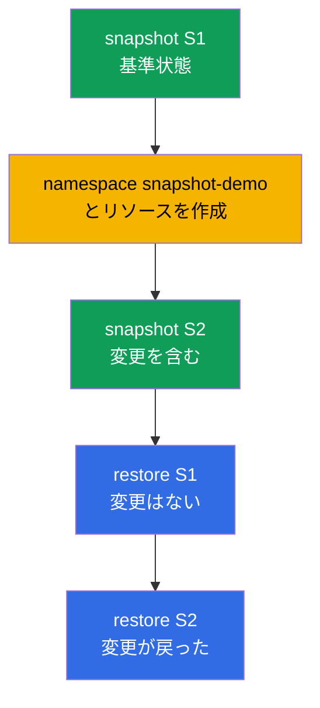

[Русская версия](README_RU.MD) · [Eng version](README.MD) · [Versión en español](README_ES.MD) · [Version française](README_FR.MD) · [Deutsche Version](README_DE.MD) · [ქართული ვერსია](README_GE.MD) · [繁體中文版](README_TW.MD)

# Lab 112 - etcd：スナップショットとリストア

## 概要

運用で最も価値のあるスキル - クラスタの全状態を保持するストア、etcd のバックアップと
リストアに取り組む実習です。ここでは一連の流れをすべて体験します：基準状態の
スナップショットを取得し、変更を加え、2 つ目のスナップショットを取得し、そのうえで
稼働中のクラスタで、1 つ目のスナップショットからのリストアは変更を巻き戻し、
2 つ目のスナップショットからのリストアは変更を戻すことを確認します。etcd に関する
作業はすべて SSH 経由で control plane ノード上で行います。

すべての課題は試験形式（実際の CKA/CKAD の問題と同じスタイル）で書かれており、
`check_result` コマンドで自動的に検証されます。自動チェックでは、両方の
スナップショットが存在すること、リストア後にクラスタが健全であること、そして
リストアされたリソースが存在することを確認します。

## 目的

次のコース章の内容を定着させます：

- [第 37 章。etcd のバックアップとリストア](../../course/37/README.md) - `snapshot save`/`status`/`restore`、control plane の静的 Pod の停止と起動、etcd データのリストア、クラスタの健全性チェック

## 何をし、なぜするのか

この実習では etcd の一連の流れを最後まで通します - スナップショットの取得から、
必要な状態へのクラスタのリストアまでです。各操作にはそれぞれの目的があります：

| 操作 | なぜ |
|----------|-------|
| `etcdctl snapshot save`（S1） | クラスタの基準状態のバックアップを取得する（第 37 章） |
| namespace とリソースを作成する | 変更を加えて、クラスタの状態に差分を作る（第 37 章） |
| `etcdctl snapshot save`（S2） | 2 つ目のコピーを取得する - こちらは変更を含む（第 37 章） |
| S1 からの `etcdctl snapshot restore` | 変更前の状態までクラスタを巻き戻す（第 37 章） |
| S2 からの `etcdctl snapshot restore` | 変更を含む状態までクラスタを戻す（第 37 章） |

最終的にデプロイされる全体像：



## インフラ

環境は Terragrunt により AWS（`eu-central-1`）に展開され、次の要素で構成されます：

| コンポーネント | 説明                                                             |
|------------|----------------------------------------------------------------------|
| `vpc`      | パブリックサブネットを持つ VPC `10.10.0.0/16`                          |
| `ssh-keys` | ノードへアクセスするための SSH キー                                     |
| `k8s-1`    | Kubernetes `1.35.2`（kubeadm）、CNI Calico、metrics-server、単一ノード構成；`etcdctl` 導入済み |
| `worker`   | `kubectl`、`check_result`、control plane への SSH アクセスを備えた作業マシン |

インスタンス：`t3.medium`（master）、Ubuntu `22.04`。クラスタは単一ノード構成で、master の
taint は解除されています（`control-plane` taint を削除）。そのため Pod は master 上に直接スケジュールされます。

## デプロイ

```bash
TASK=112 make run_cka_task
```

作成が完了したら、SSH で作業マシン（worker）に接続してください。etcd の作業自体は
SSH 経由で control plane ノード上で行います（`ssh k8s1_controlPlane_1`、`sudo -i`）；etcd の
証明書は `/etc/kubernetes/pki/etcd/` にあります。作業マシンの `kubectl` はすでに
`cluster1-admin@cluster1` コンテキストに設定されています。

作業マシンで使える便利なコマンド：

```bash
time_left       # 残り時間
check_result    # 解答をチェックする
```

## 課題

---
|        **1**        | **スナップショット S1（基準状態）を取得する**                 |
| :-----------------: | :----------------------------------------------------------- |
| やること            | control plane 上で、endpoint `https://127.0.0.1:2379` と `/etc/kubernetes/pki/etcd/` の証明書（`ca.crt`、`server.crt`、`server.key`）を使い、`etcdctl snapshot save /root/etcd-snapshot-1.db` で etcd のスナップショットを取得してください。`etcdctl snapshot status ... --write-out=table` で確認し、作業マシンのファイル `/var/work/tests/artifacts/etcd/etcd-snapshot-1.db` にコピーしてください（たとえば `scp` で）。 |
| 受け入れ基準        | - スナップショット S1 が `/var/work/tests/artifacts/etcd/etcd-snapshot-1.db` にコピーされている；<br/>- ファイルが空でない（スナップショットが有効）。 |
---
|        **2**        | **クラスタに変更を加える**                                  |
| :-----------------: | :----------------------------------------------------------- |
| やること            | namespace `snapshot-demo` を作成し、その中に ConfigMap `demo-config`（たとえば `--from-literal=app=v1`）と、イメージ `viktoruj/ping_pong`、レプリカ `2` の Deployment `demo-web` を作成してください。これらのリソースはスナップショット S1 の**あと**に現れたものです - 後でこれらを使って 2 つのスナップショットの違いを確認します。 |
| 受け入れ基準        | - namespace `snapshot-demo` が作成されている；<br/>- その中に ConfigMap `demo-config` と Deployment `demo-web` がある。 |
---
|        **3**        | **スナップショット S2（変更後）を取得する**                  |
| :-----------------: | :----------------------------------------------------------- |
| やること            | control plane 上で 2 つ目のスナップショットを `/root/etcd-snapshot-2.db` に取得し（S1 と同じ方法で）、`snapshot status` で確認し、作業マシンの `/var/work/tests/artifacts/etcd/etcd-snapshot-2.db` にコピーしてください。このスナップショットには namespace `snapshot-demo` とそのリソースがすでに含まれています。 |
| 受け入れ基準        | - スナップショット S2 が `/var/work/tests/artifacts/etcd/etcd-snapshot-2.db` にコピーされている；<br/>- ファイルが空でない（スナップショットが有効）。 |
---
|        **4**        | **S1 をリストアし、余分なリソースがないことを確認する**        |
| :-----------------: | :----------------------------------------------------------- |
| やること            | スナップショット S1 をリストアしてください：control plane の静的 Pod を停止し（マニフェストを `/etc/kubernetes/manifests/` から移動）、`etcdctl snapshot restore` で S1 を `/var/lib/etcd` にリストアし（`--name`/`--initial-cluster`/`--initial-advertise-peer-urls` は etcd のマニフェストから取得）、マニフェストを元の場所に戻します。API が Ready になるまで待ち、namespace `snapshot-demo` が**存在しない**ことを確認してください。 |
| 受け入れ基準        | - クラスタが健全：`/healthz` が `ok` を返す；<br/>- namespace `snapshot-demo` が存在しない（変更が巻き戻された）。 |
---
|        **5**        | **S2 からクラスタをリストアする**                            |
| :-----------------: | :----------------------------------------------------------- |
| やること            | 同じ手順でスナップショット S2 をリストアしてください。クラスタが再び健全になるまで待ち、ConfigMap `demo-config` と Deployment `demo-web` を含む namespace `snapshot-demo` が**戻った**ことを確認してください。 |
| 受け入れ基準        | - リストア後にクラスタが健全：`/healthz` が `ok` を返し、`kube-system` の Pod が Running/Completed 状態である；<br/>- ConfigMap `demo-config` と Deployment `demo-web` を含む namespace `snapshot-demo` が存在する。 |
---

## 結果のチェック

作業マシンで自動チェックを実行します：

```bash
check_result
```

スクリプトがテストを実行し、いくつの課題が完了したかを表示します。自動チェックが見るのは
**最終**状態（S2 からのリストア後）です：両方のスナップショットが所定の場所にあり、クラスタが
健全で、リストアされたリソースが存在すること。

## 解答

参考解答：[worker/files/solutions/1_JP.MD](worker/files/solutions/1_JP.MD)

## 模擬試験のカバー範囲

この実習は模擬試験の etcd バックアップに関する課題をカバーします：CKA mock 01（第 13 問 - backup
etcd）、CKA mock 02（第 20 問 - backup + restore etcd）。

## クラスタとリソースの削除

```bash
TASK=112 make delete_cka_task
```
