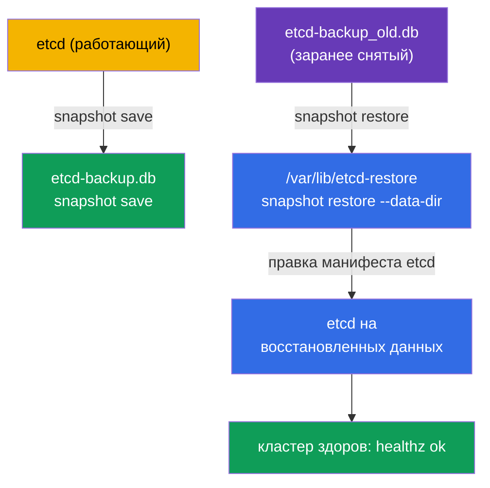

# Lab 112 — etcd: резервное копирование и восстановление

## Описание

Практическая работа по самому ценному навыку эксплуатации — бэкапу и восстановлению
etcd, хранилища всего состояния кластера. Вы снимете снапшот etcd, проверите его, а затем
восстановите кластер из заранее подготовленного снапшота и убедитесь, что кластер
вернулся в рабочее состояние. Работа ведётся на control plane ноде по SSH.

Все задания оформлены в экзаменационном стиле (как реальные вопросы CKA/CKAD) с
автоматической проверкой командой `check_result`. Автопроверка проверяет наличие
снапшота и здоровье кластера после восстановления.

## Цель

Закрепить материал глав курса:

- [Глава 37. Резервное копирование и восстановление etcd](../../course/37/ru.md) — `snapshot save`/`status`/`restore`, правка манифеста etcd, проверка здоровья кластера

## Что мы делаем и зачем

В этой лабе мы проходим полный цикл работы с etcd — от снятия снапшота до восстановления
кластера из резервной копии. Каждое действие решает свою задачу:

| Действие | Зачем |
|----------|-------|
| `etcdctl snapshot save` | снять резервную копию всего состояния кластера (глава 37) |
| `etcdctl snapshot status` | убедиться, что снапшот валиден (глава 37) |
| `etcdctl snapshot restore` в новый каталог | развернуть состояние из снапшота (глава 37) |
| переключить манифест etcd на новый каталог | поднять etcd на восстановленных данных (глава 37) |

Итоговая картина того, что будет развёрнуто:



## Инфраструктура

Окружение разворачивается в AWS (`eu-central-1`) через Terragrunt и состоит из:

| Компонент  | Описание                                                             |
|------------|----------------------------------------------------------------------|
| `vpc`      | VPC `10.10.0.0/16` с публичными подсетями                             |
| `ssh-keys` | SSH-ключи для доступа к нодам                                         |
| `k8s-1`    | Kubernetes `1.35.2` (kubeadm), CNI Calico, metrics-server, одноузловой; установлен `etcdctl`; заранее снят снапшот `/root/etcd-backup_old.db` |
| `worker`   | Рабочая машина с `kubectl`, `check_result` и SSH-доступом к control plane |

Инстансы: `t3.medium` (master) Ubuntu `22.04`. Кластер одноузловой — master
«разтейнчен» (снят taint `control-plane`), поэтому поды планируются прямо на него.

## Развёртывание

```bash
TASK=112 make run_cka_task
```

После создания подключитесь к рабочей машине (worker) по SSH. Работа с etcd ведётся по
SSH уже на control plane ноде (`ssh k8s1_controlPlane_1`, `sudo -i`); сертификаты etcd
лежат в `/etc/kubernetes/pki/etcd/`. `kubectl` на рабочей машине настроен на контекст
`cluster1-admin@cluster1`.

Полезные команды на рабочей машине:

```bash
time_left       # сколько осталось времени
check_result    # проверить решение
```

## Задания

---
|        **1**        | **Снять снапшот etcd**                                       |
| :-----------------: | :----------------------------------------------------------- |
| Что делаем          | На control plane снимите снапшот etcd командой `ETCDCTL_API=3 etcdctl snapshot save /root/etcd-backup.db` с endpoint `https://127.0.0.1:2379` и сертификатами из `/etc/kubernetes/pki/etcd/` (`ca.crt`, `server.crt`, `server.key`). Проверьте его через `etcdctl snapshot status ... --write-out=table` и скопируйте снапшот на рабочую машину (например, `scp`) в файл `/var/work/tests/artifacts/etcd/etcd-backup.db`. |
| Критерии приёмки    | - снапшот скопирован в `/var/work/tests/artifacts/etcd/etcd-backup.db`;<br/>- файл не пуст (снапшот валиден). |
---
|        **2**        | **Восстановить etcd из старого снапшота**                   |
| :-----------------: | :----------------------------------------------------------- |
| Что делаем          | На control plane восстановите заранее подготовленный снапшот `/root/etcd-backup_old.db` в новый каталог: `ETCDCTL_API=3 etcdctl snapshot restore /root/etcd-backup_old.db --data-dir=/var/lib/etcd-restore`. Остановите etcd, убрав манифест статик-пода (`mv /etc/kubernetes/manifests/etcd.yaml /tmp/`), поменяйте в нём `hostPath` каталога данных на `/var/lib/etcd-restore` и верните манифест на место — kubelet поднимет etcd на восстановленных данных. Дождитесь, пока кластер снова станет здоровым. |
| Критерии приёмки    | - кластер здоров после восстановления: `/healthz` возвращает `ok`;<br/>- все поды в namespace `kube-system` в статусе Running/Completed. |
---

## Проверка результата

На рабочей машине запустите автоматическую проверку:

```bash
check_result
```

Скрипт прогонит тесты и покажет, сколько заданий выполнено.

## Решение

Эталонное решение: [worker/files/solutions/1.MD](worker/files/solutions/1.MD)

## Покрытие мок-экзаменов

Лаба закрывает задания моков по резервному копированию etcd: CKA mock 01 (№13 — backup
etcd), CKA mock 02 (№20 — backup + restore etcd).

## Удаление кластера и ресурсов

```bash
TASK=112 make delete_cka_task
```
