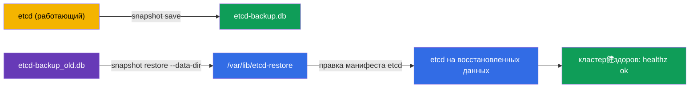

# Lab 112 — etcd: резервное копирование и восстановление

## Описание

Практическая работа по самому ценному навыку эксплуатации — бэкапу и восстановлению
etcd, хранилища всего состояния кластера. Вы снимете снапшот etcd, проверите его, а затем
восстановите кластер из заранее подготовленного снапшота и убедитесь, что кластер
вернулся в рабочее состояние. Работа ведётся на control plane ноде по SSH.

Автопроверка `check_result` проверяет наличие снапшота и здоровье кластера после
восстановления.

## Цель

Закрепить главу курса:

- [Глава 37. Резервное копирование и восстановление etcd](../../course/37/ru.md)

## Что мы делаем и зачем

| Действие | Зачем |
|----------|-------|
| `etcdctl snapshot save` | снять резервную копию всего состояния кластера |
| `etcdctl snapshot status` | убедиться, что снапшот валиден |
| `etcdctl snapshot restore` в новый каталог | развернуть состояние из снапшота |
| переключить манифест etcd на новый каталог | поднять etcd на восстановленных данных |



## Инфраструктура

| Компонент  | Описание                                                             |
|------------|----------------------------------------------------------------------|
| `k8s-1`    | Kubernetes `1.35.2` (kubeadm), одноузловой; установлен `etcdctl`; заранее снят снапшот `/root/etcd-backup_old.db` |
| `worker`   | Рабочая машина с `kubectl`, `check_result` и SSH к control plane      |

## Развёртывание

```bash
TASK=112 make run_cka_task
```

## Задания

---
|        **1**        | **Снять снапшот etcd**                                       |
| :-----------------: | :----------------------------------------------------------- |
| Что делаем          | Создаём снапшот на control plane и копируем на worker         |
| Критерии приёмки    | - Снапшот скопирован в `/var/work/tests/artifacts/etcd/etcd-backup.db` (валиден) |
---
|        **2**        | **Восстановить etcd из старого снапшота**                   |
| :-----------------: | :----------------------------------------------------------- |
| Что делаем          | Восстанавливаем `/root/etcd-backup_old.db` и переключаем etcd на новый каталог |
| Критерии приёмки    | - Кластер здоров после восстановления: `/healthz` = `ok`, поды `kube-system` Running |
---

## Проверка результата

```bash
check_result
```

## Решение

[worker/files/solutions/1.MD](worker/files/solutions/1.MD)

## Покрытие мок-экзаменов

CKA mock 01 (№13 — backup etcd), CKA mock 02 (№20 — backup + restore etcd).

## Удаление

```bash
TASK=112 make delete_cka_task
```
