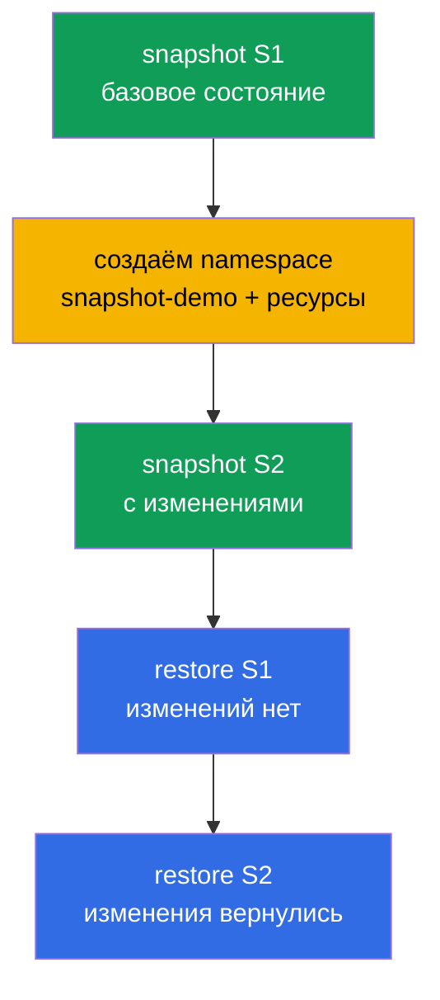

# Lab 112 — etcd: снапшоты и восстановление

## Описание

Практическая работа по самому ценному навыку эксплуатации — резервному копированию и
восстановлению etcd, хранилища всего состояния кластера. Вы пройдёте полный цикл: снимете
снапшот базового состояния, внесёте изменения, снимете второй снапшот, а затем на живом
кластере убедитесь, что восстановление из первого снапшота откатывает изменения, а
восстановление из второго — возвращает их. Работа с etcd ведётся на control plane ноде
по SSH.

Все задания оформлены в экзаменационном стиле (как реальные вопросы CKA/CKAD) с
автоматической проверкой командой `check_result`. Автопроверка проверяет наличие обоих
снапшотов, здоровье кластера после восстановления и присутствие восстановленных ресурсов.

## Цель

Закрепить материал глав курса:

- [Глава 37. Резервное копирование и восстановление etcd](../../course/37/ru.md) — `snapshot save`/`status`/`restore`, остановка и запуск статик-подов control plane, восстановление данных etcd, проверка здоровья кластера

## Что мы делаем и зачем

В этой лабе мы проходим полный цикл работы с etcd — от снятия снапшота до восстановления
кластера в нужное состояние. Каждое действие решает свою задачу:

| Действие | Зачем |
|----------|-------|
| `etcdctl snapshot save` (S1) | снять резервную копию базового состояния кластера (глава 37) |
| создать namespace и ресурсы | внести изменения, чтобы состояние кластера отличалось (глава 37) |
| `etcdctl snapshot save` (S2) | снять вторую копию — уже с изменениями (глава 37) |
| `etcdctl snapshot restore` из S1 | откатить кластер к состоянию до изменений (глава 37) |
| `etcdctl snapshot restore` из S2 | вернуть кластер к состоянию с изменениями (глава 37) |

Итоговая картина того, что будет развёрнуто:


```mermaid
flowchart TB
    s1["snapshot S1<br>базовое состояние"]
    change["создаём namespace<br>snapshot-demo + ресурсы"]
    s2["snapshot S2<br>с изменениями"]
    r1["restore S1<br>изменений нет"]
    r2["restore S2<br>изменения вернулись"]
    s1 --> change
    change --> s2
    s2 --> r1
    r1 --> r2
    style s1 fill:#0f9d58,color:#fff
    style change fill:#f4b400,color:#000
    style s2 fill:#0f9d58,color:#fff
    style r1 fill:#326ce5,color:#fff
    style r2 fill:#326ce5,color:#fff
```

## Инфраструктура

Окружение разворачивается в AWS (`eu-central-1`) через Terragrunt и состоит из:

| Компонент  | Описание                                                             |
|------------|----------------------------------------------------------------------|
| `vpc`      | VPC `10.10.0.0/16` с публичными подсетями                             |
| `ssh-keys` | SSH-ключи для доступа к нодам                                         |
| `k8s-1`    | Kubernetes `1.35.2` (kubeadm), CNI Calico, metrics-server, одноузловой; установлен `etcdctl` |
| `worker`   | Рабочая машина с `kubectl`, `check_result` и SSH-доступом к control plane |

Инстансы: `t3.medium` (master) Ubuntu `22.04`. Кластер одноузловой — master
«разтейнчен» (снят taint `control-plane`), поэтому поды планируются прямо на него.

## Развёртывание

```bash
TASK=112 make run_cka_task
```

После создания подключитесь к рабочей машине (worker) по SSH. Работа с etcd ведётся по
SSH уже на control plane ноде (`ssh k8s1_controlPlane_1`, `sudo -i`); сертификаты etcd
лежат в `/etc/kubernetes/pki/etcd/`. `kubectl` на рабочей машине настроен на контекст
`cluster1-admin@cluster1`.

Полезные команды на рабочей машине:

```bash
time_left       # сколько осталось времени
check_result    # проверить решение
```

## Задания

---
|        **1**        | **Снять снапшот S1 (базовое состояние)**                     |
| :-----------------: | :----------------------------------------------------------- |
| Что делаем          | На control plane снимите снапшот etcd командой `etcdctl snapshot save /root/etcd-snapshot-1.db` с endpoint `https://127.0.0.1:2379` и сертификатами из `/etc/kubernetes/pki/etcd/` (`ca.crt`, `server.crt`, `server.key`). Проверьте его через `etcdctl snapshot status ... --write-out=table` и скопируйте на рабочую машину (например, `scp`) в файл `/var/work/tests/artifacts/etcd/etcd-snapshot-1.db`. |
| Критерии приёмки    | - снапшот S1 скопирован в `/var/work/tests/artifacts/etcd/etcd-snapshot-1.db`;<br/>- файл не пуст (снапшот валиден). |
---
|        **2**        | **Внести изменения в кластер**                              |
| :-----------------: | :----------------------------------------------------------- |
| Что делаем          | Создайте namespace `snapshot-demo`, а в нём — ConfigMap `demo-config` (например, `--from-literal=app=v1`) и Deployment `demo-web` с образом `viktoruj/ping_pong` и `2` репликами. Эти ресурсы появились **после** снапшота S1 — по ним потом увидим разницу между снапшотами. |
| Критерии приёмки    | - namespace `snapshot-demo` создан;<br/>- в нём есть ConfigMap `demo-config` и Deployment `demo-web`. |
---
|        **3**        | **Снять снапшот S2 (после изменений)**                      |
| :-----------------: | :----------------------------------------------------------- |
| Что делаем          | На control plane снимите второй снапшот в `/root/etcd-snapshot-2.db` (тем же способом, что S1), проверьте его `snapshot status` и скопируйте на рабочую машину в `/var/work/tests/artifacts/etcd/etcd-snapshot-2.db`. Этот снапшот уже содержит namespace `snapshot-demo` и его ресурсы. |
| Критерии приёмки    | - снапшот S2 скопирован в `/var/work/tests/artifacts/etcd/etcd-snapshot-2.db`;<br/>- файл не пуст (снапшот валиден). |
---
|        **4**        | **Восстановить S1 и убедиться, что лишних ресурсов нет**    |
| :-----------------: | :----------------------------------------------------------- |
| Что делаем          | Восстановите снапшот S1: остановите статик-поды control plane (уберите манифесты из `/etc/kubernetes/manifests/`), восстановите S1 в `/var/lib/etcd` командой `etcdctl snapshot restore` (с `--name`/`--initial-cluster`/`--initial-advertise-peer-urls` из манифеста etcd) и верните манифесты на место. Дождитесь готовности API и убедитесь, что namespace `snapshot-demo` **отсутствует**. |
| Критерии приёмки    | - кластер здоров: `/healthz` возвращает `ok`;<br/>- namespace `snapshot-demo` отсутствует (изменения откачены). |
---
|        **5**        | **Восстановить кластер из S2**                              |
| :-----------------: | :----------------------------------------------------------- |
| Что делаем          | Той же процедурой восстановите снапшот S2. Дождитесь, пока кластер снова станет здоровым, и убедитесь, что namespace `snapshot-demo` с ConfigMap `demo-config` и Deployment `demo-web` **вернулся**. |
| Критерии приёмки    | - кластер здоров после восстановления: `/healthz` возвращает `ok`, поды `kube-system` в статусе Running/Completed;<br/>- namespace `snapshot-demo` с ConfigMap `demo-config` и Deployment `demo-web` присутствует. |
---

## Проверка результата

На рабочей машине запустите автоматическую проверку:

```bash
check_result
```

Скрипт прогонит тесты и покажет, сколько заданий выполнено. Автопроверка смотрит на
**итоговое** состояние (после восстановления из S2): оба снапшота на месте, кластер
здоров, восстановленные ресурсы присутствуют.

## Решение

Эталонное решение: [worker/files/solutions/1.MD](worker/files/solutions/1.MD)

## Покрытие мок-экзаменов

Лаба закрывает задания моков по резервному копированию etcd: CKA mock 01 (№13 — backup
etcd), CKA mock 02 (№20 — backup + restore etcd).

## Удаление кластера и ресурсов

```bash
TASK=112 make delete_cka_task
```
