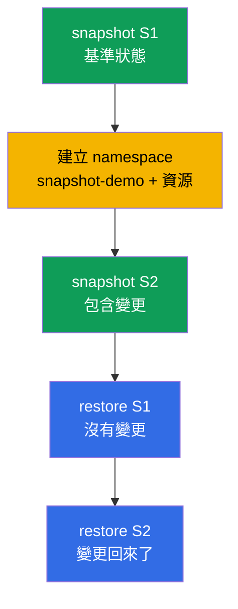

[Русская версия](README_RU.MD) · [Eng version](README.MD) · [Versión en español](README_ES.MD) · [Version française](README_FR.MD) · [Deutsche Version](README_DE.MD) · [ქართული ვერსია](README_GE.MD) · [日本語版](README_JP.MD)

# Lab 112 - etcd:快照與還原

## 說明

實作練習,聚焦於運維中最有價值的技能 - 對 etcd 進行備份與還原,
而 etcd 儲存了整個叢集的狀態。你會走完完整的流程:先為基準狀態
拍一份快照,接著變更叢集,再拍第二份快照,然後在運行中的叢集上
確認:從第一份快照還原會把變更回退,而從第二份快照還原則會把
它們帶回來。所有 etcd 相關操作都透過 SSH 在 control plane 節點上
進行。

所有任務都以考試風格撰寫(就像真正的 CKA/CKAD 題目),並透過 `check_result`
指令自動驗證。自動檢查會確認兩份快照都存在、還原之後叢集是健康的,
以及還原出來的資源確實存在。

## 目標

鞏固以下課程章節的內容:

- [第 37 章。etcd 的備份與還原](../../course/37/README.md) - `snapshot save`/`status`/`restore`、停止與啟動 control plane 的靜態 Pod、還原 etcd 資料、檢查叢集健康狀態

## 我們要做什麼,以及為什麼

在這個實驗中,我們走完 etcd 的完整流程 - 從拍下快照到把叢集還原成
需要的狀態。每個動作都有自己的用途:

| 動作 | 為什麼 |
|----------|-------|
| `etcdctl snapshot save`(S1) | 為叢集的基準狀態拍下一份備份(第 37 章) |
| 建立 namespace 與資源 | 進行變更,讓叢集狀態產生差異(第 37 章) |
| `etcdctl snapshot save`(S2) | 拍下第二份備份 - 這次已經包含變更(第 37 章) |
| 從 S1 執行 `etcdctl snapshot restore` | 把叢集回退到變更之前的狀態(第 37 章) |
| 從 S2 執行 `etcdctl snapshot restore` | 把叢集帶回包含變更的狀態(第 37 章) |

最終部署出來的整體樣貌:



## 基礎架構

環境透過 Terragrunt 部署在 AWS(`eu-central-1`),由以下部分組成:

| 元件       | 說明                                                                 |
|------------|----------------------------------------------------------------------|
| `vpc`      | VPC `10.10.0.0/16`,含公有子網路                                       |
| `ssh-keys` | 用於存取節點的 SSH 金鑰                                                |
| `k8s-1`    | Kubernetes `1.35.2`(kubeadm),CNI Calico,metrics-server,單節點;已安裝 `etcdctl` |
| `worker`   | 工作機,具備 `kubectl`、`check_result` 以及對 control plane 的 SSH 存取 |

執行個體:`t3.medium`(master),Ubuntu `22.04`。叢集為單節點 - master
已解除污點(移除了 `control-plane` taint),因此 Pod 會直接排程到它上面。

## 部署

```bash
TASK=112 make run_cka_task
```

建立完成後,請透過 SSH 連線到工作機(worker)。etcd 的操作本身則是透過
SSH 在 control plane 節點上進行(`ssh k8s1_controlPlane_1`,`sudo -i`);etcd
的憑證位於 `/etc/kubernetes/pki/etcd/`。工作機上的 `kubectl` 已經指向
`cluster1-admin@cluster1` context。

工作機上的實用指令:

```bash
time_left       # 還剩多少時間
check_result    # 檢查解答
```

## 任務

---
|        **1**        | **拍下快照 S1(基準狀態)**                                   |
| :-----------------: | :----------------------------------------------------------- |
| 要做什麼            | 在 control plane 上用 `etcdctl snapshot save /root/etcd-snapshot-1.db` 拍下 etcd 快照,endpoint 為 `https://127.0.0.1:2379`,憑證來自 `/etc/kubernetes/pki/etcd/`(`ca.crt`、`server.crt`、`server.key`)。用 `etcdctl snapshot status ... --write-out=table` 檢查它,並複製到工作機(例如用 `scp`)的檔案 `/var/work/tests/artifacts/etcd/etcd-snapshot-1.db`。 |
| 驗收標準            | - 快照 S1 已複製到 `/var/work/tests/artifacts/etcd/etcd-snapshot-1.db`;<br/>- 檔案不為空(快照有效)。 |
---
|        **2**        | **對叢集進行變更**                                            |
| :-----------------: | :----------------------------------------------------------- |
| 要做什麼            | 建立 namespace `snapshot-demo`,並在其中建立 ConfigMap `demo-config`(例如 `--from-literal=app=v1`)以及 Deployment `demo-web`,映像為 `viktoruj/ping_pong`,`2` 個副本。這些資源是在快照 S1 **之後**才出現的 - 之後就靠它們看出兩份快照之間的差異。 |
| 驗收標準            | - namespace `snapshot-demo` 已建立;<br/>- 其中有 ConfigMap `demo-config` 與 Deployment `demo-web`。 |
---
|        **3**        | **拍下快照 S2(變更之後)**                                    |
| :-----------------: | :----------------------------------------------------------- |
| 要做什麼            | 在 control plane 上拍下第二份快照到 `/root/etcd-snapshot-2.db`(方式與 S1 相同),用 `snapshot status` 檢查它,並複製到工作機的 `/var/work/tests/artifacts/etcd/etcd-snapshot-2.db`。這份快照已經包含 namespace `snapshot-demo` 及其資源。 |
| 驗收標準            | - 快照 S2 已複製到 `/var/work/tests/artifacts/etcd/etcd-snapshot-2.db`;<br/>- 檔案不為空(快照有效)。 |
---
|        **4**        | **還原 S1 並確認多出來的資源已消失**                            |
| :-----------------: | :----------------------------------------------------------- |
| 要做什麼            | 還原快照 S1:停止 control plane 的靜態 Pod(把清單檔從 `/etc/kubernetes/manifests/` 移走),用 `etcdctl snapshot restore` 把 S1 還原到 `/var/lib/etcd`(`--name`/`--initial-cluster`/`--initial-advertise-peer-urls` 取自 etcd 的清單檔),然後把清單檔放回原處。等到 API 就緒,並確認 namespace `snapshot-demo` **不存在**。 |
| 驗收標準            | - 叢集健康:`/healthz` 回傳 `ok`;<br/>- namespace `snapshot-demo` 不存在(變更已被回退)。 |
---
|        **5**        | **從 S2 還原叢集**                                            |
| :-----------------: | :----------------------------------------------------------- |
| 要做什麼            | 用同樣的程序還原快照 S2。等到叢集再次變得健康,並確認帶有 ConfigMap `demo-config` 與 Deployment `demo-web` 的 namespace `snapshot-demo` **回來了**。 |
| 驗收標準            | - 還原之後叢集健康:`/healthz` 回傳 `ok`,`kube-system` 的 Pod 處於 Running/Completed 狀態;<br/>- 帶有 ConfigMap `demo-config` 與 Deployment `demo-web` 的 namespace `snapshot-demo` 存在。 |
---

## 檢查結果

在工作機上執行自動檢查:

```bash
check_result
```

腳本會跑完測試,並顯示已完成多少任務。自動檢查看的是**最終**狀態
(從 S2 還原之後):兩份快照都在原處、叢集是健康的、還原出來的資源
都存在。

## 解答

參考解答:[worker/files/solutions/1_TW.MD](worker/files/solutions/1_TW.MD)

## 模擬考涵蓋範圍

本實驗涵蓋模擬考中關於 etcd 備份的題目:CKA mock 01(第 13 題 - backup
etcd)、CKA mock 02(第 20 題 - backup + restore etcd)。

## 刪除叢集與資源

```bash
TASK=112 make delete_cka_task
```
