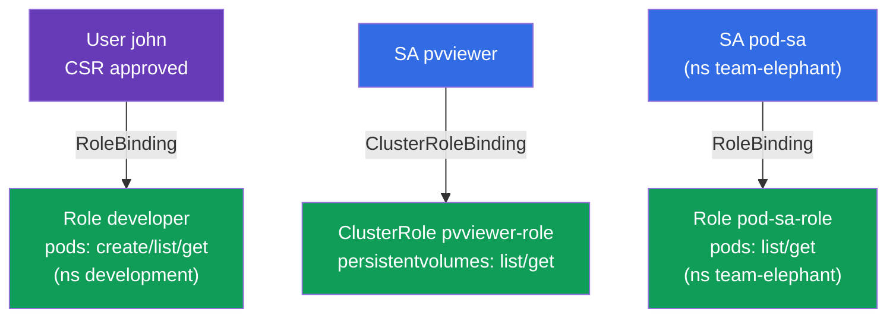

[Русская версия](README_RU.MD) · [Versión en español](README_ES.MD) · [Version française](README_FR.MD) · [Deutsche Version](README_DE.MD) · [ქართული ვერსია](README_GE.MD) · [繁體中文版](README_TW.MD) · [日本語版](README_JP.MD)

# Lab 113 — RBAC and Certificates: Role, ClusterRole, ServiceAccount, CSR

## Description

A hands-on lab about access management. You will grant permissions to a human user
through the **CSR API** (certificate + Role + RoleBinding) and set up access for
applications through a **ServiceAccount** (paired with Role/ClusterRole). This is the core
of the CKA security domain and a frequent task on both exams.

All tasks are written in exam style (like real CKA/CKAD questions) with automatic
validation via the `check_result` command (including through `kubectl auth can-i --as`).

## Goal

Reinforce the material from the course chapters:

- [Chapter 21. ServiceAccount; authn/authz/admission](../../course/21/README.md) — how applications authenticate, the stages of processing an API request
- [Chapter 38. RBAC: Role, ClusterRole and bindings](../../course/38/README.md) — permissions in a namespace and at cluster level, binding to subjects
- [Chapter 39. TLS certificates, kubeconfig and the CSR API](../../course/39/README.md) — issuing a client certificate to a human through CSR

## What We Build and Why

In this lab we hand out access to different subjects — a human and applications — and
verify the permissions with `kubectl auth can-i`. Every object serves its own purpose:

| Object | What it is | Why it is in this lab |
|--------|------------|-----------------------|
| **CSR `john-developer` + Role/RoleBinding** | access for a human | learn to issue a client certificate through the CSR API and grant permissions in a namespace (chapters 38, 39) |
| **SA `pvviewer` + ClusterRole/CRB + Pod** | cluster-level access for an application | the SA gets the `list persistentvolumes` permission (cluster-scoped, chapters 21, 38) |
| **SA `pod-sa` + Role/RoleBinding + Pod** (`team-elephant`) | namespace access for an application | the SA gets the `list/get pods` permission in its own namespace (chapters 21, 38) |

The final picture of what will be deployed:



## Infrastructure

The environment is deployed in AWS (`eu-central-1`) via Terragrunt and consists of:

| Component  | Description                                                  |
|------------|--------------------------------------------------------------|
| `vpc`      | VPC `10.10.0.0/16` with public subnets                        |
| `ssh-keys` | SSH keys for node access                                      |
| `k8s-1`    | Kubernetes `1.35.2` (kubeadm), Calico CNI, metrics-server, single-node |
| `worker`   | Work machine with `kubectl`, `openssl` and `check_result`     |

Instances: `t3.medium` (master), Ubuntu `22.04`. The cluster is single-node — the master is
untainted (the `control-plane` taint is removed), so Pods are scheduled directly on it.

## Deployment

```bash
TASK=113 make run_cka_task
```

Once it is created, connect to the work machine (worker) over SSH and do the tasks from
there. `kubectl` is already pointed at the `cluster1-admin@cluster1` context.

Handy commands on the work machine:

```bash
time_left       # how much time is left
check_result    # check your solution
```

## Tasks

---
|        **1**        | **Grant a user access through CSR + RBAC**                   |
| :-----------------: | :----------------------------------------------------------- |
| What to do          | Create the namespace `development`. Generate a key and a certificate request (`openssl genrsa`, `openssl req ... -subj "/CN=john"`), create a `CertificateSigningRequest` object named `john-developer` (`signerName: kubernetes.io/kube-apiserver-client`, usage `client auth`, `request` = base64 of the `.csr`) and approve it (`kubectl certificate approve john-developer`). Create the Role `developer` in `development` with `create,list,get` permissions on `pods` and the RoleBinding `developer-role-binding` that binds the Role to the user `john`. |
| Acceptance criteria | - namespace `development` exists;<br/>- CSR `john-developer` is in the `Approved` state;<br/>- Role `developer` (pods: create/list/get) and RoleBinding `developer-role-binding` for `john`;<br/>- `john` can `create` and `get` Pods in `development` (`kubectl auth can-i --as=john`). |
---
|        **2**        | **Give an SA cluster-level access**                          |
| :-----------------: | :----------------------------------------------------------- |
| What to do          | Create the ServiceAccount `pvviewer` (in namespace `default`). Create the ClusterRole `pvviewer-role` with `list,get` permissions on `persistentvolumes` and the ClusterRoleBinding `pvviewer-role-binding` that binds it to the SA `default:pvviewer`. Run a Pod `pvviewer` that uses this ServiceAccount (`spec.serviceAccountName: pvviewer`). |
| Acceptance criteria | - ServiceAccount `pvviewer` exists;<br/>- ClusterRole `pvviewer-role` (persistentvolumes: list/get) and ClusterRoleBinding `pvviewer-role-binding`;<br/>- Pod `pvviewer` uses this SA;<br/>- the SA can `list persistentvolumes` (`--as=system:serviceaccount:default:pvviewer`). |
---
|        **3**        | **Give an SA access within a namespace**                     |
| :-----------------: | :----------------------------------------------------------- |
| What to do          | Create the namespace `team-elephant` and the ServiceAccount `pod-sa` in it. Create the Role `pod-sa-role` with `list,get` permissions on `pods` and the RoleBinding `pod-sa-roleBinding` that binds the Role to the SA `team-elephant:pod-sa`. Run in `team-elephant` a Pod `pod-sa` that uses this ServiceAccount. |
| Acceptance criteria | - namespace `team-elephant` exists;<br/>- ServiceAccount `pod-sa`, Role `pod-sa-role` (pods: list/get) and RoleBinding `pod-sa-roleBinding`;<br/>- Pod `pod-sa` uses this SA;<br/>- the SA can `list pods` in `team-elephant` (`--as=system:serviceaccount:team-elephant:pod-sa`). |
---

## Checking the Result

On the work machine run the automatic validation:

```bash
check_result
```

The script runs the tests and shows how many tasks are complete.

## Solution

Reference solution: [worker/files/solutions/1.MD](worker/files/solutions/1.MD)

## Mock Exam Coverage

The lab covers the mock-exam tasks on RBAC and certificates: CKA mock 01 (#17 — user+CSR+Role,
#18 — SA+ClusterRole), CKA mock 02 (#13 — SA+Role), CKAD mock 02 (#15 — SA+Role).

## Deleting the Cluster and Resources

```bash
TASK=113 make delete_cka_task
```
