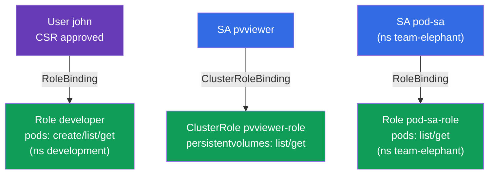

[Русская версия](README_RU.MD) · [Eng version](README.MD) · [Versión en español](README_ES.MD) · [Version française](README_FR.MD) · [ქართული ვერსია](README_GE.MD) · [繁體中文版](README_TW.MD) · [日本語版](README_JP.MD)

# Lab 113 — RBAC und Zertifikate: Role, ClusterRole, ServiceAccount, CSR

## Beschreibung

Praxisübung zur Zugriffsverwaltung. Du vergibst Rechte an einen menschlichen Benutzer über
die **CSR API** (Zertifikat + Role + RoleBinding) und richtest den Zugriff für Anwendungen
über einen **ServiceAccount** ein (in Verbindung mit Role/ClusterRole). Das ist der Kern
der CKA-Sicherheitsdomäne und eine häufige Aufgabe in beiden Prüfungen.

Alle Aufgaben sind im Prüfungsstil formuliert (wie echte CKA/CKAD-Fragen) mit automatischer
Prüfung über den Befehl `check_result` (u. a. über `kubectl auth can-i --as`).

## Ziel

Den Stoff der Kurskapitel festigen:

- [Kapitel 21. ServiceAccount; authn/authz/admission](../../course/21/de.md) — wie sich Anwendungen authentifizieren, die Stufen der Verarbeitung einer API-Anfrage
- [Kapitel 38. RBAC: Role, ClusterRole und Bindings](../../course/38/de.md) — Rechte im Namespace und auf Cluster-Ebene, Bindung an Subjekte
- [Kapitel 39. TLS-Zertifikate, kubeconfig und CSR API](../../course/39/de.md) — Ausgabe eines Client-Zertifikats an eine Person über CSR

## Was wir erstellen und warum

In diesem Lab verteilen wir Zugriff an verschiedene Subjekte — an eine Person und an
Anwendungen — und prüfen die Rechte mit `kubectl auth can-i`. Jedes Objekt erfüllt seine
eigene Aufgabe:

| Objekt | Was das ist | Warum in diesem Lab |
|--------|-------------|---------------------|
| **CSR `john-developer` + Role/RoleBinding** | Zugriff für eine Person | wir lernen, ein Client-Zertifikat über die CSR API auszustellen und Rechte im Namespace zu vergeben (Kapitel 38, 39) |
| **SA `pvviewer` + ClusterRole/CRB + Pod** | Zugriff einer Anwendung auf Cluster-Ebene | die SA erhält das Recht `list persistentvolumes` (cluster-scoped, Kapitel 21, 38) |
| **SA `pod-sa` + Role/RoleBinding + Pod** (`team-elephant`) | Zugriff einer Anwendung im Namespace | die SA erhält das Recht `list/get pods` in ihrem eigenen Namespace (Kapitel 21, 38) |

Das Gesamtbild dessen, was ausgerollt wird:



## Infrastruktur

Die Umgebung wird in AWS (`eu-central-1`) über Terragrunt ausgerollt und besteht aus:

| Komponente | Beschreibung                                                 |
|------------|--------------------------------------------------------------|
| `vpc`      | VPC `10.10.0.0/16` mit öffentlichen Subnetzen                 |
| `ssh-keys` | SSH-Schlüssel für den Zugriff auf die Nodes                    |
| `k8s-1`    | Kubernetes `1.35.2` (kubeadm), CNI Calico, metrics-server, ein Node |
| `worker`   | Arbeitsmaschine mit `kubectl`, `openssl` und `check_result`   |

Instanzen: `t4g.medium` (Master), Ubuntu `22.04`. Der Cluster hat einen Node — beim Master
ist der Taint `control-plane` entfernt, daher werden Pods direkt auf ihm geplant.

## Bereitstellung

```bash
TASK=113 make run_cka_task
```

Verbinde dich nach dem Erstellen per SSH mit der Arbeitsmaschine (Worker) und erledige die
Aufgaben von dort. `kubectl` ist bereits auf den Kontext `cluster1-admin@cluster1`
eingestellt.

Nützliche Befehle auf der Arbeitsmaschine:

```bash
time_left       # wie viel Zeit noch bleibt
check_result    # Lösung prüfen
```

## Aufgaben

---
|        **1**        | **Einem Benutzer Zugriff über CSR + RBAC geben**             |
| :-----------------: | :----------------------------------------------------------- |
| Was wir tun         | Erstelle den Namespace `development`. Erzeuge einen Schlüssel und eine Zertifikatsanfrage (`openssl genrsa`, `openssl req ... -subj "/CN=john"`), erstelle ein `CertificateSigningRequest`-Objekt mit dem Namen `john-developer` (`signerName: kubernetes.io/kube-apiserver-client`, Usage `client auth`, `request` = base64 der `.csr`) und genehmige es (`kubectl certificate approve john-developer`). Erstelle die Role `developer` in `development` mit den Rechten `create,list,get` auf `pods` und das RoleBinding `developer-role-binding`, das die Role an den Benutzer `john` bindet. |
| Abnahmekriterien    | - Namespace `development` existiert;<br/>- CSR `john-developer` ist im Status `Approved`;<br/>- Role `developer` (pods: create/list/get) und RoleBinding `developer-role-binding` für `john`;<br/>- `john` kann Pods in `development` `create` und `get` (`kubectl auth can-i --as=john`). |
---
|        **2**        | **Einer SA Zugriff auf Cluster-Ebene geben**                 |
| :-----------------: | :----------------------------------------------------------- |
| Was wir tun         | Erstelle den ServiceAccount `pvviewer` (im Namespace `default`). Erstelle die ClusterRole `pvviewer-role` mit den Rechten `list,get` auf `persistentvolumes` und das ClusterRoleBinding `pvviewer-role-binding`, das sie an die SA `default:pvviewer` bindet. Starte einen Pod `pvviewer`, der diesen ServiceAccount nutzt (`spec.serviceAccountName: pvviewer`). |
| Abnahmekriterien    | - ServiceAccount `pvviewer` existiert;<br/>- ClusterRole `pvviewer-role` (persistentvolumes: list/get) und ClusterRoleBinding `pvviewer-role-binding`;<br/>- Pod `pvviewer` nutzt diese SA;<br/>- die SA kann `list persistentvolumes` (`--as=system:serviceaccount:default:pvviewer`). |
---
|        **3**        | **Einer SA Zugriff im Namespace geben**                      |
| :-----------------: | :----------------------------------------------------------- |
| Was wir tun         | Erstelle den Namespace `team-elephant` und darin den ServiceAccount `pod-sa`. Erstelle die Role `pod-sa-role` mit den Rechten `list,get` auf `pods` und das RoleBinding `pod-sa-roleBinding`, das die Role an die SA `team-elephant:pod-sa` bindet. Starte in `team-elephant` einen Pod `pod-sa`, der diesen ServiceAccount nutzt. |
| Abnahmekriterien    | - Namespace `team-elephant` existiert;<br/>- ServiceAccount `pod-sa`, Role `pod-sa-role` (pods: list/get) und RoleBinding `pod-sa-roleBinding`;<br/>- Pod `pod-sa` nutzt diese SA;<br/>- die SA kann `list pods` in `team-elephant` (`--as=system:serviceaccount:team-elephant:pod-sa`). |
---

## Ergebnisprüfung

Starte auf der Arbeitsmaschine die automatische Prüfung:

```bash
check_result
```

Das Skript führt die Tests aus und zeigt, wie viele Aufgaben erledigt sind.

## Lösung

Referenzlösung: [worker/files/solutions/1_DE.MD](worker/files/solutions/1_DE.MD)

## Abdeckung der Mock-Prüfungen

Das Lab deckt die Mock-Aufgaben zu RBAC und Zertifikaten ab: CKA mock 01 (Nr. 17 —
user+CSR+Role, Nr. 18 — SA+ClusterRole), CKA mock 02 (Nr. 13 — SA+Role),
CKAD mock 02 (Nr. 15 — SA+Role).

## Löschen von Cluster und Ressourcen

```bash
TASK=113 make delete_cka_task
```
