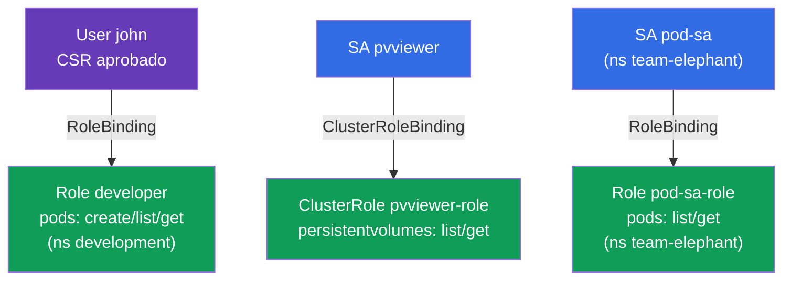

[Русская версия](README_RU.MD) · [Eng version](README.MD) · [Version française](README_FR.MD) · [Deutsche Version](README_DE.MD) · [ქართული ვერსია](README_GE.MD)

# Lab 113 — RBAC y certificados: Role, ClusterRole, ServiceAccount, CSR

## Descripción

Práctica sobre la gestión de accesos. Concederás permisos a un usuario humano mediante la
**CSR API** (certificado + Role + RoleBinding) y configurarás el acceso de las aplicaciones
mediante **ServiceAccount** (en combinación con Role/ClusterRole). Este es el núcleo del
dominio de seguridad de CKA y una tarea frecuente en ambos exámenes.

Todas las tareas están redactadas en estilo de examen (como las preguntas reales de
CKA/CKAD) con verificación automática mediante el comando `check_result` (incluido a través
de `kubectl auth can-i --as`).

## Objetivo

Consolidar el material de los capítulos del curso:

- [Capítulo 21. ServiceAccount; authn/authz/admission](../../course/21/ru.md) — cómo se autentican las aplicaciones, las etapas de procesamiento de una petición a la API
- [Capítulo 38. RBAC: Role, ClusterRole y bindings](../../course/38/ru.md) — permisos en un namespace y a nivel de clúster, vinculación con los sujetos
- [Capítulo 39. Certificados TLS, kubeconfig y CSR API](../../course/39/ru.md) — emisión de un certificado de cliente para una persona mediante CSR

## Qué creamos y para qué

En este laboratorio repartimos acceso a distintos sujetos —una persona y aplicaciones— y
comprobamos los permisos con `kubectl auth can-i`. Cada objeto resuelve su propia tarea:

| Objeto | Qué es | Para qué está en este laboratorio |
|--------|--------|-----------------------------------|
| **CSR `john-developer` + Role/RoleBinding** | acceso para una persona | aprendemos a emitir un certificado de cliente mediante la CSR API y a dar permisos en un namespace (capítulos 38, 39) |
| **SA `pvviewer` + ClusterRole/CRB + Pod** | acceso de una aplicación a nivel de clúster | la SA obtiene el permiso `list persistentvolumes` (cluster-scoped, capítulos 21, 38) |
| **SA `pod-sa` + Role/RoleBinding + Pod** (`team-elephant`) | acceso de una aplicación en un namespace | la SA obtiene el permiso `list/get pods` en su propio namespace (capítulos 21, 38) |

Panorama final de lo que quedará despliegado:



## Infraestructura

El entorno se despliega en AWS (`eu-central-1`) mediante Terragrunt y consta de:

| Componente | Descripción                                                  |
|------------|--------------------------------------------------------------|
| `vpc`      | VPC `10.10.0.0/16` con subredes públicas                      |
| `ssh-keys` | Claves SSH para el acceso a los nodos                         |
| `k8s-1`    | Kubernetes `1.35.2` (kubeadm), CNI Calico, metrics-server, de un solo nodo |
| `worker`   | Máquina de trabajo con `kubectl`, `openssl` y `check_result`  |

Instancias: `t3.medium` (master), Ubuntu `22.04`. El clúster es de un solo nodo: al master
se le ha quitado el taint `control-plane`, por lo que los pods se planifican directamente
en él.

## Despliegue

```bash
TASK=113 make run_cka_task
```

Tras la creación, conéctate por SSH a la máquina de trabajo (worker) y realiza las tareas
desde allí. `kubectl` ya está configurado con el contexto `cluster1-admin@cluster1`.

Comandos útiles en la máquina de trabajo:

```bash
time_left       # cuánto tiempo queda
check_result    # comprobar la solución
```

## Tareas

---
|        **1**        | **Dar acceso a un usuario mediante CSR + RBAC**              |
| :-----------------: | :----------------------------------------------------------- |
| Qué hacemos         | Crea el namespace `development`. Genera una clave y una petición de certificado (`openssl genrsa`, `openssl req ... -subj "/CN=john"`), crea un objeto `CertificateSigningRequest` con el nombre `john-developer` (`signerName: kubernetes.io/kube-apiserver-client`, uso `client auth`, `request` = base64 del `.csr`) y apruébalo (`kubectl certificate approve john-developer`). Crea el Role `developer` en `development` con permisos `create,list,get` sobre `pods` y el RoleBinding `developer-role-binding` que vincula el Role con el usuario `john`. |
| Criterios de aceptación | - el namespace `development` existe;<br/>- el CSR `john-developer` está en estado `Approved`;<br/>- Role `developer` (pods: create/list/get) y RoleBinding `developer-role-binding` para `john`;<br/>- `john` puede hacer `create` y `get` de Pods en `development` (`kubectl auth can-i --as=john`). |
---
|        **2**        | **Dar a una SA acceso a nivel de clúster**                   |
| :-----------------: | :----------------------------------------------------------- |
| Qué hacemos         | Crea el ServiceAccount `pvviewer` (en el namespace `default`). Crea el ClusterRole `pvviewer-role` con permisos `list,get` sobre `persistentvolumes` y el ClusterRoleBinding `pvviewer-role-binding` que lo vincula con la SA `default:pvviewer`. Lanza un Pod `pvviewer` que use este ServiceAccount (`spec.serviceAccountName: pvviewer`). |
| Criterios de aceptación | - el ServiceAccount `pvviewer` existe;<br/>- ClusterRole `pvviewer-role` (persistentvolumes: list/get) y ClusterRoleBinding `pvviewer-role-binding`;<br/>- el Pod `pvviewer` usa esta SA;<br/>- la SA puede hacer `list persistentvolumes` (`--as=system:serviceaccount:default:pvviewer`). |
---
|        **3**        | **Dar a una SA acceso dentro de un namespace**               |
| :-----------------: | :----------------------------------------------------------- |
| Qué hacemos         | Crea el namespace `team-elephant` y en él el ServiceAccount `pod-sa`. Crea el Role `pod-sa-role` con permisos `list,get` sobre `pods` y el RoleBinding `pod-sa-roleBinding` que vincula el Role con la SA `team-elephant:pod-sa`. Lanza en `team-elephant` un Pod `pod-sa` que use este ServiceAccount. |
| Criterios de aceptación | - el namespace `team-elephant` existe;<br/>- ServiceAccount `pod-sa`, Role `pod-sa-role` (pods: list/get) y RoleBinding `pod-sa-roleBinding`;<br/>- el Pod `pod-sa` usa esta SA;<br/>- la SA puede hacer `list pods` en `team-elephant` (`--as=system:serviceaccount:team-elephant:pod-sa`). |
---

## Comprobación del resultado

En la máquina de trabajo lanza la verificación automática:

```bash
check_result
```

El script ejecuta los tests y muestra cuántas tareas están completadas.

## Solución

Solución de referencia: [worker/files/solutions/1_ES.MD](worker/files/solutions/1_ES.MD)

## Cobertura de exámenes simulados

El laboratorio cubre las tareas de los simulados sobre RBAC y certificados: CKA mock 01
(n.º 17 — user+CSR+Role, n.º 18 — SA+ClusterRole), CKA mock 02 (n.º 13 — SA+Role),
CKAD mock 02 (n.º 15 — SA+Role).

## Eliminación del clúster y los recursos

```bash
TASK=113 make delete_cka_task
```
