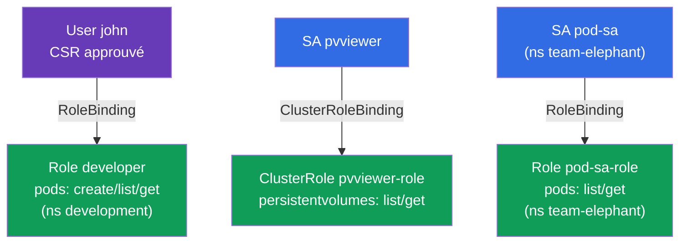

[Русская версия](README_RU.MD) · [Eng version](README.MD) · [Versión en español](README_ES.MD) · [Deutsche Version](README_DE.MD) · [ქართული ვერსია](README_GE.MD)

# Lab 113 — RBAC et certificats : Role, ClusterRole, ServiceAccount, CSR

## Description

Travail pratique sur la gestion des accès. Vous allez accorder des droits à un utilisateur
humain via la **CSR API** (certificat + Role + RoleBinding) et configurer l'accès des
applications via un **ServiceAccount** (associé à Role/ClusterRole). C'est le cœur du
domaine sécurité du CKA et une tâche fréquente aux deux examens.

Toutes les tâches sont rédigées dans le style de l'examen (comme les vraies questions
CKA/CKAD) avec une vérification automatique via la commande `check_result` (y compris via
`kubectl auth can-i --as`).

## Objectif

Consolider le contenu des chapitres du cours :

- [Chapitre 21. ServiceAccount ; authn/authz/admission](../../course/21/ru.md) — comment les applications s'authentifient, les étapes de traitement d'une requête à l'API
- [Chapitre 38. RBAC : Role, ClusterRole et bindings](../../course/38/ru.md) — droits dans un namespace et au niveau du cluster, liaison aux sujets
- [Chapitre 39. Certificats TLS, kubeconfig et CSR API](../../course/39/ru.md) — délivrance d'un certificat client à une personne via CSR

## Ce que nous créons et pourquoi

Dans ce lab, nous distribuons des accès à différents sujets — une personne et des
applications — et nous vérifions les droits avec `kubectl auth can-i`. Chaque objet a son
propre rôle :

| Objet | Ce que c'est | Pourquoi dans ce lab |
|-------|--------------|----------------------|
| **CSR `john-developer` + Role/RoleBinding** | accès pour une personne | apprendre à délivrer un certificat client via la CSR API et à donner des droits dans un namespace (chapitres 38, 39) |
| **SA `pvviewer` + ClusterRole/CRB + Pod** | accès d'une application au niveau du cluster | la SA obtient le droit `list persistentvolumes` (cluster-scoped, chapitres 21, 38) |
| **SA `pod-sa` + Role/RoleBinding + Pod** (`team-elephant`) | accès d'une application dans un namespace | la SA obtient le droit `list/get pods` dans son propre namespace (chapitres 21, 38) |

Vue d'ensemble de ce qui sera déployé :



## Infrastructure

L'environnement est déployé dans AWS (`eu-central-1`) via Terragrunt et se compose de :

| Composant  | Description                                                  |
|------------|--------------------------------------------------------------|
| `vpc`      | VPC `10.10.0.0/16` avec des sous-réseaux publics               |
| `ssh-keys` | Clés SSH pour l'accès aux nœuds                                |
| `k8s-1`    | Kubernetes `1.35.2` (kubeadm), CNI Calico, metrics-server, mono-nœud |
| `worker`   | Machine de travail avec `kubectl`, `openssl` et `check_result` |

Instances : `t3.medium` (master), Ubuntu `22.04`. Le cluster est mono-nœud — le taint
`control-plane` a été retiré du master, les pods sont donc planifiés directement dessus.

## Déploiement

```bash
TASK=113 make run_cka_task
```

Après la création, connectez-vous en SSH à la machine de travail (worker) et effectuez les
tâches depuis celle-ci. `kubectl` est déjà configuré sur le contexte
`cluster1-admin@cluster1`.

Commandes utiles sur la machine de travail :

```bash
time_left       # combien de temps il reste
check_result    # vérifier la solution
```

## Tâches

---
|        **1**        | **Donner accès à un utilisateur via CSR + RBAC**             |
| :-----------------: | :----------------------------------------------------------- |
| Ce qu'on fait       | Créez le namespace `development`. Générez une clé et une demande de certificat (`openssl genrsa`, `openssl req ... -subj "/CN=john"`), créez un objet `CertificateSigningRequest` nommé `john-developer` (`signerName: kubernetes.io/kube-apiserver-client`, usage `client auth`, `request` = base64 du `.csr`) et approuvez-le (`kubectl certificate approve john-developer`). Créez le Role `developer` dans `development` avec les droits `create,list,get` sur `pods` et le RoleBinding `developer-role-binding` qui lie le Role à l'utilisateur `john`. |
| Critères d'acceptation | - le namespace `development` existe ;<br/>- le CSR `john-developer` est à l'état `Approved` ;<br/>- Role `developer` (pods: create/list/get) et RoleBinding `developer-role-binding` pour `john` ;<br/>- `john` peut faire `create` et `get` de Pods dans `development` (`kubectl auth can-i --as=john`). |
---
|        **2**        | **Donner à une SA un accès au niveau du cluster**            |
| :-----------------: | :----------------------------------------------------------- |
| Ce qu'on fait       | Créez le ServiceAccount `pvviewer` (dans le namespace `default`). Créez le ClusterRole `pvviewer-role` avec les droits `list,get` sur `persistentvolumes` et le ClusterRoleBinding `pvviewer-role-binding` qui le lie à la SA `default:pvviewer`. Lancez un Pod `pvviewer` qui utilise ce ServiceAccount (`spec.serviceAccountName: pvviewer`). |
| Critères d'acceptation | - le ServiceAccount `pvviewer` existe ;<br/>- ClusterRole `pvviewer-role` (persistentvolumes: list/get) et ClusterRoleBinding `pvviewer-role-binding` ;<br/>- le Pod `pvviewer` utilise cette SA ;<br/>- la SA peut faire `list persistentvolumes` (`--as=system:serviceaccount:default:pvviewer`). |
---
|        **3**        | **Donner à une SA un accès dans un namespace**              |
| :-----------------: | :----------------------------------------------------------- |
| Ce qu'on fait       | Créez le namespace `team-elephant` et, dedans, le ServiceAccount `pod-sa`. Créez le Role `pod-sa-role` avec les droits `list,get` sur `pods` et le RoleBinding `pod-sa-roleBinding` qui lie le Role à la SA `team-elephant:pod-sa`. Lancez dans `team-elephant` un Pod `pod-sa` qui utilise ce ServiceAccount. |
| Critères d'acceptation | - le namespace `team-elephant` existe ;<br/>- ServiceAccount `pod-sa`, Role `pod-sa-role` (pods: list/get) et RoleBinding `pod-sa-roleBinding` ;<br/>- le Pod `pod-sa` utilise cette SA ;<br/>- la SA peut faire `list pods` dans `team-elephant` (`--as=system:serviceaccount:team-elephant:pod-sa`). |
---

## Vérification du résultat

Sur la machine de travail, lancez la vérification automatique :

```bash
check_result
```

Le script exécute les tests et affiche le nombre de tâches réussies.

## Solution

Solution de référence : [worker/files/solutions/1_FR.MD](worker/files/solutions/1_FR.MD)

## Couverture des examens blancs

Le lab couvre les tâches des examens blancs sur le RBAC et les certificats : CKA mock 01
(n° 17 — user+CSR+Role, n° 18 — SA+ClusterRole), CKA mock 02 (n° 13 — SA+Role),
CKAD mock 02 (n° 15 — SA+Role).

## Suppression du cluster et des ressources

```bash
TASK=113 make delete_cka_task
```
