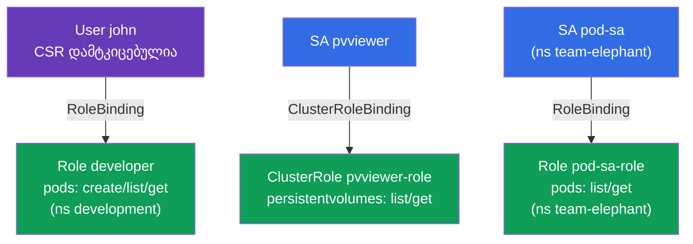

[Русская версия](README_RU.MD) · [Eng version](README.MD) · [Versión en español](README_ES.MD) · [Version française](README_FR.MD) · [Deutsche Version](README_DE.MD)

# Lab 113 — RBAC და სერტიფიკატები: Role, ClusterRole, ServiceAccount, CSR

## აღწერა

პრაქტიკული სამუშაო წვდომის მართვაზე. თქვენ გასცემთ უფლებებს ადამიან-მომხმარებელს
**CSR API**-ის მეშვეობით (სერტიფიკატი + Role + RoleBinding) და მოაწყობთ აპლიკაციების წვდომას
**ServiceAccount**-ის საშუალებით (Role/ClusterRole-თან ერთად). ეს არის CKA-ს უსაფრთხოების
დომენის ბირთვი და ხშირი დავალება ორივე გამოცდაზე.

ყველა დავალება გამოცდის სტილშია გაფორმებული (როგორც რეალური CKA/CKAD კითხვები) და მათი
შემოწმება ავტომატურად ხდება ბრძანებით `check_result` (მათ შორის `kubectl auth can-i --as`-ის
გავლით).

## მიზანი

განამტკიცოთ კურსის თავების მასალა:

- [თავი 21. ServiceAccount; authn/authz/admission](../../course/21/ru.md) — როგორ ხდება აპლიკაციების აუთენტიფიკაცია, API-ზე მოთხოვნის დამუშავების სტადიები
- [თავი 38. RBAC: Role, ClusterRole და binding-ები](../../course/38/ru.md) — უფლებები namespace-ში და კლასტერის დონეზე, სუბიექტებთან დაკავშირება
- [თავი 39. TLS-სერტიფიკატები, kubeconfig და CSR API](../../course/39/ru.md) — კლიენტის სერტიფიკატის გაცემა ადამიანისთვის CSR-ის მეშვეობით

## რას ვქმნით და რისთვის

ამ ლაბორატორიაში ვურიგებთ წვდომას სხვადასხვა სუბიექტს — ადამიანს და აპლიკაციებს — და
უფლებებს ვამოწმებთ `kubectl auth can-i`-ით. თითოეული ობიექტი თავის ამოცანას ასრულებს:

| ობიექტი | რა არის ეს | რისთვის არის ამ ლაბორატორიაში |
|---------|------------|-------------------------------|
| **CSR `john-developer` + Role/RoleBinding** | წვდომა ადამიანისთვის | ვსწავლობთ კლიენტის სერტიფიკატის გაცემას CSR API-ის მეშვეობით და namespace-ში უფლებების მიცემას (თავები 38, 39) |
| **SA `pvviewer` + ClusterRole/CRB + Pod** | აპლიკაციის წვდომა კლასტერის დონეზე | SA იღებს უფლებას `list persistentvolumes` (cluster-scoped, თავები 21, 38) |
| **SA `pod-sa` + Role/RoleBinding + Pod** (`team-elephant`) | აპლიკაციის წვდომა namespace-ში | SA იღებს უფლებას `list/get pods` საკუთარ namespace-ში (თავები 21, 38) |

საბოლოო სურათი იმისა, რაც განთავსდება:



## ინფრასტრუქტურა

გარემო იშლება AWS-ში (`eu-central-1`) Terragrunt-ის მეშვეობით და შედგება:

| კომპონენტი | აღწერა                                                    |
|------------|-----------------------------------------------------------|
| `vpc`      | VPC `10.10.0.0/16` საჯარო ქვექსელებით                      |
| `ssh-keys` | SSH-გასაღებები node-ებზე წვდომისთვის                        |
| `k8s-1`    | Kubernetes `1.35.2` (kubeadm), CNI Calico, metrics-server, ერთკვანძიანი |
| `worker`   | სამუშაო მანქანა `kubectl`-ით, `openssl`-ით და `check_result`-ით |

ინსტანსები: `t3.medium` (master), Ubuntu `22.04`. კლასტერი ერთკვანძიანია — master-ს
მოშორებულია taint `control-plane`, ამიტომ pod-ები პირდაპირ მასზე იგეგმება.

## განთავსება

```bash
TASK=113 make run_cka_task
```

შექმნის შემდეგ დაუკავშირდით სამუშაო მანქანას (worker) SSH-ით და დავალებები შეასრულეთ
იქიდან. `kubectl` უკვე კონფიგურირებულია კონტექსტზე `cluster1-admin@cluster1`.

სასარგებლო ბრძანებები სამუშაო მანქანაზე:

```bash
time_left       # რამდენი დრო დარჩა
check_result    # ამოხსნის შემოწმება
```

## დავალებები

---
|        **1**        | **მომხმარებლისთვის წვდომის გაცემა CSR + RBAC-ით**            |
| :-----------------: | :----------------------------------------------------------- |
| რას ვაკეთებთ        | შექმენით namespace `development`. დააგენერირეთ გასაღები და სერტიფიკატის მოთხოვნა (`openssl genrsa`, `openssl req ... -subj "/CN=john"`), შექმენით ობიექტი `CertificateSigningRequest` სახელით `john-developer` (`signerName: kubernetes.io/kube-apiserver-client`, usage `client auth`, `request` = `.csr`-ის base64) და დაამტკიცეთ ის (`kubectl certificate approve john-developer`). შექმენით Role `developer` `development`-ში უფლებებით `create,list,get` `pods`-ზე და RoleBinding `developer-role-binding`, რომელიც Role-ს აკავშირებს მომხმარებელ `john`-თან. |
| მიღების კრიტერიუმები | - namespace `development` არსებობს;<br/>- CSR `john-developer` სტატუსში `Approved`;<br/>- Role `developer` (pods: create/list/get) და RoleBinding `developer-role-binding` `john`-ისთვის;<br/>- `john`-ს შეუძლია Pod-ების `create` და `get` `development`-ში (`kubectl auth can-i --as=john`). |
---
|        **2**        | **SA-სთვის წვდომის მიცემა კლასტერის დონეზე**                 |
| :-----------------: | :----------------------------------------------------------- |
| რას ვაკეთებთ        | შექმენით ServiceAccount `pvviewer` (namespace `default`-ში). შექმენით ClusterRole `pvviewer-role` უფლებებით `list,get` `persistentvolumes`-ზე და ClusterRoleBinding `pvviewer-role-binding`, რომელიც მას აკავშირებს SA `default:pvviewer`-თან. გაუშვით Pod `pvviewer`, რომელიც ამ ServiceAccount-ს იყენებს (`spec.serviceAccountName: pvviewer`). |
| მიღების კრიტერიუმები | - ServiceAccount `pvviewer` არსებობს;<br/>- ClusterRole `pvviewer-role` (persistentvolumes: list/get) და ClusterRoleBinding `pvviewer-role-binding`;<br/>- Pod `pvviewer` იყენებს ამ SA-ს;<br/>- SA-ს შეუძლია `list persistentvolumes` (`--as=system:serviceaccount:default:pvviewer`). |
---
|        **3**        | **SA-სთვის წვდომის მიცემა namespace-ში**                     |
| :-----------------: | :----------------------------------------------------------- |
| რას ვაკეთებთ        | შექმენით namespace `team-elephant` და მასში ServiceAccount `pod-sa`. შექმენით Role `pod-sa-role` უფლებებით `list,get` `pods`-ზე და RoleBinding `pod-sa-roleBinding`, რომელიც Role-ს აკავშირებს SA `team-elephant:pod-sa`-თან. გაუშვით `team-elephant`-ში Pod `pod-sa`, რომელიც ამ ServiceAccount-ს იყენებს. |
| მიღების კრიტერიუმები | - namespace `team-elephant` არსებობს;<br/>- ServiceAccount `pod-sa`, Role `pod-sa-role` (pods: list/get) და RoleBinding `pod-sa-roleBinding`;<br/>- Pod `pod-sa` იყენებს ამ SA-ს;<br/>- SA-ს შეუძლია `list pods` `team-elephant`-ში (`--as=system:serviceaccount:team-elephant:pod-sa`). |
---

## შედეგის შემოწმება

სამუშაო მანქანაზე გაუშვით ავტომატური შემოწმება:

```bash
check_result
```

სკრიპტი გაატარებს ტესტებს და აჩვენებს, რამდენი დავალებაა შესრულებული.

## ამოხსნა

ეტალონური ამოხსნა: [worker/files/solutions/1_GE.MD](worker/files/solutions/1_GE.MD)

## Mock-გამოცდების დაფარვა

ლაბორატორია ფარავს mock-ების დავალებებს RBAC-სა და სერტიფიკატებზე: CKA mock 01 (№17 —
user+CSR+Role, №18 — SA+ClusterRole), CKA mock 02 (№13 — SA+Role), CKAD mock 02 (№15 — SA+Role).

## კლასტერისა და რესურსების წაშლა

```bash
TASK=113 make delete_cka_task
```
