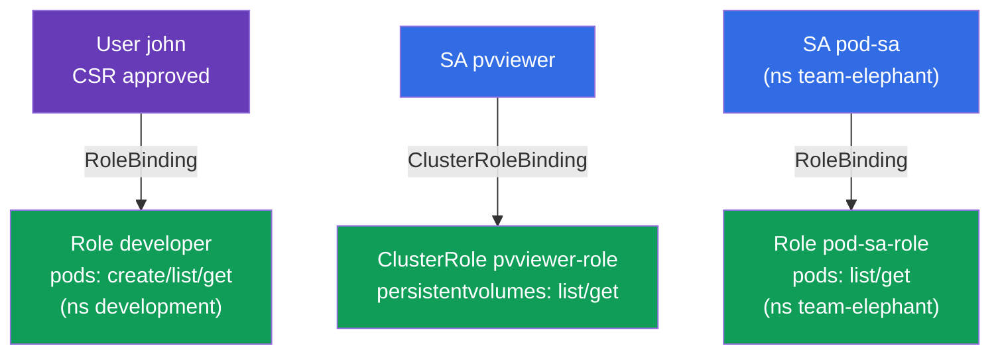

[Русская версия](README_RU.MD) · [Eng version](README.MD) · [Versión en español](README_ES.MD) · [Version française](README_FR.MD) · [Deutsche Version](README_DE.MD) · [ქართული ვერსია](README_GE.MD) · [繁體中文版](README_TW.MD)

# Lab 113 - RBAC と証明書：Role、ClusterRole、ServiceAccount、CSR

## 概要

アクセス管理の実習です。**CSR API**（証明書 + Role + RoleBinding）を使って
人間のユーザーに権限を与え、**ServiceAccount**（Role/ClusterRole と組み合わせて）
アプリケーション用のアクセスを設定します。これは CKA のセキュリティ領域の中核であり、
どちらの試験でもよく出る課題です。

すべての課題は試験形式（実際の CKA/CKAD の問題と同じスタイル）で書かれており、
`check_result` コマンドで自動的に検証されます（`kubectl auth can-i --as` も使います）。

## 目的

次のコース章の内容を定着させます：

- [第 21 章。ServiceAccount；authn/authz/admission](../../course/21/README.md) - アプリケーションはどのように認証されるか、API リクエストの処理段階
- [第 38 章。RBAC：Role、ClusterRole と binding](../../course/38/README.md) - namespace 内とクラスタレベルの権限、サブジェクトへの紐づけ
- [第 39 章。TLS 証明書、kubeconfig と CSR API](../../course/39/README.md) - CSR 経由で人間にクライアント証明書を発行する

## 何を作り、なぜ作るのか

この実習では、さまざまなサブジェクト - 人間とアプリケーション - にアクセス権を配り、
`kubectl auth can-i` で権限を確認します。各オブジェクトにはそれぞれの役割があります：

| オブジェクト | これは何か | この実習での役割 |
|--------|---------|-------------------|
| **CSR `john-developer` + Role/RoleBinding** | 人間へのアクセス | CSR API 経由でクライアント証明書を発行し、namespace 内で権限を与える方法を学ぶ（第 38、39 章） |
| **SA `pvviewer` + ClusterRole/CRB + Pod** | アプリケーションへのクラスタレベルのアクセス | SA が `list persistentvolumes` の権限を得る（cluster-scoped、第 21、38 章） |
| **SA `pod-sa` + Role/RoleBinding + Pod**（`team-elephant`） | アプリケーションへの namespace 内のアクセス | SA が自分の namespace で `list/get pods` の権限を得る（第 21、38 章） |

最終的にデプロイされる全体像：



## インフラ

環境は Terragrunt により AWS（`eu-central-1`）に展開され、次の要素で構成されます：

| コンポーネント | 説明                                                    |
|------------|-------------------------------------------------------------|
| `vpc`      | パブリックサブネットを持つ VPC `10.10.0.0/16`                    |
| `ssh-keys` | ノードへアクセスするための SSH キー                                |
| `k8s-1`    | Kubernetes `1.35.2`（kubeadm）、CNI Calico、metrics-server、単一ノード |
| `worker`   | `kubectl`、`openssl`、`check_result` を備えた作業マシン      |

インスタンス：`t4g.medium`（master）、Ubuntu `22.04`。クラスタは単一ノード構成で、master の
taint は解除されています（`control-plane` taint を削除）。そのため Pod は master 上に直接スケジュールされます。

## デプロイ

```bash
TASK=113 make run_cka_task
```

作成が完了したら、SSH で作業マシン（worker）に接続し、そこから課題を進めてください。
`kubectl` はすでに `cluster1-admin@cluster1` コンテキストに設定されています。

作業マシンで使える便利なコマンド：

```bash
time_left       # 残り時間
check_result    # 解答をチェックする
```

## 課題

---
|        **1**        | **CSR + RBAC でユーザーにアクセス権を与える**               |
| :-----------------: | :----------------------------------------------------------- |
| やること            | namespace `development` を作成してください。キーと証明書署名要求を生成し（`openssl genrsa`、`openssl req ... -subj "/CN=john"`）、`john-developer` という名前の `CertificateSigningRequest` オブジェクトを作成して（`signerName: kubernetes.io/kube-apiserver-client`、usage は `client auth`、`request` は `.csr` の base64）、それを承認してください（`kubectl certificate approve john-developer`）。`development` の中に `pods` に対する `create,list,get` 権限を持つ Role `developer` を作成し、その Role をユーザー `john` に紐づける RoleBinding `developer-role-binding` を作成してください。 |
| 受け入れ基準        | - namespace `development` が存在する；<br/>- CSR `john-developer` が `Approved` の状態である；<br/>- Role `developer`（pods: create/list/get）と `john` 向けの RoleBinding `developer-role-binding` がある；<br/>- `john` が `development` で Pods を `create` および `get` できる（`kubectl auth can-i --as=john`）。 |
---
|        **2**        | **SA にクラスタレベルのアクセス権を与える**                 |
| :-----------------: | :----------------------------------------------------------- |
| やること            | ServiceAccount `pvviewer` を（namespace `default` に）作成してください。`persistentvolumes` に対する `list,get` 権限を持つ ClusterRole `pvviewer-role` と、それを SA `default:pvviewer` に紐づける ClusterRoleBinding `pvviewer-role-binding` を作成してください。この ServiceAccount を使う Pod `pvviewer` を起動してください（`spec.serviceAccountName: pvviewer`）。 |
| 受け入れ基準        | - ServiceAccount `pvviewer` が存在する；<br/>- ClusterRole `pvviewer-role`（persistentvolumes: list/get）と ClusterRoleBinding `pvviewer-role-binding` がある；<br/>- Pod `pvviewer` がこの SA を使っている；<br/>- SA が `list persistentvolumes` できる（`--as=system:serviceaccount:default:pvviewer`）。 |
---
|        **3**        | **SA に namespace 内のアクセス権を与える**                 |
| :-----------------: | :----------------------------------------------------------- |
| やること            | namespace `team-elephant` と、その中に ServiceAccount `pod-sa` を作成してください。`pods` に対する `list,get` 権限を持つ Role `pod-sa-role` と、その Role を SA `team-elephant:pod-sa` に紐づける RoleBinding `pod-sa-roleBinding` を作成してください。`team-elephant` の中で、この ServiceAccount を使う Pod `pod-sa` を起動してください。 |
| 受け入れ基準        | - namespace `team-elephant` が存在する；<br/>- ServiceAccount `pod-sa`、Role `pod-sa-role`（pods: list/get）と RoleBinding `pod-sa-roleBinding` がある；<br/>- Pod `pod-sa` がこの SA を使っている；<br/>- SA が `team-elephant` で `list pods` できる（`--as=system:serviceaccount:team-elephant:pod-sa`）。 |
---

## 結果のチェック

作業マシンで自動チェックを実行します：

```bash
check_result
```

スクリプトがテストを実行し、いくつの課題が完了したかを表示します。

## 解答

参考解答：[worker/files/solutions/1_JP.MD](worker/files/solutions/1_JP.MD)

## 模擬試験のカバー範囲

この実習は模擬試験の RBAC と証明書に関する課題をカバーします：CKA mock 01（第 17 問 - user+CSR+Role、
第 18 問 - SA+ClusterRole）、CKA mock 02（第 13 問 - SA+Role）、CKAD mock 02（第 15 問 - SA+Role）。

## クラスタとリソースの削除

```bash
TASK=113 make delete_cka_task
```
